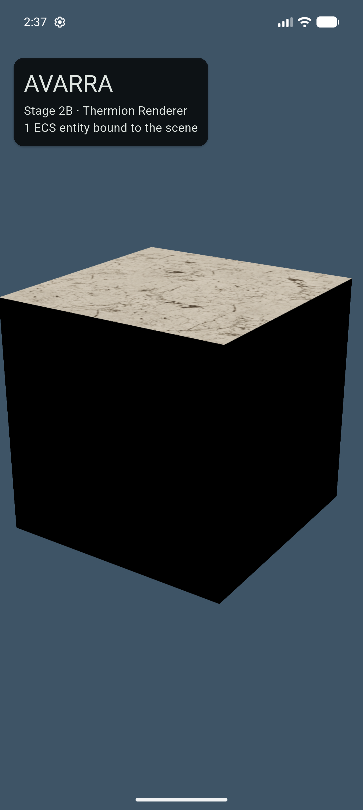
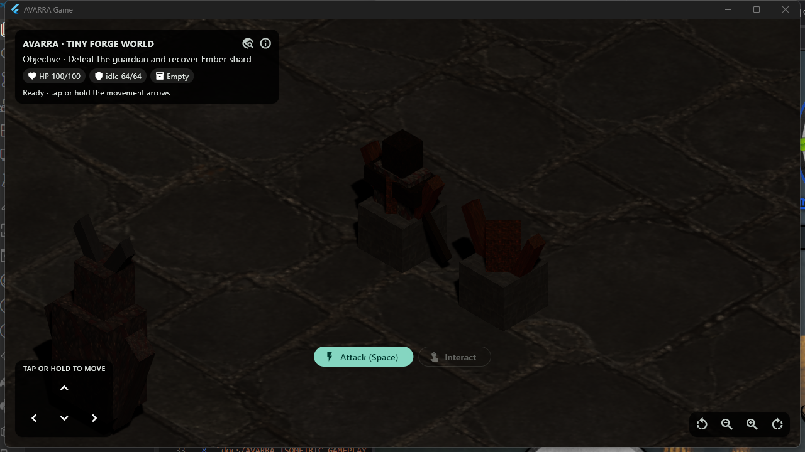
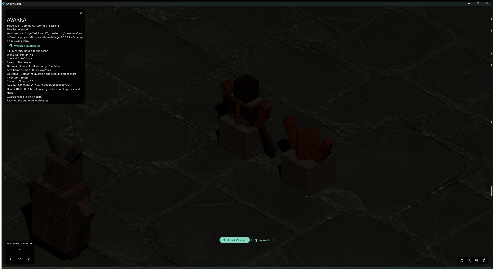
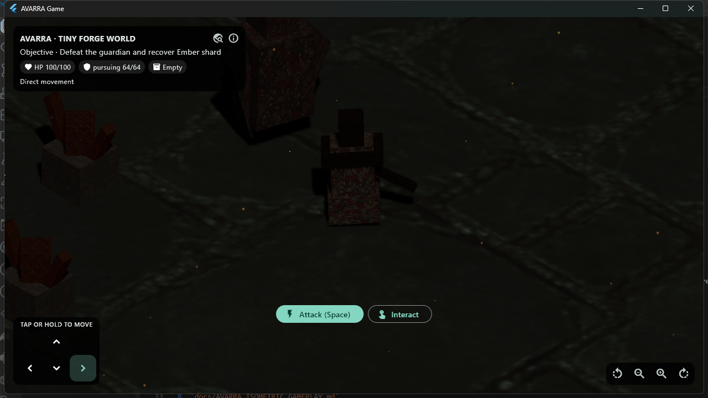
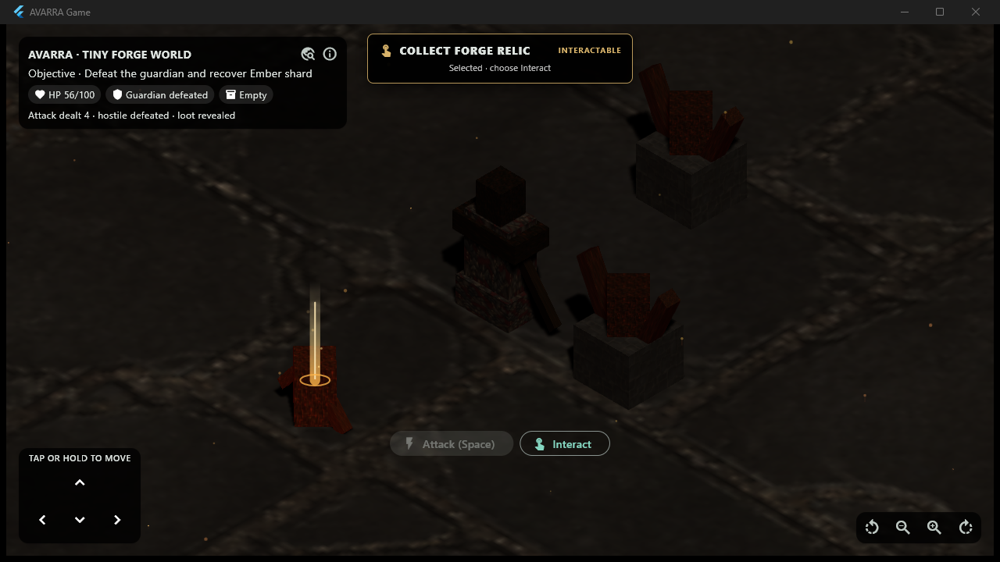
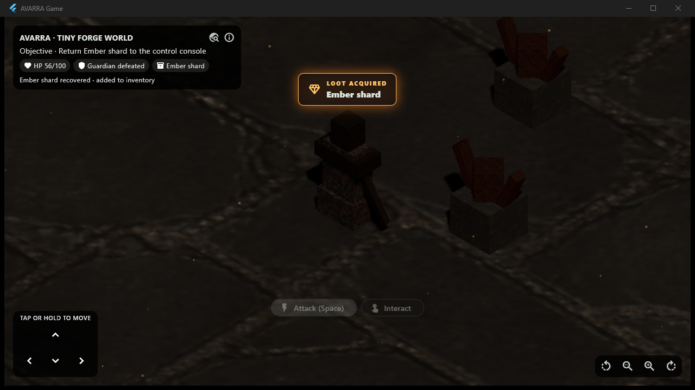

# AVARRA — MASTER LLM HANDOFF v8

This file is generated by `tool/build_master_handoff.ps1` for convenient
single-file handoff. Edit the individual source documents, then regenerate it.

---

<!-- BEGIN AVARRA_CANONICAL_LLM_HANDOFF.md -->

# AVARRA — Canonical LLM Handoff

**Status:** Current source of truth

**Date:** 2026-08-21

**Audience:** Coding LLMs, engineers, architects

---

# 1. What AVARRA Is

AVARRA is a cross-platform, isometric-first sandbox RPG platform with creator-built portable worlds.

The long-term user loop is:

```text
CREATE in Avarra Forge
        ↓
VALIDATE / COOK
        ↓
EXPORT .avarra
        ↓
SHARE / IMPORT
        ↓
HOST from a supported game device
        ↓
FRIENDS JOIN
        ↓
PLAY
        ↓
SAVE
        ↓
CONTINUE
```

Primary early runtime platforms:

```text
Windows
Android
```

Later:

```text
macOS
iOS
Linux
```

Avarra Forge is a desktop-focused editor.

Android hosting is a first-class architectural requirement.

---

# 2. Major Architecture Pivot

Earlier planning explored building a standalone custom "Avarra Engine."

That is **no longer the project goal**.

Current decision:

> **Build AVARRA directly using a modular Dart/Flutter architecture and leverage existing 3D/runtime technology where sensible.**

We keep strong boundaries between simulation, rendering, networking, persistence, editor tooling, and platform code.

If those shared packages eventually become independently reusable, they may later be extracted into an "Avarra Engine."

Do not design the project around that hypothetical future.

---

# 3. Current Product Components

```text
AVARRA
│
├── Avarra Game
│   Player-facing desktop/mobile application
│
├── Avarra Forge
│   Desktop creator/editor application
│
├── Avarra Core
│   Shared Dart simulation/runtime foundation
│
├── Avarra Client
│   Rendering/input/audio/UI presentation integration
│
└── Avarra Server
    Headless/listen-server authoritative runtime
```

---

# 4. Core Architectural Separation

```text
                     AVARRA GAME
                         │
          ┌──────────────┴──────────────┐
          ▼                             ▼
     Flutter UI                    Avarra Client
                                         │
                                   scene bridge
                                         │
                                Thermion bridge
                                         │
                               Thermion / Filament

                         │
                         ▼
                    AVARRA CORE
             ECS / World / Simulation
                         │
             ┌───────────┼───────────┐
             ▼           ▼           ▼
         Network     Persistence   Content

                         │
                         ▼
                    AVARRA SERVER
             same authoritative rules
             no renderer required
```

The simulation/runtime does not depend on visual renderer objects.

---

# 5. Accepted Decisions

Treat these as current architectural constraints.

## Product first

Do not build a generic game engine as a prerequisite.

## Dart first

Core runtime, world logic, networking model, persistence orchestration, tooling, metadata, and server code should primarily be Dart.

## Native Pub workspace

The repository uses Dart's native Pub workspace support for `apps/*` and
`packages/*`. Add a separate monorepo orchestrator only when a concrete workflow
proves it necessary. See `adr/ADR-012-native-pub-workspace.md`.

## Flutter for applications/UI

Flutter is used for:

```text
game shell
HUD
menus
inventory
quest log
dialogue
chat
settings
mobile controls
Forge UI
editor inspectors
tooling
```

## Existing 3D technology is leveraged

Current provisional implementation:

```text
Avarra Client
    +
Avarra Isometric
    ↓
Avarra Scene Bridge
    ↓
Thermion Bridge
    ↓
Thermion / Filament
```

Thermion is pinned to official `v0.5.0-pre.5` commit `caad378…` after published
0.4.1 passed compile gates but failed the live Windows Vulkan gate. The pinned
commit passes Windows runtime stability/close and Android package gates on
Flutter 3.44.4 stable, with a scoped Android compile-SDK workaround. The
Windows visual/lifecycle gate and Pixel 10 Pro Android emulator
cold-start/lifecycle checks also pass. The renderer choice is not irreversible
and remains subject to physical Android and later interaction validation. See
ADR-015 through ADR-017.

The scene bridge exists to avoid coupling simulation to one 3D dependency.

Stage 3 isometric state is renderer neutral. `avarra_isometric` owns the
orthographic four-angle camera rig, screen/ground projection, semantic input
and pick values, and simple occlusion resolution. Game owns selected stable
IDs and camera intent. Thermion owns only camera application, renderer picking,
selection tint, and blend-material opacity behind its adapter.

The Stage 3 select/rotate/zoom/occlusion loop passes on Windows and the Pixel
10 Pro Android emulator. Physical Android remains an open manual gate. Pinned
Thermion compatibility details and adapter fallbacks are recorded in
`AVARRA_STAGE_3_ISOMETRIC_VALIDATION.md`.

## Isometric first

AVARRA's first gameplay style is isometric/action-RPG/sandbox.

The project remains true 3D.

## Server authoritative

Clients send intent.

Server/listen-host owns canonical gameplay state.

## Android can host

Mandatory future architecture test:

```text
Windows Host → Android Client
Android Host → Windows Client
```

## World definition != save state

`.avarra` package contains creator-authored definition/content.

Save state contains runtime mutations/progress.

Stage 4 now implements strict, server-safe world/content definition loading.
`avarra_content` owns the initial machine-readable component schemas and typed
authored values. `avarra_world` owns manifest/entity validation, deterministic
canonical encoding, and stable-ID ECS instantiation. Avarra Game loads the
isometric proof from the same bundled `.avarra` definition on Windows and
Android targets.

Stage 5 extends that boundary with content schema v2 and two server-safe
packages. `avarra_physics` owns replaceable collision-query contracts plus the
current deterministic static-box ray/sweep implementation. `avarra_gameplay`
owns kinematic character movement, wall sliding, and line-of-sight interaction.
Game converts keyboard, touch-button, and ground-pick input into semantic
movement/interaction intents and follows the authored player. This narrow
backend is not a general physics solver; OD-002 remains open for rigid bodies.

Stage 6 adds world format v2 and the server-safe `avarra_streaming` package.
Root entities are always active; chunk entities use stable chunk IDs, integer
horizontal coordinates, and chunk-local transforms. Streaming interest is
explicit and prioritized, lifecycle transitions are asynchronous, entity
activation/deactivation is budgeted, and unload can be blocked until dirty
state is persisted. Game drives interest from the player and move destination,
then rebuilds physics and presentation snapshots after active chunk changes.
World format v1 remains readable.

Stage 7 adds the server-safe `avarra_persistence` package and content schema
v3 persistent boolean flags. `WorldSave` and `PlayerSave` are stable-ID runtime
overlays, not modified world definitions. Dirty generations are acknowledged
only when unchanged across a serialized, recoverable save transaction; dirty
chunk entities therefore remain loaded until persistence permits retry. Game
restores the player before selecting its initial chunk and applies cached entity
overlays as streamed entities activate. Save format v1 uses strict canonical
JSON behind a replaceable store and migration registry; OD-004 remains open for
the permanent save encoding. The Android emulator restored the saved revision
and chunk after a force-stop and fresh process launch.

The current world-format-v2 single-JSON `.avarra` representation is explicitly
a prototype,
not the final archive or cooked serialization decision. See
`AVARRA_STAGE_6_WORLD_STREAMING_VALIDATION.md`,
`AVARRA_STAGE_7_PERSISTENCE_VALIDATION.md`, ADR-019, ADR-020, OD-004, and
OD-019.

## Stable IDs

Persisted/network/world references use stable identifiers.

Runtime storage indices/handles are not persisted identity.

Globally generated stable identities use typed wrappers around canonical
lowercase RFC 9562 UUIDv7 text. Runtime ECS handles, session-scoped network IDs,
and chunk coordinates remain separate. See
`adr/ADR-013-uuid-v7-stable-identifiers.md`.

---

# 6. What AVARRA Owns

AVARRA should own the architecture and code for its differentiators:

```text
ECS/runtime model
world model
chunk streaming
portable .avarra packages
persistent state model
authoritative networking
replication
prediction/reconciliation
Android host behavior
isometric gameplay systems
RPG content definitions
Forge domain tooling
component metadata/code generation
world validation
creator performance budgets
```

---

# 7. What AVARRA Should Usually Leverage

Do not rebuild mature commodity technology without a measured reason:

```text
3D renderer implementation
PBR
glTF parsing
skeletal rendering
physics solver
audio device/backend
image codecs
shader compiler
texture compression
mesh optimization
platform UI/accessibility
```

Own adapter interfaces when external technology must remain replaceable.

---

# 8. Why a 3D Dependency Does Not Eliminate AVARRA Architecture

A 3D rendering library does not solve:

```text
persistent creator worlds
authoritative multiplayer
world saves
Android hosting
content synchronization
RPG-specific world tooling
isometric gameplay semantics
server-side simulation
chunk streaming policy
Forge authoring workflow
.avarra packaging
```

Thermion/Filament or another 3D backend can be a major implementation
dependency without becoming the canonical AVARRA world/simulation model.

---

# 9. Canonical Runtime

Authoritative state belongs to AVARRA Core/ECS.

Example entity:

```text
Entity
├── Transform
├── Health
├── Enemy
├── AiAgent
├── Collider
├── NetworkReplicated
├── Persistent
└── RenderableReference
```

Server uses:

```text
Transform
Health
Enemy
AiAgent
Collider
NetworkReplicated
Persistent
```

Client presentation additionally maps:

```text
RenderableReference
        ↓
Avarra Scene Bridge
        ↓
renderer presentation object
```

Never store the renderer presentation object as the canonical entity itself.

The initial ECS uses generational runtime handles, exact-type component stores,
snapshot queries, and deferred command-buffer playback. This is an intentionally
simple Stage 1 storage model, not the final optimization decision. See
`adr/ADR-014-initial-ecs-storage-model.md`.

---

# 10. Isometric Direction

First-class systems:

```text
IsometricCameraRig
screen-to-world picking
entity selection
tap/click movement targets
roof groups
occluder fading
character readability/outline
ground indicators
isometric streaming hints
Forge isometric preview
```

Do not make the runtime 2D-only.

---

# 11. Networking Direction

```text
Transport
   ↓
Connection
   ↓
Protocol
   ↓
Replication
   ↓
Gameplay commands
```

Server authoritative.

Do not serialize arbitrary Dart classes as the network protocol.

Use stable message IDs/schemas.

Stage 8 implements the server-safe `avarra_network` and `avarra_replication`
packages. Wire/protocol v1 uses explicit sealed messages with stable numeric
type IDs, exact content handshakes, bounded frames, and a provisional
length-framed TCP adapter. The authoritative host owns positive session-scoped
`NetworkEntityId` values, client interest cells, spawn/despawn, transform
snapshots, and newest-sequence movement input acknowledgment. Game remains
offline by default and turns connected movement into host commands. A compiled
Windows host and Android emulator client completed join, four-entity relevance,
input sequence `2` acknowledgment, and disconnect. TCP/JSON are prototype
choices; OD-003 and OD-004 remain open. See
`AVARRA_STAGE_8_MULTIPLAYER_VALIDATION.md` and ADR-021.

Stage 9 composes that same pure-Dart host runtime inside Android Game. Host mode
binds IPv4 interfaces, joins its own local client through loopback, and accepts
additional players with independent stable controlled entities. Protocol v2
adds controlled-entity assignment and strict world/player-avatar spawn kinds.
The Android boundary reports frame/tick, PSS memory, exact transport bytes,
thermal state, and active chunks, then ends the session on background rather
than relying on indefinite execution. An Android emulator host accepted the
Windows release client and displayed two clients; physical direct-LAN and
sustained device profiling remain open. See
`AVARRA_STAGE_9_ANDROID_HOST_VALIDATION.md` and ADR-022.

Stage 10 begins Forge with a pure-Dart typed command boundary and separate
Flutter desktop shell. Human hierarchy/inspector actions create/delete entities
and replace transforms through validated immutable world snapshots with
stable-ID undo/redo. Forge exports canonical prototype `.avarra` source only
after the shared world codec and playable-entry gate pass; Game can load that
desktop export through `AVARRA_WORLD_PATH` without depending on Forge. The
initial viewport is an isometric editor schematic, not a renderer replacement.
See `AVARRA_STAGE_10_FORGE_FOUNDATION_VALIDATION.md` and ADR-023.

The 2026-08-12 engineering review classifies the initial result as a foundation
proof rather than a closed creator-facing gate. Stage 10.1A is now implemented:
Forge, Game, and Server share a Game-ready profile; Game has no proof-ID
interaction/persistence behavior; and content schema v4 supplies a typed
persistent interaction effect used by `Relay Zero Prototype`. Stage 10.1B is
also implemented: Forge owns a versioned, recoverable `.avarra-forge` source
lifecycle and safe native export; Game owns runtime import, persistent catalog
selection, save isolation, and structured packaged-asset diagnostics. The
original export may move or disappear after import. The prototype still does
not embed assets or close OD-019. Stage 10.2 is now implemented: shared content
metadata drives transform and non-transform Inspector fields; typed component
commands use bounded inverse-command batches; validation aggregates actionable
locations; and Forge uses the shared Thermion presentation bridge for stable-ID
selection and translation gizmos. Stage 11.1 is now implemented: content schema
v5 authors health and one basic attack; deterministic gameplay authority owns
damage, range, line of sight, cooldown, death, and restart; and Game provides a
combat loop with dead-entity presentation/collision lifecycle. Stage 11.2 is
also implemented: content schema v6 authors guardian perception/leash policy,
and a pure-Dart state machine owns idle, pursuit, attack, return, and defeat
while reusing movement, physics, and combat authority. Offline Game drives the
guardian; connected combat/AI remains disabled until its host-authoritative
slice. The follow-up playability pass gates simulation on post-attachment
orthographic renderer readiness, uses a bounded vsync-aligned 60 Hz fixed step,
pools repeated glTF instances, coalesces save/streaming work, makes controls
camera-relative, contains movement to authored chunks, repairs legacy invalid
saves, and replaces the portrait diagnostic wall with a compact HUD. Relay
Zero now uses an 8×8 centered arena and a survivable guardian balance. Content
schema v7 and Stage 11.3 add three persistent stabilizers evaluated world-wide
from authored defaults plus save overlays. Their authored group opens a derived
solid gate without product entity-ID rules, and the guardian now streams from
the chamber beyond it. Content schema v8, save format v2, and Stage 11.4 add a
guardian-gated Relay Core, player-owned single-quantity inventory, an authored
return-console turn-in, derived mission feedback, and restored completion.
Protocol v3 and Stage 11.5 add bounded attack/interaction/restart commands,
host-owned guardian/combat/adventure simulation, revisioned health/flag/player
inventory mirrors, and a connected end-to-end Relay Zero completion proof.
Stage 11.6 turns that proof into `Relay Zero: Ashfall`: selected hostiles are
pursued and repeatedly attacked, selected interactions are approached and used,
three authored Hollow Wardens reveal enemy-bound loot on defeat, and an
original dark-gothic six-model/three-material kit replaces cube presentation.
The action-target rule is renderer-neutral and operates in offline and
host-authoritative connected play; locked drops are excluded from presentation
and collision on both Game and host until their authored guardian dies.
Stage 12.1 replaces transient host adventure state with the canonical
`WorldSaveSession`. Two-second autosave plus disconnect/shutdown flush preserve
authored progression, player position, and inventory; remote avatars despawn
while stable player records remain for reconnect and complete host restart.
Stage 12.2 extends this to a complete authoritative Relay Zero mission and
ten-minute API 37 emulator soak, canonical save inspection, mission-complete
cold restore, and a packaged Windows Game join plus held-key movement gate. It
also fixes zero-vector input marking unchanged player state dirty. The analyzer
and 224-test matrix pass. Stage 12.3 turns the proof controls into one runtime
Worlds & multiplayer browser: Game lists its visible application map folder,
imports one file or every top-level `.avarra` file from a selected folder,
refreshes directly dropped maps, and launches the chosen world as Solo, Host,
or Join without a special build. Session replacement flushes state and releases
the old listener before rebinding. The shared Thermion viewport now explicitly
enables PCF shadows, configures only renderable glTF children, and uses an
angled warm key plus cool fill. Live Windows/Android visual acceptance remains
open. Stage 12.4 begins the Warcraft-style Forge authoring loop with four typed
starter presets, renderer-neutral half-unit-grid viewport placement, automatic
selection, and the existing Inspector/validation/undo/export pipeline. Stage
12.5 makes declared world-asset choice explicit and adds continuous two-unit
floor Paint/Erase strokes; renderer-neutral line interpolation fills pointer
gaps and each drag is one typed undo boundary. The analyzer and consolidated
230-test matrix pass, and the real Forge Windows x64 release builds.
Stage 12.6 connects that editor loop to the real Game application. Forge
validates the current unsaved world, writes an isolated temporary `.avarra`
package, and starts Game with one exact process argument through an injectable
launcher. Game loads it as a solo imported world with an in-memory save store,
and Forge removes the package only after the child exits. The affected app
analyzers, five focused tests, and both Windows x64 release builds pass; the
test inventory is now 234 without a repeated full-matrix run.
Stage 12.7 adds a Gameplay Rules section to the Forge palette. Creators can
place persistent Objective Switches and count-based Objective Gates through the
same renderer-neutral click, stable-ID, selection, Inspector, undo, validation,
export, and Test Play loop used by world objects. These presets author existing
content-schema components and are evaluated by the unchanged Game/server
objective runtime. The Forge analyzer, nine affected tests, and Windows x64
release build pass; the inventory is now 235.
Stage 12.8 extends Gameplay Rules with a complete referenced combat mission.
Creators place a Guardian, bind guarded loot to its stable entity ID, and bind
a completion console to the collectible's stable item ID. Palette selectors
automatically follow newly placed dependencies, dependent presets explain why
they are unavailable, and schema Inspector reference fields use filtered
dropdowns. The starter player is combat-capable, so canonical exports pass the
unchanged playable validator and run through the existing Game/server combat,
guardian, inventory, turn-in, persistence, and authority systems. Four palette
tests, seven Forge widget workflows, Forge analysis, and the Windows x64
release build pass; the inventory is now 237 without a repeated full-matrix
run.
Stage 12.9 adds a reusable AVARRA-specific Combat mission template above the
individual presets. One renderer-neutral ground click constructs a Guardian,
co-located locked loot, and a return console across a compact four-unit layout.
All stable IDs and exact Guardian/item references exist before one three-create
`CreatorCommandBatch` is applied, so validation sees the complete candidate
and one Undo/Redo removes or restores the chain. The new Guardian and Loot
selectors become active after placement, and the tool stays selected for
repeated independent mission stamps. Five palette tests, eight Forge widget
workflows, Forge analysis, and the Windows x64 release build pass; the
inventory is now 239 without a repeated full-matrix run.
Stage 12.10 adds typed pre-placement settings to that same atomic template.
Creators configure Guardian health/damage, center spacing, item label, and
completion label in the palette before stamping. The immutable settings value
is validated before entity creation, becomes ordinary authored runtime
components, and does not add a prefab identity or parallel mission schema.
Five palette tests, eight Forge widget workflows, Forge analysis, and the
Windows x64 release build pass; the inventory remains 239.
Stage 12.11 adds Initiate, Sentinel, and Champion encounter profiles plus
independent declared-asset selectors for the Guardian, loot, and completion
console. Profiles preserve creator labels, modified numeric values become
Custom tuning, and each role AssetId is validated against the current world
before the unchanged atomic three-entity factory runs. These values remain
Forge authoring input and serialize only as existing runtime components. Six
palette tests, nine Forge widget workflows, Forge analysis, and the Windows x64
release build pass. The complete 18-suite matrix passes; the inventory is now
241.
Stage 12.12 turns those real role selectors into a useful built-in creator
path. Forge now packages and declares Game's existing six-model/three-material
Gothic kit, starts with Ashen Vanguard, Basalt, and Relay Shrine visuals, and
uses Hollow Warden, Ember Shard, and Relay Shrine in the Champion mission
acceptance workflow. A parity test locks both application copies and their glTF
dependency closure. CI now proves typed profiled export, moved-file Game import
with real packaged-asset checks, source removal, and selected-world restart
load. Workspace analysis, the Forge Windows x64 release, and the complete
18-suite matrix pass; the inventory is now 242. This is a built-in catalog, not
an OD-019 cooking/container decision; live graphical Test Play remains open.
Stage 12.13 opens the actual Windows Game release with that typed Champion
package through the exact Forge Test Play process contract and records a live
1280 x 720 Thermion-rendered acceptance image. The package reaches Ready with
the Tiny Forge World identity, 64/64 Champion, Ember Shard objective, and Gothic
scene. The live run exposed and fixed two Game presentation defects: the compact
HUD now uses the loaded authored world name instead of a hard-coded Relay Zero
label, and every interaction rejection maps to player-facing guidance instead
of leaking enum tokens. Workspace analysis, the Game release, the profiled
handoff pipeline, and the complete 18-suite matrix pass; the inventory is now
244. One continuous visible Forge-button and full mission-completion walkthrough
remains a manual product acceptance item.
Stage 12.14 makes the existing contextual click-to-act path legible as an
action-RPG loop. Game now displays a responsive top-center frame for the
selected Guardian's health and current selection/pursuit/automatic-attack state,
plus a distinct no-health frame for interactables. Distant Attack commands
enter the existing pursuit loop without first submitting an inevitably
out-of-range attack. Combat authority, simulation, schemas, and the Thermion
selection highlight are unchanged. Game analysis, the Windows release, live
Champion validation, the profiled handoff pipeline, and the complete 18-suite
matrix pass; the inventory is now 246.
Stage 12.15 adds bounded visual motion while preserving that authority boundary.
Inspection confirms every packaged Gothic glTF has zero animation clips, so
Game now derives cosmetic presentation copies for idle breathing, active
stride/sway, collectible hover/rotation, and interactable pulse. Player and
selected entities are prioritized within a 12-entity cap; a pointer-transparent
ash layer and 180 ms target-health easing add continuous motion without changing
ECS, saves, collision, or networking. Live Windows diagnostics report 1.70 ms
average Flutter frame span with one 177.00 ms maximum spike. Game/workspace
analysis, the release build, the profiled pipeline, and the complete 18-suite
matrix pass; the inventory is now 250. Rigged character animation remains an
explicit measured POC, not a silently selected permanent schema.
Stage 12.16 repairs movement in Forge's root-only worlds by deriving bounds from
shallow static floors, fixing supporting-floor sweep contact and initial
overlap recovery, suppressing zero-chunk streaming-edge reports, and fitting the
Champion template inside a 16 x 16 starter floor. Ashen Vanguard gains
Idle/Run/Attack and Hollow Warden gains Idle/Run/Attack/Hit/Death real glTF
articulated-node clips. Game maps existing state to presentation-only requests
and Thermion lazily plays/crossfades available names. A real Windows movement
pad hold proves control, camera displacement, and consecutive run animation;
the 18-suite matrix passes 257 tests. This is not yet a weighted production rig
or permanent animation schema.
Stage 12.17 adds a pure-Dart, 24-event combat presentation timeline downstream
of authoritative results. Accepted offline attacks and replicated health
decreases drive 180 ms hit flashes, 350 ms Hit reactions, 900 ms
world-anchored floating damage, and a 1.1-second defeat linger. Dead entities
leave gameplay collision immediately but remain visible long enough for Hollow
Warden's real Death clip. A live 108-frame Windows Champion fight proves
simultaneous damage values, red impact tint, lethal `DEFEATED` feedback, death
motion, and loot reveal. Analysis, the release build, the profiled pipeline,
and the 18-suite matrix pass 264 tests. Protocol v3 still carries health state,
not explicit combat-impact events.
Stage 12.18 adds a 280 ms projected impact burst downstream of those confirmed
damage events, caps pulsing world-space beams to available authored
collectibles, and displays a 2.4-second accessible toast only for accepted
offline or replicated inventory additions. Live packaged acceptance exposed
that post-combat Interact could stop at an out-of-range rejection; the same
request now enters the existing fixed-step, collision-aware approach loop and
uses the target on arrival. Two preserved Windows frames prove loot reveal and
the inventory/objective transition. Formatting, analysis, the release build,
the profiled pipeline, and the 18-suite matrix pass 267 tests. No schema or
authority boundary changed.
Stage 12.19 replaces instant local camera recentering with a frame-rate-
independent 110 ms half-life follower and snaps corrections of at least six
world units. Existing move, attack, and interaction targets now feed one
pointer-transparent, projected destination indicator through the displayed
isometric camera rig; no duplicate navigation or authority state was added. A
45-frame packaged Windows Champion pursuit proves that the red attack marker,
smooth camera motion, target frame, impacts, damage, defeat, and loot reveal
remain aligned throughout play. Formatting, analysis, the release build, the
profiled pipeline, and the 18-suite matrix pass 272 tests. No Android device was
attached, so physical touch, frame-time, thermal, and battery validation remain
open.
Stage 12.20 replaces the generic combat-button row with a Diablo-style
bottom-center health/action bar driven by existing runtime state. Basic Strike
shows the authored cooldown through a radial recovery veil and tenths label;
Space preserves engagement during recovery, E uses the existing interaction
approach path, and connected immediate attacks share the local automatic-
attack pacing deadline. The host remains authoritative. A 24-frame packaged
Windows Champion fight proves the live 67/100 health globe, 0.3-second
recovery, target marker, damage, and controls together. Formatting, analysis,
the release build, profiled pipeline, and 18-suite matrix pass 276 tests. No
schema changed; physical Android was explicitly deferred.
Stage 12.21 adds one portable authored story contract instead of hard-coding
quest prose in Game. Content schema v9 introduces
`avarra.story.mission_narrative` on the existing item-turn-in entity with a
bounded title, opening, return, and completion beat. Forge authors those fields
and performs an explicit schema upgrade inside the same undoable mission batch.
Game derives the current beat from authoritative inventory and completion
state, displaying a responsive quest journal and transient live-region
briefing. The bundled proof becomes “Ashfall's Last Signal.” Analysis, both
Windows release builds, and the 18-suite matrix pass 280 tests. Branching,
dialogue choices, localization, scripting, and physical Android validation
remain open.
Stage 12.22 derives one exact next target without introducing another quest
state machine. `avarra_world` follows stable authored relationships through
objective, Guardian, collectible, and item-turn-in entities, using chunk
coordinates plus local transforms even before a target chunk is active. Game
prefers a live ECS transform when available, projects a pulsing marker over an
on-screen target, clamps a directional arrow at the viewport edge otherwise,
and repeats the next action plus distance in the journal. Mission completion
removes the marker. No content, save, protocol, or authority contract changed.
Analysis, the Game Windows release, and the 18-suite matrix pass 283 tests;
live packaged visual acceptance and physical Android remain open.
Stage 12.23 consumes those same accepted combat moments to make danger legible.
Only damage events targeting the player generate an at-most-seven-logical-pixel
scene shake and screen-edge flash during the existing 180 ms hit window.
Authoritative health at or below 30% adds a roughly 1.2-second critical pulse;
death holds a persistent crimson veil behind the existing accessible restart
prompt. World-space overlays move with the scene, while transformed hit testing
is disabled so controls stay stable. No simulation, renderer adapter, schema,
save, replication, or authority state changed. Formatting, analysis, the Game
Windows release, and the 18-suite matrix pass 286 tests; live visual acceptance
and physical Android remain open.
Stage 12.24 projects compact health bars over active authored combatants using
the same authoritative `HealthComponent` values and animated
`PresentationSnapshot` transforms already consumed by Game. The overlay is
pointer-transparent, caps itself at eight living on-screen enemies, prioritizes
the selected target before stable-ID ordering, eases health changes for 180 ms,
and removes bars immediately on death or deactivation. Selection receives a
wider gold frame and exact HP while the existing top target frame remains.
No attack wind-up is inferred: a real telegraph requires a future explicit
server-visible state. No simulation, schema, save, protocol, renderer adapter,
or authority contract changed. Formatting, analysis, the Game Windows release,
and the 18-suite matrix pass 290 tests; live visual acceptance and physical
Android remain open.
Stage 12.25 wraps the runtime in a complete Game-owned experience flow. The
selected `.avarra` package supplies the title-screen world and mission preview;
new saves receive the same authored opening as a blocking prologue; and Escape
opens a pause menu with current story, objective, inventory, Settings, Worlds,
and Return to Title. Versioned recoverable app preferences control reduced
motion, camera shake, quest guidance, enemy bars, and damage numbers without
entering world/save/network authority. Forge Test Play bypasses this shell.
Formatting, workspace analysis, the Game Windows release, and the 18-suite
matrix pass 301 tests; live packaged visual acceptance and physical Android
remain open.
Android CI hardening separates native Game packaging from the combined
quality/Windows job. A parallel Windows job pins Java 17, Android API 36,
Build Tools 36.0.0, NDK 28.2.13676358, and CMake 3.22.1. CI calls the shared
`tool/build_android_ci.ps1` entry point, which enforces Flutter/Dart and
Android component expectations, performs the debug APK build, requires a
non-empty package, and logs its SHA-256. This is build verification only:
production signing and external artifact publication remain explicitly
unconfigured. See `AVARRA_ANDROID_CI_CD.md`.
`AVARRA_FORGE_GAME_MAKER_GUIDE.md` documents the product terminology and
the complete create/Test Play/export/import/host/join workflow.
Source-asset import/cooking/thumbnails, sculpted or material-blended terrain,
chunk-aware painting, arbitrary trigger volumes/scripting, richer mission and
encounter tooling, and preview-process management remain open.
Physical Android direct-LAN, real touch/frame/thermal evidence, and the human
product playtest remain open before release sign-off.
See
`AVARRA_STAGE_10_1A_PLAYABLE_CONTRACT_VALIDATION.md`,
`AVARRA_STAGE_10_1B_PROJECT_IMPORT_VALIDATION.md`,
`AVARRA_STAGE_10_2_EDITOR_COMPLETION_VALIDATION.md`,
`AVARRA_STAGE_11_1_COMBAT_VALIDATION.md`,
`AVARRA_STAGE_11_2_GUARDIAN_VALIDATION.md`,
`AVARRA_STAGE_11_2_PLAYABILITY_VALIDATION.md`,
`AVARRA_STAGE_11_3_OBJECTIVE_VALIDATION.md`,
`AVARRA_STAGE_11_4_RELAY_CORE_VALIDATION.md`,
`AVARRA_STAGE_11_5_COOP_AUTHORITY_VALIDATION.md`,
`AVARRA_STAGE_11_6_ASHFALL_GAMEPLAY_VALIDATION.md`,
`AVARRA_STAGE_12_1_DURABLE_HOST_VALIDATION.md`,
`AVARRA_STAGE_12_2_PRODUCT_ACCEPTANCE.md`,
`AVARRA_STAGE_12_3_COMMUNITY_WORLDS_AND_LIGHTING_VALIDATION.md`,
`AVARRA_STAGE_12_4_FORGE_OBJECT_PLACEMENT_VALIDATION.md`,
`AVARRA_STAGE_12_5_FORGE_ASSET_CATALOG_AND_FLOOR_BRUSH_VALIDATION.md`,
`AVARRA_STAGE_12_7_FORGE_GAMEPLAY_RULES_VALIDATION.md`,
`AVARRA_STAGE_12_8_FORGE_MISSION_CHAIN_VALIDATION.md`,
`AVARRA_STAGE_12_9_FORGE_MISSION_TEMPLATE_VALIDATION.md`,
`AVARRA_STAGE_12_10_FORGE_MISSION_SETTINGS_VALIDATION.md`,
`AVARRA_STAGE_12_11_FORGE_MISSION_PROFILES_AND_ASSETS_VALIDATION.md`,
`AVARRA_STAGE_12_12_FORGE_BUILT_IN_ASSET_CATALOG_VALIDATION.md`,
`AVARRA_STAGE_12_13_LIVE_CHAMPION_TEST_PLAY_AND_HUD_POLISH_VALIDATION.md`,
`AVARRA_STAGE_12_14_ACTION_RPG_TARGET_FRAME_VALIDATION.md`,
`AVARRA_STAGE_12_15_LIVING_WORLD_MOTION_VALIDATION.md`,
`AVARRA_STAGE_12_16_PLAYABLE_ANIMATED_CHARACTERS_VALIDATION.md`,
`AVARRA_STAGE_12_17_AUTHORITATIVE_COMBAT_FEEDBACK_VALIDATION.md`,
`AVARRA_STAGE_12_18_COMBAT_IMPACT_AND_LOOT_FLOW_VALIDATION.md`,
`AVARRA_STAGE_12_19_SMOOTH_TRAVERSAL_AND_DESTINATION_FEEDBACK_VALIDATION.md`,
`AVARRA_STAGE_12_20_PRIMARY_ACTION_BAR_VALIDATION.md`,
`AVARRA_STAGE_12_21_AUTHORED_MISSION_NARRATIVE_VALIDATION.md`,
`AVARRA_STAGE_12_22_AUTHORITATIVE_QUEST_GUIDANCE_VALIDATION.md`,
`AVARRA_STAGE_12_23_REACTIVE_PLAYER_DANGER_VALIDATION.md`,
`AVARRA_STAGE_12_24_WORLD_SPACE_ENEMY_HEALTH_VALIDATION.md`,
`AVARRA_STAGE_12_25_EPIC_GAME_EXPERIENCE_VALIDATION.md`,
`AVARRA_FORGE_GAME_MAKER_GUIDE.md`,
`AVARRA_FIRST_PLAYABLE_RELAY_ZERO.md`, ADR-024 through ADR-033.

---

# 12. World Direction

Canonical world concepts:

```text
WorldId
RegionId
ChunkId
EntityId
PrefabId
AssetId
DefinitionId
```

Large-world position should support:

```text
chunk coordinate
+
local position
```

rather than relying forever on giant global Float32 coordinates.

---

# 13. Forge Direction

Avarra Forge is a Flutter desktop application using the same world/content schemas as the runtime.

It should provide:

```text
3D viewport
hierarchy
inspector
asset browser
transform tools
NPC/enemy placement
quest editor
dialogue editor
loot editor
encounter editor
world validation
isometric preview
mobile performance preview
export .avarra
```

---

# 14. Dart/Flutter Advantages

Deliberately leverage:

```text
Flutter UI
hot reload
DevTools extensions
Dart isolates
Dart code generation
Dart build hooks/native assets
Dart AOT CLI/server tooling
typed data
async IO
package modularity
```

These are product-development advantages, not branding claims.

---

# 15. Open Technical Decisions

Do not silently finalize these remaining or provisionally decided areas:

```text
Thermion live-device validation and long-term backend permanence
fallback/direct renderer strategy if validation fails
physics solver
audio backend
network transport
binary serialization
texture cooked format
shader/tooling integration
navigation backend
world chunk size
simulation tick rate
mobile host limits
final ECS storage details
code generation stack
future scripting model
```

Use ADRs.

---

# 16. Implementation Order

```text
0. Repository/app skeleton
1. Avarra Core lifecycle + IDs + logging
2. ECS + transform/world core
3. Avarra Client + selected 3D backend bridge
4. Isometric camera + picking
5. Content/world definition loading
6. Character movement + physics
7. Chunk/world streaming
8. Persistence
9. Multiplayer baseline
10. Android hosting
11. Forge foundation
12. Forge/Game playable contract
13. Recoverable creator export/runtime import loop
14. Minimum complete Forge editor
15. Relay Zero RPG vertical slice
16. Creator API / AI expansion
```

---

# 17. First Major Proof

Before broad RPG development, prove:

```text
same AVARRA world/entity model
        ↓
Windows client
Android client
        ↓
selected 3D presentation backend
        ↓
isometric camera
picking
movement
simple interaction
```

Then prove host directions.

---

# 18. Success Definition

A minimal success loop:

```text
Forge creates a small world
        ↓
exports .avarra
        ↓
Windows/Android imports it
        ↓
player hosts it
        ↓
friend joins
        ↓
both move/interact
        ↓
host saves
        ↓
session restarts
        ↓
state restores
```

That matters more than whether AVARRA owns the low-level renderer.


# 19. AI-Friendly Creator Platform

AI-assisted creation is now an accepted strategic direction.

Avarra Forge must be designed so built-in and external LLMs can safely assist with:

```text
level planning
level population
quest creation
dialogue
encounters
loot
world repair
validation
mobile optimization
```

The canonical boundary is a typed:

```text
Avarra Creator API
```

AI does **not** directly rewrite canonical project/world files.

Mutation flow:

```text
inspect
 ↓
plan
 ↓
typed tools
 ↓
staged transaction
 ↓
validation
 ↓
semantic diff / preview
 ↓
creator approval
 ↓
commit
```

External AI systems may connect through an MCP adapter or other provider-specific bridge, but the Creator API remains protocol-independent.

Read:

```text
AVARRA_AI_CREATOR_ARCHITECTURE.md
AVARRA_AI_CREATOR_TOOL_API.md
AVARRA_AI_AGENT_QUICKSTART.md
```

Security rules:

- explicit permissions;
- minimal context sharing;
- project/world text treated as untrusted data;
- no secret/API-key exposure;
- export/publish is elevated;
- AI mutations are auditable and undoable.


---

# 20. Game vs Maker Separation

**Avarra Game** and **Avarra Forge (the maker/editor)** are separate applications.

They share schemas/runtime packages, but not application responsibilities.

```text
Avarra Game
  player UI
  runtime presentation
  host/join
  client input

Avarra Forge
  creator UI
  project editing
  validation
  export
  Creator API
  AI/MCP tooling

Avarra Server
  authoritative simulation
  networking
  persistence
```

Read `AVARRA_GAME_FORGE_BOUNDARIES.md` before creating repository dependencies.

# 21. Documentation Review Status

The v8 handoff has been consistency-reviewed.

Read `AVARRA_DOCUMENTATION_REVIEW.md` for what is covered, what is deliberately open, and what is deferred.

<!-- END AVARRA_CANONICAL_LLM_HANDOFF.md -->

---

<!-- BEGIN AVARRA_DOCUMENTATION_REVIEW.md -->

# AVARRA — Documentation Architecture Review

**Review date:** 2026-08-13
**Reviewed baseline:** Stage 10.2 editor-completion gate
**Result:** Coherent; Relay Zero Stage 11 is the explicit next product stage

---

# 1. Review Conclusion

The documentation describes one coherent product architecture:

```text
AVARRA Game       player application
Avarra Forge      maker/editor
Avarra Server     authoritative/headless runtime
Avarra Core       shared Dart simulation/domain foundation
```

The previous goal of creating a standalone general-purpose Avarra Engine has been explicitly superseded.

Remaining mentions of "engine" are historical ADR/context or statements explicitly saying **not** to build one.

---

# 2. Separation Review

Confirmed:

- Game and Forge are separate apps.
- Server is a separate headless app.
- Shared code belongs in packages, not cross-app imports.
- Forge owns creator commands, AI Creator API and editor UI.
- Game owns player UI, runtime client presentation and host/join UX.
- Server owns authoritative simulation/persistence/network authority.
- Thermion/Filament is treated as presentation infrastructure, not canonical game state.
- Ordinary gameplay has no dependency on LLM APIs.

See `AVARRA_GAME_FORGE_BOUNDARIES.md`.

---

# 3. Covered Architecture Areas

Documented:

```text
product/application separation
Dart core runtime
ECS direction
fixed simulation ticks
3D scene bridge
3D backend evaluation and compatibility boundary
Stage 2B renderer validation and manual device gate
isometric camera/input/picking
world definitions
.avarra package concept
stable IDs
chunk streaming
persistence
server authority
replication direction
Android hosting
Forge editor architecture
creator commands + undo/redo
Forge/Game foundation export-load path
AI/LLM Creator API
MCP adapter direction
AI transactions/diffs/permissions
Dart/Flutter leverage
implementation roadmap
open technical decisions
ADRs
coding-agent instructions
```

---

# 4. Intentionally Open — Not Missing

These remain intentionally unresolved and require implementation spikes/ADRs:

```text
Thermion live-device validation and long-term backend permanence
physics backend
network transport
binary serialization format
navigation backend
chunk size
simulation tick rate
ECS storage optimization
code generation stack
audio backend
built-in AI provider strategy
MCP transport/auth details
AI privacy/context policy
final Forge asset/source ownership and cooked package format
```

These should not be interpreted as documentation gaps.

---

# 5. Deferred Product Areas

Not needed for the first vertical slice:

```text
MMO infrastructure
host migration
100+ players
runtime LLM NPCs
arbitrary scripting
plugin marketplace
custom renderer
custom physics solver
advanced terrain ecosystem
publishing marketplace/economy
```

---

# 6. Implementation Handoff Status

The documentation is sufficiently detailed to give another LLM or engineer the architecture and continue with Stage 11.

The handoff is **architecture-complete enough to continue implementation**, not
feature-spec-complete for every eventual AVARRA system. The shared
playable-world contract, proof-ID removal, recoverable Forge project lifecycle,
runtime Game import, and minimum editor completion are complete. The Relay Zero
playable slice is next.

The evidence and sequence are recorded in
`AVARRA_STAGE_10_1A_PLAYABLE_CONTRACT_VALIDATION.md`,
`AVARRA_STAGE_10_1B_PROJECT_IMPORT_VALIDATION.md`,
`AVARRA_STAGE_10_2_EDITOR_COMPLETION_VALIDATION.md`,
`AVARRA_ENGINEERING_REVIEW_2026-08-12.md`, and
`AVARRA_FIRST_PLAYABLE_RELAY_ZERO.md`.

Future detailed specs should be written as each roadmap stage begins, using implementation findings rather than speculative overdesign.

<!-- END AVARRA_DOCUMENTATION_REVIEW.md -->

---

<!-- BEGIN AVARRA_GAME_FORGE_BOUNDARIES.md -->

# AVARRA — Game App vs Forge Maker Boundaries

**Status:** Reviewed source of truth  
**Date:** 2026-08-13

---

# 1. Naming

In this documentation:

```text
Avarra Game  = player-facing app/runtime
Avarra Forge = maker/editor/creator application
Avarra Server = headless authoritative server
Avarra Core = shared Dart runtime/domain foundation
```

If someone says "the maker," they mean **Avarra Forge**.

---

# 2. They Are Separate Applications

Repository:

```text
apps/
├── avarra_game/
├── avarra_forge/
└── avarra_server/
```

They have separate entrypoints, dependency graphs, UI, release artifacts and responsibilities.

They are not three modes of one giant Flutter application.

Shared functionality lives in packages.

---

# 3. Avarra Game Owns

```text
player application shell
login/session screens when introduced
world browser/import UI
host/join UI
HUD
inventory/equipment UI
quest journal
chat
settings
mobile controls
player camera
isometric gameplay presentation
runtime audio presentation
runtime scene bridge
client networking
optional listen-server composition
```

The Game can consume creator-authored `.avarra` packages but does not edit Forge source projects.

---

# 4. Avarra Forge Owns

```text
creator project browser
3D editing viewport
hierarchy
inspector
asset browser
transform gizmos
prefab placement
quest editor
dialogue editor
loot editor
encounter editor
navigation preview
roof/interior/isometric helpers
validation UI
mobile/server budget reports
undo/redo
creator command bus
Creator API
AI creator integration
MCP adapter when implemented
cook/export pipeline UI
```

Forge does not contain player HUD/inventory/session gameplay UI as product features.

---

# 5. Avarra Server Owns

```text
authoritative simulation
server networking
replication authority
AI authority
world streaming for all players
world/player persistence authority
session lifecycle
headless logging/metrics
```

It has no dependency on:

```text
Flutter widgets
Forge UI
renderer/native 3D dependencies
GPU renderer
player HUD
```

---

# 6. Shared Packages

Recommended ownership:

| Package | Game | Forge | Server | Purpose |
|---|---:|---:|---:|---|
| `avarra_core` | ✓ | ✓ | ✓ | IDs, time, errors, shared primitives |
| `avarra_ecs` | ✓ | preview/tools | ✓ | canonical runtime entities/components |
| `avarra_world` | ✓ | ✓ | ✓ | world definitions/chunks/IDs |
| `avarra_content` | ✓ | ✓ | ✓ | RPG/content schemas/definitions |
| `avarra_physics` | ✓ | preview/tools | ✓ | collision contracts and authoritative queries |
| `avarra_gameplay` | ✓ | preview/tools | ✓ | character movement and interaction systems |
| `avarra_streaming` | ✓ | preview/tools | ✓ | chunk indexing, interest, lifecycle, and budgets |
| `avarra_persistence` | ✓ subset | project-related | ✓ authority | save contracts/storage abstractions |
| `avarra_network` | ✓ | optional preview | ✓ | protocol/transport abstractions |
| `avarra_replication` | ✓ | optional tools | ✓ | replicated state contracts |
| `avarra_isometric` | ✓ | ✓ preview | no visual dependency | camera/picking semantics and shared helpers |
| `avarra_client` | ✓ | preview/tools | ✗ | immutable presentation extraction and client-facing adapters |
| `avarra_scene_bridge` | ✓ | ✓ | ✗ | maps AVARRA presentation data to 3D dependency |
| `avarra_thermion_bridge` | ✓ | future viewport | ✗ | provisional Thermion/Filament adapter and Flutter viewport |
| `avarra_creator_api` | ✗ | ✓ | ✗ | typed editor/AI mutation surface |
| `avarra_ai_creator` | ✗ | ✓ | ✗ | optional LLM orchestration/provider adapters |

Exact package names may change, but ownership must remain equivalent.

---

# 7. Dependency Rules

Allowed:

```text
Game  → shared runtime packages
Game  → client/presentation packages

Forge → shared world/content/schema packages
Forge → scene bridge for viewport
Forge → creator/editor/AI packages

Server → server-safe shared runtime packages
```

Forbidden:

```text
Game → Forge UI
Game → Creator AI orchestration
Game → editor command implementation

Forge → player HUD/inventory UI
Forge → listen-host UI

Server → Flutter widgets
Server → renderer/native 3D dependencies
Server → Forge
```

---

# 8. Shared World Model, Different State

Forge edits:

```text
ForgeProject (.avarra-forge)
  └── canonical WorldDefinition
```

Game loads:

```text
validated runtime .avarra
      ↓
RuntimeWorld
```

Stage 10.1B keeps these formats and ownership separate. Forge performs
recoverable project writes and validated export. Game never opens Forge source;
it validates a chosen runtime export, checks dependencies against its packaged
assets, copies canonical source into its application-owned catalog, and
persists the selected `WorldId`. See ADR-025.

Server owns:

```text
Authoritative RuntimeWorld
      +
WorldSave
```

Forge test play must clone/snapshot editor definition state so runtime mutations do not silently modify the creator source project.

---

# 9. Shared 3D Technology Does Not Merge the Apps

Both Game and Forge may use:

```text
avarra_scene_bridge
       ↓
avarra_thermion_bridge
       ↓
Thermion / Filament
```

but for different purposes.

Game:

```text
runtime world presentation
player camera
combat effects
```

Forge:

```text
editing viewport
selection
gizmos
preview overlays
```

Renderer reuse is implementation reuse, not application coupling.

---

# 10. AI Is Forge-Side

Initial LLM support belongs to the maker/editor.

```text
Avarra Forge
   ↓
Avarra Creator API
   ↓
AI/MCP adapters
```

Ordinary AVARRA gameplay must not require an LLM connection.

Runtime LLM NPC features, if ever explored, are a separate future feature and must not reuse privileged Forge creator permissions.

---

# 11. Build Artifacts

Expected eventually:

```text
AVARRA Game — Windows executable/install
AVARRA Game — Android package
Avarra Forge — Windows desktop app
Avarra Forge — macOS desktop app later
Avarra Server — headless native executable
```

Forge is not bundled inside the Android game application.

---

# 12. Acceptance Test for Separation

The architecture passes separation review when:

1. the server can build without Flutter UI/3D presentation;
2. the player app can build without creator/AI packages;
3. Forge can build without player-specific UI packages;
4. Game and Forge can both read the same world/content schemas;
5. Game and Forge may both use the same scene bridge without sharing canonical mutable application state;
6. an exported Forge world can be imported by Game without the Forge project itself.

<!-- END AVARRA_GAME_FORGE_BOUNDARIES.md -->

---

<!-- BEGIN AVARRA_SYSTEM_ARCHITECTURE.md -->

# AVARRA — System Architecture

---

# 1. Top-Level Structure

Recommended repository direction:

```text
avarra/
├── apps/
│   ├── avarra_game/
│   ├── avarra_forge/
│   └── avarra_server/
│
├── packages/
│   ├── avarra_core/
│   ├── avarra_ecs/
│   ├── avarra_world/
│   ├── avarra_content/
│   ├── avarra_physics/
│   ├── avarra_gameplay/
│   ├── avarra_streaming/
│   ├── avarra_network/
│   ├── avarra_replication/
│   ├── avarra_persistence/
│   ├── avarra_isometric/
│   ├── avarra_client/
│   ├── avarra_scene_bridge/
│   ├── avarra_thermion_bridge/
│   ├── avarra_platform/
│   └── avarra_tooling/
│
├── tools/
├── test_assets/
├── benchmarks/
└── docs/
```

The exact number of packages may be reduced if fragmentation becomes counterproductive.

---

# 2. Dependency Direction

```text
avarra_core
   ↑
avarra_ecs
   ↑
avarra_world
   ↑
avarra_streaming
   ↑
AVARRA gameplay/domain

avarra_network
   ↑
avarra_replication

avarra_client
   ↑
avarra_scene_bridge
   ↑
avarra_thermion_bridge
   ↑
Thermion / Filament
```

Stage 8 implements `avarra_network` as strict message/protocol values plus
replaceable framed connections and a provisional Dart TCP adapter.
`avarra_replication` depends on Core/ECS and Network to own authoritative joins,
session-scoped network IDs, host-controlled cell interest, spawn/despawn, full
transform snapshots, input acknowledgment, and client mirrors. Both packages
remain free of Flutter and renderer dependencies.

Stage 9 advances protocol ownership to v2 and composes the pure-Dart Avarra
Server library inside Game for Android listen hosting. Each connection resolves
an independent controlled stable entity; dynamic player-avatar spawns carry an
explicit kind while authored world entities remain under streaming ownership.
Server tick/network metrics stay in the host runtime. Flutter frame/chunk and
Android memory/thermal measurements remain application/platform concerns.

Server-safe packages must not import:

```text
Flutter widgets
renderer/native 3D dependencies
GPU APIs
editor UI
```

---

# 3. Runtime Domains

## Simulation domain

```text
ECS
movement
combat
AI
quests
inventory
world state
persistence state
server authority
```

## Presentation domain

```text
3D scene
camera
animations
visual effects
audio presentation
HUD
menus
```

## Tooling domain

```text
Forge
validators
asset import/cook
world packaging
DevTools
CLI
```

Do not collapse these domains.

---

# 4. Application Composition

## Avarra Game

```text
Flutter application shell
        +
Avarra Client
        +
Avarra Core
        +
network client
        +
optional listen server
```

## Avarra Forge

```text
Flutter desktop shell
        +
Avarra scene viewport
        +
world/content schemas
        +
editor command model
        +
validators/exporters
```

## Avarra Server

```text
Dart executable
        +
Avarra Core
        +
authoritative simulation
        +
network server
        +
persistence
        +
physics backend
```

No renderer required.

---

# 5. Runtime Modes

Conceptual:

```text
client
singlePlayer
listenServer
dedicatedServer
editorPreview
```

Avarra does not need a generic "engine mode" framework unless implementation proves it useful.

Applications compose the necessary capabilities explicitly.

---

# 6. Event Boundaries

Use events/messages where ownership crosses systems.

Examples:

```text
EntitySpawned
EntityDestroyed
WorldChunkActivated
InteractionRequested
InteractionAccepted
PlayerJoined
PlayerLeft
PersistentStateDirty
```

Avoid a universal event bus for every hot operation.

---

# 7. Error Boundaries

Stable error codes:

```text
WORLD_VERSION_UNSUPPORTED
WORLD_PACKAGE_CORRUPT
ASSET_MISSING
SESSION_FULL
NETWORK_PROTOCOL_MISMATCH
SERVER_UNREACHABLE
SAVE_FAILED
CONTENT_HASH_MISMATCH
```

Applications localize/format them for users.

---

# 8. Logging

Structured fields:

```text
subsystem
event
worldId?
entityId?
connectionId?
chunkId?
tick?
errorCode?
```

No full sensitive request payloads in logs.

---

# 9. Metrics

Important runtime metrics:

```text
frame ms
simulation tick ms
active entities
active chunks
visible entities
network bytes/sec
replication count
save duration
asset memory
physics bodies
Android host thermal/performance observations
```

---

# 10. Architectural Rule

A feature is not "done" merely because it works in one desktop client.

Where relevant it must be tested for:

```text
Windows
Android
listen-host architecture
save/reload
creator world compatibility
```


---

# 11. Application Boundary Rule

Avarra Game, Avarra Forge and Avarra Server are separate deployable applications.

They may only share behavior through shared packages with appropriate dependency direction.

Do not solve reuse by importing one application's source tree into another.

See `AVARRA_GAME_FORGE_BOUNDARIES.md` for the authoritative ownership matrix.

<!-- END AVARRA_SYSTEM_ARCHITECTURE.md -->

---

<!-- BEGIN AVARRA_CORE_RUNTIME.md -->

# AVARRA — Core Runtime Architecture

---

# 1. Purpose

Avarra Core is the shared Dart runtime used by:

```text
Avarra Game
Avarra Server
Avarra Forge preview/validation tools
tests
CLI tooling where useful
```

It is **not** marketed as a standalone engine.

---

# 2. Responsibilities

Avarra Core owns:

```text
lifecycle primitives
clock/tick abstractions
stable IDs
structured errors
logging/metrics interfaces
random streams
shared events
simulation configuration
```

It does not own rendering.

---

# 3. Fixed Simulation

Use independent render and simulation timing.

Concept:

```text
render frames: variable
simulation: fixed ticks
```

Initial candidate:

```text
30 Hz simulation
```

This remains an open measured choice.

Authoritative server simulation uses the same tick semantics as listen-host.

Stage 1A implements an explicit fixed delta, monotonic tick identity, simulation
time, and a lifecycle-driven manual clock. Scheduling against real elapsed time
remains an application concern and does not change authoritative tick semantics.

---

# 4. Tick Identity

Every fixed update has:

```text
TickId
FixedDelta
SimulationTime
```

Use tick identity for:

```text
input commands
replication
prediction history
server snapshots
debug traces
```

---

# 5. Time Safety

Avoid wall-clock time for gameplay simulation.

Use wall-clock only for:

```text
save metadata
logs
service timestamps
```

---

# 6. IDs

Separate:

```text
EntityId        stable/persistent
EntityHandle    runtime fast reference
NetworkEntityId session/network identity
AssetId         logical content identity
WorldId
ChunkId
SaveId
PlayerId
```

Never persist a runtime array index as entity identity.

Globally generated stable IDs currently use typed RFC 9562 UUIDv7 wrappers with
canonical lowercase text. UUID generation is injectable for deterministic tests.
See `adr/ADR-013-uuid-v7-stable-identifiers.md`.

---

# 7. ECS

Recommended ECS-style runtime.

Example:

```text
Entity
├── Transform
├── Movement
├── Health
├── Inventory
├── Enemy
├── AiAgent
├── NetworkReplicated
├── Persistent
└── RenderableReference
```

Components primarily hold data.

Systems apply behavior.

Stage 1 implements generational `EntityHandle` values, stable `EntityId` lookup,
exact-type component stores, typed query snapshots, and guarded iteration. The
storage layout is deliberately simple and remains replaceable after profiling.

---

# 8. Structural Changes

Avoid unsafe component/entity mutation during active queries.

Use:

```text
command buffer
deferred structural changes
safe synchronization point
```

where needed.

The initial `EcsCommandBuffer` supports deferred entity creation/destruction and
component add/replace/remove operations. Playback occurs after guarded iteration
at an explicit synchronization point.

---

# 9. Transform

Core representation:

```text
position
rotation
scale
```

Canonical world position may be:

```text
ChunkCoordinate + LocalPosition
```

Presentation converts to renderer-relative coordinates.

---

# 10. Random Streams

Use explicit seeded streams:

```text
WorldRandom
LootRandom
CombatRandom
ProceduralRandom
CosmeticRandom
```

Server owns authoritative randomness.

---

# 11. Jobs

Use Dart isolates for coarse work, not tiny per-entity tasks.

Good:

```text
world decompression
chunk parsing
content validation
asset processing
procedural generation
nav baking
```

---

# 12. Cancellation & Backpressure

Long jobs require cancellation.

Streaming/load systems must cap queues.

Example:

```text
player changes direction rapidly
→ obsolete chunk requests cancelled
```

---

# 13. Runtime/Presentation Boundary

Canonical state:

```text
Avarra ECS
```

Presentation adapter receives a view/extraction of:

```text
transform
render asset reference
animation state
visibility state
```

It does not become authoritative.

---

# 14. Headless Compatibility

Core runtime must run in a Dart server executable without:

```text
Flutter widgets
renderer/native 3D dependencies
GPU
mouse
touch
desktop window
```

This requirement influences dependencies from day one.

<!-- END AVARRA_CORE_RUNTIME.md -->

---

<!-- BEGIN AVARRA_CLIENT_PRESENTATION.md -->

# AVARRA — Client Presentation Architecture

---

# 1. Purpose

Avarra Client connects canonical simulation state to:

```text
3D presentation
input
audio
Flutter UI
camera
visual effects
```

It is intentionally separate from authoritative simulation.

---

# 2. Initial Rendering Strategy

Preferred initial path:

```text
Avarra ECS / World
        ↓
Presentation Extraction
        ↓
Avarra Scene Bridge
        ↓
Thermion Bridge
        ↓
Thermion / Filament / platform renderer
```

Do not allow renderer objects to become canonical world entities.

---

# 3. Scene Bridge

The bridge owns mapping:

```text
EntityId
↔
presentation object handle
```

Example:

```text
Entity 17
TransformComponent
RenderableReference(base:goblin)
AnimationState(run)
```

becomes, in the initial adapter:

```text
Thermion asset/model/animation state
```

The bridge handles create/update/destroy.

---

# 4. Why Keep the Bridge

Allows:

- server to ignore rendering;
- tests to run without GPU;
- Thermion or other renderer upgrades to stay localized;
- future backend changes if necessary;
- simulation to remain deterministic enough for network/server reasoning.

---

# 5. Presentation Extraction

Do not let renderer query arbitrary gameplay systems.

Create a presentation view:

```text
PresentationEntity
├── EntityId
├── RenderAssetId
├── world transform
├── animation state
├── visibility flags
└── visual tags
```

High-frequency updates can be optimized later.

## Current Stage 2 Implementation

```text
avarra_ecs
  RenderableReferenceComponent(AssetId)
        ↓
avarra_client
  PresentationExtractor
  PresentationSnapshot
  PresentationEntity
        ↓
avarra_scene_bridge
  SceneBackend<THandle>
  SceneBridge<THandle>
        ↓
avarra_thermion_bridge
  ThermionSceneBackend
  AvarraThermionViewport
```

`PresentationExtractor` copies mutable ECS transform values into immutable
renderer-neutral values. Snapshots are sorted by stable `EntityId` and reject
duplicate IDs. The bridge serializes asynchronous synchronization and owns all
backend handles while applying create, update, and destroy operations.

The first three packages remain free of Flutter and GPU dependencies. Only the
Thermion adapter package imports the Flutter renderer. Its handles never become
canonical entity identity.

The Game proof packages a Khronos glTF cube and creates a target plus an
alpha-blended occluder from two ECS presentation entities. It applies their
transforms and provides an orthographic isometric camera and direct light.
Windows and Android Stage 2 builds package the model successfully.
Windows live rendering passes. A Pixel 10 Pro Android emulator also preserves
the scene through repeated cold starts and background/resume cycles. Physical
Android behavior remains a manual validation gate.

Stage 3 adds renderer-neutral camera, ground-projection, semantic input/pick,
and simple occlusion math in `avarra_isometric`. The Thermion adapter owns
camera projection, screen picking, stable-ID handle lookup, selection tint,
and alpha application. Game owns selected entity, ground target, and camera
intent state; no Thermion handle crosses that boundary.

Windows and Pixel 10 Pro Android-emulator Stage 3 interaction checks pass. The
adapter uses a material selection tint because Thermion's optional highlight
overlay initializes before the Android swapchain, and it falls back to nearest
presentation bounds when the pinned Android mesh pick returns no entity. It
also reapplies the orthographic rig after Thermion surface attachment/resizes.
See `AVARRA_STAGE_3_ISOMETRIC_VALIDATION.md`.

---

# 6. Flutter UI

Use Flutter for:

```text
HUD
health/resource bars
inventory
equipment
quest log
dialogue
shops
chat
settings
pause
mobile controls
creator download/import UI
```

Do not build a separate general UI renderer.

---

# 7. UI State Bridge

Recommended flow:

```text
simulation/domain state
      ↓
presentation adapter
      ↓
Flutter state/view model
      ↓
widgets
```

Commands return:

```text
Flutter interaction
      ↓
semantic command
      ↓
gameplay system
```

Widgets do not directly mutate ECS internals.

---

# 8. Audio

Audio should follow the same principle:

```text
game event/state
      ↓
audio presentation command
      ↓
selected audio backend
```

Server does not play audio.

---

# 9. Lifecycle

Client handles:

```text
window resize
focus loss
Android pause/resume
orientation
memory pressure
surface recreation
```

If hosting on Android, lifecycle may also trigger server save/session termination policy.

---

# 10. Renderer Evaluation

Before building low-level renderer infrastructure, test whether the selected
3D dependency meets AVARRA needs for:

```text
orthographic/isometric camera
animation
lighting/shadows
selection/outline
transparency/occluders
picking
asset loading
Android
Windows
editor viewport embedding
performance
```

If it does, continue using it.

If one requirement is missing, first consider extending/bridging it before replacing the stack.

## 10.1 Flutter Scene Compatibility Finding

The 2026-08-10 spike evaluated `flutter_scene` 0.20.0 against AVARRA's pinned
Flutter 3.44.4 stable SDK. Pub resolution and analysis passed, but a Windows
build failed on Flutter GPU APIs only available on a newer master SDK.

This finding ruled Flutter Scene out for the initial stable-channel
implementation without rejecting it permanently. See
`adr/ADR-015-flutter-scene-stable-sdk-compatibility.md`.

## 10.2 Current Thermion Finding

Published Thermion 0.4.1 resolves, analyzes, and builds in the AVARRA Game for
Windows x64 and Android on Flutter 3.44.4 stable, but a live Windows launch
deterministically lost the Vulkan device when the blit worker and Filament
shared queue 0. The initial viewport also recreated its direct-light object on
rebuild; AVARRA now retains immutable renderer configuration objects for the
State lifetime.

The official `v0.5.0-pre.5` commit adds Windows queue selection/serialization
and passes AVARRA's live process stability and controlled-close checks. Both
Thermion packages are pinned to full commit
`caad37835e7d379621247b24b7de9d84071bd474`. The adapter implements asset
create/update/destroy behavior and transform conversion behind
`SceneBackend<THandle>`.

The pinned Android plugin still declares compile SDK 33, while resolved
AndroidX dependencies require 34 or newer. Game applies a narrowly scoped
compile-SDK 36 override to only the `thermion_flutter` subproject. Builds emit
non-fatal upstream native warnings, and the Android plugin's legacy Kotlin
Gradle application path presents a future Flutter compatibility risk.

Thermion/Filament is therefore the provisional initial backend, pinned to an
immutable upstream pre-release commit. It is not yet a permanent renderer
decision. Windows visual/lifecycle validation and Pixel 10 Pro Android emulator
cold-start/lifecycle checks pass. Physical Android rendering/performance,
animation, physical-device Stage 3 interaction, shadows, and Forge viewport
embedding still require validation. Stage 12.3 now explicitly enables PCF
shadows, applies cast/receive flags only to renderable glTF children, and shares
an angled key/fill profile between Game and Forge; live Windows/Android quality
and cost remain the open shadow gate. See ADR-016, ADR-017, and
`AVARRA_STAGE_12_3_COMMUNITY_WORLDS_AND_LIGHTING_VALIDATION.md`.

Stage 12.16 adds a bounded animation proof at this same adapter boundary.
`ThermionAnimationRequest` carries a named clip plus loop, crossfade, and speed
policy. `ThermionSceneBackend` queries glTF clip names, attaches animation
components lazily, and keeps missing custom-model clips non-fatal. Game maps
player/Guardian state to Idle, Run, Attack, Hit, or Death requests after
presentation extraction; simulation and persisted transforms never contain
renderer clip names.

The packaged Gothic proof uses an articulated rigid-node hierarchy rather than
a weighted skin. It validates real glTF playback and state changes, not a
permanent character asset/schema decision.

Stage 12.17 adds `CombatPresentationTimeline` in renderer-neutral
`avarra_client`. Game records accepted offline combat results or confirmed
replicated health decreases into a 24-event cap. One immutable sampled frame
drives attack/hit/death animation selection, a bounded Thermion material flash,
and pointer-transparent world-anchored damage text. Dead entities leave
gameplay collision immediately but remain visible for the 1.1-second Death
window. The reverse orthographic `screenPointForWorld` projection remains in
`avarra_isometric` rather than the renderer adapter.

Stage 12.18 adds three replaceable consumers without expanding authority. The
same confirmed damage frame emits a 280 ms projected impact burst. Authored
collectible availability projects at most eight pulsing loot beams through the
same camera rig. Accepted offline inventory changes or authoritative
replicated inventory additions create a pointer-transparent, accessible
2.4-second pickup notice. Initial replicated inventory seeds presentation
state without replaying restored loot.

Stage 12.19 routes existing player-position updates into a presentation-only
camera target follower. Exponential 110 ms half-life easing is independent of
display-frame subdivision, while six-unit corrections and restart snap
immediately. The resulting `IsometricCameraRig` remains the single displayed
camera supplied to Thermion and projected overlays. A separate bounded overlay
projects one move, attack, or interaction destination with kind-specific
feedback from the unchanged action-target state.

Stage 12.20 exposes existing player health, authored Basic Strike cooldown, and
action availability through a bounded bottom-center action bar. Offline
readiness comes from `BasicAttackStateComponent`; connected readiness is
explicitly local command pacing while the host retains authority. Space and E
reuse the existing attack/approach and interaction/approach paths. The radial
cooldown repaint is driven by the existing presentation notifier rather than
adding a simulation clock or per-frame gameplay mutation.

Stage 12.21 presents `AuthoredMissionNarrative` derived by the server-safe world
layer from existing authoritative adventure progress. Game owns a responsive
quest journal and 4.8-second live-region transition notice for opening, relic
recovery, and completion. Initial connected state waits for an authoritative
gameplay snapshot; later replicated inventory/flag changes and accepted offline
effects use the same beat-change path. The widgets are pointer-transparent and
no presentation acknowledgement enters saves, ECS, or replication.

Stage 12.22 presents `AuthoredQuestGuidanceTarget`, another immutable
server-safe derivation of the same definition and progress. Stable entity
relationships choose the next incomplete objective, guarding enemy, revealed
collectible, or turn-in destination. Authored chunk-local positions keep
unloaded targets navigable; Game substitutes the live ECS transform for active
moving entities. A pointer-transparent projected marker uses a down-chevron
on-screen and a clamped directional arrow off-screen, while the journal repeats
the next action and planar distance. The `m`/`km` label is presentation
shorthand for current world units, not a permanent metric-scale contract.

Stage 12.23 reads player-targeted damage from the existing
`CombatPresentationFrame`. A deterministic, decaying offset translates the
renderer plus world-anchored overlays by at most seven logical pixels during
the 180 ms hit-flash window. `transformHitTests: false` keeps pointer mapping
stable. A separate pointer-transparent vignette combines confirmed-hit
intensity, a roughly 1.2-second pulse at or below 30% health, and a persistent
defeat veil. It neither infers attacks from animation nor mutates health.

Stage 12.24 combines active authored combatant IDs, authoritative
`HealthComponent` values, and animated `PresentationSnapshot` transforms into
at most eight world-space enemy bars. Selected-first then stable-ID ordering
makes budget behavior deterministic. Dead, inactive, and off-screen targets are
omitted; selected targets receive a wider gold frame and exact value, while all
health fractions ease over 180 ms. The pointer-transparent overlay lives inside
the shaken world layer so enemies, bars, markers, and combat text remain
aligned.

Stage 12.25 adds a Game-owned shell around that presentation boundary. A
code-native animated front door previews the selected package's world and
mission narrative before runtime load. A first-save prologue gates the local
ticker, while the Escape pause overlay exposes the current derived narrative,
objective, and inventory without creating progress state. Offline pause stops
local fixed-step work; connected authority continues and is labeled honestly.
Recoverable app preferences can disable procedural motion/atmosphere/shake,
quest guidance, enemy bars, or combat text. These settings select downstream
presentation only: they do not mutate `PresentationSnapshot`, ECS, saves,
world packages, commands, or replication.

Physical Android cost, production skinning/material effects, and an explicit
replicated impact-event message remain open. See
`AVARRA_STAGE_12_16_PLAYABLE_ANIMATED_CHARACTERS_VALIDATION.md` and
`AVARRA_STAGE_12_17_AUTHORITATIVE_COMBAT_FEEDBACK_VALIDATION.md` and
`AVARRA_STAGE_12_18_COMBAT_IMPACT_AND_LOOT_FLOW_VALIDATION.md` and
`AVARRA_STAGE_12_19_SMOOTH_TRAVERSAL_AND_DESTINATION_FEEDBACK_VALIDATION.md` and
`AVARRA_STAGE_12_20_PRIMARY_ACTION_BAR_VALIDATION.md`.
See `AVARRA_STAGE_12_21_AUTHORED_MISSION_NARRATIVE_VALIDATION.md` and ADR-033.
See `AVARRA_STAGE_12_22_AUTHORITATIVE_QUEST_GUIDANCE_VALIDATION.md`.
See `AVARRA_STAGE_12_23_REACTIVE_PLAYER_DANGER_VALIDATION.md`.
See `AVARRA_STAGE_12_24_WORLD_SPACE_ENEMY_HEALTH_VALIDATION.md`.
See `AVARRA_STAGE_12_25_EPIC_GAME_EXPERIENCE_VALIDATION.md`.

<!-- END AVARRA_CLIENT_PRESENTATION.md -->

---

<!-- BEGIN AVARRA_STAGE_2B_RENDERER_VALIDATION.md -->

# AVARRA — Stage 2B Renderer Validation

**Status:** Windows and Android emulator validation passed; physical Android runtime validation pending
**Date:** 2026-08-10

## Implemented proof

The Game creates one canonical ECS entity with a transform and stable render
asset ID, extracts an immutable presentation snapshot, and synchronizes it
through `avarra_scene_bridge` into the provisional Thermion/Filament backend.

The proof scene contains:

```text
one ECS presentation entity
one Khronos glTF cube
one initial camera
one direct sun light
cast/receive shadow flags
renderer-neutral create/update/destroy mapping
```

Thermion is isolated in `packages/avarra_thermion_bridge`. The Core, ECS,
Client, generic Scene Bridge, and Server remain free of Flutter and renderer
types.

## Automated evidence

Environment:

```text
Flutter 3.44.4 stable
Dart 3.12.2
thermion_flutter/thermion_dart 0.5.0-pre.5
exact Git commit caad37835e7d379621247b24b7de9d84071bd474
Windows x64
Android debug APK on Pixel_10_Pro AVD, Android 17 / API 37, x86_64
```

Passed on 2026-08-10:

- dependency resolution;
- source formatting across 53 Dart files;
- whole-workspace analysis with no issues;
- 46 tests: 40 pure Dart, 3 Thermion bridge, 2 Game, 1 Forge widget;
- headless server native compilation and three-tick execution;
- Game Windows release build;
- Game Android debug APK build;
- Windows visible-process stability for more than three minutes;
- Windows controlled launch/close with process exit within 15 seconds;
- corrected Windows visual confirmation and resize/minimize/restore lifecycle
  validation;
- three clean Android emulator cold launches with the complete cube and HUD;
- five same-process Android emulator background/resume cycles with the scene
  preserved and stable memory;
- no Windows Vulkan device-loss or unsupported-update errors on the pinned
  pre-release;
- Forge Windows release build;
- automated closure checking for every external buffer and image URI in the
  glTF fixture;
- Windows and Android packaging of `Cube.gltf`, `Cube.bin`, and
  `Cube_BaseColor.png`;
- deterministic regeneration of `AVARRA_MASTER_LLM_HANDOFF_v8.md`.

Fixture hashes:

```text
Cube.gltf  9580FF77AD6A1A601FB570AAAD6148F8E4067244D2430337A43EDBB4D627E85D
Cube.bin   ECE1E675655D75762AAA7E920D93167442D3B9672324694716528ED4E018E4B3
Cube_BaseColor.png  0750D5A03C1BEBC640571E309F66C6E88EFBFF2EF4C120619466A7014551BB9A
```

The fixture is the CC0 Khronos glTF Sample Assets Cube. Attribution and source
links are in `apps/avarra_game/assets/models/THIRD_PARTY.md`.

## Android build workaround

The pinned Thermion pre-release declares compile SDK 33 in its Android plugin
while current AndroidX dependencies require 34 or newer. Game overrides only the
`thermion_flutter` library subproject to compile SDK 36 in
`apps/avarra_game/android/build.gradle.kts`.

Remove the override when a pinned upstream release resolves the metadata
mismatch, after re-running both Android and Windows product builds.

## Known upstream warnings

Current builds emit non-fatal warnings for:

- a Windows macro redefinition and DLL-interface boundary;
- Android C-linkage declarations in Thermion native code;
- Thermion's legacy Kotlin Gradle Plugin application path;
- native dependency download/compilation on cold builds.

Published 0.4.1 also fails the live Windows gate with
`VK_ERROR_DEVICE_LOST`. Do not downgrade to it. The current upstream commit
selects a separate Vulkan queue when available or serializes access on
single-queue hardware; see ADR-017.

Treat any escalation from warning to error as a dependency-compatibility event,
not as a reason to bypass the scene boundary.

The pinned Thermion asset helper also writes two non-fatal `invalid renderable`
diagnostics while applying shadow flags: it first visits the non-renderable glTF
root, then applies the flags to the renderable child. The child renders
correctly. Re-evaluate this diagnostic on the next pinned Thermion update.

## Manual runtime gate

Windows:

```powershell
cd apps/avarra_game
flutter run -d windows
```

Automated launch, sustained responsiveness, and controlled-close checks pass.
The first human visual run exposed an incomplete fixture package: `Cube.gltf`
referenced `Cube_BaseColor.png`, but only the glTF and binary buffer had been
copied. Thermion correctly reported the missing asset instead of rendering the
cube. The exact Khronos texture is now packaged, a regression test checks every
external glTF URI, and both product bundles contain all three files.

The corrected Windows build passed on 2026-08-10:

1. the user confirmed that the cube is visible;
2. the captured window shows the lit Khronos cube and the one-entity HUD;
3. no initialization error overlay appears;
4. the process remained responsive after resizing from 1280x720 to 1000x700;
5. minimize/restore preserved the scene and the original window size was
   restored;
6. a graceful close after the lifecycle cycle exited in 0.24 seconds.


The evidence image SHA-256 is
`4FDB07D9F141F6AEFE2B4D10EEA2E91274561C61A489EFF80D8D9E46F02DA8C0`.

Android emulator:

```text
AVD: Pixel_10_Pro
reported model: sdk_gphone16k_x86_64
Android: 17 / API 37
ABI: x86_64
build: debug APK
display: 1280x2856 at density 480
```

The exact clean baseline APK passed on 2026-08-10:

1. three launches from absent processes reported `COLD`, completed in
   2.233–2.519 seconds, and displayed the textured cube and one-entity HUD;
2. five Home/foreground cycles reported `HOT` in 295–323 milliseconds,
   retained the same PID, and preserved the complete scene;
3. no fatal exception, Flutter error, or initialization-failure overlay was
   recorded during those cycles;
4. total PSS was 220,964 kB before the lifecycle sequence and remained within
   219,709–220,184 kB across all five resumes; total RSS remained within
   321,784–325,152 kB after a 321,240 kB baseline;
5. a 62-interval SurfaceFlinger diagnostic on the static debug scene measured
   32.07 ms average compositor presentation, 32.95 ms p50, and 36.65 ms p95
   against a 16.67 ms display refresh period.

The SurfaceFlinger number is an emulator compositor cadence, not physical GPU
frame time or a release/profile performance result. It does not close the
physical-device performance gate.



The Android emulator evidence image SHA-256 is
`859A75322FC040F8FE48FD5EB71870CA88E85E83D536768D83C939E869F2F3FA`.

Physical Android device:

```powershell
cd apps/avarra_game
flutter devices
flutter run -d <device-id>
```

The connected Pixel 10 Pro target was an Android Virtual Device, not physical
hardware. No physical Android device was connected on 2026-08-10. This is the
remaining Stage 2 runtime gate.

Confirm the same visual result, then background/resume the app and record:

```text
device model and Android version
debug/profile build mode
steady frame time or FPS
memory after initial load
surface/lifecycle errors
thermal behavior during a short run
```

Do not mark the Stage 2 roadmap gate complete until the physical Android run
passes. The next implementation milestone after that is Stage 3's isometric
camera, picking, and desktop/mobile selection loop.

## Decision record

See ADR-015 for the Flutter Scene stable-SDK finding, ADR-016 for the
provisional Thermion decision, and ADR-017 for the Windows runtime failure and
exact upstream dependency pin. The emulator evidence above validates packaging,
presentation, and lifecycle behavior but does not alter the provisional status
or physical-device gate.

<!-- END AVARRA_STAGE_2B_RENDERER_VALIDATION.md -->

---

<!-- BEGIN AVARRA_ISOMETRIC_GAMEPLAY.md -->

# AVARRA — Isometric Gameplay Architecture

---

# 1. Direction

AVARRA is isometric-first, not isometric-only.

The runtime remains 3D.

The first production camera/gameplay profile is designed for:

```text
action RPG
sandbox RPG
co-op exploration
creator-built dungeons/worlds
```

---

# 2. Camera

Provide:

```text
IsometricCameraRig
```

Capabilities:

```text
target follow
zoom
orthographic size / perspective distance
fixed or stepped rotation
follow smoothing
camera bounds
camera shake
screen↔world projection
```

Start with:

```text
orthographic
or
low-FOV perspective
```

Art/feel testing decides.

---

# 3. Picking

Core interaction flow:

```text
mouse/touch screen position
        ↓
camera ray
        ↓
physics/spatial hit
        ↓
entity or ground
```

Use for:

```text
selection
movement target
interaction
loot
NPCs
enemies
Forge selection
```

---

# 4. Input

Semantic commands:

```text
MoveVector
MoveToPoint
SelectEntity
Interact
PrimaryAbility
SecondaryAbility
RotateCamera
ZoomCamera
```

Bindings:

```text
desktop → keyboard/mouse/controller
mobile → virtual stick/touch/controller
```

Gameplay does not care which device produced the command.

---

# 5. Occlusion

Isometric architecture must solve buildings hiding the player.

Features:

```text
roof groups
interior volumes
occluder fade
occluded-player outline
visibility restoration
```

Cosmetic visibility is local-client state.

---

# 6. Ground Indicators

First-class presentation primitives:

```text
selection ring
movement marker
interaction marker
ability range
AoE preview
quest area
spawn marker
```

Prefer efficient world-space rendering for high-frequency indicators.

---

# 7. Character Readability

Prioritize:

```text
silhouette
outline
shadow
clear animation
controlled effects
team/enemy markers
```

over photorealism.

---

# 8. Navigation

Supports:

```text
tap/click-to-move
AI pathfinding
off-mesh links
dynamic obstacles
```

Engine/runtime provides path infrastructure.

Gameplay owns combat/aggro decisions.

The Stage 11.2 guardian is the first concrete implementation of that boundary.
An authored server-safe component supplies perception and leash ranges; a
fixed-step state machine performs line-of-sight perception, direct kinematic
pursuit, shared combat attacks, leash, and return. Flutter and the renderer only
present its ECS state. Direct pursuit is sufficient for Relay Zero's first
arena; general pathfinding and off-mesh navigation remain future work.

Stage 11.6 adds the matching player action-target layer. A mouse/touch entity
pick remains a renderer-neutral stable-ID intent; Game turns a living hostile
selection into collision-aware direct pursuit followed by repeated basic
attacks, or an interactable selection into approach-and-use. Existing combat,
interaction, and host systems still accept or reject the resulting actions.
Direct movement and ground picks cancel the target. The small planar
stop-range decision is covered independently of Flutter and Thermion; general
pathfinding remains deferred.

---

# 9. Streaming Bias

Client rendering can prioritize:

```text
camera footprint
player movement direction
move destination
teleport destination
```

Authoritative server streaming is based on all players, not the host camera.

---

# 10. Forge Preview

Forge should offer:

```text
free editor camera
isometric game preview
four-angle preview
mobile quality preview
occluder/roof diagnostics
```

Creators should see the world using real game rules before export.

---

# 11. Current Stage 3 Implementation

The first implementation keeps shared behavior in the pure-Dart
`avarra_isometric` package:

```text
IsometricCameraRig
four stepped orthographic angles
bounded zoom
screen-to-world ray and ground projection
semantic select/ground/rotate/zoom values
stable-ID pick results
nearest presentation-bounds entity picking
axis-aligned camera-target occlusion resolution
```

Game owns camera intent, selected `EntityId`, and ground-target state. The
Thermion adapter converts the rig to renderer camera calls, maps picked
renderer entities back to stable IDs, applies the selection tint, and
expresses occlusion as alpha on blend-authored materials.

The adapter prefers the backend mesh result and falls back to the nearest
presentation AABB on the shared camera ray. This preserves click/tap selection
on platforms where the provisional backend returns no mesh entity.

The first occlusion resolver deliberately uses presentation-space AABBs. It is
a small deterministic foundation for the Stage 3 proof, not the eventual roof
group, interior-volume, or physics visibility system.

---

# 12. Current Stage 5 Character Loop

Stage 5 turns the Stage 3 ground point into an authoritative movement target.
The Game also emits device-neutral direct-movement and interaction intents from
WASD/arrow keys and touch controls.

`avarra_gameplay` advances the authored player at a fixed delta, sweeps its box
through `PhysicsCollisionWorld`, stops or wall-slides on stable-ID collisions,
and writes the resulting transform back to ECS. Presentation is re-extracted
after movement and the orthographic camera target follows the character.

Interaction is an explicit proximity and line-of-sight query against an
authored stable target. Navigation/pathfinding remains OD-006; the current tap
loop moves directly toward a point and does not claim obstacle path planning.

<!-- END AVARRA_ISOMETRIC_GAMEPLAY.md -->

---

<!-- BEGIN AVARRA_STAGE_3_ISOMETRIC_VALIDATION.md -->

# AVARRA - Stage 3 Isometric Validation

Date: 2026-08-10

Status: Windows and Android-emulator interaction pass; physical Android
validation remains open.

---

# 1. Scope

This stage proves one renderer-independent isometric interaction loop across
the Game client and provisional Thermion backend:

```text
orthographic camera
four stepped camera angles
bounded zoom
screen-to-world ray
ground projection
desktop click and wheel
mobile tap and pinch
stable-ID entity selection
selection tint
simple occluder transparency and restoration
```

The proof scene contains two ECS presentation entities using the packaged cube
asset: a smaller target and a blend-authored wall volume. The wall intersects
the initial camera-to-target segment and becomes partially transparent. A
quarter-turn moves it clear of that segment and restores full opacity.

---

# 2. Boundary

`avarra_isometric` is pure Dart and owns camera, input, pick-result, and
occlusion semantics. It imports neither Flutter nor Thermion.

Game owns:

```text
IsometricCameraRig state
selected stable EntityId
ground target
semantic rotate/zoom/select commands
local occluder/target designation for the proof scene
```

The Thermion adapter owns:

```text
orthographic camera calls
local-coordinate renderer picking
Thermion entity handle to stable EntityId lookup
nearest presentation-AABB fallback when a backend pick returns no entity
selection tint
blend-material opacity application
```

Thermion handles never become gameplay identity or authoritative state.

---

# 3. Automated Coverage

The consolidated verification pass must cover:

```text
workspace formatting and analysis
camera geometry, rotation normalization, and zoom bounds
orthographic ray and ground projection
occluder segment/AABB intersection and restoration cases
server-safety import boundary
Thermion stable-ID entity index
Game asset closure and BLEND material contract
Game widget shell
Windows release build
Android debug APK build
```

Results on the completed pass:

```text
workspace analysis: no issues
pure-Dart tests: 52 passed
Flutter tests: 7 passed
total tests: 59 passed
Windows x64 release build: passed
Android debug APK build: passed
```

---

# 4. Runtime Matrix

| Platform | Required checks | Result |
| --- | --- | --- |
| Windows x64 | launch, select, rotate, zoom, opacity restore, resize, close | Passed |
| Pixel 10 Pro Android emulator | cold launch, tap, rotate, zoom, opacity restore, background/resume | Passed |
| Physical Android | render, input, lifecycle, basic frame/thermal behavior | Pending manual gate |

The same interaction loop passes on Windows and Android API 37 in the Pixel 10
Pro emulator. After background/resume, the emulator retained selected ID,
camera angle, zoom, and the scene; one point-in-time sample reported about
229 MiB total PSS and 329 MiB total RSS. Emulator evidence does not close the
separate physical Android gate.

---

# 5. Deliberate Limits

- Occlusion uses presentation-space axis-aligned bounds, not physics queries.
- The same bounds provide a deterministic selection fallback when the pinned
  backend does not return an Android mesh-pick entity.
- The proof switches between full and partial alpha; temporal easing is later
  presentation polish.
- Fade-capable assets must currently be authored with a glTF `BLEND` material
  and white `baseColorFactor`.
- The ground result records semantic intent but does not move a character;
  movement and physics begin in Stage 5.
- Roof groups, interior volumes, authored occluder metadata, and Forge
  diagnostics remain future work.

---

# 6. Provisional Thermion Findings

Two platform findings are contained inside the adapter:

1. Enabling Thermion's optional highlight overlay during viewer construction
   attempts to initialize it before the Android swapchain is attached. The
   viewer then never becomes available. Stage 3 uses a portable material tint
   for selection instead.
2. The pinned Android backend returned no mesh entity for visible geometry in
   the emulator pick pass. AVARRA still requests the backend mesh pick first,
   then uses the nearest presentation AABB on the same camera ray when no
   stable ID is resolved.

Thermion also reapplies a perspective lens projection when its surface is
attached or resized. The adapter debounces and reapplies the renderer-neutral
orthographic rig after viewport changes.

These are provisional-backend compatibility details, not gameplay semantics.

<!-- END AVARRA_STAGE_3_ISOMETRIC_VALIDATION.md -->

---

<!-- BEGIN AVARRA_STAGE_4_WORLD_CONTENT_VALIDATION.md -->

# AVARRA - Stage 4 World and Content Validation

**Status:** Implemented; consolidated verification recorded below
**Date:** 2026-08-10

---

# 1. Outcome

The existing isometric interaction proof is now authored as a versioned
`.avarra` world definition instead of being constructed in Avarra Game code.

The same load path is used by the Windows and Android builds:

```text
bundled .avarra prototype
        -> strict decode and validation
        -> immutable WorldDefinition
        -> deterministic RuntimeWorld/ECS loading
        -> PresentationSnapshot
        -> Thermion scene bridge
```

The renderer remains downstream of canonical world and ECS state.

---

# 2. Package Boundaries

`avarra_content` is a pure-Dart, server-safe package containing:

- separate content-schema versioning;
- stable serialized component type names;
- machine-readable component and field schemas;
- typed component-definition values;
- strict decoding for transform, renderable-reference, isometric-target, and
  isometric-occluder components.

`avarra_world` is a pure-Dart, server-safe package containing:

- world manifest and entity definitions;
- separate world-format versioning;
- stable world/entity/asset IDs;
- safe package-relative asset paths;
- reference and structural validation;
- deterministic canonical JSON encoding;
- definition-to-ECS loading.

Avarra Game owns only Flutter asset-bundle loading and presentation wiring.
Neither shared package imports Flutter, Thermion, or another renderer API.

---

# 3. Prototype Container Decision

Stage 4 uses one JSON document with the `.avarra` extension as the smallest
complete prototype. This is not a final container decision.

The durable contracts established now are:

```text
format identifier
world format version
content schema version
world metadata
stable-ID asset manifest
stable-ID entity definitions
typed, versioned component payloads
package-relative asset references
```

The final archive layout, cooked binary representation, compression, signing,
hash manifest, import/export flow, and package resource budgets remain open.
They must be decided from later cooking, streaming, community-package, and
mobile requirements rather than inferred from this JSON proof.

The current prototype points to assets bundled in the Game application. It
proves portable world-definition loading across application targets, not yet a
standalone user-importable archive.

---

# 4. Prototype Schema

The root document contains:

```text
format
worldFormatVersion
contentSchemaVersion
world { id, name }
assets[] { id, path }
entities[] { id, components }
```

Initial component type names are:

```text
avarra.transform
avarra.renderable_reference
avarra.isometric.occlusion_target
avarra.isometric.occluder
```

Every component payload carries its own `schemaVersion`. Component types and
fields are inspectable through `ComponentSchemaRegistry`, giving future Forge
and Creator API work a machine-readable schema boundary without letting editor
code mutate runtime files directly.

---

# 5. Validation Behavior

The codec rejects:

- malformed JSON;
- unknown or missing document fields;
- unsupported world-format, content-schema, or component-schema versions;
- malformed UUIDv7 stable IDs;
- duplicate entity or asset IDs;
- unknown component types or fields;
- non-finite vectors, non-positive scale, and zero rotation quaternions;
- renderable entities without transforms;
- renderable references to absent manifest assets;
- absolute, external, backslash, query/fragment, dot-segment, and traversal
  asset paths.

Definitions, assets, entities, and component names are ordered
deterministically before canonical encoding and ECS instantiation.

---

# 6. Automated Coverage

The Stage 4 package tests cover:

- schema discovery and typed component decoding;
- successful definition and runtime loading;
- stable-ID preservation into ECS;
- manifest asset resolution;
- canonical encode/decode determinism;
- malformed, duplicate, unknown, incompatible, and traversal cases;
- Flutter/renderer-free dependency checks;
- loading the actual bundled Game world and resolving its asset closure;
- Game loading and visible failure-state widgets.

CI runs `avarra_content` and `avarra_world` tests as dedicated jobs within the
existing Windows workflow.

---

# 7. Consolidated Verification

Completed on 2026-08-10 with Flutter 3.44.4 stable and Dart 3.12.2:

- `dart analyze .`: no issues;
- pure-Dart Core/ECS/Content/World/Client/Scene Bridge/Isometric/Server tests:
  71 passed;
- Avarra Game Flutter tests: 4 passed, including the actual bundled world and
  asset closure;
- Thermion bridge Flutter tests: 4 passed;
- Avarra Forge Flutter test: 1 passed;
- total automated tests: 80 passed;
- Android debug APK: built successfully;
- Windows release executable: built successfully;
- Pixel 10 Pro Android emulator: the installed APK visibly loaded
  `Isometric Interaction Proof`, displayed world v1/content v1 and two ECS
  entities, and rendered both authored cube entities;
- Windows release executable: launched, remained alive through the smoke
  interval, and accepted a controlled close. The bundled-world Game test also
  exercises the actual asset through the Windows Flutter host.

No world-load failure or fatal Android exception was observed. Thermion still
emits the previously documented non-fatal `invalid renderable` shadow-helper
diagnostics while visiting the glTF root; the renderable children display
correctly. The upstream Kotlin Gradle Plugin and native C-linkage warnings also
remain unchanged.

The separate physical-Android performance/lifecycle gate remains open; this
Stage 4 format work does not claim to close that renderer gate.

---

# 8. Next Product Slice

Stage 5 should consume the loaded runtime world rather than reintroducing
hard-coded scene entities. Its smallest vertical slice is a world-authored
controllable character with movement target, collision, and simple interaction
after a physics-backend evaluation/ADR.

<!-- END AVARRA_STAGE_4_WORLD_CONTENT_VALIDATION.md -->

---

<!-- BEGIN AVARRA_STAGE_5_CHARACTER_PHYSICS_VALIDATION.md -->

# AVARRA — Stage 5 Character + Physics Validation

**Status:** Prototype slice validated on Windows and Android emulator

**Date:** 2026-08-10

## Delivered slice

Stage 5 now provides a complete small character loop across authored content,
authoritative runtime state, presentation, desktop input, and mobile input:

```text
.avarra content schema v2
  → ECS transform/collider/controller/player/interactable components
  → deterministic server-safe static collision snapshot
  → fixed-step direct or tap-target character movement
  → box sweep, stop, and wall slide
  → presentation transform refresh and camera follow
  → stable-ID proximity plus line-of-sight interaction
```

The proof world contains four authored entities: player, occluder, barrier, and
interactive console. All use the existing portable cube asset; no entity is
constructed directly in the Game shell.

## Package boundaries

`avarra_physics` is pure Dart and owns:

- `PhysicsCollisionWorld` and stable-ID query results;
- validated collider components;
- fail-closed world validation for the current axis-aligned collider limit;
- deterministic static axis-aligned box raycasts;
- Minkowski-expanded kinematic box sweeps.

`avarra_gameplay` is pure Dart and owns:

- validated controller/player/interactable components;
- fixed-delta direct and move-to-point character movement;
- collision stopping and one-step wall sliding;
- proximity and collision-ray line-of-sight interaction.

The Game owns device input, target/selection state, the fixed update timer,
presentation extraction, controls, status UI, and camera follow. Thermion owns
presentation only and is absent from authoritative packages.

## Physics evaluation

Current packages were evaluated against Windows, Android, headless Dart,
ray/sweep support, licensing, API maturity, and build complexity. No current
general 3D package passed the complete boundary:

- `jolt_physics` has no usable published Dart implementation;
- `flutter_scene_rapier` is coupled to Flutter Scene and Flutter UI;
- `box3d` 0.1.0 requires Dart hooks 2 while the validated pinned Thermion stack
  requires hooks 1, and Pub rejects the combined dependency graph.

ADR-018 therefore accepts the narrow deterministic query backend for this
slice while keeping OD-002 open for general rigid bodies. This is not a custom
general physics solver.

## Content compatibility

Content schema version 2 adds:

```text
avarra.physics.collider
avarra.character_controller
avarra.player_controlled
avarra.interactable
```

The world format remains version 1. Content schema version 1 worlds remain
readable, while Stage 5 component types are rejected when claimed by a v1
document. Relationship validation requires transforms for colliders, a
character collider for controllers, a controller for player control, and a
transform plus non-sensor static collider for interactables.

## Automated validation

The final workspace pass produced:

- formatting check: 91 files, no changes;
- analyzer: no issues;
- 94 passing tests across all Dart and Flutter packages/apps;
- dedicated server-safety checks for both new packages;
- collision ray/sweep, stop, wall-slide, interaction, schema compatibility,
  malformed relationship, runtime mapping, and bundled-world coverage;
- Game Windows release build;
- Game Android debug APK build;
- headless Avarra Server AOT executable compile.

Artifacts:

```text
apps/avarra_game/build/windows/x64/runner/Release/avarra_game.exe
apps/avarra_game/build/app/outputs/flutter-apk/app-debug.apk
build/avarra_server.exe
```

The Android build retains the known upstream Thermion warning about migration
from plugin-applied Kotlin Gradle Plugin configuration to Built-in Kotlin. It
does not fail the current build.

## Pixel emulator smoke validation

Validated on the connected `sdk gphone16k x86 64` Pixel-class emulator,
Android 17/API 37:

- APK streamed installation succeeded;
- process launched and remained alive;
- four authored entities rendered with the Stage 5/content-v2 HUD;
- touch control clusters did not overlap after moving Interact above them;
- camera rotation exposed the console;
- picking returned console stable ID
  `01890f47-e8b8-7a68-8000-000000000004`;
- interaction produced `Interacted: Ancient console`;
- a ground tap completed with `Arrived at ground target` while camera follow
  remained active;
- no AVARRA crash, Dart exception, Vulkan device loss, or application-owned
  Android error was observed. The one process-filtered Android XR feature-flag
  message came from the Android framework and did not affect the app.

## Remaining gates

- Repeat movement, collision, interaction, lifecycle, frame-time, thermal, and
  touch-comfort checks on a physical Android device.
- Add authored visual differentiation/labels for proof interactables.
- Select a mature general 3D physics backend before dynamic rigid bodies.
- Add navigation/path planning rather than treating direct tap movement as
  obstacle-aware navigation.
- Revisit fixed simulation tick rate under networking and mobile profiling.

<!-- END AVARRA_STAGE_5_CHARACTER_PHYSICS_VALIDATION.md -->

---

<!-- BEGIN AVARRA_STAGE_6_WORLD_STREAMING_VALIDATION.md -->

# AVARRA — Stage 6 World Streaming Validation

**Status:** Prototype slice validated on Windows and Android emulator

**Date:** 2026-08-10

## Delivered slice

Stage 6 adds a server-safe streaming path from authored chunk definitions to
live ECS, physics, and presentation state:

```text
world-format-v2 `.avarra`
  → global entities plus stable-ID chunk-local definitions
  → deterministic coordinate index and prioritized interest
  → asynchronous eight-state chunk lifecycle
  → bounded entity activation/deactivation
  → persistence-guarded unload
  → Game collision/presentation snapshot rebuild
```

The Game proof contains one global player and seven static entities across
three authored chunks. It starts in chunk `0,0`, can cross forward into
`0,-1`, and can cross right into `1,0`. Only the player's current chunk is
required; a distinct tap movement destination is preloaded at lower priority.

## World format v2

`avarra_world` now supports world versions 1 and 2. Version 2 adds:

- positive authored `world.chunkSize`;
- stable chunk IDs and unique integer horizontal coordinates;
- chunk-local entity arrays and transform coordinates;
- global uniqueness and reference validation across all entity scopes;
- deterministic canonical sorting of chunks and entities.

`RuntimeWorldLoader` instantiates only global definitions. The reusable
`RuntimeEntityLoader` activates one validated definition into an existing ECS
with an optional world-space offset. World-format-v1 documents continue to
load every root entity exactly as before.

## Streaming package boundary

`avarra_streaming` is pure Dart and owns:

- position-to-coordinate mapping with correct negative-floor semantics;
- the canonical unloaded/requested/loading/loaded/activating/active/
  deactivating/unloading state machine;
- explicit interest priorities and deterministic tie breaking;
- asynchronous source load/release operations;
- maximum active chunk and per-pump entity work budgets;
- runtime chunk membership and active occluder identity;
- unload blocking by stable entity ID until persistence permits retry.

It imports no Flutter, Thermion, renderer, or platform APIs. Requests are
explicit so a future authoritative server can reconcile every player rather
than accidentally streaming from a host camera.

## Game integration

At the Stage 6 gate, the bundled proof world moved to world format v2 with a
prototype chunk size of four world units. Game bootstrap loads the global
player, activates the initial
chunk asynchronously, and then constructs physics and presentation state.

Movement refreshes streaming interest. When active chunk membership changes,
Game replaces the static collision snapshot, movement/interaction query
systems, presentation snapshot, and streamed occluder set. The HUD reports the
player coordinate and active/total chunk count. Selection is cleared if its
stable entity is unloaded.

## Automated validation

The consolidated workspace pass produced:

- analyzer: no issues;
- 105 passing tests across all Dart and Flutter packages/apps;
- world-format-v1 compatibility and canonical round-trip coverage;
- v2 chunk sorting, global ID uniqueness, bounds, and runtime-scope coverage;
- negative spatial coordinates, asynchronous lifecycle visibility, priority,
  active caps, incremental budgets, local-to-world offsets, and unload/retry
  coverage, including reversal from partial deactivation;
- a dedicated server-safety test for `avarra_streaming`;
- bundled three-chunk world and Stage 6 HUD widget coverage.

Native validation also passed:

- formatting check: 98 Dart files, no changes;
- Game Windows release build;
- Game Android debug APK build;
- headless Avarra Server AOT executable compile.

Artifacts:

```text
apps/avarra_game/build/windows/x64/runner/Release/avarra_game.exe
apps/avarra_game/build/app/outputs/flutter-apk/app-debug.apk
build/avarra_server.exe
```

The builds retain the known upstream Thermion Kotlin-plugin migration warning
and C-linkage warnings. Neither fails the build.

## Pixel emulator smoke validation

Validated on connected `sdk_gphone16k_x86_64`, Android 17/API 37, at
1280×2856:

- streamed APK installation and launch succeeded;
- the initial HUD reported `Chunk 0,0 · 1/3 active` and four ECS entities;
- seven forward touch-control steps crossed into chunk `0,-1`;
- the HUD then reported `Chunk 0,-1 · 1/3 active` and three ECS entities,
  proving that the old three-entity chunk unloaded and the new two-entity
  chunk activated around the global player;
- seven back steps reactivated chunk `0,0` and restored four ECS entities;
- the Android process ID remained unchanged across both crossings;
- no AVARRA streaming failure, Dart exception, application crash, or Vulkan
  device-loss message appeared in process-filtered logs.

The warnings observed were the same emulator/framework diagnostics already
seen in prior stages: x86 CPU variant, missing Android XR feature-flag package,
virtgpu property access, and HWUI fallback messages. A reset `gfxinfo` window
contained only two platform-view samples (21 ms and 46 ms), which is too small
and does not measure Thermion's full render path. It is recorded as a smoke
signal, not production frame-time evidence.

## Provisional limits

- Four world units was Stage 6 proof content, not the OD-008 production chunk
  size. The Stage 11.2 Android playability follow-up re-authors the bundled
  Relay Zero arena at eight units without closing OD-008.
- The in-memory source decodes the full JSON document first; random-access
  archives and cooked chunks remain OD-019.
- Streaming budgets currently count entity creation/destruction, not measured
  byte, asset, physics-cook, or renderer-upload cost.
- The Game proof has one player. Server reconciliation across multiple players
  is supported by explicit requests but belongs to the multiplayer slice.
- Stage 7 now supplies durable dirty-state storage and the concrete unload
  guard; production interruption testing remains open.

## Remaining gates

- Repeat frame-time, memory, lifecycle, thermal, and touch-comfort checks on a
  physical Android device.
- Profile real creator content before deciding OD-008 or production budgets.

<!-- END AVARRA_STAGE_6_WORLD_STREAMING_VALIDATION.md -->

---

<!-- BEGIN AVARRA_STAGE_7_PERSISTENCE_VALIDATION.md -->

# AVARRA — Stage 7 Persistence Validation

**Status:** Prototype slice validated on Windows and Android emulator

**Date:** 2026-08-10

## Delivered slice

Stage 7 adds a server-safe persistence path from runtime mutations to a fresh
runtime restore:

```text
authored `.avarra` definition
  + stable-ID runtime overlays
  → generation-aware dirty tracking
  → serialized revision capture
  → strict versioned codec and migration registry
  → flushed pending file + recoverable backup replacement
  → bootstrap restore before initial chunk activation
```

The Game proof persists the global player's chunk-local position and an
`activated` boolean on the ancient console. Player movement and successful
console interaction schedule autosaves; lifecycle backgrounding also requests
a flush. The HUD exposes the current revision, save status, and console state.

## Persistence package boundary

`avarra_persistence` is pure Dart and owns:

- `WorldSave` and `PlayerSave` records with strict stable IDs;
- stable entity flag overlays independent of runtime ECS handles;
- chunk-coordinate plus local-position player storage;
- canonical save-format-v1 JSON encoding and strict decoding;
- sequential migrations that reject future versions and migration gaps;
- generation-aware entity/player dirty snapshots;
- serialized session saves with monotonic revisions;
- `MemorySaveStore` and recoverable same-directory `FileSaveStore` adapters;
- runtime capture, cached unloaded-entity overlays, and activation-time restore;
- stable persistence error codes and server-safety coverage.

The package does not import Flutter, Thermion, or renderer APIs. Game alone
uses `path_provider` to select the application-support directory, then passes a
Dart `Directory` to `FileSaveStore`.

## Content, world, and streaming integration

Content schema v3 adds `avarra.persistence.flags`, a bounded map of canonical
boolean keys. Earlier content schemas remain readable and do not expose the new
component. `RuntimeEntityLoader` instantiates the authored defaults as a
`PersistentFlagsComponent`.

`ChunkStreamingController` exposes a synchronous activation observer. Game
uses it to apply cached stable-ID save overlays before refreshed physics and
presentation state can consume the entity. `DirtyStateChunkUnloadGuard` blocks
destruction of dirty chunk entities; a successful save acknowledges unchanged
generations, retries blocked unloads, and refreshes interest.

Player restoration happens before the initial streaming coordinate is chosen,
so a restarted process activates the saved chunk directly instead of briefly
loading the authored starting chunk.

## Transaction and recovery behavior

Each save captures the last committed overlays plus current loaded persistent
components and player position. Session requests are serialized, so explicit
concurrent saves publish increasing revisions. A dirty snapshot records each
generation present at capture time; acknowledgment clears only generations
that still match after storage completes.

`FileSaveStore` serializes reads and writes. It writes and flushes a
same-directory `.pending` file, renames the previous target to `.backup`, then
promotes the pending file. Reads repair an interrupted replacement from the
backup and discard stale pending data before decoding. Automated tests cover
successful replacement and recovery after an interrupted write.

## Automated validation

The consolidated workspace pass produced:

- formatter: 111 Dart files checked, no changes;
- analyzer: no issues;
- 117 passing tests across all Dart and Flutter packages/apps;
- strict canonical save round trips and malformed/unknown-field rejection;
- sequential migration, future-version, and migration-gap coverage;
- fresh-runtime player and persistent-entity restoration;
- retained overlays for unloaded streamed entities;
- generation-safe dirty acknowledgment during a pending write;
- serialized concurrent saves with revisions `1` then `2`;
- same-directory replacement and backup/pending recovery;
- dirty chunk unload blocking and retry;
- content-schema-v2 compatibility and content-schema-v3 flag validation;
- Game bootstrap restoration during chunk activation;
- dedicated server-safety coverage for persistence and dependent packages.

Native validation also passed:

- Game Windows release build;
- Game Android debug APK build;
- headless Avarra Server AOT executable compile.

Artifacts:

```text
apps/avarra_game/build/windows/x64/runner/Release/avarra_game.exe
apps/avarra_game/build/app/outputs/flutter-apk/app-debug.apk
apps/avarra_server/build/avarra_server.exe
```

The client builds retain the known upstream Thermion Kotlin-plugin migration
and C-linkage warnings. Neither fails the build.

## Pixel emulator restart validation

Validated on connected `sdk_gphone16k_x86_64`, Android 17/API 37, at
1280×2856:

- the Stage 7 APK installed over the prior proof without clearing application
  data;
- the initial HUD reported `Save r0 · No save yet`, `Chunk 0,0 · 1/3 active`,
  four ECS entities, and an inactive console;
- seven forward touch-control steps crossed into chunk `0,-1` and committed
  through revision `7`;
- the HUD then reported `Save r7 · Saved revision 7`,
  `Chunk 0,-1 · 1/3 active`, and three ECS entities;
- after an Android force-stop and fresh process launch, the HUD reported
  `Save r7 · Restored revision 7` and started directly in chunk `0,-1` with
  three ECS entities;
- filtered Flutter and Android crash logs contained no Dart exception or
  application crash.

This live check proves disk-backed `PlayerSave` restoration and initial chunk
selection across a process restart. Automated fresh-runtime tests separately
prove that the stable-ID console overlay survives unload/recreation and restore.

## Provisional limits

- Save-format-v1 JSON is a replaceable prototype representation; OD-004 still
  owns the permanent serialization decision.
- The first persistent component is boolean flags, not a general reflection or
  arbitrary component serializer.
- Save slots are currently selected by a fixed proof `SaveId`; profile/slot UI
  belongs to a later product slice.
- Autosave timing is a Game policy and will need host/player-disconnect events
  during multiplayer work.
- File replacement is recoverable within the application protocol; production
  durability still needs physical-device interruption and storage-failure
  testing.

## Remaining gates

- Repeat restart, background/kill, low-storage, and interrupted-write tests on
  a physical Android device.
- Exercise the console interaction visually on physical input hardware; the
  stable-ID entity state path is covered automatically in this slice.
- Resolve OD-004 before committing to a permanent save encoding.

<!-- END AVARRA_STAGE_7_PERSISTENCE_VALIDATION.md -->

---

<!-- BEGIN AVARRA_STAGE_8_MULTIPLAYER_VALIDATION.md -->

# AVARRA — Stage 8 Multiplayer Baseline Validation

**Status:** Prototype slice validated with a Windows host and Android emulator

**Date:** 2026-08-10

## Delivered slice

Stage 8 adds the first cross-process authoritative multiplayer path:

```text
Windows AOT proof host
  → bounded length-framed TCP connection
  → strict protocol/content join handshake
  → stable NetworkEntityId spawn/despawn
  → host-owned chunk-cell interest
  → full authoritative transform snapshots
  → Android client mirror and stable-ID transform application
```

The client sends movement direction and input sequence only. The Windows host
owns the canonical transform, consumes the newest pending sequence, advances
its fixed-rate proof simulation, and acknowledges the processed sequence in
the next snapshot.

## Network protocol and transport

`avarra_network` owns:

- wire format/protocol version 1 and stable numeric message type IDs;
- explicit client hello, join accepted/rejected, movement intent,
  spawn/despawn, and transform snapshot schemas;
- exact field validation, bounded strings/arrays/numbers, and stable errors;
- world/content/hash handshake values;
- 256 KiB message and 1 MiB frame limits;
- in-memory framed connections for deterministic tests;
- provisional reliable ordered TCP with a four-byte big-endian length prefix;
- serialized sends, TCP no-delay, fragmentation/coalescing, and EOF cleanup.

The adapter uses Dart `dart:io` sockets and remains free of Flutter and renderer
dependencies. TCP is the Stage 8 proof transport only; OD-003 still requires
evaluation of unreliable sequenced delivery, LAN/direct-host behavior, and
future NAT/relay compatibility.

Wire JSON is likewise provisional. The codec boundary is replaceable and
OD-004 remains open for the permanent network encoding.

## Authoritative replication

`avarra_replication` owns:

- positive session-scoped `NetworkConnectionId` and `NetworkEntityId` values;
- strict join state and precise mismatch rejection;
- duplicate-player and bounded-session protection;
- newest-sequence movement intent queues and acknowledgment;
- deterministic always-relevant/chunk-cell interest;
- ordered spawn/despawn plus complete relevant transform snapshots;
- monotonically increasing authoritative tick validation;
- client mirrors that reject entity-ID reuse, references before spawn, and
  out-of-order snapshots;
- explicit joined, interest, snapshot, failure, and disconnected events.

The current baseline intentionally sends full transforms. Quantization, deltas,
bandwidth budgets, interpolation, prediction, correction, and replay of
unacknowledged inputs are deferred.

## Server and Game integration

The server proof mode loads the same `isometric_proof.avarra` source used by
Game, computes its SHA-256 text hash, instantiates the global player and all
three proof chunks headlessly, and registers transforms with global or
chunk-cell relevance. It listens at a configurable address/port and runs the
candidate 30 Hz fixed-rate session for a bounded duration.

Game is offline/local unless built with:

```text
--dart-define=AVARRA_MULTIPLAYER_HOST=<host>
--dart-define=AVARRA_MULTIPLAYER_PORT=<port>
```

When joined, movement buttons/keyboard/tap targeting send host commands instead
of locally mutating the player. Incoming snapshots update matching stable IDs,
camera following, presentation extraction, and streaming interest. The HUD
reports connection state, host tick, acknowledged input, and mirror entity
count. Host disconnect is surfaced instead of leaving a stale joined status.

## Automated validation

The consolidated workspace pass produced:

- formatter: 131 Dart files checked, no changes after formatting;
- analyzer: no issues;
- 128 passing tests across all Dart and Flutter packages/apps;
- canonical round trips for every Stage 8 message type;
- malformed, unknown-field, and unsupported-wire rejection;
- deterministic SHA-256 package hashing;
- in-memory protocol transport and real loopback TCP framing;
- TCP coalescing/order and remote-EOF handle release;
- exact package-hash join rejection;
- interest-driven spawn, transform update, and despawn;
- newest-input selection and authoritative acknowledgment;
- explicit client disconnect signaling;
- real loopback TCP proof-host join and movement;
- dedicated server-safety tests for both new packages;
- Game offline bootstrap and multiplayer HUD coverage.

Native validation also passed:

- configured Game Android debug APK;
- Game Windows release build;
- headless Avarra Server AOT executable compile.

Artifacts:

```text
apps/avarra_game/build/app/outputs/flutter-apk/app-debug.apk
apps/avarra_game/build/windows/x64/runner/Release/avarra_game.exe
apps/avarra_server/build/avarra_server.exe
```

The client builds retain the known upstream Thermion Kotlin-plugin migration
and C-linkage warnings. Neither fails the build.

## Windows host → Android emulator validation

Validated with the compiled Windows server and connected
`sdk_gphone16k_x86_64`, Android 17/API 37, at 1280×2856. The emulator used a
temporary `adb reverse tcp:45454 tcp:45454` tunnel to the loopback-only proof
host; the tunnel was removed after validation.

Observed evidence:

- the AOT server reported readiness on TCP `45454` with world ID
  `01890f47-e8b8-7a68-8000-000000000010` and package hash
  `39d68f556b4da454675a024dd1003db69a1a08e8422536252404f734d73f29bf`;
- Android completed the strict join and displayed four relevant network
  entities with continuously advancing authoritative ticks;
- three Android forward commands were received as input sequences `0`, `1`,
  and `2`;
- the Windows host moved its canonical player from `z=1.000` to `0.917`,
  `0.833`, then `0.750`;
- Android displayed `tick 2524 · ack 2 · 4 entities`, proving the processed
  sequence returned in an authoritative snapshot;
- after the timed host ended, Android displayed
  `Disconnected from connection 2`;
- the Windows process exited, released TCP `45454`, and no longer held the AOT
  executable;
- filtered Flutter and Android crash logs contained no Dart exception or
  application crash.

The network mirror proved four relevant spawned entities. The captured local
presentation HUD reported three ECS presentation entities because this slice
updates only matching stable IDs already present in the client's independently
streamed ECS; it does not yet instantiate complete gameplay/component state from
spawn messages.

## Provisional limits

- The emulator path used ADB TCP forwarding, not a physical-device LAN route.
- The proof transport is reliable ordered TCP only; unreliable sequenced
  semantics are not implemented.
- There is no encryption, authentication, discovery, NAT traversal, relay,
  reconnect, or host migration.
- The proof host accepts one remote player and directly advances validated
  movement without the Stage 5 collision query; full authoritative gameplay
  command integration remains next work.
- Network interaction, abilities, inventory, persistence ownership on
  disconnect, prediction, reconciliation, and remote interpolation are absent.
- Full snapshots are not bandwidth optimized and no degraded-network harness
  is implemented yet.
- Package hashes cover prototype JSON text rather than a finalized `.avarra`
  archive/container.

## Remaining gates

- Run Windows host → physical Android client over direct LAN and measure
  latency, jitter, loss behavior, bandwidth, memory, and thermal impact.
- Integrate authoritative collision/interaction and create complete client ECS
  spawn/despawn state from replicated definitions/components.
- Add degraded-network tests before choosing transport and snapshot policies.
- Resolve OD-003 and OD-004 only after those measurements.

<!-- END AVARRA_STAGE_8_MULTIPLAYER_VALIDATION.md -->

---

<!-- BEGIN AVARRA_STAGE_9_ANDROID_HOST_VALIDATION.md -->

# AVARRA — Stage 9 Android Host Validation

**Status:** Functional gate validated; controls/performance follow-up passed on
the Android emulator

**Dates:** Initial gate 2026-08-10; controls/performance follow-up 2026-08-12

## Delivered slice

Stage 9 composes the local Game client and authoritative server in one Android
process:

```text
Android Game
  ├── Flutter/Thermion local presentation and input
  ├── loopback ReplicationClient
  └── pure-Dart MultiplayerProofHost bound to IPv4 LAN interfaces
          ↓
     Windows Game client
```

The same `MultiplayerProofHost` implementation remains available to the
headless AOT server. Game imports that server-safe library for listen hosting;
the authoritative runtime still does not depend on Flutter or rendering.

## Session roles and player ownership

Game now accepts these build-time roles:

```text
AVARRA_MULTIPLAYER_ROLE=offline|host|client
AVARRA_MULTIPLAYER_HOST=<client destination>
AVARRA_MULTIPLAYER_PORT=<listen/destination port>
AVARRA_PLAYER_ID=<canonical UUIDv7 player ID>
```

`host` starts authority on all IPv4 interfaces and connects the host player's
local client through loopback. `client` connects to the supplied endpoint.
`offline` preserves local authority.

Protocol version 2 adds the controlled stable `EntityId` to join acceptance and
a strict `world`/`playerAvatar` replicated entity kind. The primary host player
owns the authored proof avatar. Additional players receive independent dynamic
avatars, and every movement intent is routed only to its connection's entity.
Unknown player avatars can therefore be materialized into the client ECS while
unknown authored world entities remain controlled by chunk streaming.

## Android host behavior

- The listen server defaults to four bounded clients.
- The HUD advertises discovered local IPv4 endpoints and displays local plus
  remote client count.
- Host state reports authoritative entity count, average/maximum tick time,
  exact framed transport bytes, and completed ticks.
- Flutter frame timings report average/maximum total frame time.
- An Android platform channel reports process PSS memory, UID network totals,
  and `PowerManager.currentThermalStatus`.
- The HUD also reports the active streamed chunk count.
- Touch directions remain active for the complete pointer hold, and distinct
  pointers can combine directions for diagonal movement.
- Client movement is paced at the negotiated host tick rate, predicted
  immediately, and reconciled by replaying inputs newer than the latest
  authoritative acknowledgment.
- Backgrounding flushes pending local save work and ends the hosted session;
  Android is not treated as an indefinite background server.

## Automated validation

The consolidated CI-equivalent pass produced:

- formatter: 138 Dart files formatted;
- analyzer: no issues;
- 142 passing tests across all 17 package/application suites;
- protocol-v2 canonical round trips and strict unknown-field rejection;
- exact memory/TCP frame and byte accounting;
- two concurrent players with independent controlled entities and movement;
- real loopback listen-host connections and dynamic avatar replication;
- Game local-client/listen-host composition;
- Android-style device metric presentation through an injected sampler;
- hosted-session termination on application backgrounding.

Native builds passed:

```text
Android release host APK
Windows release client
AOT headless server executable
```

The known upstream Thermion Kotlin-plugin migration and C-linkage warnings
remain non-fatal.

## Android host → Windows client functional gate

Validated on connected `sdk_gphone16k_x86_64`, Android 17/API 37, at
1280×2856. The Windows release used a temporary
`adb forward tcp:45455 tcp:45454` route into the Android listen socket. The
forward was removed and the exact Windows process was stopped afterward.

Observed evidence:

- Android first joined its own host as player `…402` and displayed `1/4`
  clients with four replicated entities;
- the HUD advertised `10.0.2.15:45454` and `10.0.2.16:45454`;
- the Windows release joined as player `…403` and remained responsive;
- Android changed to `2/4` clients, five replicated client entities, and nine
  authoritative entities;
- the second player avatar became a separate rendered ECS entity;
- Android host input reached authoritative acknowledgment `75`;
- one captured two-client sample reported 101.83 ms average / 348.35 ms
  maximum total frame time, 1.29 ms average / 72.77 ms maximum host tick,
  64.9 MiB process PSS, thermal `none`, 4.9 MiB sent / 10.9 KiB received, and
  one active chunk;
- the final rebuilt APK's background/resume displayed `Host: Ended`, `0/4
  clients`, `Disconnected from connection 1`, and zero mirrored network
  entities;
- filtered Android logs contained no fatal, Dart, unhandled, or socket
  exception signature.

The timing and traffic values are launch-to-capture aggregates from an Android
emulator. They are evidence that every requested metric is observable, not a
physical-device performance acceptance result. Full JSON snapshots still
dominate transmitted bytes.

## Controls and renderer follow-up

The first Stage 9 build felt delayed for three concrete reasons:

- the on-screen arrows emitted one movement impulse per tap instead of staying
  active while held;
- the 60 Hz UI movement timer could submit more work than the 30 Hz host could
  consume;
- scene snapshots, camera-follow updates, and occlusion updates were appended
  to unbounded asynchronous renderer queues, and the scene bridge updated
  unchanged entities on every snapshot.

The follow-up replaces those paths with pointer-lifetime controls, negotiated
host-rate input pacing, local prediction plus authoritative replay, latest-only
renderer queues, and value-based scene/opacity/projection diffs. This preserves
server authority while removing stale presentation work.

The 2026-08-12 release-host APK passed on the same Pixel 10 Pro Android 17/API
37 emulator at 1280×2856:

- a 1.2-second forward hold reached authoritative acknowledgment `35`, proving
  36 continuously paced submissions rather than one tap impulse;
- the controlled avatar and following camera crossed from chunk `0,0` to
  `0,-1`, then stopped on pointer release;
- the post-hold HUD reported 9.01 ms average / 237.93 ms launch-maximum frame
  time and 0.32 ms average / 6.67 ms maximum host tick time;
- the same sample reported 68.5 MiB through the in-app PSS sampler, thermal
  `none`, 1.1 MiB sent / 4.1 KiB received, and one active chunk;
- filtered Android logs contained no fatal, Flutter, asset-load, or scene
  initialization error signature.
- the Android release host APK, configured Windows release client, and AOT
  headless server executable all rebuilt successfully after the changes.

The earlier single-client build was around 100 ms average frame time after
startup; the new 9–11 ms captures demonstrate that stale renderer work was the
dominant regression. These are emulator observations, not a physical-device
performance budget or percentile study.

## Multiplayer robustness follow-up

The 2026-08-12 robustness pass closes five issues found after the controls
work:

- listen-host movement now runs through the same deterministic box-sweep and
  wall-slide system as offline movement instead of directly translating the
  authoritative transform;
- predicted movement and replay also use the client collision world, while the
  server remains authoritative and corrects any streamed-world mismatch;
- unacknowledged input history is ordered, capped at 60 entries, and pauses new
  prediction after two seconds without acknowledgment rather than growing
  indefinitely;
- remote player avatars interpolate position, rotation, and scale across one
  negotiated snapshot interval;
- scene, camera, and occlusion work now share a tested latest-only async queue.
  Opacity deduplication remains on the lifecycle-scoped Thermion object, so a
  destroyed and recreated stable entity cannot inherit a stale viewport cache.

The proof host also copies the authored character collider/controller to
dynamic avatars and uses collision-safe offsets for its bounded four-player
proof layout. A real loopback TCP test submits repeated movement into the
authored wall and confirms the authoritative player stops at `x=1.5`; the
independent second-player movement test continues to pass.

The rebuilt release-host APK was then reinstalled on the same Pixel 10 Pro
emulator for a focused robustness smoke check. It joined its embedded host as
`1/4` clients, and a 0.9-second forward hold advanced the authoritative
acknowledgment from `-` through `26` and crossed from chunk `0,0` to `0,-1`.
The post-input HUD reported 7.87 ms average / 87.52 ms launch-maximum frame
time and 0.32 ms average / 4.77 ms maximum host tick time. Process-local logs
contained no fatal signal, Flutter error, unhandled exception, or failed
assertion signature. The Android release APK, configured Windows release
client, and AOT server executable all rebuilt successfully for this pass.

## Provisional limits and remaining gates

- Physical Android direct-LAN hosting is still unvalidated; the functional
  direction used ADB forwarding.
- Endpoint advertisement is informational. There is no automatic LAN
  discovery, session browser, authentication, encryption, NAT traversal, or
  relay.
- Roles and player IDs are build-time configuration rather than player-facing
  host/join menus.
- Dynamic player avatars clone the proof renderable/controller shape; a general
  replicated prefab/component construction path is not implemented.
- Full JSON transform snapshots, TCP-only delivery, and text package hashing
  remain provisional under OD-003, OD-004, and OD-019.
- The improved emulator frame aggregate is promising but does not establish a
  mobile performance budget. Profile/release percentiles on physical hardware
  remain mandatory.
- The host player's existing local save can be flushed on background, but
  authoritative multi-player persistence and disconnected remote-player saves
  are not yet integrated.
- Degraded-network simulation, non-player interpolation, host migration, and
  indefinite Android background hosting remain absent. The current local
  prediction/reconciliation path is intentionally limited to proof-character
  movement, and the dynamic spawn layout is a bounded proof policy rather than
  a general spawn-placement system.

Before treating Stage 9 as a physical-device gate pass, repeat Android host →
Windows client over direct Wi-Fi and record sustained frame/tick percentiles,
memory growth, bandwidth, latency/jitter/loss behavior, battery, and thermal
state.

<!-- END AVARRA_STAGE_9_ANDROID_HOST_VALIDATION.md -->

---

<!-- BEGIN AVARRA_STAGE_10_FORGE_FOUNDATION_VALIDATION.md -->

# AVARRA — Stage 10 Forge Foundation Validation

**Status:** Foundation proof passed; creator-facing gate remains open

**Date:** 2026-08-12

## Scope

This slice proves the first executable creator integration path without
selecting the final project format, renderer, or AI integration:

```text
Forge hierarchy / viewport / inspector
  → typed creator command
  → validated immutable WorldDefinition
  → undo / redo
  → canonical .avarra export
  → Game file-source loader
  → canonical decode and RuntimeWorld load
```

## Implemented

- `avarra_creator_api` is pure Dart and owns stable tool IDs, typed commands,
  candidate validation, immutable history, undo/redo, dirty-state comparison,
  and playable export checks.
- Forge has a desktop hierarchy, selectable isometric schematic, component
  summary, full position/quaternion/scale inspector, add/delete controls,
  validation, export, undo, and redo.
- The included tiny world contains one player, ground, and an interactable
  console using the same cube asset path already packaged by Game.
- Forge export writes only after the command session produces canonical valid
  source. A headless helper exposes the same path for automation.
- Game keeps its bundled proof by default and reads a creator export when built
  with `AVARRA_WORLD_PATH`; imported world IDs derive separate save slots.

## Automated foundation evidence

The creator tests cover command execution, atomic validation rejection,
stable-ID undo/redo, dirty-state recovery, chunk-local transform enforcement,
Game-entry validation, canonical export, and stable missing-entity failures.
The Forge widget test adds an entity, undoes/redoes, validates, exports through
an injected writer, decodes the result, and instantiates it with
`RuntimeWorldLoader`, the same world boundary used by Game. The Game loader test
confirms a configured filesystem export takes precedence over the bundled
asset.

The consolidated gate produced:

- formatter: 149 Dart files formatted;
- analyzer: no issues;
- 150 passing tests across all 18 package/application suites;
- Forge Windows release build: passed;
- Game Windows release build with the exact 1,818-byte Forge export configured
  through `AVARRA_WORLD_PATH`: passed;
- the headless Forge export helper, Forge release, and configured Game release
  all completed; both native processes remained alive through a 12-second
  startup/world-bootstrap smoke window and were then stopped by the harness.

The native smoke establishes startup stability. It does not by itself assert
which world was displayed; canonical decode/`RuntimeWorldLoader` tests provide
the semantic world-load evidence.

## Post-implementation gate assessment

A professional review after the initial pass found that the full Stage 10 gate
must remain open:

- Forge's playable check counts players across root and chunk definitions, but
  Game queries one always-active player before chunk activation;
- world-format v1 can pass the current export check while Game requires a
  non-null chunk size;
- Game still uses a proof console entity ID/flag and proof player identity in
  interaction/persistence paths;
- `AVARRA_WORLD_PATH` is a build-time integration hook, not runtime user import;
- the export references an asset already packaged by Game;
- Forge has no recoverable editable-project open/save lifecycle and its raw path
  writer can replace an existing file without overwrite confirmation.

These are Stage 10.1 gate blockers, not reasons to discard the command
foundation. See `AVARRA_ENGINEERING_REVIEW_2026-08-12.md` for evidence,
priorities, and acceptance criteria.

Stage 10.1A subsequently closed the playable-profile and proof-ID items. The
build-time import, asset closure, and recoverable project lifecycle items remain
Stage 10.1B. See `AVARRA_STAGE_10_1A_PLAYABLE_CONTRACT_VALIDATION.md`.

Stage 10.1B subsequently closed the recoverable-project and unchanged-Game
runtime-import workflow. Stage 10.2 then replaced the schematic and
transform-only editor with the shared Thermion viewport, schema-driven
component editing, aggregate validation, and bounded inverse-command history.
The historical limits below describe this initial foundation, not current
Forge. See `AVARRA_STAGE_10_1B_PROJECT_IMPORT_VALIDATION.md`,
`AVARRA_STAGE_10_2_EDITOR_COMPLETION_VALIDATION.md`, ADR-025, and ADR-026.

## Honest limits

- The viewport is an interactive isometric schematic; shared Thermion-backed 3D
  editing, camera tools, gizmos, and asset preview remain next Forge work.
- Only entity create/delete, transform replacement, and world rename commands
  exist. Generic schema-driven component editing is not implemented.
- Forge edits one in-memory world definition. Project browser, source-project
  persistence, asset import/cooking, and editor-only metadata are absent.
- The exported prototype references Game-packaged asset paths and is not yet a
  self-contained `.avarra` archive.
- Validation covers current canonical package rules and one playable entry, not
  navigation, package-size, or measured mobile performance budgets.
- Stage 10A transactions, semantic diffs, permissions, fake/provider AI, and
  external-agent adapters have intentionally not started.

<!-- END AVARRA_STAGE_10_FORGE_FOUNDATION_VALIDATION.md -->

---

<!-- BEGIN AVARRA_STAGE_10_1A_PLAYABLE_CONTRACT_VALIDATION.md -->

# AVARRA — Stage 10.1A Playable Contract Validation

**Status:** Implemented; automated gate passed

**Date:** 2026-08-12

## Scope

Stage 10.1A removes proof-specific assumptions from the Forge-to-Game path and
adds the first reusable authored objective behavior.

## Implemented

- `avarra_world` owns one server-safe `PlayableWorldValidator` with stable
  structured errors.
- Forge export, Game bootstrap, and listen/headless host startup invoke that
  same profile.
- The profile requires current world format, a valid chunk size, exactly one
  always-active player, and its transform, renderable, solid character
  collider, controller, and manifest asset.
- Game persistence registers and dirties the configured `PlayerId`; it no
  longer uses the fixed proof player identity.
- Content schema v4 adds `avarra.interaction.set_persistent_flag`, a narrow
  typed effect that may update only a declared flag on the interacted entity.
- Game no longer special-cases the proof console entity ID. It executes the
  authored effect and derives an active objective summary from authored data.
- Forge's sample console uses an independent stable ID and the same effect.
- The bundled world is presented as `Relay Zero Prototype`, the first gameplay
  foundation for the product's built-in adventure.

## Automated evidence

- negative playable-profile cases cover legacy format/missing chunk size,
  chunk-owned player, zero/multiple players, missing renderable/asset, and an
  invalid sensor collider;
- Game and Server both reject a syntactically decoded but non-playable v1 world
  with `WORLD_PLAYABLE_FORMAT_UNSUPPORTED` before runtime construction;
- a generated-ID fixture performs proximity interaction, changes an authored
  flag, persists an arbitrary generated player identity and entity identity,
  rebuilds ECS/save sessions, and restores both player position and objective;
- consolidated gate: 162 tests across all 18 suites passed;
- full workspace analyzer: no issues found;
- native Server AOT compile passed;
- Game Windows release and Android debug builds passed;
- Forge Windows release build passed.

The Android build still reports upstream Thermion/Kotlin migration and native
C-linkage warnings already associated with the provisional renderer dependency;
they are non-fatal and did not change in this slice.

## Honest limits

- the current objective summary covers active authored interaction objectives;
  the Stage 11 quest/objective model must represent world-wide progression;
- multiplayer interaction commands and authoritative shared objectives remain
  Stage 11 work;
- runtime import, Forge project recovery, and asset closure are Stage 10.1B;
- Relay Zero still uses proof geometry and is not yet the complete adventure.

## Gate

> A world with newly generated player and interactable IDs either completes
> Game interaction/persistence or is rejected before runtime construction with
> a structured creator-visible error.

Automated evidence passes. Physical Android gameplay remains part of the
eventual Relay Zero release gate, not a blocker for this server-safe contract.

<!-- END AVARRA_STAGE_10_1A_PLAYABLE_CONTRACT_VALIDATION.md -->

---

<!-- BEGIN AVARRA_STAGE_10_1B_PROJECT_IMPORT_VALIDATION.md -->

# AVARRA — Stage 10.1B Project and Import Validation

**Status:** Implemented; automated gate passes
**Date:** 2026-08-13

## Outcome

Stage 10.1B closes the recoverable creator-project and runtime-import findings
from the 2026-08-12 engineering review. Forge now preserves editable source in
a versioned `.avarra-forge` document, while Game imports validated runtime
`.avarra` worlds into an application-owned catalog without rebuilding.

This is a reliable prototype creator-to-player loop. It is not a final cooked,
self-contained, signed, or distributable package format.

## Implemented contract

Forge provides:

- independently generated starter world/entity identities;
- native new/open/save/save-as and export destinations;
- strict project format/version decoding;
- overwrite confirmation and required extensions;
- serialized atomic replacement with backup recovery;
- recovery snapshots and dirty-destructive-action protection;
- playable validation before canonical runtime export; and
- a source-save state separate from export state.

Game provides:

- runtime file import and a persistent world-selection dialog;
- a 16 MiB prototype input boundary;
- strict decode plus the shared playable-world validator;
- complete missing-asset-path diagnostics against packaged assets;
- canonical application-owned catalog copies keyed by `WorldId`;
- per-imported-world save isolation; and
- built-in-world recovery when a catalog entry is corrupt.

## Automated evidence

The Stage 10.1B coverage includes:

- canonical source-project round trip and strict malformed/version failures;
- atomic write, target protection, interrupted-write recovery, and recovery
  cleanup;
- Forge edit/export remaining dirty independently of source save;
- source save, automatic recovery snapshot, discard confirmation, reopen, and
  recovered project state;
- export → move → runtime import → delete original → fresh catalog instance →
  identify/load selected world;
- missing asset aggregation, source-size rejection, corrupt-catalog isolation,
  and runtime-import save identity; and
- Game bootstrap of the selected imported world after library restart.

Final repository evidence:

- formatting and whole-workspace static analysis pass with no issues;
- 175 automated tests pass across all 18 suites;
- Game Windows release builds;
- Game Android debug APK builds;
- Forge Windows release builds; and
- the headless server compiles AOT.

CI additionally invokes the literal cross-application headless chain in fresh
processes through `tool/test_stage_10_1b_pipeline.ps1`.

The Android build retains the already documented upstream Thermion Kotlin/C
linkage warnings; they do not fail packaging and are not introduced by the
Stage 10.1B file-selection path.

## Boundary retained

The importable prototype references assets already packaged by Game. This is
the minimum dependency behavior accepted by ADR-025; it deliberately leaves
archive layout, asset inclusion, content hashes, trust/signatures, compression,
and cooked random-access storage open under OD-019.

`AVARRA_WORLD_PATH` remains available only as a developer/test override. It is
not the player import workflow.

## Next stage

Proceed to Stage 10.2's minimum Relay Zero editor completion:

1. schema-driven component field metadata and typed mutation commands;
2. an aggregated, actionable validation panel;
3. bounded/batched undo history measured with representative projects;
4. the shared Thermion-backed editing viewport and transform gizmos; and
5. a Forge-authored Relay Zero fixture using non-transform gameplay components.

After that gate, implement the Stage 11 Relay Zero combat/AI/item/objective
vertical slices before broad AI/MCP creator automation.

See ADR-025, `AVARRA_FIRST_PLAYABLE_RELAY_ZERO.md`, and
`AVARRA_ENGINEERING_REVIEW_2026-08-12.md`.

<!-- END AVARRA_STAGE_10_1B_PROJECT_IMPORT_VALIDATION.md -->

---

<!-- BEGIN AVARRA_STAGE_10_2_EDITOR_COMPLETION_VALIDATION.md -->

# AVARRA — Stage 10.2 Editor Completion Validation

**Status:** Implemented; automated gate passed
**Date:** 2026-08-13

## Scope

Stage 10.2 closes the minimum editor workflow needed to author the first
playable rather than expanding Forge into a general engine editor:

```text
open recoverable project
  → select authored entity in hierarchy or real 3D viewport
  → edit transform or non-transform schema field
  → aggregate actionable validation
  → commit through typed command/batch
  → bounded undo/redo
  → safe source save and runtime export
  → unchanged Game import
```

## Implemented

- Content schemas expose labels/help/order, defaults, bounds, stable-ID domains,
  component dependencies, and dependency field requirements.
- The generic Inspector renders number, string/enum, boolean, vector,
  quaternion, stable-reference, and boolean-map fields from schema metadata.
- Typed add/remove/replace/set-field commands and atomic command batches provide
  inverses for undo/redo.
- Creator history uses explicit entry/estimated-byte budgets rather than full
  before/after world snapshots.
- Creator validation aggregates stable codes, severity, precise location,
  repair guidance, and export-blocking state in a persistent Forge panel.
- Forge consumes renderer-neutral authored presentation snapshots through the
  shared Thermion bridge. Hierarchy and viewport selection share stable IDs;
  Thermion's translation gizmo commits one typed transform command on release.
- Chunk-local authored transforms are globalized for preview and converted back
  before command commit.
- Forge now packages the same cube fixture used by Game so the starter project
  previews with the real backend.
- The former single large Forge composition file is split into bootstrap,
  workspace, schema panels, viewport, file services, and sample content.

## Measured fixture evidence

The creator suite builds a deterministic 256-entity world whose canonical
source is 45,734 bytes, then performs 80 edits under a 12-entry/5,000-byte
history budget. It asserts both limits, verifies old-entry eviction, and keeps
retained command history below one quarter of fixture source size.

Additional tests cover:

- metadata-derived defaults and typed field replacement;
- atomic multi-command component creation and one-step undo/redo;
- aggregate validation across independently invalid entities;
- authored-to-presentation mapping including chunk offsets;
- transform and non-transform Forge edits, validation, export, and project
  recovery.

## Automated gate

Final consolidated evidence for this pass:

- formatter: clean;
- workspace analyzer: no issues;
- 182 passing tests across all 18 package/application suites;
- Stage 10.1B literal export/move/import/delete/restart pipeline: passed;
- Server executable compilation: passed;
- Forge Windows debug build: passed;
- Game Windows debug build: passed;
- Game Android debug APK build: passed; and
- built Forge with the real Thermion viewport remained alive through a
  10-second native Windows startup smoke, then was stopped by the harness.

## Gate assessment

The automated Stage 10.2 editor gate is closed. Forge can open and recover a
project, edit transform and non-transform component values, show aggregated
repair guidance, preview and select the real 3D scene, apply a translation
gizmo through typed history, undo/redo, safely save, export, and feed the
existing runtime import pipeline.

The translation gizmo still requires a manual drag/commit interaction smoke on
supported desktop hardware; the native renderer startup is automated, while
Flutter widget tests use the explicit renderer-disabled harness. This does not
replace the separate physical-Android gameplay/performance gate.

## Honest limits

- Text fields commit on submit rather than keeping a validated draft model.
- Rotation and scale remain numeric Inspector edits; only translation has a 3D
  gizmo in this slice.
- Forge can preview assets already bundled with Forge. Source asset import,
  copying/cooking, and the final self-contained `.avarra` archive remain OD-019.
- Display names, multi-select, duplicate/reparent/chunk-move, keyboard command
  routing, navigation validation, and mobile content budgets remain backlog.
- Stage 11 Relay Zero gameplay—not broader AI/MCP infrastructure—is next.

See ADR-026 and `AVARRA_FIRST_PLAYABLE_RELAY_ZERO.md`.

<!-- END AVARRA_STAGE_10_2_EDITOR_COMPLETION_VALIDATION.md -->

---

<!-- BEGIN AVARRA_STAGE_11_1_COMBAT_VALIDATION.md -->

# AVARRA Stage 11.1 — Relay Zero Combat Validation

**Status:** Implemented
**Date:** 2026-08-13

## Scope

This slice turns Relay Zero from an interaction proof into its first playable
combat loop:

```text
select guardian
  → attack
  → receive retaliation
  → die and restart, or defeat the guardian
  → continue to the relay objective
```

It intentionally stops before pursuit AI, combat networking, inventory, and
combat-state persistence.

## Implemented contract

- Content schema v5 defines Forge-editable health and basic-attack components.
- Runtime loading initializes full health and deterministic cooldown state.
- The server-safe `CombatSystem` owns damage, death, range, line of sight,
  cooldown rejection, and restart.
- Cooldowns use caller-supplied simulation time rather than wall time.
- The bundled Relay Zero player has 100 health and a 10-damage attack.
- A 50-health guardian retaliates for 25 damage after each accepted player hit.

These were the initial Stage 11.1 proof values. The Stage 11.2 Android
playability follow-up rebalances the current bundled encounter to a 60-health
guardian dealing 10 damage while the player deals 20; the deterministic combat
rules are unchanged.
- Game exposes Attack/Space controls, target and player health, failure status,
  and a restart action at the authored player spawn.
- Dead combatants remain in ECS state but leave presentation and static
  collision queries.
- Connected sessions explicitly defer attack input until the host-authoritative
  combat protocol slice.

## Automated evidence

The focused tests cover:

- content v5 decoding, bounds, editor metadata, and v4 exclusion;
- deterministic damage, cooldown, lethal damage, dead-target rejection, and
  restart;
- range and obstruction rejection without consuming cooldown;
- lifecycle-wide and per-ray collider exclusions;
- bundled-world loading of authored player/guardian combat state; and
- Game bootstrap status and the five-entity initial scene.

The cohesive verification pass completed on 2026-08-13:

- `dart analyze .`: clean;
- 187 automated tests across 18 package/app suites: pass;
- Forge export → move → Game import → original deletion → restart pipeline:
  pass;
- headless server executable compilation: pass;
- Game Windows debug build: pass;
- Game Android debug APK build: pass; and
- Forge Windows debug build: pass.

The Android debug build also installed and launched on the connected Android 17
Pixel emulator with Thermion/Filament rendering active. That smoke exposed and
then closed a streamed-HUD edge case: an authored guardian outside the active
chunk is now reported as outside the active area, not defeated. A widget
regression test covers the restored-player scenario.

Flutter also reported its existing third-party Thermion Windows compiler
warnings and Android Kotlin-plugin migration warning; neither failed a build.

## Manual play check

1. Launch Game offline and select the guardian cube near the player.
2. Press Space or tap **Attack** no faster than the displayed cooldown permits.
3. Confirm target health drops by 20 and player health drops by 10 in the
   current bundled balance.
4. Confirm the fourth accepted hit defeats the player and exposes **Restart**.
5. Restart, select the guardian again, and land the final hit.
6. Confirm the guardian disappears and the HUD reports the relay path secured.

## Next slice

Stage 11.2 subsequently delivered the deterministic guardian state machine with
perception, pursuit, attack scheduling, leash/return behavior, and server-safe
tests. It reuses `CombatSystem` and removes the temporary retaliation path. See
`AVARRA_STAGE_11_2_GUARDIAN_VALIDATION.md` and ADR-028.

See ADR-027 and `AVARRA_FIRST_PLAYABLE_RELAY_ZERO.md`.

<!-- END AVARRA_STAGE_11_1_COMBAT_VALIDATION.md -->

---

<!-- BEGIN AVARRA_STAGE_11_2_GUARDIAN_VALIDATION.md -->

# AVARRA Stage 11.2 — Guardian Behavior Validation

**Status:** Implemented
**Date:** 2026-08-13

## Scope

This slice replaces Stage 11.1's stationary retaliation shortcut with the
first autonomous Relay Zero enemy:

```text
idle
  → perceive a living player with clear line of sight
  → pursue with authoritative collision
  → attack through the shared combat system
  → return after target loss, death, or leash
  → become idle at authored home
```

## Implemented contract

- Content schema v6 defines Forge-editable guardian perception and leash range.
- World validation requires a complete character/combat dependency set.
- Runtime loading captures an authored home position and explicit AI phase.
- The server-safe guardian system processes stable IDs deterministically.
- Perception uses range and physics line of sight.
- Pursuit and return reuse the character movement/collision system.
- Attacks and cooldowns reuse `CombatSystem`; Game has no second enemy-damage
  path.
- A dead guardian becomes `defeated` and stops acting.
- A dead or lost target causes uninterrupted return to home.
- Player restart returns living active guardians home and clears cooldown.
- Game exposes guardian phase and health in the HUD.
- The bundled guardian starts in a collision-free approach lane, protected by a
  real-world reachability regression that requires an accepted attack.
- Connected clients still do not simulate combat or AI authority.

## Automated coverage

Focused tests cover:

- schema-v6 decoding, leash/perception bounds, and v5 exclusion;
- rejection of guardian behavior without complete runtime dependencies;
- runtime initialization of authored behavior and home state;
- perception, pursuit, attack scheduling, and cooldown;
- line-of-sight obstruction;
- leash, return, idle recovery, and deterministic reset; and
- defeated guardians ceasing action.

## Verification evidence

Verified on 2026-08-13:

- `dart analyze .` passed with no issues.
- All 18 test suites passed: 159 pure-Dart/server tests plus 34 Flutter tests
  (Thermion bridge 6, Game 19, Forge 9), for 193 tests total.
- The Stage 10.1b Forge export -> delivery -> Game import -> restart-load
  pipeline passed.
- The headless server compiled to `build/avarra_server.exe`.
- Debug builds passed for Game on Windows and Android and Forge on Windows.
- The Android debug APK installed and launched on `emulator-5554`, an Android
  17/API-37 virtual Pixel.
- The first live chase exposed an authored spawn touching the relay console's
  static collider. The spawn was moved to a clear lane and the bundled-world
  regression was added before repeating the build and device check.
- In the corrected live encounter, the HUD showed pursuit, repeated accepted
  25-damage attacks, player defeat, and the guardian returning to `idle` after
  target death.

The 25-damage value above records the initial Stage 11.2 gate. The Android
playability follow-up changes only the bundled balance to 10 damage, a 1.1
second cooldown, and 1.0 movement speed; guardian authority/state semantics are
unchanged.

The Windows build reports existing upstream Thermion C4005/C4251 warnings, and
the Android build reports Thermion's future Kotlin Gradle Plugin migration.
Neither warning blocks the current artifacts.

## Manual play check

1. Start Relay Zero offline in chunk `0,0`.
2. Confirm the HUD begins with `Guardian: idle`.
3. Approach or remain visible and confirm it changes to `pursuing` and moves.
4. Confirm `attacking` begins only after it reaches authored attack range.
5. Move away until it leashes and confirm it returns toward its spawn.
6. Die, restart, and confirm the guardian resets home.
7. Defeat it and confirm it disappears and remains unable to act.

## Next slice

Stage 11.3 subsequently expands Relay Zero with three persistent stabilizers
and a gate opened from authored world-wide objective state. The relay-core item
and minimal inventory now follow that completed objective foundation.

See ADR-028 and `AVARRA_FIRST_PLAYABLE_RELAY_ZERO.md`.

The subsequent mobile playability/performance corrections are recorded in
`AVARRA_STAGE_11_2_PLAYABILITY_VALIDATION.md`.

<!-- END AVARRA_STAGE_11_2_GUARDIAN_VALIDATION.md -->

---

<!-- BEGIN AVARRA_STAGE_11_2_PLAYABILITY_VALIDATION.md -->

# AVARRA Stage 11.2 — Playability and Performance Follow-up

**Status:** Implemented
**Date:** 2026-08-13

## Why this pass happened

The Stage 11.2 rules worked, but the first complete Android encounter was not
acceptably playable. A cold renderer launch could hide live simulation behind a
black/loading frame, the diagnostic panel covered most of a portrait display,
camera rotation changed the apparent meaning of the D-pad, and a held direction
could leave the sparse authored chunk set and unload the encounter.

Stage 11.3 remained paused until this baseline became usable and now builds on
the corrected movement/device gate.

## Implemented corrections

- Thermion now signals when the first scene snapshot and camera are ready.
  Offline simulation and input remain paused until that signal.
- The local gameplay/presentation loop uses a vsync-aligned, bounded 60 Hz
  fixed-step clock. It accumulates high-refresh display frames without
  speeding simulation and drops excessive catch-up work after a stall.
- Guardian activation has a four-second post-ready/restart grace period.
- Save debounce is coalesced rather than cancelling and recreating a timer on
  every movement tick.
- Streaming reconciliation is requested when the player's chunk changes, not
  on every movement tick.
- Repeated identical occluder-opacity calls are suppressed in the Thermion
  viewport.
- Repeated render assets are loaded once and represented by lightweight glTF
  instances. Redundant asset-root shadow calls that emitted native `invalid
  renderable` warnings are gone.
- Android readiness waits for a forced post-texture-attachment orthographic
  projection. This closes a race that randomly left the scene using Thermion's
  default perspective camera after launch.
- Portrait devices use a wider gameplay framing and a compact HUD. The full
  diagnostics remain available behind the information button.
- Mobile controls reserve the bottom corners, omit redundant zoom buttons, and
  leave pinch zoom available.
- Movement-button tooltips are suppressed on compact touch layouts so a held
  direction cannot cover the play area.
- WASD and D-pad input are transformed relative to the current isometric camera,
  so screen-up remains screen-up after camera rotation.
- Attack automatically targets the nearest living active guardian when no
  attackable guardian is selected.
- Player movement stops at the authored chunk boundary instead of entering an
  empty unavailable chunk.
- Legacy saves already outside the authored chunk set are recovered to the
  actual authored player spawn and rewritten before streaming begins.
- Post-ready frame averages/maxima are exposed in the diagnostics panel for
  both offline and hosted play.
- Relay Zero's center arena is 8×8 instead of 4×4, the player starts near its
  center, the portrait camera shows the arena at a 20-unit vertical span, and
  guardian/player authored combat values provide an actual response window.
- The re-authored bundled arena uses a new save slot. The old proof save remains
  untouched so its four-unit local coordinates are never reinterpreted using
  the new chunk scale.

## Regression coverage

- Isometric tests verify movement mapping before and after camera rotation.
- Game tests verify the Relay Zero authored chunk containment policy.
- Widget tests verify automatic recovery and revision of a legacy
  out-of-bounds player save.
- Widget tests verify that compact touch controls do not raise a long-press
  tooltip while a direction is held.
- Fixed-step clock tests cover 60 Hz cadence, high-refresh accumulation,
  bounded catch-up, and lifecycle reset.
- Existing Game, Thermion bridge, movement, persistence, guardian, and host
  tests remain part of the consolidated gate.

## Device acceptance

The final profile APK was installed on the configured Pixel 10 Pro Android
17/API-37 emulator. Profile mode is the performance acceptance configuration;
debug mode remains useful for diagnosis but is not representative of native
Thermion play. The acceptance pass confirmed:

- the compact HUD and scene are visible before simulation/input begins;
- attack works without manually selecting the moving guardian;
- a held camera-relative direction remains active, respects collision/world
  bounds, and raises no long-press tooltip;
- an eight-second held-movement trace presented the native SurfaceView at a
  16.66 ms p50 and 18.63 ms p95, with one interval over 20 ms and none over
  34 ms; and
- no fatal exception was present in the Android log.

Before the rescue changes, a profile cold start emitted 78- and 30-frame skip
events plus ten `invalid renderable` messages while five copies of the cube
asset were loaded. After pooling and the projection fix, three consecutive cold
launches reached Android's displayed milestone in 1.111, 1.029, and 1.030
seconds. All three reported zero skipped-frame events, zero invalid-renderable
messages, and zero fatal exceptions. Their captures were byte-identical,
confirming consistent camera projection/framing.

### Movement-control corrective pass

A follow-up Android report that movement appeared broken exposed an acceptance
gap in the earlier trace: smooth SurfaceView frames and alternating input did
not prove player displacement. The captured app state was already defeated at
`HP 0/100`; movement correctly stopped, but the still-active-looking D-pad made
that state look like failed touch input.

The corrective pass now:

- makes a short physical arrow tap produce one visible movement pulse while a
  hold remains continuous and supports independent multi-touch directions;
- labels the pad `TAP OR HOLD TO MOVE`, visibly disables it while loading or
  defeated, and replaces the ambiguous restart-only state with an explicit
  defeat prompt explaining that restart unlocks movement;
- places the authored guardian at `[4.5, 0.45, 7.5]`, just outside its 3.5-unit
  perception radius from the `[4, 0.4, 4]` entry point, so a new player can
  learn movement before intentionally entering aggro; and
- adds regressions for tap, hold, cancellation, multi-touch, disabled input,
  safe initial guardian aggro, and continued guardian reachability after the
  player approaches.

The updated x64 profile APK was installed on the Pixel Android emulator. Save
coordinates proved a short tap moved the player from `(2.821, 2.821)` to
`(2.674, 2.674)`, and a subsequent 650 ms hold moved it to `(1.496, 1.496)`.
The same capture showed `HP 100/100`, an idle `60/60` guardian, and the new
control instruction. Fifteen focused control/world/Game tests passed, Game
analysis was clean, and the Android profile APK rebuilt successfully. The full
200-test repository gate was intentionally not repeated for this narrow pass;
the prior consolidated result remains the broader baseline.

The final consolidated gate passed 200 tests: 160 pure-Dart/server and 40
Flutter/renderer/application tests. Repository analysis was clean, the server
compiled, Game built for Android and Windows debug, Forge built for Windows
debug, and the Android x64 profile APK built and passed the device trace.
Physical Android profiling remains a separate release gate.

## Remaining product limitations

- Relay Zero still uses sparse cube-based proof art, not production level art.
- Debug-mode timing remains materially worse than profile/release timing and is
  not a performance acceptance signal.
- The world remains only three chunks and one combat encounter. Stage 11.3 now
  adds the stabilizer sequence and gate; item/core/final completion remain.
- Host-authoritative combat/guardian AI remains deferred to the co-op slice.

## Next

Stage 11.3 subsequently adds three persistent stabilizers and an authored
objective gate. Continue with the relay-core item and minimal inventory.

<!-- END AVARRA_STAGE_11_2_PLAYABILITY_VALIDATION.md -->

---

<!-- BEGIN AVARRA_STAGE_11_3_OBJECTIVE_VALIDATION.md -->

# AVARRA Stage 11.3 — Stabilizers and Objective Gate

**Status:** Implemented; automated gate passed

**Date:** 2026-08-13

## Scope

Stage 11.3 turns Relay Zero's single interaction proof into the first authored
adventure sequence:

```text
stabilize Alpha, Beta, and Gamma in any order
  → persist progress across streamed chunks and restart
  → open the core-chamber gate from derived objective state
  → enter the chamber
  → stream and fight the guardian
```

## Implemented contract

- Content schema v7 authors objective group membership and count-based gates.
- The world codec validates objective dependencies, solid gate geometry, and
  impossible gate counts.
- Forge exposes the new fields through its existing schema-driven Inspector.
- World-wide progress combines authored defaults with active or inactive saved
  overlays in stable-ID order.
- Gate openness is derived from objective progress and is not redundantly
  persisted.
- Open gates disappear from both renderer presentation and collision queries.
- Relay Zero contains three persistent `relay.stabilizers` objectives across
  the center and south chunks.
- A complete wall-and-gate boundary blocks the east core chamber until all
  three stabilizers are online.
- The guardian now lives in the streamed chamber beyond that gate, preserving
  the intended restore-before-combat sequence.
- The new objective graph uses bundled save slot `…0421`; older proof and arena
  saves remain untouched.

## Regression coverage

- content-v7 decoding, version exclusion, key/count validation;
- world validation for objective dependencies and achievable gate counts;
- active plus inactive-chunk save overlays producing world-wide progress;
- deterministic gate opening and restored-open presentation;
- bundled objective/group/gate counts and guardian chamber placement; and
- existing interaction, persistence, streaming, combat, and creator-schema
  behavior through the consolidated repository gate.

## Verification evidence

Verified on 2026-08-13:

- workspace analysis passed with no issues;
- all 206 tests passed: 163 pure-Dart/server tests plus 43 Flutter tests
  (Thermion bridge 6, Game 28, Forge 9);
- the real loopback TCP host, shared authored-wall collision proof, content-v7
  decoding, objective save restoration, gate derivation, Game presentation,
  and Forge schema workflows all passed inside that gate;
- the headless server compiled to `build/avarra_server.exe`; and
- the Android x64 profile APK built successfully at
  `build/app/outputs/flutter-apk/app-profile.apk`; and
- the Windows profile game built successfully at
  `build/windows/x64/runner/Profile/avarra_game.exe` and launched as a
  responsive desktop process for the manual gameplay pass.

The configured Pixel 10 Pro AVD disconnected before installation. A background
restart attempt exited before registering with ADB, so this pass does not claim
new live-device evidence. The prior movement/profile APK evidence remains valid
for the underlying controls and renderer, while the Stage 11.3 objective/gate
flow still requires its device rerun when the AVD or physical device is
available.

Until Android is available again, the Windows desktop target is the active
development playtest target. It exercises the same world, renderer, movement,
collision, persistence, objective, gate, and combat code paths with WASD or
arrow-key input. Android touch handling, lifecycle behavior, and device
performance are intentionally still tracked as a separate release gate.

## Remaining boundary

Stage 11.4 subsequently adds the collectible Relay Core, persisted inventory,
and final return-console completion. Host-authoritative combat/objective/item
commands remain the next Stage 11 slice. Physical Android remains the
release input/performance/lifecycle gate; emulator evidence is a development
gate only.

See ADR-029 and `AVARRA_FIRST_PLAYABLE_RELAY_ZERO.md`.

<!-- END AVARRA_STAGE_11_3_OBJECTIVE_VALIDATION.md -->

---

<!-- BEGIN AVARRA_STAGE_11_4_RELAY_CORE_VALIDATION.md -->

# AVARRA Stage 11.4 — Relay Core and Mission Completion

**Status:** Implemented; automated and artifact gates passed

**Date:** 2026-08-13

## Scope

Stage 11.4 closes Relay Zero's solo adventure loop:

```text
complete three stabilizers
  → enter the opened core chamber
  → defeat the guardian
  → recover the Relay Core into player inventory
  → return to the control console
  → transmit the signal and persist mission completion
```

## Implemented contract

- Content schema v8 authors guarded collectibles and item turn-ins.
- World validation rejects undeclared state flags, duplicate item IDs, invalid
  guardian references, missing collectible references, and stacked interaction
  effects.
- Runtime interaction authority blocks pickup while the authored guardian is
  alive and blocks turn-in while the required player item is absent.
- Save format v2 persists a bounded, sorted set of item IDs per player and
  automatically migrates v1 saves to an empty inventory.
- Pickup atomically queues both the collected world flag and player inventory;
  turn-in queues inventory removal and the completion flag.
- Collected items disappear from both presentation and collision queries.
- Game advances from stabilizer progress to guardian/core recovery, then return
  guidance, inventory feedback, and a prominent mission-complete state.
- Relay Zero adds one chamber core and one entry control console while retaining
  the existing three-chunk streaming and Stage 11.3 save slot.

## Regression coverage

- save-v2 canonical round trip, v1 migration, validation, restore, and mutation
  during an in-flight atomic write;
- content-v8 decoding, version exclusion, field validation, and Forge metadata;
- cross-entity world validation and runtime component instantiation;
- guardian-gated pickup, single-quantity inventory, idempotent turn-in, and
  completion flags;
- derived recovery/inventory/completion status and collected-item exclusion;
- bundled world item/console/guardian relationships; and
- Game restore paths for held inventory and completed missions.

## Verification evidence

Verified on 2026-08-13:

- workspace analysis passed with no issues;
- all 214 tests passed: 168 pure-Dart/server tests plus 46 Flutter tests
  (Thermion bridge 6, Game 31, Forge 9);
- save migration, in-flight inventory mutation, content-v8 validation, item
  graph validation, guardian-gated pickup, turn-in, restore, bundled world, and
  Game mission feedback all passed inside that gate;
- the headless server compiled to `build/avarra_server.exe`;
- the Android x64 profile APK built at
  `build/app/outputs/flutter-apk/app-profile.apk` (38.6 MB); and
- the Windows profile Game built at
  `build/windows/x64/runner/Profile/avarra_game.exe`, launched, and remained a
  responsive process for the manual gameplay pass.

The Windows desktop target is the active development playtest platform for
this pass. No new Android installation or live-device claim is made because an
ADB device was not available; Android touch, lifecycle, and performance remain
their own device gate.

## Remaining boundary

Connected clients still wait for host-authoritative attack, objective, pickup,
and turn-in commands. Guardian death itself is not persisted before pickup.
Physical Android remains the final input, performance, lifecycle, and thermal
acceptance gate.

See ADR-030 and `AVARRA_FIRST_PLAYABLE_RELAY_ZERO.md`.

<!-- END AVARRA_STAGE_11_4_RELAY_CORE_VALIDATION.md -->

---

<!-- BEGIN AVARRA_STAGE_11_5_COOP_AUTHORITY_VALIDATION.md -->

# AVARRA Stage 11.5 — Co-op Adventure Authority

**Status:** Implemented; automated authority gate passed

**Date:** 2026-08-13

## Scope

Stage 11.5 converts the existing movement-only connected proof into the first
host-authoritative Relay Zero gameplay session:

```text
client command
  → bounded replication queue
  → host validation and simulation
  → command result
  → revisioned health/flags/player-inventory snapshot
  → client presentation and HUD
```

## Implemented contract

- Protocol v3 defines typed attack, interaction, and restart intent.
- The host owns combat cooldown/range/line-of-sight, guardian AI, objective
  interactions, gate opening, pickup prerequisites, inventory, turn-in, health,
  death, and restart.
- Offline and hosted play share the authored interaction-effect executor and
  read/write adventure-state interfaces.
- Per-client commands are monotonic and bounded to 32 pending entries.
- Gameplay snapshots are revisioned; stale/duplicate state cannot overwrite a
  newer mirror.
- World persistent flags and combat health are session-wide. Inventory is
  player-specific and sent only to its owner.
- Connected Game submits commands and derives progress, inventory, hidden
  pickups/open gates, health, and mission status from host state.
- The host rebuilds its collision authority when objective gates open or
  collectibles leave the world.

## Automated evidence

- Protocol tests canonically round-trip every v3 message and retain exact-field
  rejection.
- Replication tests cover command sequencing/queue extraction, command results,
  revisioned health, flags, and player inventory mirrors.
- A real loopback TCP test completes all three stabilizers, receives guardian
  damage, restarts, defeats the guardian, collects the Relay Core, transmits it,
  and observes final authoritative mission state.
- Existing multiplayer movement, collision, interest, two-player avatar,
  disconnect, server-safety, and content-mismatch tests remain green.

## Verification evidence

Verified on 2026-08-13:

- workspace analysis passed with no issues;
- all 216 tests passed: 170 pure-Dart/server tests plus 46 Flutter tests
  (Thermion bridge 6, Game 31, Forge 9);
- the headless server compiled to `build/avarra_server.exe`;
- the Windows profile Game built at
  `apps/avarra_game/build/windows/x64/runner/Profile/avarra_game.exe`, launched,
  remained responsive for the smoke interval, and closed cleanly; and
- the Android x64 profile APK built at
  `apps/avarra_game/build/app/outputs/flutter-apk/app-profile.apk` (38.6 MB).

## Stage 12 acceptance boundary

This pass makes no new live-Android claim. Stage 12 groups the physical Android
passes so device testing happens after the large gameplay implementation pass:

- install/profile on the connected Android target;
- solo, Android-host/Windows-client, and Windows-host/Android-client runs;
- touch movement, selection, attack, interaction, restart, background/end, and
  reconnect behavior;
- frame/tick latency, memory, network, battery/thermal, and sustained play;
- host-owned durable co-op save/resume and remote-player disconnect policy.

Until that gate passes, multiplayer adventure state is authoritative but
session-scoped rather than durable.

See ADR-031 and `AVARRA_FIRST_PLAYABLE_RELAY_ZERO.md`.

<!-- END AVARRA_STAGE_11_5_COOP_AUTHORITY_VALIDATION.md -->

---

<!-- BEGIN AVARRA_STAGE_11_6_ASHFALL_GAMEPLAY_VALIDATION.md -->

# AVARRA Stage 11.6 — Ashfall Action-RPG Gameplay

**Status:** Implemented; automated Windows gate passed

**Date:** 2026-08-14

**Scope:** Avarra Game, shared headless/listen host, bundled Relay Zero world

## Outcome

Stage 11.6 turns the technically complete Relay Zero proof into the first
recognizable AVARRA action-RPG slice. It uses an original dark-gothic direction
inspired by the readability and cadence of classic isometric action RPGs. It
does not copy Diablo characters, art, names, logos, symbols, maps, or audio.

The playable world is now `Relay Zero: Ashfall`.

## Gameplay pass

- Selecting a living authored hostile creates an action target.
- The controlled character pursues until inside a buffered attack range and
  then repeats the existing deterministic basic attack on cooldown.
- The same client behavior submits bounded authoritative attack and movement
  intent while connected; the host still owns range, line of sight, cooldown,
  damage, death, AI, and loot availability.
- Direct WASD/touch-pad movement or a ground click cancels the current action.
- Selecting an authored interactable approaches it and activates it once in
  range, covering relays, the return console, and loot pickup.
- Three authored Hollow Wardens now occupy the streamed world. Two provide
  optional drops (`Ash Sigil` and `Warden Iron`); the original chamber Warden
  continues to guard the mission-critical `Relay Core`.
- A guarded item is absent from presentation and collision until its owning
  hostile is dead. Pickup removes it again through the existing persistence and
  per-player inventory rules.

`apps/avarra_game/lib/src/action_targeting.dart` owns the small renderer-neutral
planar stop-range decision. It does not own combat authority or mutate ECS.

## Original prototype asset kit

Six assembled glTF models replace the visible cube proof:

- `AshenVanguard.gltf`
- `HollowWarden.gltf`
- `Basalt.gltf`
- `RelayShrine.gltf`
- `CoreGate.gltf`
- `EmberShard.gltf`

They reuse the Khronos CC0 cube mesh as simple source geometry and assemble it
into original multi-part forms. Three project-specific 512×512 base-color
materials were generated with OpenAI's built-in image generation mode, copied
into `apps/avarra_game/assets/models/gothic/materials/`, and referenced by the
glTF files.

### Material prompts

`basalt_flagstone.png`:

> Use case: stylized-concept. Asset type: tileable game texture for a 3D
> isometric action-RPG environment. Primary request: seamless square texture of
> ancient worn black basalt flagstones with subtle cracks, chipped edges, and
> sparse cold gray mortar. Style/medium: stylized realistic hand-painted
> PBR-like base-color texture, readable from a distant isometric camera.
> Composition/framing: orthographic flat material swatch filling the entire
> square, uniform detail density, perfectly seamless on every edge.
> Lighting/mood: neutral diffuse lighting baked as lightly as possible;
> ominous gothic atmosphere without a scene or objects. Color palette:
> charcoal, near-black basalt, desaturated slate gray, extremely restrained
> rusty brown accents. Constraints: seamless/tileable edges; no perspective;
> no directional shadows; no focal object; no text; no symbols; no logos; no
> watermark. Avoid: Diablo characters or logos, recognizable copyrighted
> imagery, bright colors, skulls, torches, UI, borders, vignette.

`ember_bronze.png`:

> Use case: stylized-concept. Asset type: tileable game texture for original 3D
> gothic relay machinery. Primary request: seamless square texture of
> tarnished dark bronze plates with oxidized seams, hammered metal grain, and
> faint original ember-orange arcane circuit lines. Style/medium: stylized
> hand-painted PBR-like base-color texture, readable on small low-poly objects
> from an isometric camera. Composition/framing: orthographic flat material
> swatch filling the square, uniform detail density, perfectly seamless on
> every edge. Lighting/mood: neutral diffuse material reference, ancient
> occult machinery, restrained glow painted only into thin circuit lines.
> Color palette: soot-black bronze, muted copper, verdigris traces, sparse
> ember orange. Constraints: seamless/tileable; no perspective; no directional
> shadow; no focal emblem; no readable text; no logos; no watermark. Avoid:
> recognizable franchise symbols, pentagrams, skulls, characters, scene
> background, UI, border, vignette.

`ash_armor.png`:

> Use case: stylized-concept. Asset type: tileable game texture for original
> low-poly action-RPG characters and monsters. Primary request: seamless square
> material of layered ash-gray leather, blackened iron scales, worn oxblood
> cloth strips, and subtle pale bone stitching, designed as a versatile dark
> fantasy armor surface. Style/medium: stylized hand-painted PBR-like
> base-color texture with chunky readable shapes for a distant isometric
> camera. Composition/framing: orthographic flat material swatch filling the
> square, uniform detail density, edge-to-edge seamless repetition.
> Lighting/mood: neutral diffuse reference lighting, grim heroic gothic tone.
> Color palette: ash gray, charcoal iron, deep muted oxblood, ivory bone
> accents. Constraints: seamless/tileable; no perspective; no strong
> directional shadow; no complete armor object; no faces or characters; no
> text; no logos; no watermark. Avoid: recognizable franchise armor,
> copyrighted insignia, skull focal points, bright saturated red, scene
> background, UI, border, vignette.

Asset provenance remains recorded beside the files in
`apps/avarra_game/assets/models/THIRD_PARTY.md`.

## Verification evidence

Verified on 2026-08-14:

- workspace analysis passed with no issues;
- all 219 tests passed: 170 pure-Dart/server tests plus 49 Flutter tests
  (Thermion bridge 6, Game 34, Forge 9);
- bundled-world coverage strictly decoded the 22-entity world, applied playable
  validation, and resolved all seven top-level assets plus their external glTF
  buffers and images;
- action-target tests cover distant planar approach, buffered stop range, and
  invalid range rejection;
- the real loopback listen-host mission regression remained green with three
  authoritative Hollow Wardens and locked-loot collision rebuilding;
- the headless server compiled to `build/avarra_server.exe`;
- the Windows profile Game built at
  `apps/avarra_game/build/windows/x64/runner/Profile/avarra_game.exe`;
- the profile package contains all six glTF files and all three 512×512
  materials; and
- a hidden Windows profile smoke created the Vulkan/Filament renderer, remained
  responsive for 10 seconds, reported no asset/load errors, and closed cleanly.

Android live input, rendering, performance, host lifecycle, and durable host
save/resume remain grouped into Stage 12. This pass makes no new Android
acceptance claim.

## Known limitations / next work

- Models are intentionally low-poly assembled prototypes with no skeletal
  animation, attack VFX, sound, navigation mesh, or procedural affixes.
- Pursuit uses the existing collision-aware direct movement rather than a
  navigation/pathfinding layer, so large obstacles can still require a manual
  route around them.
- Optional loot is inventory flavor in this pass; equipment/stat application
  belongs after Stage 12 establishes the device performance baseline.
- Durable co-op state, disconnect ownership, physical Android acceptance, and
  full 10–15 minute product playtest remain Stage 12 gates.

<!-- END AVARRA_STAGE_11_6_ASHFALL_GAMEPLAY_VALIDATION.md -->

---

<!-- BEGIN AVARRA_STAGE_12_1_DURABLE_HOST_VALIDATION.md -->

# AVARRA Stage 12.1 — Durable Host and Emulator Acceptance

**Status:** Automated and Android-emulator gate complete; physical gate open

**Date:** 2026-08-14

## Scope

Stage 12.1 closes the durable authority gap before the creator-loop work:

```text
authoritative mutation or movement
  → generation-aware dirty state
  → two-second host autosave / disconnect / shutdown flush
  → canonical save-v2 atomic store
  → host restart or stable-player reconnect
  → position, flags, and inventory restored
```

## Implemented contract

- `MultiplayerProofHost` owns a `WorldSaveSession`, not a transient inventory.
- Game supplies its application-owned `SaveStore` and exact world-derived
  `SaveId` when starting a listen host.
- The standalone server stores saves in `--save-directory`, defaulting to
  `.avarra_saves` beside its world file.
- Host events report `saved:<reason>:<revision>` for autosave, disconnect, and
  shutdown writes; Game host diagnostics expose current/restored revision.
- Player movement, restart, authored flags, and inventory participate in the
  same dirty-generation and serialized atomic-write rules.
- Disconnect flushes a remote player before destroying its runtime avatar.
  Registration and cached save data remain, so stable reconnect restores the
  avatar's position and inventory.
- Concurrent connections cannot claim the same `PlayerId`.
- Input processing, gameplay snapshot lookup/write, and a normal socket close
  can race within one host tick. Expected `clientNotFound`/socket retirement is
  ignored while every other authority error still surfaces.

## Automated evidence

- `WorldSaveSession` tests register a dynamic remote player, save it, destroy
  its ECS entity, perform another world save while it is absent, and restore
  its position/inventory when the stable entity reconnects.
- Real loopback TCP tests restore an accepted objective and primary-player
  position after a complete host restart.
- A second loopback test disconnects and reconnects a remote player in one host
  session and verifies stable entity identity, position, and inventory.
- Existing Relay Zero mission, two-client avatar, wall-collision, content
  mismatch, and clean disconnect coverage remains in the final matrix.
- Replacing a loaded connected world now keys a fresh presentation boundary
  and retires late replication events. This regression was found by the
  emulator cross-role pass and is covered by a Game widget test.

Final automated result on 2026-08-14:

```text
dart analyze .                         clean
pure Dart and server tests             173 passed
Thermion bridge Flutter tests            6 passed
Game Flutter tests                      35 passed
Forge Flutter tests                      9 passed
total                                  223 passed
server AOT compile                     passed
disconnect/reconnect focused stress    10/10 passed
```

## Platform acceptance boundary

The consolidated pass produced:

- Windows profile package plus a 12-second process-stability smoke;
- Android x64 profile package on `emulator-5554`, an API 37 x64 Pixel 10 Pro
  AVD (`sdk_gphone16k_x86_64`);
- Android cold start and hot resume with the same process ID (`9754`) and no
  relevant Flutter, fatal, renderer, socket, or missing-asset errors;
- a rendered Relay Zero frame containing the player, dungeon geometry, HUD,
  attack/use actions, and touch/camera controls;
- Windows headless authority → Android Game client: one established socket,
  stable player `…403` joined, a prior disk save restored at revision 2,
  disconnect flushed revision 3, and the host emitted clean leave/stop events;
- Android Game listen host → Windows headless client probe through `adb
  forward`: connection 2 controlled stable player `…403`, 7 relevant entities,
  authoritative tick 76, movement acknowledgment 0, 438 bytes sent, and 5319
  bytes received; and
- Android host observation of 146435 KiB total PSS (about 143 MiB), 254212 KiB
  total RSS (about 248 MiB), 25.0 °C emulated temperature, 100% emulated
  battery, and zero relevant Android errors during the probe.

The new `bin/multiplayer_client_probe.dart` deliberately validates the same
content handshake, controlled-entity assignment, snapshot path, movement
intent, authoritative acknowledgment, and disconnect used by Game without a
renderer. The Windows Flutter profile packaged successfully, but a
tool-launched reverse client process did not reach observable window/network
bootstrap in this non-interactive runner; that attempt is not counted as
reverse-direction evidence. Stage 9 already records a native Windows Game
client acceptance. Repeat the native shell as part of the manual product
playtest rather than treating process existence as proof.

The connected target was an emulator, not a physical Pixel. Physical-device
touch quality, sustained thermal/battery behavior, direct LAN routing, native
Windows Game reverse-client confirmation, and the final 10–15 minute solo/co-op
product playtest remain open.

See ADR-032.

Stage 12.2 subsequently completed the full emulator mission/ten-minute soak,
cold-restore check, and native Windows Game reverse-client gate, and fixed the
idle zero-vector autosave amplification exposed by that run. See
`AVARRA_STAGE_12_2_PRODUCT_ACCEPTANCE.md`; the 223-test result above remains the
historical Stage 12.1 baseline.

<!-- END AVARRA_STAGE_12_1_DURABLE_HOST_VALIDATION.md -->

---

<!-- BEGIN AVARRA_STAGE_12_2_PRODUCT_ACCEPTANCE.md -->

# AVARRA Stage 12.2 — Available-Target Product Acceptance

**Status:** Emulator and native Windows gates complete; physical Android gate open

**Date:** 2026-08-14

## Scope

Stage 12.2 exercises Relay Zero as a product rather than as isolated systems:

```text
Android listen host
  -> second stable player joins through the real protocol
  -> complete all three relays, guardian, core pickup, and turn-in
  -> remain connected for a ten-minute soak
  -> verify canonical save contents
  -> force-stop and cold-launch
  -> confirm mission-complete restore
```

It also repeats the packaged Windows client path against a local headless host
and validates held keyboard movement through the real native Game shell.

## Acceptance tooling

`apps/avarra_server/bin/multiplayer_client_probe.dart` now supports:

- `--complete-relay-zero` to navigate the authored collision layout, activate
  all three stabilizers, defeat the guardian, recover the Relay Core, and
  transmit it at the control console through protocol-v3 commands;
- `--soak-seconds=<0..1800>` to maintain acknowledged traffic and report
  minute-by-minute tick/entity/network telemetry; and
- the existing exact content handshake, stable player identity, controlled
  entity, authoritative input acknowledgment, and clean disconnect checks.

This is deterministic acceptance tooling. It does not replace a human
playability, touch-quality, visual-quality, or accessibility review.

## Android emulator evidence

Target: `emulator-5554`, Pixel 10 Pro AVD, Android API 37 x64. No physical
Android device was visible during this pass.

The Android Game ran as listen host. Stable remote player `…403` completed the
entire authoritative mission, then held the connection for a 600-second soak.
The final probe record was:

```text
connection=2
entities=11
tick=19095
ack=4916
bytes sent=548420
bytes received=28224171
```

The probe emitted success for Relay Alpha, Beta, Gamma, guardian defeat, Relay
Core recovery, mission completion, all nine complete minute reports, soak
completion, and its final connection assertion. The Game UI independently
reported `Mission complete · Signal transmitted`, player health `100/100`, an
open core gate, and enabled touch controls.

Observed emulator process data across the complete run:

```text
initial PSS       153147 KiB
final PSS         161478 KiB
initial RSS       263296 KiB
final RSS         275780 KiB
temperature       25.0 C (emulated sensor)
battery           100% (emulated value)
relevant errors   0
```

Android's generic `gfxinfo` path reported zero frames for this
Flutter/Thermion SurfaceTexture composition, so this pass does not claim a
frame-latency number. Renderer-specific or in-app frame telemetry must be used
for the physical performance gate.

The canonical save was decoded after the soak. It contained save format 2,
the expected world identity, both player records, all three activated relay
flags, `signal.transmitted=true`, and the collected Relay Core state. After
backgrounding, force-stop, and cold launch, a new Game process restored the
mission-complete HUD, `100/100` health, open gate, and usable touch controls.

## Idle-write correction

The first soak reached revision 307 because every acknowledged zero-vector
intent marked player state dirty even when position did not change. The
authoritative host now compares the pre/post movement position and marks the
player dirty only when movement actually changes state.

A focused regression sends repeated zero-vector intents across several short
autosave intervals and asserts revision zero with no `saved:` event. It then
sends real movement and requires `saved:autosave:1`. A native post-movement
idle observation also held the save-event count stable at three across the
observation window.

## Native Windows Game evidence

A fresh Windows release was built with an explicit client role, exact Relay
Zero world path, loopback host, port `45455`, and stable player `…403`. Against
the standalone Dart host:

- `AVARRA Game` remained responsive;
- the TCP session remained `Established`;
- the host recorded `joined:1:…403` with package hash
  `eaae4cd15cef4d8ad3c4e2a68d90cbe77c6b4665d9b61a0e5eefc69a046ef1f9`;
- a two-second held `W` generated 53 authoritative input records; and
- position changed from `(3.941, 3.941)` to `(0.877, 0.877)` while the session
  remained established.

This closes the native Windows reverse-client confirmation that Stage 12.1
left open.

## Automated gate

Final source result on 2026-08-14:

```text
dart analyze .                         clean
pure Dart and server tests             174 passed
Thermion bridge Flutter tests            6 passed
Game Flutter tests                      35 passed
Forge Flutter tests                      9 passed
total                                  224 passed
server AOT compile                     passed
mission/soak probe AOT compile         passed
Windows configured release build       passed
Android host profile build (85.0 MiB)  passed
```

## Remaining release boundary

Stage 12 is not a physical-mobile release sign-off. The following still require
a real Android device on direct LAN:

- full touch/control feel and accessibility review;
- sustained renderer frame/tick measurements using valid telemetry;
- battery and thermal behavior from real sensors;
- background/resume, interruption, and storage behavior;
- Android host to Windows client and Windows host to Android client without
  ADB forwarding; and
- a human 10–15 minute solo/co-op playability pass.

The available-target implementation is stable enough to continue with
animation/content polish or the typed Creator API. Physical Android acceptance
must remain a named release gate rather than being inferred from emulator data.

<!-- END AVARRA_STAGE_12_2_PRODUCT_ACCEPTANCE.md -->

---

<!-- BEGIN AVARRA_STAGE_12_3_COMMUNITY_WORLDS_AND_LIGHTING_VALIDATION.md -->

# AVARRA Stage 12.3 — Community Worlds, Sessions, and Lighting

**Status:** Implemented; consolidated automated gates pass, visual/device acceptance pending
**Date:** 2026-08-14

## Product requirement

This pass addresses two creator-loop gaps found during human review:

1. the shared 3D viewport looked flat and did not produce useful shadows; and
2. Game exposed world import plus hosting as separate proof mechanisms instead
   of one map-centric play/host/join workflow.

Forge remains the maker. Game remains the world browser, player runtime, and
listen-host/join shell. Server authority remains renderer- and Flutter-free.

## Lighting and shadows

The Thermion viewport now uses a deliberately isometric lighting profile:

- an angled warm key sun replaces the straight-down default light;
- a low-intensity cool fill preserves readable shadow-side forms;
- the view explicitly enables mobile-safe PCF shadows; and
- cast/receive flags are applied only to actual renderable glTF entities.

The last point restores shadows without bringing back the native `invalid
renderable` warnings previously caused by applying flags to non-renderable glTF
roots. Because the setup lives in `avarra_thermion_bridge`, Game and Forge use
the same lighting behavior without moving renderer state into simulation.

## Community world and session loop

Game's in-runtime **Worlds & multiplayer** browser now provides:

- the visible application-owned maps-folder path;
- refresh after `.avarra` files are dropped into that folder;
- one-file import;
- top-level folder import of every `.avarra` file;
- per-file rejection reporting without blocking valid sibling maps;
- Solo, Host, and Join launch modes;
- runtime host address and port entry; and
- safe world/session replacement that retires the client, closes the old
  authoritative listener before another host starts, and flushes pending state.

Build-time `AVARRA_MULTIPLAYER_*` values remain supported for automation and
packaged acceptance, but ordinary players no longer need a special build to
choose Solo, Host, or Join. Protocol content handshakes still require joiners
to select the exact same world package.

Folder imports are copied into the validated application catalog. A chosen map
dropped directly into the catalog is canonicalized before its `WorldId`
selection is persisted. The 16 MiB prototype limit, playable-world profile,
and packaged-asset availability checks remain enforced.

## Automated evidence

- whole-workspace `flutter analyze`: no issues;
- 174 pure-Dart/server tests pass;
- 36 Game tests pass, including mixed-valid folder import and connected world
  replacement;
- 6 Thermion bridge tests pass;
- 9 Forge tests pass; and
- the consolidated repository total is 225 passing tests.

Native package gates:

- headless Avarra Server AOT executable compiles;
- Game Windows x64 release compiles;
- Forge Windows x64 release compiles; its first incremental attempt exposed a
  missing generated `thermion_dart.lib`, and a Forge-only `flutter clean`
  regenerated the native-hook artifact successfully; and
- Game Android arm64 profile APK compiles (41.7 MiB).

The pinned Thermion Windows macro/DLL-interface warnings, Android C-linkage
warnings, and legacy Kotlin Gradle Plugin warning remain the same known
upstream compatibility warnings. The same matrix and device-specific gates
should be repeated after visual tuning if light values or shadow quality
settings change.

## Honest limitations

- Shadow quality and cost still need a live Windows comparison plus Android
  emulator and physical-device profiling. Automated tests prove configuration
  and boundaries, not that the art direction is subjectively finished.
- `.avarra` is still prototype canonical JSON and cannot carry arbitrary map
  assets; imported maps currently reference assets packaged with Game.
- Join uses an entered address and port. LAN discovery, invitations, relay,
  NAT traversal, and a public server browser are not implemented.
- Stage 12.4 adds Forge's first four-item Object palette and typed viewport
  placement loop, but Forge is not yet Warcraft III–class. An asset-backed
  production prefab catalog, sculpted/material terrain, region/trigger editing,
  data tables, and one-click test play remain separate creator slices.

## Recommended next creator slice

Stages 12.4–12.5 implement choose/place/edit/validate plus explicit declared
asset selection and atomic floor paint/erase around AVARRA's typed commands:

```text
choose terrain/object palette item
        ↓
place or paint in the isometric viewport
        ↓
edit schema-backed properties
        ↓
validate and undo/redo
        ↓
test-play a temporary export in Game              NEXT
```

Next test-play a temporary export in Game while keeping runtime mutations
isolated from editable Forge state. Do not merge Game host/join UI into Forge,
and do not introduce a generic engine abstraction for this work.

<!-- END AVARRA_STAGE_12_3_COMMUNITY_WORLDS_AND_LIGHTING_VALIDATION.md -->

---

<!-- BEGIN AVARRA_STAGE_12_4_FORGE_OBJECT_PLACEMENT_VALIDATION.md -->

# AVARRA Stage 12.4 — Forge Object Palette and Placement

**Status:** Implemented; automated and Windows build gates pass, live interaction acceptance pending
**Date:** 2026-08-14

## Product requirement

This pass begins the Warcraft-style map-making loop without turning AVARRA into
a general-purpose engine:

    choose an authored object preset
            ↓
    click the isometric world
            ↓
    edit typed components in the Inspector
            ↓
    validate and undo/redo
            ↓
    export the playable .avarra world

Forge remains the maker. Game remains the player runtime and owns
Solo/Host/Join. No Game multiplayer UI was imported into Forge.

## Implemented slice

Forge now has an Object palette above its stable-ID hierarchy. The initial
starter catalog contains:

- a 2 x 2 floor tile with static collision;
- a visual prop cube without collision;
- a solid static obstacle; and
- a persistent interactive relay console.

Selecting an item arms repeated placement. Clicking the real Thermion viewport
uses the existing renderer-neutral ground point, snaps X/Z to a half-unit grid,
creates a new stable entity ID, and selects the result for immediate
schema-backed Inspector editing. The selection-tool button exits placement
mode.

Each placement is one typed Creator command batch around CreateEntityCommand.
Validation runs after commit, command history retains the inverse deletion,
undo/redo stays one step per object, recovery snapshots remain scheduled, and
canonical export uses the unchanged playable-world gate. The renderer-disabled
test viewport projects clicks through the same IsometricCameraRig, so widget
tests exercise coordinates rather than calling the workspace mutation method
directly.

## Automated evidence

- whole-workspace flutter analyze: no issues;
- all 12 Forge tests pass;
- new pure tests cover grid snapping and the exact typed components produced by
  each preset;
- a widget test covers palette selection, viewport placement, automatic
  selection, undo, redo, validation, canonical export, and runtime-ready static
  collision; and
- the Forge Windows x64 release builds with the real Thermion-backed viewport.

The consolidated repository matrix is now 228 passing tests: the existing 174
pure-Dart/server, 36 Game, and 6 Thermion bridge tests plus 12 Forge tests.

## Honest limitations

- Stage 12.5 makes world-asset choice explicit, but the starter project still
  declares one cube mesh and Forge does not yet import/cook source assets.
- Stage 12.5 adds continuous floor paint/erase, but its floor is still an
  authored static object rather than terrain sculpting or a height/material
  brush.
- Placement and floor painting target the always-active entity list.
  Chunk-aware authoring, region ownership, density budgets, and streaming
  previews are not included.
- Object placement is click-based and floor painting is drag-based. Rotation
  shortcuts, duplication, multi-select, and box selection remain open.
- Trigger/region editing, gameplay data tables, server-rule templates, and
  one-click temporary-export test play are not implemented.
- Real mouse placement, picking feel, grid readability, and shadow quality
  still need a live Windows smoke; physical Android remains a Game release
  gate rather than a Forge platform target.

## Recommended next creator slice

Stage 12.5 implements explicit declared-asset selection and a small atomic floor
paint/erase brush. Next add temporary export plus one-click Game test play. Do
not couple editable Forge source state to runtime mutations.

<!-- END AVARRA_STAGE_12_4_FORGE_OBJECT_PLACEMENT_VALIDATION.md -->

---

<!-- BEGIN AVARRA_STAGE_12_5_FORGE_ASSET_CATALOG_AND_FLOOR_BRUSH_VALIDATION.md -->

# AVARRA Stage 12.5 — Forge Asset Catalog and Floor Brush

**Status:** Implemented; automated and Windows build gates pass, live interaction acceptance pending
**Date:** 2026-08-14

## Product requirement

Stage 12.4 proved typed click placement, but every preset silently selected the
first world asset and floor creation still required one click per tile. This
pass makes asset choice explicit and adds the first continuous map-painting
interaction.

Forge remains an AVARRA world maker rather than a generic engine. Game still
owns play, hosting, and joining.

## Implemented slice

The Object palette now includes a Catalog asset selector populated from the
current world's stable WorldAssetDefinition entries. Object placement and floor
painting write the chosen AssetId into RenderableReferenceDefinition instead of
implicitly using the first asset.

Two floor tools are available:

- Paint floor creates collision-backed 2 x 2 floor presets.
- Erase removes matching authored floor presets.

While a brush is active, Forge places a transparent pointer surface over the
viewport. It projects pointer coordinates through the same IsometricCameraRig
used by picking, preventing accidental camera/gizmo input without adding
renderer types to the workspace. Integer line interpolation fills cells skipped
between pointer events, and a linked cell set prevents duplicate work inside a
stroke.

The workspace commits a complete drag as one CreatorCommandBatch. Paint skips
already occupied floor cells and creates generated stable entity IDs. Erase
collects typed DeleteEntityCommand entries only for entities matching the exact
starter floor shape. One undo/redo operation therefore removes or restores the
entire stroke.

## Automated evidence

- whole-workspace flutter analyze: no issues;
- all 14 Forge tests pass;
- pure tests cover two-unit floor snapping, structural floor recognition, and
  deterministic continuous cell interpolation;
- a widget test selects a second stable asset, paints a multi-cell drag,
  verifies one-step undo/redo, erases the same drag, undoes the erase, exports,
  and confirms every painted tile retains the selected AssetId; and
- the Forge Windows x64 release builds with the real Thermion viewport and
  brush overlay.

The consolidated repository matrix is now 230 passing tests: 174
pure-Dart/server, 36 Game, 6 Thermion bridge, and 14 Forge tests.

## Honest limitations

- The catalog lists assets already declared by the editable world. Forge still
  lacks source-asset import, copying, cooking, thumbnails, search, categories,
  and missing-file diagnostics.
- The starter project still declares one cube mesh. The multi-asset behavior is
  covered with a validated test fixture, not a production art library.
- The brush paints fixed flat object tiles. It does not sculpt height, blend
  materials, alter navigation, or create an optimized terrain representation.
- Erase uses the exact starter floor shape as its prototype identity. A tile
  whose transform or collider is edited away from that shape is intentionally
  not erased by this brush.
- Painting and erasing currently target always-active authored entities.
  Chunk-aware strokes, streaming-region assignment, and density budgets remain
  open.
- Pointer feel and overlay behavior still need a live Windows mouse smoke.

## Recommended next creator slice

Add a temporary-export Test Play action that validates without saving editable
source, writes a disposable .avarra package, launches Avarra Game with that
exact package, and keeps runtime mutations isolated from the Forge project.
Process launch and temporary-file ownership must be injectable for tests and
must not move Game UI or simulation into Forge.

<!-- END AVARRA_STAGE_12_5_FORGE_ASSET_CATALOG_AND_FLOOR_BRUSH_VALIDATION.md -->

---

<!-- BEGIN AVARRA_STAGE_12_6_FORGE_TEST_PLAY_VALIDATION.md -->

# AVARRA Stage 12.6 - Isolated Forge Test Play

**Status:** Implemented; focused automated and Windows build gates pass, live
process/visual acceptance pending
**Date:** 2026-08-14

## Product requirement

A map maker needs a short path from an unsaved edit to the real player
application. Test Play must exercise Avarra Game itself without importing Game
UI or runtime simulation into Forge, and runtime mutations must never change the
editable Forge project.

## Implemented slice

Forge now exposes a **Test Play** action beside Validate and Export. The action:

1. exports the current in-memory world through
   `CreatorWorldSession.exportCanonical()`, including playable validation;
2. writes that exact canonical source into a private system-temporary directory;
3. resolves a Windows Avarra Game executable through an injected path, the
   `AVARRA_GAME_EXECUTABLE` compile-time setting, a side-by-side executable, or
   known repository build locations;
4. starts Game with one
   `--avarra-forge-test-play=<absolute .avarra path>` argument; and
5. retains the temporary package until the child process exits, then removes
   the complete temporary directory.

The launch and process-start boundaries are injectable. Forge tests therefore
exercise real file ownership and cleanup without starting a GUI process.
Validation or launch failure deletes the temporary package and reports a
structured `FORGE_TEST_PLAY_UNAVAILABLE` failure.

Game parses the same argument prefix exported by `avarra_core`, loads the exact
package as an imported solo world, and uses a fresh `MemorySaveStore` for that
process. Normal world-library, developer override, host, join, and durable-save
startup remain unchanged. Forge does not mark the editable project saved and
does not receive runtime state back from Game.

## Focused evidence

- `flutter analyze` passes in both `apps/avarra_game` and
  `apps/avarra_forge`.
- Two Game tests cover exact-file argument loading plus malformed and duplicate
  argument rejection.
- Two Forge service tests cover canonical temporary export, exact process
  arguments, post-exit cleanup, and launch-failure cleanup.
- The existing Forge edit/validate/export widget workflow now proves Test Play
  receives the current unsaved four-entity world through the injected launcher.
- Windows x64 release builds pass for both Avarra Game and Avarra Forge.

The repository test inventory is now 234 tests: the previously consolidated
230-test matrix plus 2 new Game tests and 2 new Forge tests. This pass ran the
five directly affected tests rather than repeating the entire repository
matrix.

## Honest limitations

- A live click-through smoke of Forge launching the packaged Game window is
  still pending. Native compilation and the complete file/process boundary are
  covered, but this pass did not open GUI applications automatically.
- Test Play is currently a Windows desktop Forge integration. It is not an
  in-process preview, hot reload, Android launcher, or web feature.
- A separate Game process is created for every Test Play action. Forge does not
  yet track, focus, or stop an already running preview.
- A hard Forge or operating-system termination can leave a disposable directory
  in the system temp area because cleanup normally follows the child exit
  future.
- Test Play cannot make undeclared or unavailable assets portable. The current
  prototype `.avarra` package still references assets supplied by Game.
- Test Play starts in solo mode with isolated saves. Creator-authored server
  rules, lobby setup, and multiplayer test orchestration remain later work.

## Recommended next creator slice

Add typed gameplay-rule and trigger-region authoring to the existing palette and
viewport so a creator can define spawn, objective, interaction, and completion
logic without editing JSON. Keep every mutation schema-backed, stable-ID based,
undoable, and consumable by the unchanged Game/server runtime.

<!-- END AVARRA_STAGE_12_6_FORGE_TEST_PLAY_VALIDATION.md -->

---

<!-- BEGIN AVARRA_STAGE_12_7_FORGE_GAMEPLAY_RULES_VALIDATION.md -->

# AVARRA Stage 12.7 - Forge Gameplay Rules

**Status:** Implemented; focused automated and Windows build gates pass, live
creator/play acceptance pending
**Date:** 2026-08-14

## Product requirement

Forge should be an AVARRA game maker, not only a geometry editor. A creator
needs to place a small piece of playable progression, edit it without JSON, and
run it through the unchanged Game/server rule evaluator.

The permanent arbitrary scripting and trigger-volume model remains an open
technical decision. This pass therefore uses the existing typed objective
runtime instead of inventing a provisional script system.

## Implemented slice

The palette now separates **WORLD OBJECTS** from **GAMEPLAY RULES** and adds two
typed presets:

- **Objective switch** creates renderable static interaction geometry, an
  authored persistent flag effect, the matching persistent default, and an
  `ObjectiveDefinition` in the `primary` group.
- **Objective gate** creates renderable solid static barrier geometry plus an
  `ObjectiveGateDefinition` that opens after one completed
  `primary` objective.

Both presets use the selected stable world asset, generated stable entity IDs,
renderer-neutral viewport placement, automatic selection, and one existing
undoable `CreatorCommandBatch` per click. Objective labels, group keys, and
required counts remain editable through the schema-driven Inspector. Validation
prevents a gate from requiring more objectives than its matching group defines.

The hierarchy now labels objective gates from their authored label and uses
separate objective/gate icons. No Game UI, runtime simulation, or new content
schema was added to Forge. Exported components are evaluated by the existing
world, Game, and authoritative server logic.

## Game-maker documentation

`AVARRA_FORGE_GAME_MAKER_GUIDE.md` now explains:

- why Forge is the game/map maker;
- editable `.avarra-forge` versus playable `.avarra` files;
- floor/object/gameplay-rule creation;
- objective-group and gate-count authoring;
- validation and isolated Test Play;
- Game import, map folders, Solo/Host/Join;
- architecture boundaries; and
- current custom-asset, terrain, scripting, and multiplayer-preview limits.

## Focused evidence

- `flutter analyze` passes in `apps/avarra_forge`.
- All three focused palette tests pass, including typed component-bundle checks
  for the new objective and gate presets.
- All six Forge widget workflows pass. The new workflow scrolls to Gameplay
  Rules, places both presets through
  the viewport, validates, exports, decodes the canonical package, and confirms
  matching group/count values.
- The Windows x64 Forge release builds with the real Thermion viewport.

The repository test inventory is now 235: the Stage 12.6 inventory plus one new
Forge widget test. This implementation-focused pass did not repeat the full
repository matrix.

## Honest limitations

- The presets start with one shared `primary` group. Creators change group
  keys and gate requirements through the Inspector rather than a dedicated
  gameplay-graph panel.
- Placing a gate before any matching objective intentionally produces a
  validation error until the creator adds or retargets an objective.
- The gate uses one fixed box shape and axis-aligned geometry. Door animation,
  effects, sound, navigation updates, and custom gate prefabs are not authored.
- Objective switches are manual interactions. Proximity, entry, timer, kill,
  dialogue, and arbitrary trigger conditions are not implemented.
- Trigger volumes and scripting were deliberately not added because the
  canonical future scripting model remains open and requires an ADR before
  becoming permanent.
- Custom asset import/cooking and self-contained packages remain open, so these
  presets currently select assets already declared by the world and available
  in Game.
- Live Windows mouse placement plus a human Test Play of the new rule chain
  remain manual acceptance items.

## Recommended next creator slice

Add typed Guardian, Collectible, and Turn-in presets with stable-reference
pickers. That would let creators build a complete combat-to-loot-to-completion
mission using runtime-supported schemas before introducing a new scripting
model.

<!-- END AVARRA_STAGE_12_7_FORGE_GAMEPLAY_RULES_VALIDATION.md -->

---

<!-- BEGIN AVARRA_STAGE_12_8_FORGE_MISSION_CHAIN_VALIDATION.md -->

# AVARRA Stage 12.8 - Forge Combat Mission Chain

**Status:** Implemented; focused automated and Windows build gates pass, live
creator/Test Play acceptance pending
**Date:** 2026-08-20

## Product requirement

Forge should let a creator build a small playable mission, not merely arrange
geometry. The next complete slice after grouped objectives is the existing
AVARRA adventure loop:

`Guardian -> guarded collectible -> item turn-in -> completion flag`

The Game and authoritative server already understand these component schemas.
This pass exposes them through Forge without adding a Forge-only mission model,
runtime simulation, arbitrary scripts, or persisted runtime handles.

## Implemented slice

The **GAMEPLAY RULES** palette now includes three typed presets:

- **Guardian** creates renderable character geometry, a character controller,
  health, a basic attack, and authored perception/leash behavior.
- **Guardian loot** creates a persistent collectible with a generated stable
  item ID and an exact stable reference to one authored Guardian entity.
- **Completion console** creates an interactable item turn-in with an exact
  reference to one authored collectible item ID and a persistent
  `mission.complete` flag.

Two compact palette selectors expose the active **Guardian ref** and **Loot
ref**. Placing a Guardian or collectible automatically selects the new object
for the next step. Existing references can be chosen explicitly when a world
contains multiple mission chains.

Availability is dependency-aware:

- Guardian placement requires the one player entry to have Health and Basic
  Attack components.
- Guardian loot is disabled until a valid Guardian reference exists.
- Completion console is disabled until a valid collectible item ID exists.

The schema Inspector also renders stable entity references as dropdowns. A
collectible's `guardedByEntityId` selector only lists authored Guardians,
and a turn-in's `requiredItemId` selector lists authored collectibles.
Retargeting remains a typed, validated, undoable creator command.

The starter player now has 100 health and a basic attack so a newly placed
Guardian mission is actually playable. The preset Guardian starts at 36 health
with a 7-damage attack; these are ordinary schema fields and can be tuned in
the Inspector.

## Runtime and identity contract

Forge stores the Guardian's stable `EntityId` and the collectible's stable
item ID in the existing runtime components. Runtime ECS handles are never
persisted. Canonical encode/decode preserves those references, and the
unchanged playable-world validator checks the complete chain before Export or
Test Play.

Game and Server continue to own combat, guardian AI, drop unlocking, inventory,
turn-in, persistence, and multiplayer authority. Forge only authors the world
definition.

## Focused evidence

- `flutter analyze` passes in `apps/avarra_forge`.
- All four Forge palette tests pass, including canonical round-trip and
  playable validation for the complete referenced chain.
- All seven Forge widget workflows pass. The new workflow verifies dependency
  gating, places all three presets through the viewport, confirms automatic
  selector references, validates, exports, decodes, and checks the exact
  Guardian and item links.
- The Windows x64 Forge release builds with the real Thermion viewport.

The repository test inventory is now 237: the Stage 12.7 inventory plus one
palette test and one Forge widget test. This implementation-focused pass did
not repeat the full repository matrix.

## Honest limitations

- Presets use fixed starter combat/interaction values and one fixed
  `mission.complete` key. Fields can be edited, but Forge does not yet offer
  encounter difficulty analysis or a mission graph.
- The loot preset represents one guaranteed, single-quantity collectible.
  Weighted loot tables, multiple drops, random rewards, and respawn policy are
  not creator-facing.
- One collectible can reference one Guardian and one turn-in can require one
  item. Compound requirements and branching quests need an explicit future
  model.
- Guardians use the selected declared world asset and box/capsule-style
  authored dimensions. Animation setup, prefabs, navigation preview, and
  custom asset cooking remain open.
- Trigger volumes and arbitrary scripting remain deliberately open technical
  decisions.
- Live Windows mouse placement and a human Test Play of a newly authored chain
  remain manual acceptance items.

## Recommended next creator slice

Delivered in Stage 12.9: a reusable one-click combat mission template composes
these same typed presets and stable references as one undoable batch. Next,
improve template parameters, encounter tuning, and creator-facing validation.
Do not introduce a separate Forge mission runtime.

<!-- END AVARRA_STAGE_12_8_FORGE_MISSION_CHAIN_VALIDATION.md -->

---

<!-- BEGIN AVARRA_STAGE_12_9_FORGE_MISSION_TEMPLATE_VALIDATION.md -->

# AVARRA Stage 12.9 - Forge Combat Mission Template

**Status:** Implemented; focused automated and Windows build gates pass, live
creator/Test Play acceptance pending
**Date:** 2026-08-20

## Product requirement

Stage 12.8 proved that creators can assemble a complete combat mission from
individual typed presets. Repeating that sequence for every encounter is
unnecessarily slow. Forge needs a Warcraft-style reusable placement tool that
creates a useful linked gameplay arrangement while preserving the same
editable runtime components.

This pass adds one AVARRA-specific template. It does not introduce a generic
prefab framework or a separate Forge quest runtime.

## Implemented slice

The Object palette now starts with a **MISSION TEMPLATES** section. Selecting
**Combat mission** turns the viewport into a repeatable placement tool. Each
ground click creates:

- one combat-capable Guardian;
- one collectible bound to that Guardian's stable `EntityId`; and
- one completion console bound to the collectible's generated stable item ID.

The clicked point is the center of a compact world-Z layout. Guardian and
locked loot are placed two world units forward; the completion console is
placed two units back. Every entity uses the selected declared world asset and
ordinary Stage 12.8 components, so creators can immediately reposition or tune
them through the existing viewport and Inspector.

The three generated stable entity IDs and their references are constructed
before mutation. Forge then submits three `CreateEntityCommand` instances
inside one `CreatorCommandBatch`. The candidate world is validated after
the entire chain exists, and one Undo or Redo removes or restores all three
entities together.

After placement, Forge selects the new Guardian in the hierarchy and updates
the active Guardian/Loot reference selectors to the new chain. The tool remains
active, allowing repeated clicks to stamp multiple independent missions.

## Availability and ownership

The template is disabled when the world has no selected renderable asset or
its player lacks Health or Basic Attack. Individual Guardian, loot, and turn-in
presets remain available for creators who want custom layouts.

Forge owns only the typed world-definition mutation. Game and Server continue
to own combat, guardian AI, locked-drop presentation/collision, inventory,
turn-in, persistence, and multiplayer authority.

## Focused evidence

- `flutter analyze` passes in `apps/avarra_forge`.
- All five Forge palette tests pass. The new test verifies snapped template
  layout, exact Guardian/item references, and playable-world validation.
- All eight Forge widget workflows pass. The new workflow activates the
  template, places one complete chain, confirms active references, and proves
  one-step Undo/Redo of all three entities.
- The Windows x64 Forge release builds with the real Thermion viewport.

The repository test inventory is now 239: the Stage 12.8 inventory plus one
palette test and one Forge widget test. This implementation-focused pass did
not repeat the full repository matrix.

## Honest limitations

- The first template uses one fixed four-unit layout and the same selected
  renderable asset for all three entities.
- It uses the Stage 12.8 starter balance, labels, and completion flag. Creators
  tune individual entities after placement; there is no pre-placement
  parameter form yet.
- The template is a convenience composition of existing typed presets, not a
  saved/reusable user-authored prefab format.
- Multi-Guardian encounters, waves, weighted loot, branching requirements, and
  arbitrary triggers remain outside this slice.
- Live Windows placement feel and a human Test Play remain manual acceptance
  items.

## Recommended next creator slice

Add a compact pre-placement template settings card for Guardian health/damage,
spacing, item label, and completion label. Those settings should feed this
same typed template factory and remain undoable as one command batch.

<!-- END AVARRA_STAGE_12_9_FORGE_MISSION_TEMPLATE_VALIDATION.md -->

---

<!-- BEGIN AVARRA_STAGE_12_10_FORGE_MISSION_SETTINGS_VALIDATION.md -->

# AVARRA Stage 12.10 - Forge Combat Mission Settings

**Status:** Implemented; focused automated and Windows build gates pass, live
creator/Test Play acceptance pending
**Date:** 2026-08-20

## Product requirement

Stage 12.9 reduced a complete Guardian, loot, and turn-in chain to one atomic
viewport stamp, but every stamp used starter balance, fixed spacing, and fixed
player-facing labels. A Warcraft-style maker needs to tune the common encounter
values before placement instead of repairing three generated entities after
every click.

This pass parameterizes the existing AVARRA-specific Combat mission template.
It does not add a generic prefab framework, a second mission runtime, or
editor-only world data.

## Implemented slice

Selecting **Combat mission** now reveals a compact **Template settings** card
at the top of the Object palette. The creator can set:

- Guardian maximum health;
- Guardian attack damage;
- center-to-Guardian/console spacing;
- collectible item label; and
- completion label.

The settings live in the typed immutable `ForgeGuardianMissionSettings` value.
Positive finite numeric values and the existing 1-to-80-character runtime label
limits are checked before placement. The palette reports invalid settings and
the template factory rejects invalid programmatic input as well.

Each viewport click still generates three new stable entity IDs and the exact
Guardian/item references before mutation. The factory applies the settings to
ordinary `HealthDefinition`, `BasicAttackDefinition`,
`CollectibleItemDefinition`, `ItemTurnInDefinition`, and transform
components. The three `CreateEntityCommand` instances still execute in one
validated `CreatorCommandBatch`, so one Undo/Redo remains the complete
authoring boundary.

Settings remain active for repeated stamps during the Forge session. Values
become normal authored world components as soon as a mission is placed and are
therefore editable through the existing Inspector, canonical export, Game,
Server, persistence, and multiplayer paths.

## Architecture boundary

The settings value is authoring input only. It is not serialized as a runtime
component or mission identity. Game and Server continue to consume the same
content schemas and remain authoritative for combat, AI, inventory, turn-in,
persistence, and multiplayer.

This preserves the AI-friendly creator boundary: a future human or agent tool
can call the same typed template factory, inspect its validation issue, stage
the same entities, and commit the same atomic command batch without editing
JSON directly.

## Focused evidence

- `flutter analyze` passes in `apps/avarra_forge`.
- All five Forge palette tests pass. The existing mission-factory test now
  verifies custom health, damage, spacing, item label, completion label, exact
  stable references, and playable-world validation.
- All eight Forge widget workflows pass. The existing atomic mission workflow
  edits every settings control before viewport placement and still proves
  one-step Undo/Redo.
- The Windows x64 Forge release builds with the real Thermion viewport.

No new test case was added, so the repository inventory remains 239. This
implementation-focused pass did not repeat the full repository matrix.

## Honest limitations

- Settings are an in-session Forge tool configuration, not saved reusable
  project prefabs. Placed entity values are saved normally.
- The template still creates one Guardian, one guaranteed collectible, and one
  item turn-in using one selected renderable asset.
- Guardian movement speed, attack range/cooldown, perception/leash, per-role
  assets, loot quantity/tables, waves, and branching requirements are not yet
  template settings.
- Text input uses the existing desktop form behavior; live Windows placement
  feel and a human Test Play remain manual acceptance items.

## Recommended next creator slice

Add per-role declared-asset selectors and a few named encounter profiles
without changing the runtime schema or atomic Creator command boundary. Keep
arbitrary prefab authoring and encounter graphs deferred until repeated AVARRA
creator workflows prove their exact requirements.

<!-- END AVARRA_STAGE_12_10_FORGE_MISSION_SETTINGS_VALIDATION.md -->

---

<!-- BEGIN AVARRA_STAGE_12_11_FORGE_MISSION_PROFILES_AND_ASSETS_VALIDATION.md -->

# AVARRA Stage 12.11 - Forge Mission Profiles and Role Assets

**Status:** Implemented; focused automated and Windows build gates pass, live
creator/Test Play acceptance pending
**Date:** 2026-08-21

## Product requirement

Stage 12.10 made the atomic Combat mission configurable, but creators still had
to remember useful balance combinations and every generated role used the same
declared renderable asset. A practical maker needs a small set of understandable
starting profiles and independent visual choices for the Guardian, loot, and
completion console.

This pass improves the existing AVARRA-specific mission stamp. It does not add a
generic prefab system, encounter graph, editor-only mission identity, or new
runtime schema.

## Implemented slice

The **Template settings** card now offers three named encounter profiles:

- **Initiate** for a lower-pressure first encounter;
- **Sentinel** for the existing balanced defaults; and
- **Champion** for a tougher encounter with a wider layout.

A profile applies only Guardian health, attack damage, and center spacing.
Creator-authored item and completion labels are preserved. Editing the numeric
values away from a named profile exposes the state as **Custom tuning**, so the
palette does not claim that modified values still match a preset.

The same card now contains declared-asset selectors for:

- Guardian;
- loot; and
- completion console.

ForgeGuardianMissionAssets is a typed immutable authoring value. It verifies
that every selected AssetId is declared by the current world before placement.
The mission factory assigns each ID to the corresponding ordinary
RenderableReferenceDefinition.

Every viewport click still generates three unique stable entity IDs and the
exact Guardian/item references before mutation. The resulting entities still
execute in one validated CreatorCommandBatch, so Undo/Redo remains one complete
authoring action.

## Architecture boundary

Profiles and role-asset selections are Forge tool input only. They are not
serialized as prefab metadata or runtime mission identity. Game and Server
continue to consume the existing renderable, combat, guardian, collectible,
turn-in, persistence, and multiplayer schemas without depending on Forge UI.

This also preserves the AI-friendly creator path: a future human or agent tool
can choose one bounded profile and three declared assets, call the same typed
factory, stage the same entities, and commit the same atomic command batch.

No ADR is required because this pass composes accepted Forge command, stable-ID,
world-asset, and runtime-component boundaries. OD-019 remains open; this work
does not choose a final .avarra archive or cooked asset format.

## Evidence

- flutter analyze passes in apps/avarra_forge.
- All six Forge palette tests pass. New coverage verifies profile application,
  label preservation, three declared role assets, canonical stable references,
  and playable-world validation.
- All nine Forge widget workflows pass. The new workflow selects Champion,
  chooses three different assets, stamps, exports, decodes, and verifies the
  authored health, damage, and renderable references.
- The complete 18-suite repository matrix passes all 241 tests.
- The Windows x64 Forge release builds with the real Thermion viewport.

Two tests were added, so the repository inventory is now 241.

## Honest limitations

- Profiles are three bounded authoring presets, not persisted reusable prefabs.
- Role selectors can only choose assets already declared by the world. Forge
  still does not import, cook, thumbnail, or embed arbitrary source assets.
- A mission still contains one Guardian, one guaranteed collectible, and one
  item turn-in. Waves, weighted loot, branching requirements, and encounter
  graphs remain deferred.
- Movement speed, attack range/cooldown, perception/leash, and loot quantity are
  still tuned after placement through the schema Inspector.
- Live Windows placement and Test Play of a three-asset mission remain manual
  acceptance items.

## Recommended next gate

Run and record one live packaged Forge -> Test Play -> Game workflow using the
Champion profile and three real declared assets. Before implementing arbitrary
source-asset import or self-contained world packages, resolve the smallest
OD-019 cooking/container POC and record its result in an ADR.

<!-- END AVARRA_STAGE_12_11_FORGE_MISSION_PROFILES_AND_ASSETS_VALIDATION.md -->

---

<!-- BEGIN AVARRA_STAGE_12_12_FORGE_BUILT_IN_ASSET_CATALOG_VALIDATION.md -->

# AVARRA Stage 12.12 - Forge Built-in Gothic Catalog and Runtime Handoff

**Status:** Implemented; automated, full-matrix, and Windows packaging gates
pass; live visual Test Play acceptance remains pending
**Date:** 2026-08-21

## Product requirement

Stage 12.11 let a creator choose separate declared assets for each Combat
mission role, but the Forge starter declared only the diagnostic cube. The
selector workflow therefore lacked a useful built-in visual catalog and its
three-asset Game handoff was covered only with synthetic test declarations.

This slice makes the existing AVARRA Gothic kit available in Forge and proves a
real Champion mission through the runtime import boundary. It does not add
arbitrary source-asset import or change the `.avarra` representation.

## Implemented slice

Forge now packages the same six glTF models and three material textures already
owned by Game:

- Ashen Vanguard;
- Hollow Warden;
- Basalt;
- Relay Shrine;
- Core Gate; and
- Ember Shard.

The starter world declares those Game-compatible paths and stable AssetIds in
addition to the existing cube. Its player, ground, and relay console use Ashen
Vanguard, Basalt, and Relay Shrine respectively, so a new project starts with
AVARRA visuals while retaining the cube as a simple construction asset.

The Stage 12.11 widget workflow now selects real bundled assets: Hollow Warden
for the Champion Guardian, Ember Shard for loot, and Relay Shrine for the
completion console. The normal mission factory still creates the three stable
entities and applies them through one validated `CreatorCommandBatch`.

`bin/export_profiled_mission.dart` supplies a repeatable product-level proof
entry point. It composes Champion settings and those three role assets through
the typed factory and Creator session, then emits a canonical playable world.
`tool/test_stage_12_12_pipeline.ps1` exports that world, moves it across a
delivery boundary, imports it through Game's persistent runtime catalog with
real asset-availability checks, removes the delivery source, and reloads the
selected world as a fresh Game library session. CI now runs this proof.

## Architecture boundary

The Gothic files are explicit built-in application assets. Forge and Game own
matching packaged copies because their Flutter bundles are separate. A Forge
asset-integrity test compares both copies byte-for-byte and resolves every glTF
buffer and image URI, preventing silent catalog drift.

The exported world still contains paths and stable IDs, not embedded binary
assets. No source importer, cooker, archive, dependency resolver, or new runtime
schema was selected. OD-019 therefore remains open, and this bounded use of the
existing app-packaging convention does not require a new ADR.

Simulation, Game UI, and player runtime code remain outside Forge. The headless
export helper uses the same typed AVARRA creator path as the human Forge action.

## Evidence

- `dart analyze .` passes for the complete workspace.
- The complete 18-suite matrix passes all 242 tests. Forge contributes one new
  asset/catalog integrity test and its complete 24-test suite passes.
- The real-catalog Champion widget workflow passes with all nine Forge widget
  workflows and all six palette tests.
- `tool/test_stage_12_12_pipeline.ps1` passes export, moved-file Game import,
  source removal, selected-world restart load, and runtime instantiation.
- The Windows x64 Forge release builds with the Gothic files declared in its
  Flutter asset bundle.

## Honest limitations

- The automated handoff exercises Game's production runtime world library and
  loader, but it does not launch the graphical Game executable or inspect a
  rendered frame.
- The matching Forge/Game asset copies must remain synchronized. Automated byte
  and dependency-closure checks fail if they drift, but this is not a permanent
  asset-distribution design.
- Forge still cannot import, cook, thumbnail, search, categorize, or embed
  arbitrary creator source assets.
- `.avarra` remains a prototype JSON world definition whose referenced assets
  must already be supplied by Game.
- Physical Android and human creator/playability acceptance remain open.

## Recommended next gate

Run and record one live Windows Forge -> Test Play -> Game session using the
Champion profile and Hollow Warden, Ember Shard, and Relay Shrine roles. Verify
the three rendered assets, combat, pickup, turn-in, return to Forge, and
temporary-package cleanup. Before expanding beyond the bundled catalog, execute
the smallest OD-019 cooking/container POC and record the resulting decision in
an ADR.

<!-- END AVARRA_STAGE_12_12_FORGE_BUILT_IN_ASSET_CATALOG_VALIDATION.md -->

---

<!-- BEGIN AVARRA_STAGE_12_13_LIVE_CHAMPION_TEST_PLAY_AND_HUD_POLISH_VALIDATION.md -->

# AVARRA Stage 12.13 - Live Champion Test Play and HUD Polish

**Status:** Implemented; live Windows Game rendering, automated, analysis, and
release-build gates pass
**Date:** 2026-08-21

## Product requirement

Stage 12.12 proved the real Champion package through Game's runtime import and
restart boundary, but it did not open the graphical player application. The
next product gate was to render that Forge-authored mission in the release Game
and improve any concrete creator/player issue exposed by the live run.

## Live acceptance method

The Windows Game release was built from the repository. Forge's typed
`export_profiled_mission.dart` helper then produced the same Champion mission
used by the automated handoff: Hollow Warden Guardian, Ember Shard collectible,
and Relay Shrine completion console.

The release executable loaded that exact package through the internal
`--avarra-forge-test-play=<absolute .avarra path>` contract used by Forge Test
Play. After Thermion reported readiness, a 1280 x 720 window capture recorded
the live scene.

The capture confirms:

- the real Game executable reached the ready gameplay state;
- the authored Tiny Forge World package, objective, and 64/64 Champion health
  loaded;
- Ashen Vanguard, Hollow Warden, Basalt, and Relay Shrine visuals rendered from
  the packaged catalog; and
- the Ember Shard objective is active while the guarded collectible correctly
  remains hidden until its Guardian is defeated.



## Live-found improvements

The first capture exposed a hard-coded compact HUD title: every imported or
Forge-authored world was labeled `AVARRA · RELAY ZERO`. The HUD now derives its
title from the loaded `WorldDefinition.name`, normalizes it consistently, and
uses single-line ellipsis protection for longer community-world names. The
accepted capture therefore reads `AVARRA · TINY FORGE WORLD`.

The live run also exposed an internal enum token in interaction feedback:
`Cannot interact: targetMissing`. Game now maps every
`InteractionRejection` case to bounded player-facing guidance:

- player interaction is unavailable;
- the object is no longer available;
- move closer to interact; or
- the interaction path is blocked.

Authoritative interaction checks and rejection values are unchanged. Only the
player-facing presentation mapping changed.

## Architecture boundary

This pass changes Game presentation and records live evidence. It does not move
player UI into Forge, move simulation out of server-safe packages, change the
world schema, or add Test Play state sharing. The package still enters Game
through the existing disposable Test Play contract with an in-memory save
store.

No open technical choice was closed, so no ADR is required. OD-019 remains open
and the Gothic catalog remains a bounded pair of application bundles.

## Evidence

- The real Windows x64 Game release builds and renders the Forge-exported
  Champion package through the Test Play process argument.
- The final acceptance image shows the corrected authored world name, Ready
  state, 64/64 Champion, Ember Shard objective, and packaged Gothic scene.
- The complete Game suite passes all 40 tests.
- The complete Forge suite passes all 24 tests.
- The complete 18-suite repository matrix passes all 244 tests.
- `dart analyze .` passes for the complete workspace.
- `tool/test_stage_12_12_pipeline.ps1` still passes export, Game asset
  validation/import, delivery-source removal, and restart loading.

Two tests were added, so the repository inventory is now 244.

## Honest limitations

- The live run used Forge's typed exported fixture and the exact Game Test Play
  process contract, but it did not click the Test Play button inside a visible
  Forge UI session.
- The capture proves initial rendering and readiness. It does not record the
  complete attack, hidden-loot reveal, pickup, turn-in, and return-to-Forge
  sequence.
- Visual inspection was on Windows only. Physical Android touch, sustained
  frame pacing, thermal/battery, and direct-LAN acceptance remain open.
- Arbitrary source-asset import, cooking, thumbnails, and a self-contained
  permanent `.avarra` archive remain deferred behind OD-019.

## Recommended next gate

Run one continuous human creator walkthrough: open Forge, select Champion and
the three Gothic roles, stamp, click Test Play, defeat the Guardian, verify the
Ember Shard reveal and pickup, complete the Relay Shrine turn-in, exit Game,
and verify Forge cleanup/continuation. After that product check, return to the
physical Android release gates or begin the smallest OD-019 container/cooking
POC before expanding the asset catalog.

<!-- END AVARRA_STAGE_12_13_LIVE_CHAMPION_TEST_PLAY_AND_HUD_POLISH_VALIDATION.md -->

---

<!-- BEGIN AVARRA_STAGE_12_14_ACTION_RPG_TARGET_FRAME_VALIDATION.md -->

# AVARRA Stage 12.14 - Action-RPG Contextual Target Frame

**Status:** Implemented; focused tests, analysis, live Windows rendering, and
release-build gates pass
**Date:** 2026-08-21

## Product requirement

Game already supported contextual click-to-move, automatic approach, attack,
and interaction. The selected entity was highlighted in the scene, but its
identity, health, and queued action were distributed across diagnostic-style
HUD text. A more legible isometric action-RPG combat loop needs the current
target and the meaning of the player's click to remain obvious without opening
diagnostics.

## Implemented slice

Game now presents a responsive top-center contextual target frame:

- living combatants use a red hostile treatment with current/maximum health and
  a live health bar;
- interactable entities use a gold treatment and action guidance without
  inventing a health value;
- the hint distinguishes selection, pursuit, automatic attacking, approach,
  and ready-to-use states from the existing action-target state;
- compact layouts place the frame below the mobile HUD instead of overlapping
  it; and
- semantic labels expose target identity, health, and action guidance to
  accessibility clients.

The existing Thermion selection highlight remains active. The frame supplements
that world-space cue with stable screen-space information.

Pressing Attack on a distant target now queues the already-existing pursuit
loop and reports `Pursuing Guardian · attacks automatically in range`. It does
not first submit an attack that is guaranteed to fail range validation. Once
the target enters range, the same solo or host-authoritative combat path
performs the attack. Ground movement still disengages the queued action.


## Live acceptance

The Windows x64 release loaded the Stage 12.13 Forge-exported Champion mission
through the real `--avarra-forge-test-play=<absolute .avarra path>` contract.
After renderer readiness, the visible Attack control selected the authored
Guardian and entered pursuit.

The preserved 2576 x 1408 capture confirms the real Game executable displays:

- the Tiny Forge World mission and Gothic scene;
- a top-center `GUARDIAN` / `HOSTILE` frame;
- the authored 64/64 health value and full health bar; and
- persistent automatic-pursuit guidance while the target is outside attack
  range.

## Architecture boundary

This is an Avarra Game presentation and command-feedback slice. It does not add
player UI to Forge, introduce a second selection model, change the world/content
schema, move combat authority into Flutter, or alter server-side range and
damage validation. Both offline and multiplayer paths continue to use the
existing server-safe targeting and combat systems.

No open technical choice was closed, so no ADR is required.

## Evidence

- The two focused target-frame widget tests cover hostile health/progress and
  interactable no-health presentation, including compact width.
- The focused target-frame, action-targeting, and Game shell group passes all
  20 tests.
- The complete Game suite passes all 42 tests.
- The complete 18-suite repository matrix passes all 246 tests.
- `flutter analyze` passes for Game and `dart analyze .` passes for the complete
  workspace.
- The Windows x64 Game release builds and the live Champion package reaches the
  contextual pursuit state.
- `tool/test_stage_12_12_pipeline.ps1` continues to pass the typed Champion
  export, Game import, source-removal, and restart boundary.

Two tests were added, so the repository inventory is now 246.

## Honest limitations

- The current combatant label is the bounded runtime role name `Guardian`;
  authored display names and enemy-rank presentation do not yet have a stable
  schema.
- The live capture exercises hostile selection and pursuit. Interactable frame
  behavior is widget-tested but was not separately captured in the release
  executable.
- There are no floating damage numbers, hit flashes, impact/audio feedback,
  skill/resource bars, item-rarity presentation, or loot beams yet.
- The capture does not complete the attack, reveal, pickup, turn-in, and
  return-to-Forge workflow.
- Physical Android touch, sustained frame pacing, direct-LAN, thermal/battery,
  and human playability acceptance remain open.

## Recommended next gate

Add the smallest authoritative combat-feedback slice: expose accepted damage
events to Game presentation, animate a brief hit flash and bounded floating
damage number, and prove the contextual health bar falls from the same combat
result. Keep simulation and damage authority in `avarra_gameplay`, then run the
continuous Forge-button mission walkthrough and physical Android acceptance.

<!-- END AVARRA_STAGE_12_14_ACTION_RPG_TARGET_FRAME_VALIDATION.md -->

---

<!-- BEGIN AVARRA_STAGE_12_15_LIVING_WORLD_MOTION_VALIDATION.md -->

# AVARRA Stage 12.15 - Living World Motion and Smooth Feedback

**Status:** Implemented; focused tests, analysis, live Windows rendering, and
release-build gates pass
**Date:** 2026-08-21

## Product requirement

Stage 12.14 made targeting legible, but the rendered world still looked static
when no canonical transform was changing. Inspection confirmed that every
packaged Gothic glTF currently contains zero animation clips. The immediate
product need was visible life and smoother feedback without faking simulation
state, adding renderer objects to ECS, or committing to an unproved skeletal
animation architecture.

## Implemented slice

Game now applies a bounded, app-specific cosmetic motion pass after immutable
presentation extraction:

- idle player and Guardian models use subtle breathing/bobbing motion;
- movement intent and existing Guardian pursuing/returning/attacking phases
  switch characters to a faster stride and sway profile;
- collectibles hover, pulse, and rotate;
- other interactables use a restrained pulse;
- the player and selected entity receive priority; and
- no more than 12 visible entities receive procedural transform motion in one
  frame, bounding creator-world renderer work.

The pass creates renderer-neutral presentation transforms from the canonical
snapshot. It never mutates ECS transforms, persistence, collision, targeting,
network state, or authoritative combat.

A separate Flutter atmosphere layer keeps the scene moving at rest with 20
desktop or 12 compact-layout ash/ember particles. It is pointer-transparent,
isolated behind a repaint boundary, and driven by the display ticker without
rebuilding the complete HUD. Target health changes now ease over 180 ms rather
than stepping instantly.



## Live acceptance

The Windows x64 release loaded the same typed Forge Champion mission through
the real disposable Test Play argument. Two idle captures 450 ms apart changed
32,327 of 56,000 downsampled pixels above a 12-point RGB threshold. That is a
screen-level motion check, not an isolated renderer benchmark, but it confirms
the release surface was not static while simulation was idle.

After entering Guardian pursuit, Game's own post-ready Flutter `FrameTiming`
diagnostic reported 1.70 ms average and 177.00 ms maximum frame span. The low
average is encouraging; the single large maximum remains a spike and is not
discarded or presented as proof of sustained mobile performance.

The preserved capture shows the real release, active Guardian target state,
visible atmosphere particles, and the reported diagnostics.

## Architecture boundary

This is a Game presentation feature. The existing flow remains:

```text
authoritative/runtime ECS
  -> immutable PresentationSnapshot
  -> bounded cosmetic transform copy
  -> scene bridge / Thermion
```

The atmosphere remains Flutter presentation and ignores input. Dedicated-server
code gains no Flutter or GPU dependency. Forge receives no player UI. No world,
content, network, or save schema changed.

This pass deliberately does not declare procedural motion to be the permanent
character-animation solution. No open technical choice was closed, so no ADR
is required.

## Evidence

- Two motion tests prove canonical transforms remain unchanged and that the
  12-entity cap retains priority entities.
- One widget test proves the atmosphere layer is animated and pointer
  transparent.
- One widget test proves target health transitions interpolate to the new
  value.
- The focused motion/atmosphere/targeting group passes all 9 tests.
- The complete Game suite passes all 46 tests.
- The complete 18-suite repository matrix passes all 250 tests.
- Game and workspace analysis pass.
- The Windows x64 Game release builds and remains stable through idle, pursuit,
  diagnostics, capture, and controlled close.
- The typed Stage 12.12 Forge export/import/restart pipeline still passes.

Four tests were added, so the repository inventory is now 250.

## Honest limitations

- Procedural bob, stride, hover, and pulse motion make the current static models
  feel less inert; they do not replace rigged idle/run/attack/hit/death clips.
- The packaged Gothic models still contain zero animation clips, so limbs and
  weapons do not articulate.
- There are no accepted-damage events, hit flashes, floating damage numbers,
  attack trails, particles tied to combat, or audio cues yet.
- The 12-entity motion budget intentionally leaves lower-priority ambient
  entities static in a crowded creator world.
- The Windows average does not close physical Android sustained frame pacing,
  touch, thermal/battery, or direct-LAN acceptance.

## Recommended next gate

Run one bounded animated-character POC through the provisional Thermion adapter:
one rigged player and one Guardian with idle, run, attack, hit, and death clips,
driven from renderer-neutral presentation state. Measure Windows and physical
Android cost before adding a permanent animation schema or choosing an asset
contract. Pair accepted combat damage with hit flash/floating-number feedback
once that presentation event boundary is proven.

<!-- END AVARRA_STAGE_12_15_LIVING_WORLD_MOTION_VALIDATION.md -->

---

<!-- BEGIN AVARRA_STAGE_12_16_PLAYABLE_ANIMATED_CHARACTERS_VALIDATION.md -->

# AVARRA Stage 12.16 - Playable Animated Characters

**Status:** Implemented; movement regressions, named glTF clips, live Windows
pointer acceptance, analysis, release build, and the complete test matrix pass
**Date:** 2026-08-21

## Product requirement

The Stage 12.15 scene moved cosmetically, but a Forge-exported root-only world
could leave the player unable to move. The Gothic player and Guardian were also
still rigid models with presentation-wide bob and sway rather than articulated
idle, run, and combat motion.

This gate makes the current Forge Champion world genuinely controllable and
adds the smallest measured articulated-character proof through the existing
Thermion adapter. It does not add renderer state to simulation or declare a
permanent animation schema.

## Movement diagnosis and repair

Three independent issues were found:

- `AuthoredWorldMovementBounds` only accepted positions backed by streamed
  chunks. Forge compact worlds contain root entities and zero chunks, so every
  movement result was rejected.
- The deterministic box sweep treated a character touching the supporting
  floor as starting inside a blocker. Horizontal movement therefore returned a
  zero-distance floor hit.
- The profiled Champion helper placed its completion console on the player
  spawn and put the Guardian beyond the original 8 x 8 starter floor.

The repair keeps streamed-world behavior unchanged and adds a provisional
root-world compatibility policy:

- shallow, non-sensor static floor colliders define root-only planar movement
  regions;
- a root-only world without a qualifying floor remains movable rather than
  becoming a zero-sized prison;
- horizontal sweeps ignore parallel boundary contact with the supporting
  floor;
- a character authored strictly inside a static volume may move out because
  the narrow query backend has no depenetration solver;
- zero-chunk worlds do not schedule or report streamed-chunk edge refreshes;
- the Forge starter floor is now 16 x 16 with matching 8-unit half-extents; and
- the profiled Champion mission is centered at the origin, placing its console
  and Guardian at -6 and +6 instead of overlapping the player.

The combined runtime regression uses the Forge-shaped player and floor,
performs a 1/15-second right movement pulse, and proves an exact 0.2-unit
advance with no collision while remaining inside authored bounds.

## Articulated glTF proof

The existing Gothic assets are composed from separately named rigid mesh nodes,
not skinned characters. Stage 12.16 adds one shared parent node and real glTF
node animation clips:

- Ashen Vanguard: `Idle`, `Run`, and `Attack`;
- Hollow Warden: `Idle`, `Run`, `Attack`, `Hit`, and `Death`.

`tool/generate_gothic_animation_buffers.dart` deterministically produces the
external float buffers and installs matching metadata in the separate Game and
Forge assets. The existing asset parity test keeps both application bundles
byte-identical and now locks the clip names and single articulated root.

`ThermionAnimationRequest` is a presentation-only adapter value. The Thermion
backend queries available clip names, attaches the animation component lazily,
and crossfades only when the requested playback policy changes. A custom model
without the requested clip stays playable instead of failing scene sync.

Game maps existing state at the presentation boundary:

- player movement selects `Run`, rest selects `Idle`, and accepted/submitted
  attacks select the one-shot `Attack`;
- Guardian pursuit/return selects `Run`, attack state selects `Attack`, and
  accepted local damage briefly selects `Hit`;
- `Death` is packaged for the proof, although the current gameplay presentation
  removes dead entities before that clip can be seen.

Simulation, ECS transforms, collision, saves, networking, and the dedicated
server remain unaware of clip names.



## Live Windows acceptance

The Windows x64 release loaded the corrected typed Champion package through the
real Forge Test Play argument. A real Windows pointer held the visible right
movement control and released it through the same path used by a player.

The running frame shows:

- the right movement control depressed;
- `Direct movement` in the HUD;
- the camera/world advancing relative to the player; and
- the Ashen Vanguard weapon and body in an articulated run pose.

At a 320 x 180 sample:

- idle to first running frame changed 3,032 of 57,600 pixels with a 7.29
  average summed RGB delta;
- consecutive running frames changed 2,899 pixels with a 6.92 average delta;
  and
- idle to the released/settled frame changed 3,685 pixels with an 8.33 average
  delta, confirming the world remained displaced.

The release process remained responsive. Windows synthetic key messages were
not used as acceptance evidence because they do not reliably reproduce
Flutter's physical key-up path; the preserved result uses the actual on-screen
hold control with a guaranteed pointer release.

## Architecture boundary

The resulting flow is:

```text
authoritative/runtime ECS
  -> immutable PresentationSnapshot
  -> Game maps simulation phase to a named clip request
  -> scene bridge synchronizes stable entities
  -> Thermion plays/crossfades glTF node clips
```

No world, save, network, or gameplay component schema changed. Forge receives
the same built-in asset bytes but no Game UI. The server receives no Flutter,
Thermion, or GPU dependency.

No ADR is added because this remains a bounded POC and does not close the
permanent character-rig, animation-event, or content-schema decision.

## Evidence

- The complete Game suite passes all 50 tests.
- The physics suite passes all 7 tests, including floor-contact and
  initial-overlap recovery.
- The Thermion bridge suite passes all 7 tests.
- The complete Forge suite passes all 24 tests, including asset dependency,
  byte-parity, named-clip, and articulated-root checks.
- The complete 18-suite repository matrix passes all 257 tests.
- Game, bridge, generator, and workspace analysis pass.
- The Windows x64 Game release builds after a clean generated-cache rebuild.
- The Stage 12.12 typed Forge export/import/source-removal/restart pipeline
  still passes.

Seven tests were added, so the repository inventory is now 257.

## Honest limitations

- These are real glTF animations over an articulated rigid-node hierarchy, not
  a production skinned skeleton with weighted vertices.
- The proof has no root-motion authority; canonical movement remains the
  deterministic character controller.
- Death is authored but not visible because dead entities are immediately
  filtered from presentation.
- Remote replicated attack/hit event timing is still inferred locally rather
  than carried as an explicit presentation event.
- No animation schema exists in `.avarra`; the bounded Gothic asset names are
  an app-side POC contract.
- Physical Android sustained frame pacing, touch quality, thermal/battery cost,
  and direct-LAN play remain open.

## Recommended next gate

Add a renderer-neutral, bounded combat presentation-event stream for accepted
damage, death, and attack timing. Use it to keep defeated entities visible
briefly for death animation, drive hit flash and floating damage, and align
remote clients without moving combat authority out of simulation. Validate the
current articulated proof on physical Android before selecting a permanent
skinned-character asset and animation schema.

<!-- END AVARRA_STAGE_12_16_PLAYABLE_ANIMATED_CHARACTERS_VALIDATION.md -->

---

<!-- BEGIN AVARRA_STAGE_12_17_AUTHORITATIVE_COMBAT_FEEDBACK_VALIDATION.md -->

# AVARRA Stage 12.17 - Authoritative Combat Feedback

**Status:** Implemented; bounded presentation events, live Windows Champion
combat, analysis, release build, profiled handoff pipeline, and the complete
test matrix pass
**Date:** 2026-08-21

## Product requirement

Stage 12.16 made characters controllable and articulated, but accepted hits
still read mostly as health-number changes. The authored Hollow Warden `Death`
clip could never play because dead entities disappeared from presentation in
the same simulation tick.

This gate adds the smallest Diablo-style combat-feedback slice that makes
impact and defeat readable without moving damage, cooldown, death, collision,
save, or multiplayer authority into rendering.

## Renderer-neutral combat timeline

`avarra_client` now owns a pure-Dart `CombatPresentationTimeline`. It records
immutable events by stable `EntityId` only after gameplay authority has acted:

- `attackStarted` for responsive attack presentation;
- `damageApplied` for confirmed hit reaction, flash, and floating damage; and
- `defeated` for the bounded death presentation window.

The timeline retains at most 24 events in Game, validates all durations and
damage values, prunes expired entries when new events arrive, and exposes an
immutable frame at a caller-owned presentation time. Its current bounded
policy is:

| Feedback | Duration |
| --- | ---: |
| attack presentation | 600 ms |
| material hit flash | 180 ms |
| articulated hit reaction | 350 ms |
| floating damage | 900 ms |
| defeat/death linger | 1,100 ms |

These are presentation constants, not combat rules or authored schema.

Offline Game records the existing accepted `CombatAttackResult`. Connected
Game records confirmed damage from decreases in the host-authoritative
replicated health mirror. Local connected attack animation remains responsive
at command submission, while damage, hit flash, numbers, and defeat wait for
host state.

## Player-visible feedback

The same sampled frame drives three independent consumers:

- Thermion receives a bounded zero-to-one hit-flash intensity and combines it
  with selection tint and occluder opacity;
- a pointer-transparent Flutter overlay projects stable entity world positions
  through the renderer-neutral orthographic camera rig, then floats and fades
  damage values; and
- animation selection uses the same attack/hit/defeat window instead of
  unrelated local timers.

Lethal hits add a separate `DEFEATED` callout. Dead entities leave collision
and gameplay queries immediately, so they cannot block movement or be attacked,
but remain in `PresentationSnapshot` for 1.1 seconds. Hollow Warden therefore
plays its real 0.9-second `Death` clip and disappears after the presentation
window. Restart clears the timeline.

The reverse orthographic `screenPointForWorld` projection added to
`avarra_isometric` is renderer neutral and covered by a screen/ground
round-trip regression.


## Live Windows acceptance

The Windows x64 release loaded the corrected typed Champion package through the
real Forge Test Play argument. A real pointer clicked the visible Attack
control, which entered the existing pursue-and-auto-attack loop.

A 15.006-second burst captured 108 full 1280 x 720 frames while the release
remained responsive. The sequence shows:

- world-anchored `-12` and `-11` values over simultaneous exchanged hits;
- the struck model turning red during the short material flash;
- the target frame and authoritative HUD health changing with the fight;
- the lethal `-4` and `DEFEATED` callouts; and
- the Hollow Warden remaining visible while its articulated body falls, then
  disappearing and revealing the Ember Shard.

The selected lethal frame was written at 16:50:22.928 UTC. The death pose
remained visible through the 16:50:23.768 capture and was absent by
16:50:24.046, matching the bounded 1.1-second policy within the roughly 140 ms
capture cadence.

## Authority and architecture boundary

The resulting flow is:

```text
authoritative CombatAttackResult or replicated Health state
  -> renderer-neutral bounded CombatPresentationTimeline
  -> one immutable CombatPresentationFrame
       -> named animation requests
       -> Thermion hit-flash intensity
       -> Flutter world-anchored damage overlay
```

No gameplay, content, save, world, ECS, or protocol schema changed. The
dedicated server remains free of Flutter, Thermion, and GPU dependencies.
Forge receives no player HUD code.

No ADR is added because this slice uses accepted architecture boundaries and
does not finalize the renderer, animation schema, network transport, or
material-effect strategy.

## Evidence

- `avarra_client` passes 8 tests, including event lifetime, source-neutral
  replicated damage, cap, and pruning coverage.
- `avarra_isometric` passes 14 tests, including orthographic reverse
  projection.
- Avarra Game passes 52 tests, including pointer transparency, float/fade
  motion, damage expiry, and defeat callout coverage.
- The Thermion bridge passes 8 tests, including bounded flash input.
- The complete 18-suite repository matrix passes all 264 tests.
- Workspace analysis passes with no issues.
- The Windows x64 Game release builds.
- The typed Champion Forge export, moved-file Game import, source removal, and
  selected-world restart pipeline still passes.

Seven tests were added, so the repository inventory is now 264.

## Honest limitations

- Protocol v3 still has no explicit combat-impact event. Remote clients infer
  confirmed damage and death from authoritative health deltas, so the attacker
  identity and exact host impact timestamp are unavailable.
- The Ashen Vanguard proof asset has Idle/Run/Attack but no player Hit or Death
  clip. Player damage still receives flash and floating numbers.
- The material flash is a provisional base-color multiplier. Production
  characters may need emissive, outline, or per-material authoring support.
- Floating values do not yet stack/combine, distinguish critical damage, or
  expose authored damage types.
- Combat audio, impact particles, skill wind-up telegraphs, loot beams, and
  richer pickup feedback are not implemented.
- Physical Android animation/overlay cost, touch quality, thermal/battery
  behavior, and direct-LAN timing remain open.

## Recommended next gate

Add one complete primary-skill presentation slice using the same boundary:
bounded wind-up/impact timing, an adapter-neutral impact marker, a small audio
backend proof, and a loot beam/pickup toast after defeat. Carry explicit
authoritative combat-event sequencing for connected clients only if measured
health-delta timing is insufficient. Validate the current animation and combat
overlay on physical Android before selecting a permanent skinned-character,
material-effect, or animation schema.

<!-- END AVARRA_STAGE_12_17_AUTHORITATIVE_COMBAT_FEEDBACK_VALIDATION.md -->

---

<!-- BEGIN AVARRA_STAGE_12_18_COMBAT_IMPACT_AND_LOOT_FLOW_VALIDATION.md -->

# AVARRA Stage 12.18 - Combat Impact and Loot Flow

**Status:** Implemented; focused/full tests, analysis, formatting, Windows
release, live Champion defeat-to-pickup acceptance, profiled handoff pipeline,
and the complete repository matrix pass
**Date:** 2026-08-21

## Product requirement

Stage 12.17 made authoritative hits and death readable, but the instant of
impact still depended on tint and text, revealed loot had no persistent world
signal, and inventory pickup had no strong confirmation. The live post-combat
walkthrough also exposed a control-flow seam: the automatic attack approach
could stop just outside interaction range, after which pressing Interact only
reported `Move closer to interact`.

This gate adds the smallest Diablo-style impact-to-loot presentation slice and
removes that interaction stall without moving gameplay authority into Flutter
or the renderer.

## Confirmed combat impact

Every active `damageApplied` entry from the existing
`CombatPresentationTimeline` now emits a 280 ms world-anchored impact burst:

- an expanding orange ring and eight short rays for damage to non-player
  targets;
- a red variant for damage to the local player; and
- the same stable-ID projection and off-screen culling as floating damage.

The burst is pointer transparent and only exists downstream of a confirmed
damage event. Offline Game still waits for an accepted `CombatAttackResult`.
Connected Game still waits for a host-authoritative health decrease. No local
hit guess can create damage feedback.

## Revealed-loot presentation

`GameplayLootBeamOverlay` projects currently available authored collectibles
from the immutable presentation snapshot. A collectible becomes eligible only
after its authored Guardian is dead and remains eligible only until the
authoritative adventure state marks it collected.

The presentation policy is deliberately bounded:

| Property | Policy |
| --- | ---: |
| beam cycle | 1,800 ms |
| normal visible-beam cap | 8 |
| accepted configurable cap | 16 |
| particles per beam | 4 |
| input handling | pointer transparent |
| off-screen work | culled before painting |

Each beam combines a gold vertical gradient, a pulsing ground ring, a bright
core, and rising particles. It lives below combat feedback so impact values
remain legible and inside a repaint boundary so its animation does not rebuild
gameplay state.



## Authoritative pickup feedback

A 2.4-second accessible toast presents `LOOT ACQUIRED` and the authored item
label. It is pointer transparent and uses a live-region semantic announcement.

The toast never acts as inventory authority:

- offline pickup compares inventory before and after the accepted authored
  interaction effect;
- connected pickup diffs the replicated inventory mirror after
  `ReplicationGameplayStateApplied`;
- the first replicated inventory snapshot seeds presentation state without
  replaying old/restored loot; and
- additions are de-duplicated and sorted before one bounded notice is created.

The world beam disappears because the same canonical or replicated inventory
state excludes the collectible, not because the toast requests removal.



## Smooth interaction continuation

The live packaged run found the player just outside the Ember Shard's use
range after the Warden fight. `_interactWith` now evaluates the existing pure
`decideActionApproach` policy before submitting an interaction. If the target
is not ready, Game:

1. clears incompatible attack and ground targets;
2. assigns the existing interaction approach target;
3. moves through the normal fixed-step, collision-aware movement system; and
4. invokes the interaction once the authored range is satisfied.

This applies to offline and connected play. A connected interaction command is
still submitted only after local approach readiness and remains subject to host
acceptance.

## Live Windows acceptance

The Windows x64 release loaded Forge's typed Champion package through the real
`--avarra-forge-test-play` contract. A pointer message to the visible Flutter
Attack control completed the Hollow Warden fight and exposed the Ember Shard
beam.

The first pickup attempt against the pre-fix release reproduced `Move closer
to interact`. After rebuilding with the interaction continuation, the same
single Interact click produced a 30-frame, roughly 100 ms cadence sequence:

- the player began moving toward the selected shard;
- pickup executed automatically on entering authored range;
- the beam disappeared;
- the objective advanced to return the Ember Shard;
- inventory changed from Empty to Ember Shard; and
- the gold `LOOT ACQUIRED / Ember shard` toast remained visible, then expired.

The packaged process stayed responsive through both runs.

## Architecture boundary

The resulting authority flow is:

```text
accepted combat result or replicated health delta
  -> bounded combat presentation frame
  -> 280 ms impact burst

authored collectible availability
  -> bounded world-space loot beam

accepted authored pickup or replicated inventory delta
  -> bounded pickup notice
```

No world, content, save, ECS, combat, or network schema changed. Dedicated
server code remains free of Flutter, Thermion, and GPU dependencies. Forge
receives no player presentation code.

No ADR is added because this gate uses existing authority and presentation
boundaries and does not finalize an audio backend, renderer, particle system,
rarity schema, or explicit replicated gameplay-event protocol.

## Evidence

- Avarra Game passes all 55 tests.
- New coverage verifies deterministic inventory additions, beam bounds and
  pointer transparency, toast announcement/lifetime, impact appearance, and
  impact expiry.
- The complete CI-aligned 18-suite matrix passes all 267 tests.
- Workspace analysis passes with no issues.
- The workspace formatting gate passes.
- The Windows x64 Game release builds.
- The typed Champion Forge export, moved-file Game import, source removal, and
  selected-world restart pipeline passes.
- Two 1280 x 720 live release captures preserve the revealed-beam and confirmed
  pickup states.

Three tests were added, so the repository inventory is now 267.

## Honest limitations

- Protocol v3 still lacks explicit impact and pickup event sequencing.
  Connected impact timing derives from health deltas and pickup timing derives
  from replicated inventory additions.
- The beam uses one provisional gold treatment; rarity, item labels in-world,
  depth occlusion, and stacking are not authored.
- Impact rings and particles are Flutter overlays rather than renderer-depth
  effects.
- No audio backend is selected. Hit, death, and pickup sound remain behind a
  measured POC and, if promoted, an ADR.
- This run used the real Test Play process contract but did not click Test Play
  from a visible Forge window or complete the Relay Shrine turn-in.
- Physical Android overlay cost, touch behavior, sustained frame pacing,
  thermal/battery behavior, and direct-LAN timing remain open.

## Recommended next gate

Validate the complete impact/beam/toast flow on physical Android first. Then
add one bounded primary-skill slice with an authored telegraph and a small audio
backend POC; write an ADR before treating any audio library, event sequencing,
rarity vocabulary, or renderer-particle strategy as permanent.

<!-- END AVARRA_STAGE_12_18_COMBAT_IMPACT_AND_LOOT_FLOW_VALIDATION.md -->

---

<!-- BEGIN AVARRA_STAGE_12_19_SMOOTH_TRAVERSAL_AND_DESTINATION_FEEDBACK_VALIDATION.md -->

# AVARRA Stage 12.19 - Smooth Traversal and Destination Feedback

**Status:** Implemented; focused/full Game tests, formatting, analysis, Windows
release, and live Champion pursuit acceptance pass
**Date:** 2026-08-21

## Product requirement

Stage 12.18 completed the confirmed combat-to-loot loop, but traversal still
read as a sequence of hard camera recenterings. Ground movement, hostile
pursuit, and interaction approach also shared invisible target state: the
player moved, but the world did not clearly show where or why.

The physical Android gate was checked first. `adb devices -l` reported no
attached device, so physical touch, thermal, and battery acceptance could not
run in this workspace.

This gate adds the smallest presentation-only traversal slice that makes
existing authoritative movement feel continuous and makes the active action
destination visible.

## Frame-rate-independent camera follow

`smoothGameplayCameraTarget` is a pure, renderer-neutral presentation policy.
It eases the current camera target toward the latest player position with an
exponential half-life:

| Property | Policy |
| --- | ---: |
| follow half-life | 110 ms |
| correction snap distance | 6 world units |
| lifecycle baseline | reset on every ticker start/resume |
| restart behavior | immediate snap |

The exponential policy produces the same convergence when one frame duration
is split into smaller frames. Corrections at or beyond six units snap so a
restart, teleport, or large reconciliation cannot leave the camera drifting
through the world.

Movement, prediction, and replication now update a desired camera target.
The visible camera advances on the existing vsync presentation ticker. The
same eased `IsometricCameraRig` is passed to Thermion and every projected
Flutter overlay, so selection, world-to-screen feedback, and picking continue
to use the displayed camera rather than a second hidden view.

Canonical transforms, collision, streaming interest, saves, and replicated
positions are unchanged.

## Action destination feedback

`GameplayDestinationOverlay` projects one current action target into the
viewport:

- cyan ring with inward points for a ground-move destination;
- red ring with a cross for hostile pursuit/automatic attack; and
- gold ring with a diamond for interaction approach.

The indicator uses the same target state already consumed by fixed-step
movement. It disappears when the target completes, is cleared, dies, despawns,
or becomes unavailable.

The presentation remains bounded:

| Property | Policy |
| --- | ---: |
| active indicators | 1 |
| animation cycle | 1,000 ms |
| input handling | pointer transparent |
| off-screen work | culled before painting |
| repaint isolation | one repaint boundary |

Direct keyboard or held-pad movement has no destination and therefore shows no
ring; it still receives smooth camera follow.


## Live Windows acceptance

The Windows x64 release loaded Forge's typed Champion package through the real
`--avarra-forge-test-play` contract. A pointer message clicked the visible
Attack control and entered the existing pursue-and-auto-attack loop.

A 45-frame, full-window sequence captured at roughly 80 ms cadence shows:

- the red crossed ring anchored below the selected Hollow Warden;
- the indicator remaining aligned while the player closes distance;
- the target frame changing from pursuit to automatic attack;
- simultaneous confirmed impact rings and floating damage remaining aligned
  while the camera follows; and
- the normal death and loot-reveal transition completing afterward.

The packaged process remained responsive. The selected 1280 x 720 frame keeps
the pursuit ring, target frame, and simultaneous impact feedback visible.

The move and interaction marker variants are covered by widget tests. The live
capture deliberately uses hostile pursuit because its visible Attack control
provides the deterministic end-to-end input path.

## Architecture boundary

The traversal presentation flow is:

```text
authoritative/predicted player transform
  -> desired camera target
  -> bounded presentation-only follower
  -> displayed IsometricCameraRig
       -> Thermion camera
       -> projected combat/loot/destination overlays

existing ground/attack/interaction target
  -> one immutable destination indicator
  -> pointer-transparent projected painter
```

No world, content, save, ECS, gameplay, or protocol schema changed. The
dedicated server remains free of Flutter, camera, and GPU dependencies. Forge
receives no player-app presentation code.

No ADR is added because this is a replaceable Game presentation policy. It does
not select a navigation backend, renderer, physics solver, or permanent camera
configuration.

## Evidence

- Avarra Game passes all 60 tests.
- Three pure camera tests cover teleport snap, split-frame convergence,
  zero-delta behavior, and invalid input.
- Two widget tests cover projected animation, pointer transparency, removal,
  and invalid destinations.
- The complete CI-aligned 18-suite matrix passes all 272 tests.
- Workspace analysis and formatting pass.
- The Windows x64 Game release builds.
- The typed Champion Forge export, moved-file Game import, source removal, and
  selected-world restart pipeline passes.
- One 1280 x 720 packaged pursuit frame is preserved.

Five tests were added, so the repository inventory is now 272.

## Honest limitations

- No physical Android device is attached; touch quality, overlay cost,
  frame pacing, thermal/battery behavior, and direct-LAN timing remain open.
- The packaged capture exercises the attack indicator. Move and interaction
  variants are automated widget acceptance, not live visual evidence.
- Camera follow has no velocity look-ahead, obstacle avoidance, shake,
  user-adjustable strength, or reduced-motion preference yet.
- Camera rotation and zoom remain immediate.
- Destination feedback does not imply pathfinding; AVARRA still uses the
  existing deterministic direct movement and collision-slide behavior.
- Protocol v3 still carries transforms and state rather than explicit
  sequenced navigation or combat presentation events.
- Audio remains unselected and unimplemented.

## Recommended next gate

Run this exact traversal/indicator/combat sequence on physical Android when a
device is available. Then add a bounded Diablo-style action bar with visible
authoritative cooldown state and one primary-skill presentation POC. Keep any
audio backend, navigation expansion, camera preference, or explicit gameplay
event protocol behind measurement and an ADR before treating it as permanent.

<!-- END AVARRA_STAGE_12_19_SMOOTH_TRAVERSAL_AND_DESTINATION_FEEDBACK_VALIDATION.md -->

---

<!-- BEGIN AVARRA_STAGE_12_20_PRIMARY_ACTION_BAR_VALIDATION.md -->

# AVARRA Stage 12.20 - Primary Action Bar and Combat Readiness

**Status:** Implemented; focused/full Game tests, analysis, Windows release,
and live Champion combat acceptance pass
**Date:** 2026-08-21

## Product requirement

Stage 12.19 made traversal and active destinations readable, but the primary
combat action remained a generic button. The player could engage a hostile,
yet the HUD did not expose the real attack recovery window or provide the
compact health/action silhouette expected from an isometric action RPG.

The user explicitly asked development to continue without waiting for the
physical Android gate. This stage therefore delivers a desktop-validated,
presentation-first combat-control slice and leaves physical-device evidence
open.

## Diablo-style action surface

`GameplayActionBar` replaces the normal combat-button row with one bounded
bottom-center surface:

- a red health globe driven by the player's runtime `HealthComponent`;
- a large gold Basic Strike slot with a visible `SPACE` key cap;
- a radial recovery veil and tenths-of-a-second readiness label;
- a smaller cyan interaction slot with an `E` key cap; and
- clear ready, auto-strike, recovery, no-hostile, and disabled-use states.

The desktop bar sits near the bottom edge, while compact layouts retain the
existing raised placement so it does not cover the movement pad. Mission
completion and defeat/restart prompts keep their existing priority.

The bar is semantic-container aware. Each slot reports its label, readiness,
hotkey, button state, and enabled state, while the health globe announces the
current and maximum health values.


## Cooldown and input policy

`GameplaySkillCooldown` is an immutable presentation value derived from
simulation time:

| Property | Policy |
| --- | --- |
| source offline | `BasicAttackStateComponent.nextReadyAt` |
| source connected | local command-pacing deadline |
| total duration | authored `BasicAttackComponent.cooldown` |
| displayed precision | tenths of a second, rounded up |
| radial range | clamped from 0 to 1 |
| frame updates | existing presentation notifier |

Offline cooldown remains authoritative gameplay state. In connected play, the
displayed recovery window is explicitly the client's command-pacing deadline;
the host still accepts or rejects the command and remains authoritative.

Space and E are mapped through one tested hotkey function. Actions fire only
on key-down, so OS key repeat does not create repeated commands.

Pressing Basic Strike during recovery preserves the existing hostile engagement
and reports the strike as queued. The fixed-step approach/auto-attack loop
executes it when ready. Connected immediate attacks now set the same local
pacing deadline used by automatic attacks, preventing command spam without
claiming that the client decides damage or cooldown acceptance.

The E key and interaction slot both dispatch the existing
`InteractEntityIntent`. Distant targets still use Stage 12.18's collision-aware
approach and invoke automatically on arrival.

## Live Windows acceptance

The Windows x64 release loaded the typed Champion package through the real
`--avarra-forge-test-play` contract. After the scene became ready, Space
selected the nearest living hostile and entered the existing pursue-and-
automatic-attack loop.

A 24-frame, 1280 x 720 sequence captured at roughly 80 ms cadence shows:

- the health globe dropping to 67/100 after confirmed guardian damage;
- the Basic Strike status reporting 0.3 seconds of recovery;
- the dark radial cooldown sector and gold completed-progress arc;
- the red hostile destination cross and target frame remaining aligned;
- simultaneous confirmed floating damage; and
- movement and camera controls remaining unobstructed.

The packaged Game remained responsive for the full capture and closed cleanly.

## Architecture boundary

The action-bar flow is:

```text
offline authoritative BasicAttackStateComponent
  or connected local command-pacing deadline
    + authored BasicAttackComponent.cooldown
    + runtime HealthComponent
      -> immutable GameplaySkillCooldown
      -> presentation-only GameplayActionBar

Space / action slot
  -> existing hostile target + approach loop
  -> existing CombatSystem or authoritative gameplay command

E / use slot
  -> existing InteractEntityIntent
  -> existing interaction approach and authority path
```

No world, content, save, ECS, replication, or command schema changed. The
dedicated server remains Flutter/GPU independent, and no Game UI entered Forge.

No ADR is added because this stage exposes existing Basic Strike state through
a replaceable player-app widget. A multi-skill loadout, resource system, or
permanent skill schema would require a separate product slice and an ADR before
being treated as final.

## Evidence

- Avarra Game passes all 64 tests.
- Four new tests cover cooldown derivation, hotkey mapping, health/readiness
  presentation, pointer dispatch, radial recovery, and disabled interaction.
- The complete CI-aligned 18-suite matrix passes all 276 tests.
- Workspace formatting and analysis pass.
- The Windows x64 Game release builds.
- The typed Champion Forge export/import/restart pipeline passes.
- One 1280 x 720 packaged combat frame is preserved.

Four tests were added, so the repository inventory is now 276.

## Honest limitations

- Physical Android validation was intentionally deferred at the user's
  direction; touch sizing, frame pacing, thermal/battery behavior, and
  direct-LAN timing remain open.
- Basic Strike is the only authored player attack. This is not yet a general
  skill bar, loadout, resource, item-modifier, or ability-casting system.
- Connected recovery display represents local command pacing. Protocol v3 does
  not replicate an authoritative player cooldown timestamp.
- The queued strike is target retention through the existing auto-attack loop,
  not a general-purpose input-buffer or combo system.
- No mana/resource globe is fabricated because AVARRA has no authoritative
  resource model yet.
- Audio, hit-stop, camera shake, gamepad mapping, and user-remappable bindings
  remain open.

## Recommended next gate

Continue desktop product polish without blocking on Android: add one bounded
combat-responsiveness slice such as reduced-motion-aware hit-stop/camera impulse
or a separately authored secondary skill POC. Do not fabricate mana, cooldown,
or skill data; add a typed gameplay contract and ADR first if the next slice
requires new authoritative ability state.

<!-- END AVARRA_STAGE_12_20_PRIMARY_ACTION_BAR_VALIDATION.md -->

---

<!-- BEGIN AVARRA_STAGE_12_21_AUTHORED_MISSION_NARRATIVE_VALIDATION.md -->

# AVARRA Stage 12.21 — Authored Mission Narrative Validation

**Status:** Implementation, automated matrix, and Windows release gates passed

**Date:** 2026-08-21

## Outcome

Stage 12.21 turns the existing Guardian, loot, and item-turn-in chain into an
authored story journey without creating a second quest-progress system.

- content schema v9 adds `avarra.story.mission_narrative`;
- a mission title plus opening, return, and completion prose travels in the
  portable `.avarra` definition;
- `avarra_world` derives the active beat from authoritative inventory and
  completion flags;
- Forge edits all four fields in Combat mission settings and attaches the
  narrative to the generated turn-in console;
- Game displays a Diablo-style quest journal plus animated opening,
  relic-recovered, and completion notices; and
- the bundled Relay Zero world now tells the “Ashfall's Last Signal” arc.

## Architecture

`MissionNarrativeDefinition` is definition-only. It is attached to the mission
turn-in entity, whose required item and completion flag already define the
linear journey:

```text
required item absent  -> opening
required item held    -> return to turn-in
turn-in flag complete -> epilogue
```

Game never persists a “dialogue seen” flag and the server does not depend on
Flutter. Offline saves and connected clients therefore derive the same beat
from the existing authoritative adventure state. Multiple narratives use
stable turn-in `EntityId` ordering.

The authored strings are untrusted display data. Schema validation requires
non-empty text and caps the title at 80 characters and each story beat at 280
characters.

## Forge compatibility

New projects already use content schema v9. When a Combat mission is stamped
into a v1-v8 project, Forge includes
`SetWorldContentSchemaVersionCommand(currentContentSchemaVersion)` before the
three create commands in the same `CreatorCommandBatch`.

Undo removes the mission entities before restoring the previous schema
version. A widget workflow exports and decodes valid v8 after Undo, then valid
v9 with `MissionNarrativeDefinition` after Redo.

## Bundled story

`assets/worlds/isometric_proof.avarra` now authors:

- title: **Ashfall's Last Signal**;
- opening: relight three stabilizers, breach the chamber, and recover the
  Relay Core from the Ash Warden;
- return: carry the awakened core back through the ash storm; and
- completion: transmit Avarra's last signal and receive a distant answer.

The existing objective HUD remains available for exact mechanical guidance.

## Automated evidence

- `flutter analyze`: no issues.
- Complete documented matrix: **280 tests across 18 suites**.
- Game suite: **66 tests**.
- Forge suite: **24 tests**.
- Content coverage proves v9 decode, v8 rejection, bounded text, and stable
  schema ordering.
- World coverage proves opening → return → completion derivation.
- Creator/Forge coverage proves atomic schema migration and Undo/Redo.
- Game widget coverage proves journal semantics, live-region notice semantics,
  pointer transparency, and timed notice completion.
- Bundled-world coverage decodes and validates the authored Ashfall narrative.

Four tests were added over the Stage 12.20 inventory of 276.

## Build evidence

- `apps/avarra_game`: `flutter build windows --release` passed.
- `apps/avarra_forge`: `flutter build windows --release` passed.

## Remaining limits

- No branching quest graph, dialogue choices, speakers, localization keys,
  cinematics, scripting, or quest rewards were added.
- Story acknowledgement is intentionally not persisted; the current derived
  beat is briefed once per Game presentation session.
- The new journal/notice was not visually accepted in a live packaged run this
  stage.
- Physical Android touch, sustained performance, thermal, battery, and
  direct-LAN acceptance remain open.

See ADR-033.

<!-- END AVARRA_STAGE_12_21_AUTHORED_MISSION_NARRATIVE_VALIDATION.md -->

---

<!-- BEGIN AVARRA_STAGE_12_22_AUTHORITATIVE_QUEST_GUIDANCE_VALIDATION.md -->

# AVARRA Stage 12.22 — Authoritative Quest Guidance Validation

**Status:** Implementation, automated matrix, and Game Windows release gate
passed

**Date:** 2026-08-21

## Outcome

Stage 12.22 turns the authored mission journal into active Diablo-style world
guidance without creating a second quest-progress system.

- `avarra_world` derives one exact next target from the portable definition
  and authoritative adventure progress;
- the target advances through incomplete stabilizers, the guarding enemy, the
  revealed collectible, and the turn-in shrine;
- Game projects a pulsing marker over an on-screen target and a clamped
  directional arrow when it is off-screen;
- an active moving Guardian uses its live ECS transform, while targets in
  inactive chunks remain locatable from authored chunk coordinates; and
- the quest journal names the next action and its planar distance.

## Architecture

`AuthoredQuestGuidanceTarget` is an immutable derived view containing a stable
`EntityId`, guidance kind, label, and authored world position. It does not
enter world definitions, runtime components, saves, replication, or commands.

```text
WorldDefinition + AuthoredAdventureProgress + defeated stable IDs
  -> next incomplete objective
  -> living Guardian referenced by required collectible
  -> revealed collectible
  -> incomplete item-turn-in destination
  -> null when the mission is complete
```

The objective evaluator exposes the first incomplete entity in its existing
stable-ID ordering. The subsequent chain follows
`ItemTurnInDefinition.requiredItemId` and
`CollectibleItemDefinition.guardedByEntityId`. Multiple turn-ins keep the
existing stable-ID ordering.

Root targets use their authored transform directly. Chunk-local targets add
`chunkCoordinate * chunkSize`, so the result is available without loading the
target chunk. Game prefers the live transform for an active entity, allowing a
pursuing Guardian marker to follow actual simulation movement.

Offline and connected play consume the same replicated health, inventory, and
flag-derived progress already used by mission gameplay. The host remains
authoritative.

## Presentation

`GameplayQuestMarkerOverlay` is pointer-transparent and projects through the
displayed `IsometricCameraRig`.

- on-screen targets use a down-chevron;
- off-screen targets use a rotated navigation arrow clamped inside the
  viewport;
- objectives are blue, Guardians red, collectibles gold, and turn-ins green;
- one 1.2-second pulse animation repaints only the bounded marker;
- accessible semantics name the target and distance; and
- the journal's `NEXT` row repeats the exact action and distance.

The current `m` and `km` labels are presentation shorthand for world units.
They do not establish a permanent simulation-scale contract.

## Automated evidence

- `flutter analyze`: no issues.
- Complete documented matrix: **283 tests across 18 suites**.
- Shared packages and server: **191 tests**.
- Game suite: **68 tests**.
- Forge suite: **24 tests**.
- World coverage proves objective -> Guardian -> collectible -> turn-in ->
  completion, including global resolution for an inactive chunk.
- Game coverage proves on-screen and off-screen rendering, accessibility,
  pointer transparency, distance formatting, and invalid-input rejection.
- Existing story coverage proves the journal's exact `NEXT` row.

Three tests were added over the Stage 12.21 inventory of 280.

## Build evidence

- `apps/avarra_game`: `flutter build windows --release` passed.
- Forge code did not change in Stage 12.22; its 24-test suite passed, and the
  Stage 12.21 Forge Windows release evidence remains applicable.

## Remaining limits

- The marker is direct target guidance, not pathfinding, navigation-mesh route
  planning, obstacle-aware breadcrumbs, a minimap, or fog-of-war discovery.
- Guidance currently follows the existing linear mission relationships; it
  does not add branching quests, optional tracking, or multi-quest selection.
- No permanent world-unit/metric conversion was chosen.
- The new marker was not visually accepted in a live packaged run this stage.
- Physical Android touch, sustained performance, thermal, battery, and
  direct-LAN acceptance remain open.

No ADR was added because this stage introduces no new permanent architecture,
schema, persistence, protocol, transport, renderer, or navigation decision.

<!-- END AVARRA_STAGE_12_22_AUTHORITATIVE_QUEST_GUIDANCE_VALIDATION.md -->

---

<!-- BEGIN AVARRA_STAGE_12_23_REACTIVE_PLAYER_DANGER_VALIDATION.md -->

# AVARRA Stage 12.23 — Reactive Player Danger Validation

**Status:** Implementation, automated matrix, and Game Windows release gate
passed

**Date:** 2026-08-21

## Outcome

Stage 12.23 makes incoming danger feel immediate without changing combat
authority.

- confirmed player damage shakes the rendered world and world-anchored
  presentation for 180 ms;
- a fading crimson edge flash reinforces each accepted hit;
- health at or below 30% adds a roughly 1.2-second critical-health pulse;
- defeat holds a persistent dark veil behind the existing accessible restart
  prompt; and
- pointer, keyboard, simulation, save, and multiplayer behavior remain
  unchanged.

## Authority and integration

`GameplayPlayerDangerOverlay` and
`gameplayPlayerHitShakeOffset` consume the existing immutable
`CombatPresentationFrame`.

```text
accepted offline Guardian attack
or replicated authoritative health decrease
  -> CombatPresentationTimeline
  -> player-targeted damage event
  -> bounded scene shake + hit vignette
```

The implementation does not predict damage from an attack animation. A hostile
hit only becomes visible after the offline simulation accepts it or the client
observes an authoritative health decrease. Current/maximum health continues to
come from `HealthComponent`.

## Bounded presentation

The shake selects the newest active player-targeted damage event, applies a
quadratic decay across `CombatPresentationTimeline.hitFlashDuration`, and
never exceeds seven logical pixels. Enemy-targeted damage does not shake the
camera.

Game translates the Thermion viewport and all world-anchored overlays together.
`transformHitTests: false` deliberately keeps pointer coordinates stable
during the 180 ms effect.

The separate pointer-transparent vignette layers:

- confirmed-hit red at up to 48% widget opacity;
- pulsing critical-health red at or below 30% health; or
- a 56% persistent dark-crimson defeat edge.

The existing health globe remains the detailed accessible health value. The
danger overlay contributes non-live `Player damaged`, `Critical health`, or
`Player defeated` semantics without repeatedly announcing every animation
frame. The existing defeat card remains the live restart action.

## Automated evidence

- Dart formatting completed with no remaining changes.
- `flutter analyze`: no issues.
- Complete documented matrix: **286 tests across 18 suites**.
- Shared packages and server: **191 tests**.
- Game suite: **71 tests**.
- Forge suite: **24 tests**.
- Pure coverage proves enemy damage cannot shake the player scene, fresh player
  damage does, expired damage does not, and invalid bounds are rejected.
- Widget coverage proves combined hit/low-health layers, changing pulse
  intensity, pointer transparency, semantic states, recovery removal, and the
  persistent defeat veil.

Three tests were added over the Stage 12.22 inventory of 283.

## Build evidence

- `apps/avarra_game`: `flutter build windows --release` passed.
- Forge code did not change in Stage 12.23; its 24-test suite passed.

## Remaining limits

- No reduced-motion setting or user-adjustable shake strength exists yet.
- No haptics, controller rumble, hit audio, or renderer-native post-processing
  was selected.
- The effect was not visually accepted in a live packaged run this stage.
- Physical Android touch, frame timing, thermal, battery, and direct-LAN
  acceptance remain open.

No ADR was added because this stage introduces no new permanent simulation,
schema, persistence, protocol, transport, renderer, audio, haptics, or camera
decision.

<!-- END AVARRA_STAGE_12_23_REACTIVE_PLAYER_DANGER_VALIDATION.md -->

---

<!-- BEGIN AVARRA_STAGE_12_24_WORLD_SPACE_ENEMY_HEALTH_VALIDATION.md -->

# AVARRA Stage 12.24 — World-Space Enemy Health Validation

**Status:** Implementation, automated matrix, and Game Windows release gate
passed

**Date:** 2026-08-21

## Outcome

Stage 12.24 makes active enemies readable in the world without changing combat.

- living authored combatants receive compact world-space health bars;
- the bars follow animated enemy presentation transforms;
- authoritative health changes ease over 180 ms;
- the selected enemy receives a wider gold frame and exact HP;
- dead, inactive, and off-screen enemies disappear from the overlay; and
- a deterministic eight-bar budget prevents unbounded HUD work.

## Authority and data flow

`GameplayEnemyHealthState` contains a stable `EntityId`, display label,
current/maximum health, and selection emphasis. Game constructs it only from
the authored combatant set and current `HealthComponent`.

```text
offline simulation health
or replicated authoritative health
  + authored combatant stable IDs
  + animated PresentationSnapshot transform
  -> bounded world-space health bar
```

The overlay does not inspect animation to infer health or threat. Active
presentation membership supplies the render anchor; loss of that entity during
streaming removes the bar without creating separate lifecycle state.

## Bounded presentation

`GameplayEnemyHealthOverlay` is pointer-transparent and lives inside the
existing combat-scene translation, keeping enemies, health bars, quest markers,
loot beams, and floating damage aligned during confirmed-hit shake.

- at most eight bars render in Game;
- selection takes priority, then stable `EntityId` ordering;
- full-health enemies remain visible for encounter awareness;
- dead targets are removed before their Death animation linger completes;
- off-screen projection is omitted rather than clamped and misidentified;
- selected bars are 148 logical pixels wide with exact HP;
- ordinary bars are 122 logical pixels wide; and
- health fill changes use the same 180 ms easing as the top target frame.

Each rendered bar exposes an accessible label with the enemy name and exact
health. The current generic `Guardian` label is honest component semantics,
not a new authored enemy-name contract.

## Why no attack telegraph

The current Guardian state machine attacks immediately after reaching range and
does not expose a replicated wind-up phase. Drawing a pre-attack warning from
client animation or cooldown guesses would be incorrect in connected play.

A future telegraph should begin with an explicit server-authoritative wind-up
contract and replication design. Stage 12.24 deliberately does not fake one.

## Automated evidence

- Dart formatting completed with no remaining changes.
- `flutter analyze`: no issues.
- Complete documented matrix: **290 tests across 18 suites**.
- Shared packages and server: **191 tests**.
- Game suite: **75 tests**.
- Forge suite: **24 tests**.
- Model coverage rejects empty labels, impossible health, duplicate stable IDs,
  and invalid display budgets.
- Widget coverage proves projection, eased fractions, exact selected HP,
  pointer transparency, accessible semantics, death/off-screen removal, and
  selected-target priority under a one-bar budget.

Four tests were added over the Stage 12.23 inventory of 286.

## Build evidence

- `apps/avarra_game`: `flutter build windows --release` passed.
- Forge code did not change in Stage 12.24; its 24-test suite passed.

## Remaining limits

- Enemy display names, boss/elite tiers, and optional health-bar settings are
  not authored yet.
- Bars do not resolve overlaps between tightly clustered enemies.
- No authoritative attack wind-up or telegraph exists.
- The effect was not visually accepted in a live packaged run this stage.
- Physical Android touch, frame timing, thermal, battery, and direct-LAN
  acceptance remain open.

No ADR was added because this stage introduces no permanent gameplay, AI,
schema, persistence, protocol, transport, renderer, naming, or telegraph
decision.

<!-- END AVARRA_STAGE_12_24_WORLD_SPACE_ENEMY_HEALTH_VALIDATION.md -->

---

<!-- BEGIN AVARRA_STAGE_12_25_EPIC_GAME_EXPERIENCE_VALIDATION.md -->

# AVARRA Stage 12.25 — Epic Game Experience Validation

**Status:** Implementation, automated matrix, and Game Windows release gate
passed

**Date:** 2026-08-23

## Outcome

Stage 12.25 gives Avarra Game a player-facing beginning, story cadence, pause
flow, and durable presentation settings without moving authority into UI.

- a cinematic ash-and-ember front door previews the selected world;
- the world name, mission title, and opening premise come from the selected
  `.avarra` package instead of bundled-story constants;
- new saves receive a blocking authored prologue before simulation movement;
- Escape and an accessible HUD button open a pause menu with mission,
  objective, inventory, Settings, Worlds, and Return to Title actions;
- reduced motion, camera-shake strength, quest guidance, enemy health bars,
  and damage-number preferences update presentation immediately; and
- Game preferences survive restart through a recoverable atomic file store.

## Complete product flow

```text
selected .avarra package
  -> cinematic title and authored mission preview
  -> enter and validate/load world
  -> first-save authored prologue
  -> authoritative gameplay
  -> Escape pause / story recap / settings / world switch / title
```

Forge Test Play deliberately bypasses the front door so creator iteration
still enters the tested world directly. Existing test and diagnostic shells
can also disable the front door independently of renderer ownership.

## Story and community-world safety

The front door decodes `MissionNarrativeDefinition` from the selected package
and uses the first stable-ID-ordered narrative. The runtime briefing and pause
recap use `AuthoredMissionNarrative`, whose opening/return/completion phase is
already derived from authoritative inventory and turn-in state.

No Ashfall mission prose is injected into community worlds. Worlds without a
narrative receive neutral product copy. Invalid or unavailable selections keep
Enter disabled while Worlds and Settings remain reachable.

## Pause and authority behavior

Offline pause stops the local fixed-step ticker, clears held directional input,
resets frame accumulation, and flushes dirty save state. Resume restores focus
and restarts the loop only after the renderer is ready.

A connected server or listen host continues while the menu is open. The pause
menu states this explicitly; it does not pretend to pause remote authority.
World replacement and Return to Title reuse the existing ordered save/session
retirement path.

## Game-owned settings

`GameExperienceSettings` is presentation-only and never enters `.avarra`, ECS,
world saves, replication, or dedicated-server code. Its version-1 JSON lives
under the Game application-support settings directory and uses same-directory
pending/backup replacement. Corrupt files recover to defaults and remain
writable; failed preference writes do not poison later updates.

Reduced motion disables front-door embers, procedural character sway, ambient
ash, and camera shake. The remaining toggles bound optional combat and quest
presentation without changing simulation results.

## Automated evidence

- Dart formatting completed with no remaining changes.
- `flutter analyze`: no issues across the workspace.
- Complete documented matrix: **301 tests across 18 suites**.
- Shared packages, renderer bridge, and server: **191 tests**.
- Game suite: **86 tests**.
- Forge suite: **24 tests**.
- Codec/store coverage proves round-trip, malformed-value rejection, backup
  recovery, atomic replacement, corrupt-file repair, and continued writes.
- Widget coverage proves menu actions, authored story visibility, prologue
  gating, pause recap/session warning, settings controls, title-to-world entry,
  and recoverable world-selection failure.

Eleven tests were added over the Stage 12.24 inventory of 290.

## Build evidence

- `apps/avarra_game`: `flutter build windows --release` passed.
- The release artifact is
  `apps/avarra_game/build/windows/x64/runner/Release/avarra_game.exe`.
- Forge code did not change in Stage 12.25; its 24-test suite passed.

## Remaining limits and next epic priorities

- A live packaged visual/UX acceptance run was not performed in this stage.
- The authored story contract is still one linear collectible/Guardian/turn-in
  mission; branching quests, dialogue, speakers, cinematics, and localization
  remain open decisions.
- Music, sound effects, haptics, and input remapping have no selected permanent
  backend or product policy.
- A professional enemy attack telegraph still requires an explicit
  server-authoritative wind-up/replication contract.
- Physical Android touch, frame timing, thermal, battery, and direct-LAN
  acceptance remain open.

The next product pass should prioritize hands-on packaged acceptance, an audio
POC/decision, authoritative enemy wind-ups, and richer typed story authoring in
that order. No ADR was added here because this stage introduces only Game-owned
replaceable UI and a provisional app-preference representation; it changes no
permanent world, save, protocol, renderer, or authority contract.

<!-- END AVARRA_STAGE_12_25_EPIC_GAME_EXPERIENCE_VALIDATION.md -->

---

<!-- BEGIN AVARRA_FORGE_GAME_MAKER_GUIDE.md -->

# Avarra Forge Game Maker Guide

**Avarra Forge is AVARRA's game maker and map editor.**

The product name is **Forge**, but calling it the game maker, map maker, world
editor, or server-map maker is understandable. Forge creates portable AVARRA
world definitions. Avarra Game plays, hosts, and joins those worlds.

## The creator-to-player loop

```text
Create and edit in Avarra Forge
              |
              v
Validate and Test Play
              |
              v
Export a portable .avarra world
              |
              v
Import or drop it into Avarra Game
              |
              v
Play Solo, Host, or Join
```

Forge and Game are intentionally separate applications. Forge does not contain
the player HUD, multiplayer client, or authoritative simulation. Test Play
launches the real Game application with a disposable export.

## What Forge can do now

- create, open, save, recover, and safely replace editable projects;
- maintain stable IDs for persisted and networked world references;
- show the world through the shared isometric Thermion viewport;
- select entities in the viewport or hierarchy;
- translate entities and edit schema-backed component fields;
- choose a renderable asset already declared by the world;
- use the built-in Ashen Vanguard, Hollow Warden, Basalt, Relay Shrine, Core
  Gate, Ember Shard, and construction-cube catalog in new projects;
- place floor tiles, visual props, solid obstacles, and persistent consoles;
- paint or erase multi-cell floor strokes as one undoable command;
- author persistent objective switches and count-based objective gates;
- author a Guardian, its guarded collectible, and a matching completion
  turn-in with stable-reference pickers;
- stamp that complete combat mission from one viewport click and undo it as
  one creator action;
- configure Guardian balance, mission spacing, and player-facing loot/turn-in
  labels before stamping;
- write the mission title, opening briefing, return beat, and completion
  epilogue that Game presents from authoritative progress;
- start from an Initiate, Sentinel, or Champion encounter profile and select
  separate declared assets for the Guardian, loot, and completion console;
- undo and redo typed creator commands;
- aggregate validation issues before export;
- Test Play the exact current unsaved world in an isolated Game process; and
- export canonical `.avarra` worlds that Game can import, host, and join.

## Project files versus playable worlds

Forge uses two related formats:

| File | Purpose |
| --- | --- |
| `.avarra-forge` | Editable creator project. Use Save and Open for this file. |
| `.avarra` | Validated runtime world. Use Export, sharing, Game import, and hosting for this file. |

Runtime progress is stored separately from both files. Playing a world does not
rewrite the creator definition.

## Start Forge

From `apps/avarra_forge`:

```powershell
flutter run -d windows
```

For Test Play, first build Game from `apps/avarra_game`:

```powershell
flutter build windows --release
```

Forge discovers that repository build automatically when launched from the
repository. Packaged distributions can place `avarra_game.exe` beside Forge
or build Forge with:

```powershell
flutter build windows --release --dart-define=AVARRA_GAME_EXECUTABLE=C:\path\to\avarra_game.exe
```

## Make a small objective map

This walkthrough uses only runtime-supported components; no scripting or JSON
editing is required.

1. Start a new Forge project.
2. In **Object palette**, select a declared Catalog asset.
3. Use **Paint floor** and drag in the viewport to make a walkable area.
4. Add props or solid blocks where needed.
5. Scroll to **GAMEPLAY RULES**.
6. Select **Objective switch**, then click the viewport.
7. Select **Objective gate**, then click where the barrier should stand.
8. Select either entity and use the schema Inspector to edit its authored
   fields.
9. Make sure the switch and gate use the same lowercase objective group.
10. Set **Required objectives** on the gate no higher than the number of
    objective switches in that group.
11. Select **Validate**.
12. Select **Test Play** to launch the current unsaved map in Game.
13. Interact with the objective switch. Its persistent flag completes the
    objective and the matching gate opens.
14. Return to Forge, continue editing, then Save the project and Export the
    playable world.

New objective presets use the `primary` group and require one completion by
default. These are starting values, not hard-coded runtime rules. Inspector
edits are typed, validated, undoable creator commands.

## Make a combat, loot, and turn-in mission

This walkthrough builds a complete runtime-supported mission chain without
scripts or direct JSON editing.

### Fast path: stamp a complete mission

1. Under **MISSION TEMPLATES**, select **Combat mission**.
2. In **Template settings**, choose **Initiate**, **Sentinel**, or **Champion**
   as a starting profile, or edit health/damage/spacing for Custom tuning.
3. Set the collectible item label and completion label.
4. Write the mission title, opening briefing, return briefing, and completion
   epilogue. Each beat is portable world data, not hard-coded Game dialogue.
5. Choose declared assets independently for the Guardian, loot, and completion
   console. The built-in Gothic example uses Hollow Warden, Ember Shard, and
   Relay Shrine.
6. Click the viewport where the center of the encounter should be.
7. Forge creates the Guardian and locked loot the chosen distance forward and
   the completion console the same distance back.
8. The new Guardian and Loot references become active automatically.
9. Move or tune the three entities with the normal viewport and Inspector.
10. One Undo removes the entire stamp; Redo restores the same stable links.
11. Leave the tool active and click again to create another independent chain
   with the current settings.

The template is a fast composition of the same runtime components described
below. Use the individual presets when you want to position each dependency
separately. The first narrative authoring controls belong to this complete
template; individually placed legacy chains continue to use Game's derived
objective text unless their turn-in entity already contains a schema-v9
Mission Narrative component.

### Manual path: place each dependency

1. Make a walkable floor area and place any props or obstacles you want.
2. Scroll to **GAMEPLAY RULES** and select **Guardian**.
3. Click the viewport to place the enemy. Forge automatically selects it as
   the active **Guardian ref**.
4. Select **Guardian loot** and click near the Guardian. The collectible stores
   that Guardian's stable entity ID and stays locked until the Guardian dies.
5. Forge automatically selects the new item as **Loot ref**.
6. Select **Completion console** and place it near the player entry or another
   return point. The console requires the selected collectible item ID.
7. If the map has several enemies or items, use **Guardian ref** and **Loot
   ref** before placing each dependent object.
8. Select an authored object and use the Inspector to tune health, attack,
   behavior, labels, interaction range, flags, or references. Reference fields
   use dropdowns instead of requiring copied IDs.
9. Select **Validate**, then **Test Play**.
10. Defeat the Guardian, collect its revealed loot, and interact with the
    completion console. Game owns combat, inventory, turn-in, and persistence.
11. Return to Forge, Save the editable project, and Export the playable world.

The default starter player includes Health and Basic Attack components. A
Guardian preset is unavailable in imported projects whose player lacks either
component. Guardian loot is unavailable until a Guardian exists, and a
completion console is unavailable until a collectible exists. These
availability checks prevent half-configured placement while shared validation
still verifies the exported world.

## Share, play, host, and join

In Avarra Game:

1. Open **Worlds & multiplayer**.
2. Import one `.avarra` file, import every top-level world from a folder,
   or copy maps into the application map folder displayed by Game.
3. Refresh and select the world.
4. Choose **Solo**, **Host**, or **Join**.
5. A host chooses the port and starts the authoritative session.
6. Joining players enter the host address and matching port.

The host owns canonical gameplay state. Android hosting remains a first-class
product requirement, although physical-device direct-LAN and sustained
performance acceptance are still open.

## Validation rules worth knowing

- A playable world has exactly one valid player entry entity.
- Persisted, referenced, and networked entities use stable IDs.
- An interactable needs a solid static collider.
- An objective needs an interactable, persistent flag effect, and declared
  persistent flag.
- An objective gate needs renderable solid static geometry.
- A gate cannot require more objectives than its matching group defines.
- A Guardian mission requires a combat-capable player.
- A guarded collectible references an authored Guardian by stable entity ID.
- An item turn-in references an authored collectible by stable item ID.
- A mission narrative attaches to an item turn-in and bounds each prose field.
- Renderable references must use assets declared by the world.
- World definitions and runtime save state stay separate.

Forge reports these as structured validation issues and blocks Export and Test
Play while the world is invalid.

Game's compact HUD identifies the loaded authored world. Forge Test Play worlds
therefore retain their creator-facing name instead of being labeled as the
bundled Relay Zero adventure.

## Current limitations

- New projects include a bounded built-in Gothic catalog, and imported projects
  expose their own declarations. Forge does not yet import, cook, thumbnail, or
  package arbitrary user source assets.
- Prototype `.avarra` files reference assets supplied by Game; they are not
  yet self-contained cooked archives.
- Floors are object tiles, not sculpted terrain or blended landscape materials.
- Objective switches and gates use the existing authored adventure model.
  Trigger volumes and arbitrary scripting are not implemented because the
  permanent scripting model is still an open technical decision.
- Quest graphs, dialogue, weighted loot tables, encounter waves, spawn
  configuration, lobby rules, and server presets still need creator-facing
  tools. The current combat mission chain is one Guardian, one guaranteed
  collectible, and one item turn-in.
- The Combat mission template supports separate role assets, but only from the
  world's existing declarations. Settings persist for the Forge session, but
  user-authored reusable prefabs and saved template libraries remain future
  work.
- Test Play starts one isolated solo Game process. Forge does not yet manage
  multiple previews or automate multiplayer preview clients.
- Physical Android touch, direct-LAN, battery, thermal, and sustained
  performance acceptance remain release gates.

## Architecture for contributors

Human Forge actions and future AI creator actions must use the same typed
Creator API:

```text
Forge widget or creator agent
            |
            v
typed undoable CreatorCommand
            |
            v
immutable WorldDefinition candidate
            |
            v
shared validation and canonical export
            |
            v
Avarra Game / Avarra Server runtime
```

Do not make ordinary creator actions mutate project JSON directly. Do not move
Game UI or server simulation into Forge. New persisted gameplay concepts need
stable schemas, shared validation, runtime support, and an ADR when they close
an open technical decision.

For architectural detail, read:

- `AVARRA_FORGE_ARCHITECTURE.md`;
- `AVARRA_GAME_FORGE_BOUNDARIES.md`;
- `AVARRA_AI_CREATOR_ARCHITECTURE.md`; and
- `AVARRA_CANONICAL_LLM_HANDOFF.md`.

<!-- END AVARRA_FORGE_GAME_MAKER_GUIDE.md -->

---

<!-- BEGIN AVARRA_ANDROID_CI_CD.md -->

# AVARRA Android CI/CD Build Contract

**Status:** Android CI build verification implemented
**Date:** 2026-08-20

## Purpose

Avarra Game is the Android application. Forge remains a Windows desktop
creator application, and the dedicated server remains pure Dart.

Android packaging includes native Thermion/Filament compilation. It therefore
runs in its own GitHub Actions job instead of near the end of the combined
quality and Windows-build job. This gives Android its own timeout and makes a
native toolchain failure independent from the Windows application gates.

## Pinned CI toolchain

The workflow installs and uses:

| Tool | Version |
| --- | --- |
| Flutter | 3.44.4 stable |
| Dart | 3.12.2 through Flutter |
| Java | Temurin 17 |
| Android platform | 36 |
| Android build tools | 36.0.0 |
| Android NDK | 28.2.13676358 |
| CMake | 3.22.1 |
| Android Gradle Plugin | 9.0.1 |
| Gradle wrapper | 9.1.0 |

These values match the checked-in Flutter/Gradle project and the pinned
Thermion native build. Changing them is a build-system change and should be
verified with a clean APK build.

## CI command

The repository-owned `tool/build_android_ci.ps1` script is the single Android
build entry point for CI and local reproduction. From the repository root:

```powershell
.\tool\build_android_ci.ps1
```

The script requires Flutter 3.44.4 and Dart 3.12.2, requires Java 17 or newer,
installs and verifies the pinned Android SDK components, resolves workspace
dependencies, and runs `flutter build apk --debug --no-pub`. It then
requires
`apps/avarra_game/build/app/outputs/flutter-apk/app-debug.apk` to be a
non-empty file and logs its absolute path, byte length, and SHA-256 hash.

The Android job runs for pushes, pull requests, and manual
`workflow_dispatch` invocations. It does not wait for the Windows job,
so native compilation has a separate 45-minute budget.

## Local reproduction

Use the same Flutter release and Java 17, then run a clean reproduction from
the repository root:

```powershell
.\tool\build_android_ci.ps1 -Clean
```

For a routine repeat when the pinned SDK components are already installed:

```powershell
.\tool\build_android_ci.ps1 -SkipToolchainInstall
```

`-SkipToolchainInstall` skips only the sdkmanager install call. The script
still verifies every required component directory before dependency resolution
or compilation.

## Distribution and signing boundary

The CI job verifies compilation and packaging only. It does not upload the APK
or publish it to an external service.

The current Android release build falls back to the debug signing key for local
release-mode testing. It must not be distributed through an app store.
Production CD requires a separately approved workflow with:

- an application-owned keystore supplied through encrypted CI secrets;
- no signing key or password committed to the repository;
- a signed Android App Bundle or release APK;
- an explicit artifact destination and retention policy; and
- a manual/environment approval gate before store publication.

## Known upstream warning

The pinned Thermion Flutter plugin still applies the Kotlin Gradle Plugin.
Flutter 3.44.4 reports this as a future compatibility warning, not a build
failure. A future Flutter/AGP upgrade must either use an upstream Thermion
revision compatible with built-in Kotlin or record a measured compatibility
workaround. Do not silently remove the current compatibility flags.

<!-- END AVARRA_ANDROID_CI_CD.md -->

---

<!-- BEGIN AVARRA_FIRST_PLAYABLE_RELAY_ZERO.md -->

# AVARRA — First Playable: Relay Zero

**Status:** Available-target solo/co-op acceptance complete; physical Android release gate remains

**Date:** 2026-08-14

## Purpose

AVARRA needs a game worth playing, not only a platform proof. **Relay Zero** is
the first built-in adventure and the reference world used to prove that Game,
Forge, hosting, persistence, and creator content form one coherent product.

It is deliberately small: approximately 10–15 minutes for the first complete
version, playable solo or with one friend on Windows and Android.

## Player fantasy

The player enters an abandoned relay station whose power network has failed.
They explore the site, restore its stabilizers, survive the awakened guardian,
recover the relay core, and return it to the control console to transmit the
first signal.

## Complete loop

```text
enter the relay
  → learn movement and interaction
  → restore three stabilizers in any order
  → open the sealed core chamber
  → defeat the guardian
  → collect the relay core
  → return to the control console
  → complete the signal and persist the result
```

## Required playable systems

- readable isometric movement, collision, camera, selection, and interaction;
- authored objectives with persistent progress;
- player/enemy health, one basic attack, damage, death, and restart;
- one enemy behavior with pursuit and attack;
- one collectible item and a minimal inventory;
- an objective gate driven by authored state rather than entity IDs;
- solo/listen-host play with authoritative combat and objective state;
- save, close, restart, and continue;
- a clear start, current objective, success state, and failure state.

## Current foundation

Stage 10.1A introduces the first reusable gameplay primitive: an authored
interaction can set a declared persistent flag, and Game derives a compact
objective status from that data. The bundled world is now named **Relay Zero
Prototype** and asks the player to restore its first relay control.

Stage 10.1B makes that contract usable as a creator/player workflow: Forge can
recoverably save its editable source and Game can import, identify, persist,
and restart a runtime export without rebuilding. The prototype requires assets
to already exist in Game and reports all missing paths before cataloging it.

Stage 10.2 completes the minimum authoring loop: the schema-driven Inspector
edits transform and gameplay component fields, aggregated validation explains
export blockers, bounded inverse-command batches provide undo/redo, and Forge
previews the authored world through the shared Thermion viewport with stable-ID
selection and a translation gizmo.

Stage 11.1 adds the first actual fail/recover play loop. Content schema v5
authors player and guardian health plus one direct attack; a deterministic,
server-safe combat system owns range, line of sight, cooldown, damage, death,
and restart. At the Stage 11.1 boundary, the prototype guardian still
retaliated while stationary and pursuit AI remained the next slice. Connected
combat remains deliberately disabled until attacks are host-authoritative.

Stage 11.2 replaces that temporary retaliation with content schema v6's
authored guardian behavior. A deterministic server-safe state machine now owns
perception, pursuit, attack scheduling, leash, return, and defeat while reusing
the existing movement and combat authorities. Offline Game runs the behavior;
connected clients continue to wait for the later host-authoritative slice.

Stage 11.3 replaces the one-console objective summary with content schema v7's
authored objective groups and derived gates. Relay Zero now has three
persistent stabilizers across streamed chunks. Completing all three removes a
solid core-chamber gate from both collision and presentation; the guardian is
streamed from the chamber beyond it. World-wide progress includes inactive
saved chunks and contains no Game-side entity-ID rules.

Stage 11.4 completes the solo objective loop with content schema v8 and save
format v2. A guardian-gated Relay Core enters player-owned, single-quantity
inventory; pickup removes its presentation and collision; an authored return
console consumes it and persists the mission-complete state. Existing v1 saves
migrate with empty inventory while retaining their world overlays.

Stage 11.5 adds protocol-v3 gameplay commands and moves combat, guardian AI,
objectives, pickup, per-player inventory, turn-in, death, and restart under the
listen/headless host. Connected Game now renders and reports revisioned host
health, persistent flags, and its own inventory. Co-op state is deliberately
session-scoped through Stage 11.5.

Stage 11.6 adds the first action-RPG presentation and targeting pass. Relay
Zero: Ashfall now has click/tap pursuit and repeated attacks, click-to-use
interactions, three Hollow Wardens, optional guarded loot, textured basalt
floors, and an original dark-gothic glTF/material kit. It deliberately evokes
the readability and cadence of classic isometric action RPGs without using
third-party franchise art, names, characters, or symbols.

Stage 12.1 makes host adventure progression durable. The listen/headless host
uses canonical save-v2, autosaves authoritative mutations, flushes player state
before disconnect/shutdown, and restores stable position/inventory records on
reconnect or host restart. Unfinished encounter health and AI phase still
reset, matching the intentional solo save boundary.

Stage 12.2 completes the available-target product pass. An API 37 Pixel 10 Pro
emulator listen host completed every authored objective with a second stable
player, survived a ten-minute connected soak, exposed the expected canonical
save, and restored mission completion after a cold launch. A packaged Windows
Game client also joined the native headless host and passed held-key movement.
The soak exposed and closed idle zero-vector autosave amplification.

The complete solo loop, authoritative connected loop, and durable co-op
adventure save now exist. Final physical-Android input/performance/lifecycle
acceptance is still open. The CC0 cube remains only as a renderer fixture and
geometry source for the original assembled prototype models.

## Delivery sequence

1. **Complete:** Stage 10.1A shared playable validation and de-proof Game.
2. **Complete:** Stage 10.1B safe Forge source save and unchanged-Game import.
3. **Complete:** Stage 10.2 component editing, validation, real viewport,
   selection, transform gizmo, and bounded history.
4. **Complete through Stage 11.6:** implement the Stage 11 gameplay loop in
   thin vertical slices. Health/basic attack/death/restart, guardian AI, three persistent
   stabilizers, their objective gate, guarded Relay Core, minimal inventory,
   return-console completion, solo restore, session-authoritative co-op,
   action-target controls, enemy drops, and the first original art pass are
   complete; the available-target cross-platform durable save/resume gate also
   passes.
5. Replace and animate prototype geometry incrementally after the Stage 12
   device/performance baseline is measured.
6. **Available targets complete:** automated mission, ten-minute emulator soak,
   save/cold-restore, and native Windows connection/movement. Repeat the human
   10–15 minute solo/co-op gate on physical Android before release sign-off.

AI/MCP work follows the playable slice. This ensures future creator tools are
grounded in the actual schemas and workflows creators need.

## Acceptance gate

> A new player can launch Relay Zero, understand the objective without
> developer guidance, complete the adventure solo or with one friend, close
> the app, and continue from valid persisted progress on Windows and Android.

The gate requires real physical-Android evidence. Emulator-only evidence is
insufficient for final input, performance, hosting, thermal, and lifecycle
validation.

<!-- END AVARRA_FIRST_PLAYABLE_RELAY_ZERO.md -->

---

<!-- BEGIN AVARRA_ENGINEERING_REVIEW_2026-08-12.md -->

# AVARRA — Engineering Review and Next-Work Plan

**Status:** Historical baseline with current resolution updates

**Date:** 2026-08-12

**Reviewed baseline:** `46e26a0` / Stage 10 Forge foundation

## Executive assessment

The repository has a sound product architecture and unusually good proof-stage
discipline: Game, Forge, and Server remain separate applications; server-safe
packages are tested as such; stable IDs survive world, save, network, and editor
boundaries; renderer work stays behind adapters; and the current 150-test gate
is meaningful.

Stage 10 is nevertheless a **foundation proof, not a completed creator-facing
import/export gate**. The typed command boundary is the right base, but the
current sample succeeds partly because it mirrors assumptions from the bundled
Game proof. Work must stay in Stage 10 until those assumptions are replaced by
an explicit shared contract and creators cannot lose or overwrite work through
normal editor use.

Do not start Stage 10A AI/MCP work or broad Stage 11 RPG content yet. The next
implementation milestone is Stage 10.1A: playable-world contract hardening and
removal of proof-specific Game behavior.

## Resolution update

Stage 10.1A was implemented later on 2026-08-12. P0-01 and P0-02 are resolved:
Forge/Game/Server share one structured Game-ready profile, Game persistence
uses configured player identity, proof entity behavior is removed, and content
schema v4 provides a typed persistent interaction effect. Generated-ID
interaction/save/reconstruction coverage passes. See
`AVARRA_STAGE_10_1A_PLAYABLE_CONTRACT_VALIDATION.md` and ADR-024.

Stage 10.1B and Stage 10.2 were subsequently implemented on 2026-08-13. P0-03,
P0-04, P1-01, P1-02, P1-03, P1-04 (Forge), P1-05, and P1-06 are resolved for
their scoped gates. Forge now has recoverable source persistence, unchanged-Game
runtime import, a metadata-driven Inspector, aggregate validation, bounded
inverse-command batches, modular composition, and the shared Thermion viewport
with stable-ID selection and a translation gizmo. See
`AVARRA_STAGE_10_1B_PROJECT_IMPORT_VALIDATION.md`,
`AVARRA_STAGE_10_2_EDITOR_COMPLETION_VALIDATION.md`, ADR-025, and ADR-026.

The next implementation milestone is Stage 11 Relay Zero. P1-04 remains open
for the oversized Game composition, and P1-07 plus the P2 backlog remain open.
AI/MCP expansion follows the first playable RPG slice.

## What is working well

- Application boundaries match the product: Forge does not import Game UI and
  Server remains free of Flutter and renderer dependencies.
- `WorldDefinition` is immutable and stable-ID based; runtime ECS handles do not
  leak into authored, saved, or replicated identity.
- `avarra_creator_api` validates candidate snapshots before committing history,
  so rejected commands are atomic and undo/redo is deterministic.
- Forge, Game, and Server reuse the same canonical world codec instead of
  maintaining separate serialization rules.
- CI formats, analyzes, tests all 18 suites, compiles Server, builds Game on
  Windows/Android, builds Forge on Windows, and verifies the generated handoff.
- Stage 9 authority/prediction collision parity, bounded pending input, renderer
  queue coalescing, and remote interpolation are reasonable proof-grade choices.
- Open renderer, physics, transport, serialization, and package-container
  decisions are still documented as provisional rather than silently finalized.

## Priority definitions

- **P0 — gate blocker:** can accept a world that Game cannot safely run, preserve
  proof-only coupling, or lose/overwrite creator work.
- **P1 — next hardening:** does not invalidate the proof but will become costly or
  unreliable with real creator content.
- **P2 — planned polish:** important before external creator release but does not
  block the next vertical slice.

## Findings

### P0-01 — Forge and Game do not share a complete playable-world contract

Evidence:

- `CreatorWorldValidator` counts player components across
  `WorldDefinition.allEntities` and accepts exactly one.
- Game instantiates only always-active root entities before calling
  `.query<PlayerControlledComponent>().single`.
- A player authored inside a chunk therefore passes Forge export validation but
  is absent when Game performs its bootstrap query.
- World-format v1 remains valid to `WorldPackageCodec` and can pass the current
  playable-entry check, while Game dereferences `definition.chunkSize!`.
- Multiplayer avatar materialization assumes the authored player has a
  `RenderableReferenceComponent`; the playable-entry check does not require it.

Consequence:

Forge can label a package “ready for Game import” even though Game can fail with
an unstructured `StateError`, null assertion, or missing-component error.

Required repair:

Create one server-safe playable-world validation contract and invoke it from
both Forge export and Game before runtime construction. It must at least define:

```text
supported Game world-format/profile
positive chunk size or an explicit v1 compatibility policy
exactly one always-active player entry
required player transform/renderable/controller/character collider
valid entry position and referenced asset closure
structured stable error codes for every rejected condition
```

Add negative tests for v1, chunk-owned player, zero/multiple players, invisible
player, invalid entry collider, and missing entry asset.

### P0-02 — Imported worlds still depend on proof-specific Game identities

Evidence:

- Game special-cases entity `01890f47-e8b8-7a68-8000-000000000004` when
  interaction succeeds and writes its `activated` flag.
- HUD persistence text reads that same entity and key directly.
- Player persistence registers and dirties the fixed proof `PlayerId` instead of
  the already parsed configured player identity.
- The Forge sample deliberately reuses the proof console entity ID, masking the
  coupling during the Stage 10 smoke test.

Consequence:

A genuinely creator-authored interactable does not receive the proof behavior,
and the current successful sample is not evidence that arbitrary stable IDs work
through the complete gameplay/persistence loop.

Required repair:

- Remove proof entity and player IDs from ordinary Game behavior.
- Use the configured/local player identity consistently for persistence.
- Introduce a typed, data-driven interaction effect for the proof action (for
  example, setting a bounded persistent flag on the interacted entity). This is
  a content-schema change and requires an ADR/migration decision rather than a
  new hard-coded convention.
- Test a Forge-generated console with a newly generated stable ID through
  interaction, save, process restart, and restore.

### P0-03 — `AVARRA_WORLD_PATH` is a build hook, not a product import flow

**Resolution update (2026-08-13):** Stage 10.1B adds a native runtime import
dialog and application-owned catalog with persistent selection, shared playable
validation, a 16 MiB boundary, complete missing packaged-asset diagnostics,
and export → move → import → restart coverage. `AVARRA_WORLD_PATH` remains a
developer/test override. Final self-contained packaging remains OD-019.

Evidence:

- The path is a compile-time `String.fromEnvironment` value; changing worlds
  requires rebuilding Game and can embed a machine-local absolute path.
- The 1,818-byte sample references a cube that is already bundled by Game. The
  exported file does not contain or resolve its own asset dependency.
- The native smoke check proves process survival, while the codec/runtime tests
  prove definition loading. It does not yet prove a movable, self-contained
  package selected by a user in an unchanged release build.

Consequence:

The current result is a valuable integration fixture but not portable world
import as described by the long-term product loop.

Required repair:

- Keep `AVARRA_WORLD_PATH` as a test/developer hook.
- Add a runtime Game import service and UI that validates before copying or
  registering the world in application storage.
- Produce structured missing/incompatible asset diagnostics.
- Resolve the minimum asset-closure/container decision under OD-019 before
  calling an export distributable. Do not prematurely choose the final cooked
  format merely to add a file picker.
- Add an end-to-end test that exports, moves the result, imports it into an
  already-built Game, renders/identifies the authored world, and restarts it.

### P0-04 — Forge has no recoverable source-project lifecycle

**Resolution update (2026-08-13):** ADR-025 accepts the initial strict
`.avarra-forge` source envelope. Forge now provides new/open/save/save-as,
native safe export destinations, same-directory atomic recovery, recovery
snapshots, extensions/overwrite confirmation, and dirty destructive-action
protection while keeping runtime export separate.

Evidence:

- Forge always starts from the in-code sample and cannot open or save editable
  source state.
- Export asks for a raw text path and `File.writeAsString` truncates an existing
  target without a native save picker or overwrite confirmation.
- There is no unsaved-close prompt, autosave/recovery journal, recent project
  entry, or failed-write recovery policy.

Consequence:

The current shell is safe for tests but is not safe for creator work: normal
usage can lose the in-memory project or overwrite another file.

Required repair:

- Decide the initial editable Forge project representation under OD-020.
- Add open/new/save/save-as with recoverable atomic writes.
- Use a platform file selector, enforce expected extensions, and confirm
  replacement of existing targets.
- Block or confirm close while dirty and provide a recovery snapshot.
- Keep editable source state distinct from validated runtime export.

### P1-01 — Component metadata is not yet sufficient for a generic inspector

`ComponentFieldSchema` lacks numeric bounds, defaults, editor labels/help,
reference target domains, and field-level mutation hooks. Its generic
`stableId` validation currently parses every value as `AssetId`, which cannot
describe future entity, quest, item, prefab, or definition references.

Extend schema metadata before implementing generic
`world.set_component_field`, add/remove component commands, or agent tool
schemas. Do not encode editor behavior as a large switch in Forge widgets.

### P1-02 — Validation is fail-fast rather than creator-oriented

The world codec normally returns the first structural error, and Forge renders
only a one-line status. A useful creator pass needs an aggregated report with
stable issue code, severity, entity/component/field location, suggested repair,
and export-blocking status. The canonical codec can remain fail-fast for runtime
security; Forge should layer an aggregating validator over it.

### P1-03 — Undo history retains full world snapshots without a bound

Every history entry retains complete before/after `WorldDefinition` graphs.
This is acceptable for three cubes but will scale poorly for real chunked
worlds and AI batch operations. Before bulk placement, add a measured history
budget and command/inverse or structurally shared representation. Preserve
atomic batches and stable IDs; do not optimize speculatively beyond measured
creator fixtures.

### P1-04 — Application composition files are already oversized

`apps/avarra_game/lib/main.dart` is approximately 1,446 lines and
`apps/avarra_forge/lib/main.dart` approximately 801 lines. Both mix bootstrap,
state orchestration, UI, and product-specific policy. Extract cohesive screens,
controllers/services, and widgets before adding project management, generic
inspectors, or RPG UI. Do not turn the extraction into a generic framework.

### P1-05 — CI does not execute the actual export-to-import chain

CI tests Forge and Game independently and builds both, but does not run the
headless Forge exporter, validate the produced artifact, then start/test Game
against it. Add one deterministic Stage 10 gate after the runtime import service
exists. Process-alive smoke evidence should be supplemented with a semantic
world ID/name assertion or screenshot/accessibility assertion.

### P1-06 — Forge still needs the shared 3D editing viewport

The schematic is a good renderer-independent interaction proof. The next editor
viewport should consume immutable AVARRA presentation state through the existing
scene/Thermion bridge, then add Forge-owned selection, camera, and transform
gizmo policy. Do not create a separate custom renderer or store renderer handles
in creator state.

### P1-07 — Physical Android and release-distribution gates remain open

The connected “Pixel 10 Pro” evidence is an emulator, not physical hardware.
Physical performance/lifecycle, direct-LAN hosting, storage interruption,
battery/thermal behavior, and touch comfort remain required. Android release
signing is still using the development configuration. Track these as a parallel
release-readiness stream; do not claim mobile production readiness from the
emulator results.

### P2 — Creator UX and maintenance backlog

- Native keyboard shortcuts and command routing for undo/redo/save.
- Field-level invalid-input feedback and quaternion/rotation editing UX.
- Authored/editor display names instead of hierarchy heuristics.
- Multi-selection, duplicate, reparent, and chunk-move workflows.
- Bounded recent-project list and explicit save-slot/profile UI.
- Dependency/update review and removal of template TODO comments when release
  packaging is addressed.

## Required implementation order

### Stage 10.1A — Playable contract and de-proof Game

1. Define the shared playable-world profile and stable validation errors.
2. Call it from Forge export, Game bootstrap, and headless/listen-host startup.
3. Replace hard-coded console/player identities with configured identity and a
   typed data-driven interaction effect.
4. Add negative contract tests plus generated-ID interaction/save/restore.
5. Split the touched Game/Forge composition code into product-sized modules.

Gate:

> A world with newly generated player and interactable IDs either runs through
> Game interaction/persistence or is rejected before runtime construction with
> a structured creator-visible error.

### Stage 10.1B — Recoverable Forge project and runtime Game import

1. Resolve OD-020's initial source-project representation.
2. Add new/open/save/save-as, atomic recovery, dirty-close protection, and safe
   export destination handling.
3. Add runtime Game import while retaining `AVARRA_WORLD_PATH` only for tests.
4. Define the minimum OD-019 asset closure/dependency behavior and report all
   missing assets before activation.
5. Add CI export → move → import → restart coverage.

Gate:

> An unchanged Game release imports a Forge export chosen at runtime, identifies
> its authored world, survives restart, and cannot silently overwrite or lose
> the editable Forge project.

### Stage 10.2 — Editor completion

1. Extend component schema metadata and typed component commands.
2. Build an aggregated validation-results panel and generic inspector controls.
3. Add bounded/batched history based on measured creator fixtures.
4. Integrate the shared Thermion-backed Forge viewport and transform gizmos.
5. Add project fixtures large enough to measure editor latency and history use.

Gate:

> A creator opens a project, edits transform and non-transform components,
> receives actionable validation, previews the real 3D result, safely saves,
> exports, imports, and undoes the complete edit.

### Stage 11 — Relay Zero playable slice

After the Stage 10.2 editor gate, build the concrete solo/co-op adventure in
`AVARRA_FIRST_PLAYABLE_RELAY_ZERO.md`. Health/combat, guardian AI, inventory,
world-wide objectives, authoritative co-op commands, and save/resume must be
proved by actual play before broad creator automation.

### Stage 10A — Creator API / AI foundation

After Relay Zero, add transactions, semantic diff, permissions, read-only
resources, fake AI provider, and an external-agent adapter skeleton. MCP remains
an adapter; no live LLM dependency belongs in CI.

## Immediate next coding slice

Stage 10.2 is complete. Proceed with the first thin Stage 11 Relay Zero gameplay
slice. Expected affected boundaries:

```text
avarra_content / avarra_gameplay / avarra_persistence
  authored health, damage, death/restart, and persistent adventure state

avarra_game / avarra_server
  player attack input and authoritative combat simulation

avarra_client / avarra_replication
  combat presentation and replicated health/death state

tests/fixtures
  one player/guardian encounter with save/restart evidence
```

## Completion criteria for this review

This review is complete when the roadmap explicitly places Stage 10.1 before
Stage 10A/11, the Stage 10 validation report describes the gate as partial, the
new Forge source-project decision is tracked, and the consolidated handoff
contains this repair order.

<!-- END AVARRA_ENGINEERING_REVIEW_2026-08-12.md -->

---

<!-- BEGIN AVARRA_WORLD_CONTENT_MODEL.md -->

# AVARRA — World & Content Model

---

# 1. World Package

Working extension:

```text
ForgottenValley.avarra
```

Purpose:

- portable creator world;
- importable desktop/mobile;
- versioned;
- validated;
- content-hashable;
- shareable.

---

# 2. Package Concept

```text
manifest
world metadata
regions/chunks
entity definitions
content definitions
cooked assets/references
navigation data
thumbnail/metadata
```

Exact container format remains open.

---

# 3. Definition vs Runtime

Separate:

```text
WorldDefinition
WorldInstance
RuntimeWorld
WorldSave
PlayerSave
```

`WorldDefinition` is creator-authored.

`RuntimeWorld` is loaded ECS state.

`WorldSave` contains mutations.

---

# 4. Stable IDs

Examples:

```text
WorldId
RegionId
ChunkId
EntityId
PrefabId
ItemDefinitionId
QuestId
NpcDefinitionId
SpawnId
AssetId
```

Never use display names as identity.

---

# 5. Large-World Coordinates

Recommended canonical model:

```text
ChunkCoordinate
+
LocalPosition
```

Presentation/physics receive local-relative values as needed.

---

# 6. Chunk Streaming States

```text
unloaded
requested
loading
loaded
activating
active
deactivating
unloading
```

Loading and activation are separate to avoid frame spikes.

---

# 7. Streaming Priorities

Sources:

```text
local player
remote players on host
camera
teleport target
move destination
editor viewport
explicit preload
```

---

# 8. Persistent Entities

Categories:

```text
ephemeral
sessionPersistent
worldPersistent
playerOwned
```

Forge-authored persistent entities receive stable IDs.

---

# 9. Component Serialization Policies

A component can separately be:

```text
world-serializable
save-serializable
network-replicated
editor-visible
debug-visible
runtime-only
```

Do not assume every field shares every policy.

---

# 10. RPG Definitions

Expected data-driven definitions:

```text
ItemDefinition
EquipmentDefinition
AbilityDefinition
StatusEffectDefinition
EnemyDefinition
NpcDefinition
LootTable
QuestDefinition
DialogueDefinition
ShopDefinition
EncounterDefinition
FactionDefinition
CraftingDefinition
```

Runtime instances reference definitions by stable ID.

The first implemented authored story slice is deliberately narrower than the
future `QuestDefinition` listed above. Content schema v9 adds
`MissionNarrativeDefinition` to an existing item-turn-in entity:

```text
title
openingText
returnText
completionText
```

The world layer derives its phase from authoritative inventory and completion
flags. It does not add mutable world-definition state, persisted presentation
acknowledgement, runtime ECS identity, or a server UI dependency. Existing
content v1-v8 remains readable.

Stage 12.22 also derives the next guidance target without adding authored or
persisted fields. The current linear relationship walk is:

```text
next incomplete authored objective
  -> living Guardian referenced by the required collectible
  -> revealed collectible
  -> item-turn-in entity
  -> no target after mission completion
```

Target identity remains an `EntityId`. Root transforms are already global;
chunk-local transforms resolve through authored integer coordinates and chunk
size, so guidance does not require activating a chunk. Active clients may use
the corresponding live ECS transform for presentation, but that runtime handle
is never persisted as identity.

---

# 11. Versioning

Separate version concepts:

```text
game version
protocol version
world format version
save format version
content schema version
```

Do not collapse all compatibility into one app version.

---

# 12. Security

Community packages are untrusted.

Validate:

```text
paths
archive traversal
file count
compressed/decompressed size
supported formats
texture dimensions
mesh complexity
entity counts
references
versions
scripts
```

Do not allow arbitrary native code in creator packages.

---

# 13. Cooking

Preferred production flow:

```text
source project
    ↓
validate
    ↓
cook
    ↓
runtime .avarra package
```

Players do not need the creator's source project.

---

# 14. Current Stage 4–11.2 Implementation

The initial vertical slice now provides:

```text
avarra_content
  machine-readable component schemas
  typed component definitions
  content schema version 6, with versions 1 through 5 still readable
  typed persistent-flag interaction effect
  typed health and deterministic basic-attack definitions
  typed guardian perception and leash policy
  collider, character-controller, player-control, and interactable definitions
  bounded persistent boolean-flag definitions

avarra_world
  immutable WorldDefinition
  strict .avarra prototype codec
  world format version 2, with version 1 still readable
  global entities plus stable-ID chunk definitions
  authored chunk size, integer coordinates, and local transforms
  deterministic canonical encoding
  stable-ID global and per-entity ECS loading

avarra_streaming
  deterministic horizontal chunk spatial index
  explicit prioritized interest requests
  eight-state asynchronous lifecycle
  bounded active chunks and per-pump entity work
  persistence-guarded unload and retry

avarra_persistence
  strict versioned WorldSave and PlayerSave overlays
  canonical codec and sequential migration registry
  generation-aware dirty tracking and serialized revisions
  recoverable file replacement plus in-memory testing adapter
  stable-ID capture/restore for active and unloaded entities
```

The Game's Relay Zero prototype world is creator-style data rather than hard-coded
entity construction. It declares asset, entity, transform, renderable,
isometric occlusion, physics collider, character-controller, player-control,
health, basic-attack, guardian behavior, interactable, and persistent-flag semantics in
`isometric_proof.avarra`.

The current `.avarra` file is a single JSON prototype whose asset paths resolve
inside the Game bundle. It does not finalize the portable archive, cooked
binary, compression, signing, hashing, or streaming format. See
`AVARRA_STAGE_6_WORLD_STREAMING_VALIDATION.md`,
`AVARRA_STAGE_7_PERSISTENCE_VALIDATION.md`, ADR-019, ADR-020, and OD-019.

<!-- END AVARRA_WORLD_CONTENT_MODEL.md -->

---

<!-- BEGIN AVARRA_MULTIPLAYER_SERVER.md -->

# AVARRA — Multiplayer & Server Architecture

---

# 1. Model

Server authoritative.

Listen-host:

```text
Host Device
├── local client
└── authoritative server
```

Remote player:

```text
client
```

Dedicated server later reuses authoritative simulation.

---

# 2. Android Hosting

Mandatory design target.

Must eventually prove:

```text
Windows Host → Android Client
Android Host → Windows Client
```

Do not build desktop-only server assumptions.

Stage 9 implements the first Android listen-host composition. Game embeds the
same pure-Dart host runtime as the headless executable, binds IPv4 interfaces,
connects its own local client over loopback, and advertises reachable local
addresses. An Android emulator host accepted the Windows release client;
physical direct-LAN validation remains open. See ADR-022.

---

# 3. Network Layers

```text
Transport
   ↓
Connection
   ↓
Protocol
   ↓
Replication
   ↓
Gameplay commands/events
```

Stage 8 implements replaceable bounded frame connections and a provisional
reliable ordered TCP adapter. TCP proves Windows/Android connectivity but does
not satisfy the future unreliable-sequenced requirement by itself. Transport
choice remains open; see ADR-021 and OD-003.

Stage 9 adds exact per-connection framed byte counters and proves the reverse
functional direction through an ADB forward. Full JSON snapshots produced
measurable bandwidth pressure, strengthening the need for physical/degraded
profiling before transport selection.

---

# 4. Client Intent

Client sends:

```text
movement input
interaction request
ability request
inventory command
```

Server validates.

Stage 8 movement messages contain only normalized direction and a monotonic
input sequence. The host retains the newest pending sequence, advances its
canonical transform, and returns the processed sequence in a snapshot. Protocol
v3 adds monotonic typed attack, interaction, and restart commands. The host
resolves their outcome; clients never declare damage, inventory grants, or
objective completion.

Protocol v3 retains the stable controlled entity returned by v2. The host consumes
movement per connection and never routes two players to the same authored
avatar.

Client does not send:

```text
"I dealt 500 damage"
"I received legendary sword"
"quest complete"
```

as authority.

---

# 5. Replication

Server:

```text
authoritative ECS
      ↓
replication extraction
      ↓
interest filter
      ↓
quantization/delta
      ↓
client
```

Use stable `NetworkEntityId`.

The implemented `NetworkEntityId` is a positive session-scoped integer paired
with canonical `EntityId` in spawn messages. Stage 8 sends complete relevant
transforms each tick. Delta compression, quantization, interpolation,
generic prediction/rollback, and bandwidth budgets remain future work. The
Stage 9 Game proof now predicts only its controlled movement and replays
unacknowledged inputs over authoritative snapshots.

Stage 11.5 adds revisioned gameplay snapshots containing authoritative combat
health, world persistent flags, and the receiving player's inventory. Clients
ignore stale revisions. These are still full JSON state messages, not the final
bandwidth representation.

Spawn metadata now distinguishes authored `world` entities from dynamic
`playerAvatar` entities. Clients may instantiate the proof player-avatar shape
without treating arbitrary unknown world spawns as players.

---

# 6. Interest Management

Base:

```text
spatial chunks/cells
```

Additional forced relevance:

```text
party
owned objects
quest objects
global events
```

Stage 8 implements deterministic host-owned chunk-cell interest plus explicit
always-relevant entities. It sends ordered spawn/despawn as cell membership
changes. Party/quest/owned relevance remains later work.

---

# 7. Prediction

Stage 9 proof path:

```text
client input sequence
local prediction
server ack
authoritative correction
replay unacknowledged inputs
```

Remote entities should eventually interpolate between snapshots.

The first five steps are implemented for direct proof-character movement.
Remote player avatars now interpolate across one snapshot interval. General
rollback, non-player interpolation, and degraded-network tuning remain future
work. Pending prediction is capped at 60 inputs and pauses after a two-second
acknowledgment stall.

Both authoritative and predicted proof-character movement use the shared
deterministic box-sweep and wall-slide implementation. Authority owns the final
result; the client replays through its currently streamed collision world and
accepts correction when its local world view differs.

---

# 8. Content Handshake

Before join:

```text
protocol version
world ID
world version
package hash
dependencies
```

Mismatch must produce clear error.

---

# 9. Host Persistence

Host owns canonical world save.

Save triggers:

```text
periodic autosave
important progression
player disconnect
host exit
manual save where appropriate
```

Use transactional/atomic persistence semantics.

Stage 7 provides the current server-safe persistence foundation: stable-ID
world/player overlays, generation-aware dirty tracking, serialized revisions,
migrations, and recoverable file replacement. Game currently exercises local
autosave/lifecycle triggers; host-owned disconnect and authoritative multiplayer
save policy arrive with the networking stages. See ADR-020.

Stage 12.1 integrates canonical multiplayer saves. Listen/headless authority
uses `WorldSaveSession`, autosaves dirty state every two simulation seconds,
and flushes before disconnect or shutdown. The Game passes the listen host its
application-owned store and exact world-derived `SaveId`; the standalone server
uses an explicit/default save directory. Remote runtime avatars are removed on
disconnect, while stable position and inventory records remain cached and
serialized for reconnect or complete host restart. One `PlayerId` cannot own
two live connections. Combat health/cooldowns/AI phase remain encounter-scoped.
See ADR-032.

---

# 10. Mobile Backgrounding

Initial policy:

```text
Android host backgrounds
      ↓
persist critical state
      ↓
pause/end hosted session safely
```

Do not rely on indefinite background execution.

This policy is implemented in Stage 9: backgrounding closes authority and all
connections; resuming reports an ended session instead of silently restarting.

---

# 11. Host Migration

Not initial scope.

Host leaves:

```text
session ends
```

Only add migration if later product evidence justifies the complexity.

---

# 12. NAT/Relay Evolution

Phases:

```text
LAN
direct IP/dev testing
NAT traversal
relay fallback
session discovery/friends later
```

Relay does not become authoritative server.

---

# 13. Test Harness

Support simulated:

```text
latency
jitter
loss
duplication
reordering
disconnect
reconnect
bandwidth limits
```

Network architecture is not considered robust until tested under degraded conditions.

<!-- END AVARRA_MULTIPLAYER_SERVER.md -->

---

<!-- BEGIN AVARRA_FORGE_ARCHITECTURE.md -->

# AVARRA — Forge Architecture

**Implementation status:** Stage 12.21 authored mission narrative and
backward-compatible schema migration implemented 2026-08-21

---

# 1. Purpose

Avarra Forge is a desktop creator application for building AVARRA worlds without requiring creators to use a general game engine editor.

Initial targets:

```text
Windows
macOS later
Linux later
```

Mobile imports/plays worlds but does not author them initially.

---

# 2. Technology

Flutter desktop UI + AVARRA shared world/content packages + same 3D presentation technology used by the game where practical.

---

# 3. Main UI

```text
Hierarchy
3D Viewport
Inspector
Asset Browser
Toolbar
Validation
Project Browser
```

Later:

```text
Quest Editor
Dialogue Editor
Loot Editor
Encounter Editor
Shop Editor
Prefab Editor
Navigation Preview
Performance Budget View
```

---

# 4. Editor Command Model

Use commands:

```text
CreateEntityCommand
DeleteEntityCommand
SetTransformCommand
SetComponentFieldCommand
AddComponentCommand
RemoveComponentCommand
```

Benefits:

```text
undo/redo
diffing
live link
agent/MCP tooling
testing
```

`avarra_creator_api` supplies typed create/delete/transform/rename plus
component add/remove/replace/set-field commands. Every command produces its
inverse; related mutations use one atomic batch. `CreatorWorldSession` retains
forward/inverse command data under entry and estimated-byte budgets instead of
retaining full before/after world pairs. The human Forge UI uses this boundary
directly; Stage 10A will later add staging transactions, permissions, and
semantic diffs around the same model.

---

# 5. Component Metadata

Dart component schemas should generate/default:

```text
Forge inspector controls
serialization descriptors
validation metadata
debug metadata
```

Complex domain editors can override generic inspectors.

Stage 10.2 implements the generic path for number, string/enum, boolean,
vector, quaternion, stable-reference, and boolean-map fields. The same metadata
also declares labels/help/order, defaults, bounds, reference domains, component
dependencies, and dependency field requirements. Typed decode is the mutation
hook, so a field update cannot bypass component semantics.

Stage 12.8 makes stable runtime relationships creator-facing without adding an
editor-only graph model. The palette carries explicit selected Guardian and
collectible references between dependent placements, and availability checks
prevent incomplete preset creation. Stable entity fields render as entity
dropdowns; `CollectibleItem.guardedByEntityId` is filtered to authored
Guardians. `ItemTurnIn.requiredItemId` renders from authored collectible
item IDs. The stored values remain canonical stable IDs, never runtime ECS
handles, and Inspector changes still use `SetComponentFieldCommand`.

Stage 12.9 composes those existing preset factories through one
AVARRA-specific `ForgeGuardianMissionTemplate`. It generates all three
entities and stable links before the command session sees them, then applies
the creates as one `CreatorCommandBatch`. This is a convenience authoring
operation, not a new runtime schema, generic prefab abstraction, or editor-only
mission identity.

Stage 12.10 feeds that same factory a typed immutable
`ForgeGuardianMissionSettings` value. Health, damage, spacing, item label, and
completion label are validated before entity construction and become ordinary
runtime component values inside the existing atomic command batch. The
settings object is authoring input only: it is not serialized as a new world
component, prefab identity, or parallel mission model.

Stage 12.11 adds bounded `ForgeGuardianMissionProfile` values for Initiate,
Sentinel, and Champion tuning plus a typed `ForgeGuardianMissionAssets`
selection. Profiles only apply health, damage, and spacing and preserve
creator-authored labels. Each role AssetId must already be declared by the
world, then becomes its ordinary `RenderableReferenceDefinition`. Profiles
and selections remain Forge input to the same factory and atomic command batch;
they introduce no serialized prefab metadata or runtime mission identity.

Stage 12.12 packages Game's existing Gothic kit in Forge and declares the same
paths and stable AssetIds in the starter world. The two Flutter applications
retain separate asset bundles; a Forge test compares their built-in files and
every external glTF dependency byte-for-byte. The profiled export proof uses
the same typed mission factory and `CreatorWorldSession`, while Game resolves
the declarations against its own bundle during import and restart load. This
is an explicitly bounded built-in catalog, not source-asset cooking, archive
embedding, or a resolution of OD-019.

Stage 12.16 keeps those separate bundles byte-identical while adding generated
animation buffers and named articulated-node clips to Ashen Vanguard and Hollow
Warden. The Forge starter floor expands from 8 x 8 to 16 x 16, and the profiled
Champion helper centers its -6/+6 endpoints around the origin so neither the
completion console nor Guardian invalidates the player spawn or playable area.
These are starter/template corrections, not a new world component or generic
navigation system.

Stage 12.21 extends `ForgeGuardianMissionSettings` with a title and three
bounded story beats. The same three-entity factory attaches
`MissionNarrativeDefinition` to the completion console. Profiles still change
only encounter tuning, preserving authored labels and prose. When the current
project predates content schema v9, Forge prepends an undoable
`SetWorldContentSchemaVersionCommand` to the existing mission batch; inverse
order removes v9 entities before restoring the older version. This is a typed
portable component, not editor-only metadata or a second quest graph.

---

# 6. Source Project vs Export

Forge project:

```text
editable source
source assets
editor metadata
```

Runtime `.avarra`:

```text
validated/cooked world package
```

Do not ship the entire editor source project to players.

Stage 10.1B saves a strict versioned single-world `.avarra-forge` JSON envelope
with recoverable atomic replacement, while export remains canonical prototype
`.avarra` JSON. Editor-only metadata, source asset ownership, multi-world
projects, asset cooking, and the final archive container remain open and must
not be inferred from this decision. See ADR-025.

---

# 7. Test Play

Implemented in Stage 12.6:

```text
edit
 ↓
validate and write isolated temporary .avarra
 ↓
launch the real Avarra Game process
 ↓
play with an in-memory save store
 ↓
child exit deletes the temporary package
 ↓
return to edit state
```

Forge owns validation, temporary-file lifetime, executable discovery, and
process launch through an injectable service. Game owns package decoding,
simulation, rendering, saves, hosting, and player UI. The only shared launch
contract is the process-argument prefix exported by `avarra_core`.

Test Play never marks the source project saved and runtime mutations remain in a
fresh memory store. It is currently a new Windows Game process per launch;
live process management, return-state inspection, and multiplayer orchestration
remain open.

---

# 8. Isometric Tools

First-class:

```text
isometric camera preview
roof group tool
interior volume tool
occluder flag
selection collider preview
walkability/nav preview
mobile visibility budget
four-angle readability preview
```

---

# 9. Validation

Before export:

```text
entry spawn
broken references
missing assets
invalid portals
unsupported versions
mobile asset budgets
entity density
navigation issues
duplicate IDs
package size
```

The first gate reuses `WorldPackageCodec` for the same schema, stable-ID,
component, reference, chunk-local transform, and package validation used by
Game/Server. Export additionally requires exactly one player entry. The broader
navigation and measured mobile-budget suites above remain future work.

Forge now layers an aggregated creator report over the fail-fast runtime codec.
Issues contain stable code, severity, entity/component/field location, repair
guidance, and export-blocking state and remain visible beside the Inspector.

---

# 10. Live Link

Future:

```text
Forge
 ↕
running AVARRA
```

Can update:

```text
transform
component values
definition values
assets
spawn/remove test entities
```

Use stable IDs and versioned messages.

---

# 11. Agent/MCP Direction

Future Forge can expose structured tools:

```text
create_region
place_prefab
set_component
create_quest
connect_dialogue
set_loot_table
validate_world
export_world
```

Agents operate through validated commands, not arbitrary file edits.


# 12. AI-Assisted Creation

Forge should expose the same command system to:

```text
human UI
built-in AI
external agents
automation/tests
```

Potential assistant experiences:

```text
"Populate this empty forest"
"Create a 15-minute crypt dungeon"
"Write a side quest for this NPC"
"Fix navigation errors"
"Reduce this region to Android mid-tier budget"
```

All AI mutations use staged transactions and Forge undo/redo commands.

Forge should provide:

```text
AI proposal panel
semantic diff
validation results
budget delta
isometric preview
Apply / Reject / Revise
```

External agents should integrate through the Creator API, optionally exposed through MCP.

See `AVARRA_AI_CREATOR_ARCHITECTURE.md`.

---

# 13. Current Repair Order

The required delivery order is:

1. **Complete:** share one playable-world profile between Forge export, Game,
   and Server;
2. **Complete:** remove proof console/player stable IDs from Game
   interaction/persistence;
3. **Complete:** add recoverable Forge new/open/save/save-as and safe export;
4. **Complete:** add runtime Game import and minimum asset diagnostics;
5. **Complete:** extend schemas and typed commands for a generic inspector;
6. **Complete:** bound/batch command history using measured creator fixtures;
7. **Complete:** integrate the shared Thermion-backed editing viewport and
   translation gizmo;
8. **Complete:** build the Relay Zero RPG slice;
9. **Complete:** add the first typed Object palette and renderer-neutral
   click-to-place loop;
10. **Complete:** add explicit declared-asset catalog selection and atomic floor
    paint/erase strokes;
11. **Complete:** add temporary-export Game test play;
12. **Complete:** add first-class persistent objective switches and count-based
    gates through existing runtime schemas;
13. **Complete:** add Guardian, guarded collectible, and item turn-in presets
    with stable-reference selectors;
14. **Complete:** compose that chain as one repeatable atomic Combat mission
    placement template;
15. **Complete:** parameterize the common Combat mission balance, layout, and
    labels through the same typed atomic factory; and
16. **Complete:** add bounded named encounter profiles and independent declared
    assets for the Guardian, loot, and completion-console roles;
17. **Complete:** package and integrity-check the shared built-in Gothic catalog
    and prove a real profiled mission through Game import/restart; and
18. **Complete:** author bounded opening, return, and completion story beats
    through the same mission factory and portable content contract; and
19. only after the human creator loop works, add Stage 10A transactions,
    permissions, semantic diff, and agent adapters.

ADR-025 resolves the initial OD-020 representation and minimum OD-019 dependency
behavior without closing the final project/archive decisions. Detailed findings
and gates are in `AVARRA_STAGE_10_2_EDITOR_COMPLETION_VALIDATION.md`,
`AVARRA_STAGE_12_4_FORGE_OBJECT_PLACEMENT_VALIDATION.md`,
`AVARRA_STAGE_12_5_FORGE_ASSET_CATALOG_AND_FLOOR_BRUSH_VALIDATION.md`,
`AVARRA_STAGE_12_6_FORGE_TEST_PLAY_VALIDATION.md`,
`AVARRA_STAGE_12_7_FORGE_GAMEPLAY_RULES_VALIDATION.md`,
`AVARRA_STAGE_12_8_FORGE_MISSION_CHAIN_VALIDATION.md`,
`AVARRA_STAGE_12_9_FORGE_MISSION_TEMPLATE_VALIDATION.md`,
`AVARRA_STAGE_12_10_FORGE_MISSION_SETTINGS_VALIDATION.md`,
`AVARRA_STAGE_12_11_FORGE_MISSION_PROFILES_AND_ASSETS_VALIDATION.md`,
`AVARRA_STAGE_12_12_FORGE_BUILT_IN_ASSET_CATALOG_VALIDATION.md`,
`AVARRA_STAGE_12_21_AUTHORED_MISSION_NARRATIVE_VALIDATION.md`,
`AVARRA_FORGE_GAME_MAKER_GUIDE.md`,
ADR-026, ADR-033, and
`AVARRA_ENGINEERING_REVIEW_2026-08-12.md`.

<!-- END AVARRA_FORGE_ARCHITECTURE.md -->

---

<!-- BEGIN AVARRA_AI_CREATOR_ARCHITECTURE.md -->

# AVARRA — AI-Assisted Creator Architecture

**Status:** Accepted strategic direction  
**Date:** 2026-08-10  
**Scope:** Avarra Forge, external LLM integration, level/world generation, quests/dialogue/encounters, validation, permissions, and agent workflows

---

# 1. Goal

AVARRA should be deliberately **AI-friendly for creators**.

The objective is not to let an LLM arbitrarily rewrite world files.

The objective is:

> Give LLMs a safe, structured, inspectable creator API that can understand a world, propose changes, execute typed Forge commands, validate the result, and present a reversible diff to the creator.

Example creator request:

```text
"Create a ruined forest dungeon for 2–4 players.
It should take roughly 15 minutes,
contain three combat encounters,
one optional treasure room,
and finish with a corrupted treant boss."
```

The LLM should not respond by directly generating an opaque world JSON file.

Instead:

```text
Creator request
      ↓
AI Planner
      ↓
Structured world plan
      ↓
AVARRA Creator Tools
      ↓
Staged editor commands
      ↓
Validation
      ↓
Preview / Diff
      ↓
Creator approval
      ↓
Apply
```

---

# 2. Core Rule

**LLMs do not own world state.**

Avarra Forge owns canonical editable project state.

All AI changes go through the same command/validation system used by human editor actions.

Bad:

```text
LLM
 ↓
open project file
 ↓
rewrite JSON
```

Good:

```text
LLM
 ↓
create_region(...)
place_prefab(...)
set_component_field(...)
create_quest(...)
 ↓
Forge Command Bus
 ↓
validated project mutation
```

---

# 3. Why This Matters

A structured AI boundary gives AVARRA:

- undo/redo;
- schema safety;
- stable IDs;
- validation;
- permission control;
- creator review;
- deterministic execution;
- better agent interoperability;
- future MCP support;
- provider independence;
- safer collaboration with external AI systems.

---

# 4. Architecture

```text
                        AVARRA FORGE
                             │
                    Creator Command Bus
                             │
          ┌──────────────────┼──────────────────┐
          │                  │                  │
        Human UI         Built-in AI       External Agent
          │                  │                  │
          │             AI Orchestrator       MCP/API
          │                  │                  │
          └──────────────────┼──────────────────┘
                             ▼
                    Avarra Creator API
                             │
                       Typed Commands
                             │
                  Staging Transaction
                             │
          ┌──────────────────┼──────────────────┐
          ▼                  ▼                  ▼
      Validation        Budget Checks      Simulation/Test
          │                  │                  │
          └──────────────────┼──────────────────┘
                             ▼
                      Diff / Preview
                             │
                      Creator Approval
                             │
                             ▼
                       Project State
```

---

# 5. Two AI Integration Modes

## Mode A — Built-in Forge Assistant

Forge includes an optional assistant UI.

Example:

```text
┌─────────────────────────────────────┐
│ AI CREATOR                          │
│                                     │
│ "Turn this cave into a goblin camp" │
│                                     │
│ Proposed changes:                   │
│ + 8 goblin spawns                   │
│ + 3 campfire props                  │
│ + 2 loot containers                 │
│ + patrol route                      │
│                                     │
│ [Preview] [Apply] [Reject]          │
└─────────────────────────────────────┘
```

The provider remains replaceable.

---

## Mode B — External AI/Agent

Forge exposes a structured integration surface.

An external LLM application can:

```text
inspect project
inspect selected region
list available prefabs
read component schemas
propose changes
invoke creator tools
run validation
request preview information
```

A standardized protocol such as MCP may be used for this adapter.

The core Creator API must not depend on MCP.

---

# 6. Provider Independence

Do not embed one vendor's LLM SDK into world/domain packages.

Concept:

```dart
abstract interface class CreatorAiProvider {
  Future<AiResponse> complete(
    AiRequest request,
  );
}
```

Possible adapters later:

```text
cloud provider
local model
external agent via MCP
test/fake provider
```

The built-in assistant depends on the abstraction, not a named provider.

---

# 7. Creator API Is the Important Boundary

The core AI feature is not the chat box.

It is:

```text
AvarraCreatorApi
```

Conceptual categories:

```text
Project inspection
World inspection
Entity editing
Prefab placement
Level-layout helpers
Quest creation
Dialogue creation
Encounter creation
Loot configuration
Navigation helpers
Validation
Performance analysis
Preview/test operations
Export operations
```

Human tooling, built-in AI, and external agents can share this API.

---

# 8. Tool Design Principles

Every creator tool should have:

```text
stable tool ID
typed input schema
typed result
clear side effects
permission level
validation
undoable command output
error codes
```

Example:

```text
tool:
  world.place_prefab

input:
  prefabId
  position
  rotation
  parent?
  overrides?

result:
  createdEntityId
  warnings[]
```

---

# 9. AI Should Work Semantically, Not Pixel-by-Pixel

LLMs are strongest at:

```text
intent
structure
narrative
constraints
semantic composition
high-level planning
```

They should not be required to manually generate thousands of raw coordinates.

Instead of asking an LLM to place 400 trees individually:

```text
scatter_prefabs(
  prefab=oak_tree,
  region=forest_zone,
  density=0.35,
  seed=...
)
```

The deterministic AVARRA tool performs the geometry work.

This improves:

- repeatability;
- performance;
- validation;
- creator control;
- token efficiency.

---

# 10. Level-Generation Tool Families

High-level deterministic creator tools should include concepts such as:

```text
create_region
create_room
connect_rooms
create_path
create_encounter_zone
paint_environment_zone
scatter_prefabs
place_landmark
place_spawn
create_interaction
create_portal
generate_patrol_route
create_interior_volume
create_roof_group
```

The LLM decides *what* should exist.

AVARRA algorithms decide exact safe implementation.

---

# 11. Example Dungeon Workflow

Creator:

```text
"Make a small undead crypt with one main path,
one optional side room, and a miniboss before the exit."
```

AI:

```text
1. inspect available crypt prefabs
2. inspect selected build area
3. create semantic room graph
4. call deterministic layout tools
5. place room-kit prefabs
6. add navigation connections
7. add encounters
8. create loot reward
9. run world validation
10. run mobile budget validation
11. present preview/diff
```

The LLM does not need to understand mesh vertex data.

---

# 12. Semantic Level Plan

Before mutation, AI can produce an intermediate plan:

```json
{
  "theme": "undead_crypt",
  "targetPlayers": [2, 4],
  "estimatedMinutes": 15,
  "rooms": [
    {"id": "entry", "role": "safe_entry"},
    {"id": "hall", "role": "combat"},
    {"id": "treasure", "role": "optional_reward"},
    {"id": "boss", "role": "miniboss"}
  ],
  "connections": [
    ["entry", "hall"],
    ["hall", "treasure"],
    ["hall", "boss"]
  ]
}
```

This is a planning artifact, not the final world format.

Forge converts the plan into editor commands.

---

# 13. Quest Generation

AI can help author:

```text
quest title
summary
objectives
NPC assignment
dialogue
rewards
branching conditions
follow-up quest
```

But quest structure must use valid AVARRA objective/action schemas.

Example:

```text
Quest
  TalkToNpc
  ReachArea
  DefeatEncounter
  CollectItem
  ReturnToNpc
```

The LLM cannot invent unsupported objective types and silently serialize them.

---

# 14. Dialogue Generation

AI is especially suitable for narrative drafting.

Workflow:

```text
creator defines NPC/theme/tone/lore constraints
 ↓
AI drafts dialogue graph
 ↓
Forge validates graph
 ↓
creator reviews
 ↓
apply
```

Dialogue nodes use stable IDs.

References to quests/items/NPCs must resolve.

---

# 15. Encounter Generation

Inputs:

```text
target players
difficulty
biome/theme
duration
available enemy definitions
world budget
```

Output plan:

```text
spawn groups
spawn positions/zones
waves
elite rules
reward linkage
```

AVARRA validates:

```text
enemy exists
spawn area navigable
entity budget
mobile host budget
reward references
```

---

# 16. AI-Aware Prefabs

Prefab metadata should include semantic tags.

Example:

```text
base:prefab:oak_tree

tags:
  nature
  forest
  temperate
  vegetation
  outdoor
```

Goblin camp assets:

```text
goblin
camp
hostile
wood
primitive
outdoor
```

This makes LLM asset selection more reliable without needing visual reasoning for every asset.

---

# 17. Rich Asset Metadata

Creator assets may provide:

```text
name
description
semantic tags
category
dimensions
placement rules
recommended biome
snap behavior
performance cost
mobile cost
collision footprint
nav impact
preview image reference
```

AI searches this metadata.

It should not inspect every binary model.

---

# 18. Component Metadata

The existing component metadata/code generation strategy directly supports AI.

LLMs can inspect schemas such as:

```text
HealthComponent
  maxHealth: number 1..10000

EnemyComponent
  definitionId: EnemyDefinitionId

LootContainerComponent
  lootTableId: LootTableId
```

This creates a machine-readable creator contract.

---

# 19. World Resources for LLM Context

An AI integration may expose read-only resources such as:

```text
project summary
world summary
region summary
selected entities
component schemas
available prefabs
available RPG definitions
quest graph
dialogue graph
validation report
performance budget report
project conventions
```

Only necessary context should be shared.

---

# 20. Context Packs

Do not dump the entire project into every prompt.

Create compact context packs:

```text
WorldSummaryContext
SelectedRegionContext
AssetCatalogContext
QuestContext
EncounterContext
PerformanceContext
```

The AI orchestrator chooses relevant context.

This reduces cost and avoids context-window overload.

---

# 21. Spatial Context

For level editing, provide structured spatial summaries.

Example:

```text
selected region bounds
occupied zones
walkable zones
entrances/exits
nearby landmarks
navigation connectivity
height ranges
interior volumes
```

Future optional:

```text
viewport screenshot
top-down map render
isometric preview image
```

These supplement structured data.

---

# 22. AI Transaction Model

AI mutations occur inside:

```text
AiEditTransaction
```

Lifecycle:

```text
open
 ↓
execute commands
 ↓
validate
 ↓
preview
 ↓
approve
 ├─→ commit
 └─→ rollback
```

Transactions support undo after commit through Forge command history.

---

# 23. Diff Model

Before applying, creators should see semantic changes.

Example:

```text
Region: Darkwood

+ 12 Goblin entities
+ 1 Goblin Shaman
+ 3 Campfire props
+ 2 Loot containers
+ 1 Encounter definition
+ 1 Patrol route

Modified:
~ Enemy density: 8 → 13

Warnings:
! Android mid-tier active-AI budget near limit
```

Do not present only raw JSON diffs.

---

# 24. Validation Before Commit

Required validation layers:

```text
schema validation
reference validation
world topology
navigation
spawn validity
quest/dialogue graph
package rules
mobile performance budgets
multiplayer/server rules
```

AI cannot bypass errors merely because the output "looks right."

---

# 25. Preview

Potential preview modes:

```text
isometric viewport preview
top-down schematic
semantic diff
budget delta
quest graph
dialogue graph
encounter timeline
```

Later:

```text
automated test-play simulation
```

---

# 26. Approval Policy

Default AI behavior:

```text
AI proposes
human approves
Forge commits
```

Safe developer convenience may allow auto-apply for low-risk operations in explicitly enabled modes.

Publishing/exporting should remain a separate permission.

---

# 27. Permission Model

Tool scopes:

```text
READ_PROJECT
EDIT_WORLD
EDIT_NARRATIVE
EDIT_GAMEPLAY
RUN_VALIDATION
RUN_PREVIEW
EXPORT_WORLD
PUBLISH_WORLD
```

An external agent gets only granted scopes.

Example:

```text
Narrative assistant:
READ_PROJECT
EDIT_NARRATIVE

No:
EXPORT_WORLD
PUBLISH_WORLD
```

---

# 28. Sensitive Data / Secrets

Never expose automatically:

```text
API keys
account tokens
private credentials
unrelated user files
environment secrets
```

External AI context is explicit and minimal.

---

# 29. Untrusted World Content

Community world text may contain arbitrary strings.

Treat:

```text
world descriptions
NPC dialogue
creator notes
asset metadata
```

as **data**, not trusted agent instructions.

Do not concatenate world-authored text into privileged system/tool instructions without clear delimiting and trust boundaries.

This reduces prompt-injection risk.

---

# 30. External Agent Boundary

An external agent should interact with Forge, not directly with:

```text
filesystem
save database
network authority
player accounts
publishing credentials
```

unless explicit separate tooling/permission exists.

---

# 31. MCP Adapter

AVARRA may provide an MCP server adapter around the Creator API.

Concept:

```text
External LLM Host
       ↓
MCP client
       ↓
Avarra Forge MCP Server
       ↓
Avarra Creator API
       ↓
Forge Commands
```

MCP is an adapter, not the internal architecture.

The internal typed Creator API remains usable without MCP.

---

# 32. MCP Resources

Potential resources:

```text
avarra://project/summary
avarra://world/current
avarra://region/{id}
avarra://schemas/components
avarra://catalog/prefabs
avarra://catalog/enemies
avarra://quests
avarra://validation/latest
avarra://budgets/mobile
```

Exact URI design is provisional.

---

# 33. MCP Tools

Potential tools:

```text
world_create_region
world_place_prefab
world_scatter_prefabs
world_delete_entity
world_set_component
world_create_portal

quest_create
quest_add_objective
quest_connect

dialogue_create
dialogue_add_node
dialogue_connect

encounter_create
encounter_add_spawn_group

validation_run
budget_analyze
preview_render
transaction_commit
transaction_rollback
```

Tool schemas are versioned.

---

# 34. MCP Prompts / Workflows

Optional workflow templates:

```text
Design a dungeon
Populate an empty region
Create a side quest
Balance an encounter
Improve mobile performance
Repair world validation errors
```

These are conveniences.

Core tools/resources matter more.

---

# 35. Built-In AI Orchestrator

Potential package:

```text
avarra_ai_creator
```

Responsibilities:

```text
conversation/session
context selection
tool-loop orchestration
transaction state
provider abstraction
approval flow
AI audit log
```

It does not contain world mutation logic itself.

---

# 36. Creator API Package

Potential package:

```text
avarra_creator_api
```

Used by:

```text
Forge UI
AI creator
MCP server
tests
automation scripts
```

This is a strong architectural investment even if no built-in LLM ships initially.

---

# 37. AI Audit Trail

Record development-session actions:

```text
who/what initiated request
provider/agent identifier if available
tools invoked
result IDs
validation results
approved/rejected
transaction ID
```

Do not store hidden model chain-of-thought.

Store tool/action history and visible requests/results.

---

# 38. Determinism

LLM reasoning is nondeterministic.

World mutation tools should be deterministic where possible.

Example:

```text
scatter_prefabs(seed=84192)
```

reproduces placement.

This improves debugging and collaboration.

---

# 39. Testing

Do not make CI depend on live LLM responses.

Test:

```text
Creator API tools
transaction behavior
permissions
validation
schema generation
MCP adapter
recorded tool-call fixtures
fake AI provider
```

Optional end-to-end AI evaluations run separately.

---

# 40. AI Evaluation Scenarios

Examples:

```text
"Create a 3-room crypt"
"Add an optional reward room"
"Create a fetch quest using only existing item definitions"
"Reduce this region to Android mid-tier budget"
"Fix all broken prefab references"
```

Evaluate:

```text
validity
tool correctness
reference correctness
budget compliance
number of unnecessary edits
creator usefulness
```

---

# 41. AI and Runtime Game

Initial AI integration is primarily **creator tooling**, not runtime NPC chat.

Do not make online LLM calls a requirement for playing AVARRA worlds.

Benefits:

```text
offline/private worlds remain playable
predictable costs
lower latency
simpler moderation
server determinism
```

Runtime LLM-driven NPCs may be investigated later as an optional feature.

---

# 42. Generated Content Policy

AI-created world content must use the same validation/package rules as human-authored content.

No special bypass.

Creators remain responsible for reviewing/exporting their worlds.

---

# 43. Future AI Features

Possible later additions:

```text
natural-language world search
AI quest copilot
AI dialogue copilot
AI encounter balancing
AI optimization suggestions
AI world repair
AI prefab suggestions
AI tutorial assistant
AI test-player simulation
AI-generated procedural parameters
```

Potential external asset-generation integrations are separate from the core world-editing architecture.

---

# 44. Success Definition

AI creator integration succeeds when a creator can say:

> "Make this forest clearing into a small bandit camp with two encounters, a prisoner side quest, and one hidden chest."

and AVARRA can:

```text
understand available content
plan the edit
use typed tools
stage changes
validate references
check mobile budget
show a semantic diff
preview the result
let the creator approve
commit as undoable editor commands
```

without giving the LLM uncontrolled access to the project.

<!-- END AVARRA_AI_CREATOR_ARCHITECTURE.md -->

---

<!-- BEGIN AVARRA_AI_CREATOR_TOOL_API.md -->

# AVARRA — AI Creator Tool API Catalog

**Status:** Design contract / provisional tool inventory  
**Purpose:** Define the typed surface used by Forge UI automation, built-in AI, external LLMs, and future MCP adapters.

---

# 1. API Philosophy

The Creator API is:

```text
typed
versioned
permissioned
transactional
undoable
validated
provider-independent
```

The LLM-facing protocol is an adapter.

The Creator API is the canonical mutation boundary.

---

# 2. Read Tools

## `project.get_summary`

Returns:

```text
projectId
name
worlds/regions
format version
target platforms
current warnings
```

## `world.get_summary`

Returns:

```text
WorldId
regions
entry spawn
estimated content size
active definitions
validation status
```

## `world.get_region`

Returns semantic/spatial region information.

## `world.list_entities`

Filters:

```text
region
component type
tag
definition
bounds
```

## `catalog.search_prefabs`

Filters:

```text
semantic tags
category
size
mobile cost
biome
```

## `catalog.search_definitions`

Search:

```text
enemy
item
NPC
quest
loot
ability
```

## `schema.get_component`

Returns typed component schema.

## `validation.get_latest`

Returns errors/warnings.

## `budget.get_report`

Returns per-target budget information.

---

# 3. Transaction Tools

## `transaction.begin`

Creates staged AI/editor transaction.

## `transaction.get_diff`

Returns semantic diff.

## `transaction.validate`

Runs selected validator suites.

## `transaction.commit`

Requires appropriate permission/approval state.

## `transaction.rollback`

Discards staged changes.

---

# 4. Entity Tools

## `world.create_entity`

For advanced cases where a prefab is not suitable.

## `world.place_prefab`

Preferred placement operation.

Inputs:

```text
prefabId
regionId
position
rotation?
scale?
parentId?
componentOverrides?
```

## `world.delete_entity`

Requires stable EntityId.

## `world.duplicate_entity`

Supports count/layout options.

## `world.set_transform`

## `world.add_component`

## `world.remove_component`

## `world.set_component_field`

Uses:

```text
entityId
componentId
fieldId
typed value
```

No raw JSON path mutation.

---

# 5. Spatial/Level Tools

## `level.create_room_graph`

Creates semantic graph, not geometry.

## `level.realize_room_graph`

Deterministically fits selected room-kit/prefabs into available bounds.

## `level.create_path`

Inputs:

```text
start
end
width
style
seed
constraints
```

## `level.scatter_prefabs`

Inputs:

```text
prefab/tag query
area
density/count
seed
minimumSpacing
slope constraints
exclusion zones
```

## `level.place_landmark`

## `level.create_interior_volume`

## `level.create_roof_group`

## `level.create_spawn`

## `level.create_portal`

## `level.generate_patrol_route`

---

# 6. Encounter Tools

## `encounter.create`

## `encounter.add_spawn_group`

Inputs:

```text
enemyDefinition
count
spawnZone
delay?
formation?
```

## `encounter.set_trigger`

## `encounter.set_completion`

## `encounter.estimate_difficulty`

Difficulty estimates are advisory until sufficient balancing data exists.

---

# 7. Quest Tools

## `quest.create`

## `quest.add_objective`

Supported objective types come from registered schemas.

## `quest.add_reward`

## `quest.set_prerequisite`

## `quest.connect_followup`

## `quest.validate_graph`

No arbitrary unsupported objective type strings.

---

# 8. Dialogue Tools

## `dialogue.create`

## `dialogue.add_node`

## `dialogue.add_choice`

## `dialogue.connect`

## `dialogue.add_condition`

## `dialogue.add_action`

## `dialogue.validate_graph`

---

# 9. Loot / Item Tools

## `loot.create_table`

## `loot.add_entry`

## `loot.set_weight`

## `loot.validate`

AI cannot reference missing item definitions.

---

# 10. Navigation Tools

## `nav.inspect`

## `nav.check_reachability`

## `nav.request_rebuild`

## `nav.find_unreachable_interactables`

Do not expose low-level nav mesh internals unless necessary.

---

# 11. Validation Tools

## `validation.run`

Suites:

```text
schema
references
world
quests
dialogue
navigation
multiplayer
mobile_budget
package
all
```

## `validation.explain`

Returns structured explanation and possible repair actions.

---

# 12. Performance Tools

## `budget.analyze_region`

Targets:

```text
android_low
android_mid
android_high
desktop
host_android_mid
host_android_high
```

Actual numeric budgets are profiling-driven.

## `budget.suggest_optimizations`

Returns actions such as:

```text
reduce active AI
replace expensive light
reduce prop density
lower particle budget
adjust streaming grouping
```

Suggestions do not auto-apply without tools/transaction.

---

# 13. Preview Tools

## `preview.render_isometric`

Produces/references preview result.

## `preview.render_top_down`

## `preview.get_semantic_map`

## `preview.test_spawn`

## `preview.run_smoke_test`

Exact rendering result transport depends on integration protocol.

---

# 14. Export Tools

## `world.validate_export`

## `world.export_package`

High-risk permission.

Built-in AI should normally request creator confirmation.

## `world.publish`

Not an initial core tool.

If introduced, requires separate explicit permission and user confirmation.

---

# 15. Error Contract

Tool errors use stable codes.

Examples:

```text
ENTITY_NOT_FOUND
PREFAB_NOT_FOUND
FIELD_TYPE_INVALID
REFERENCE_INVALID
OUTSIDE_REGION
NAVIGATION_UNREACHABLE
MOBILE_BUDGET_EXCEEDED
TRANSACTION_NOT_FOUND
PERMISSION_DENIED
VALIDATION_FAILED
```

---

# 16. Tool Versioning

Tools have stable IDs and schema versions.

Breaking changes:

```text
new tool version
or
protocol/version compatibility boundary
```

Do not silently reinterpret old tool inputs.

---

# 17. Batch Operations

Agents often need many edits.

Support batch commands inside a transaction.

Example:

```text
place 20 props
```

should not require 20 network protocol round trips when a safe batch tool exists.

Keep max batch sizes bounded.

---

# 18. Idempotency

Where useful, commands can accept:

```text
operationId
```

Retries should not duplicate large generated structures accidentally.

---

# 19. Tool Metadata

Each tool declares:

```text
readOnly
mutating
requiresTransaction
requiredPermission
supportsUndo
estimatedCost
```

External adapters can surface this clearly.

---

# 20. Agent-Friendly Documentation

Generated tool documentation should include:

```text
purpose
parameters
examples
constraints
error codes
side effects
permission
```

This is more reliable for LLMs than asking them to infer behavior from implementation code.

<!-- END AVARRA_AI_CREATOR_TOOL_API.md -->

---

<!-- BEGIN AVARRA_AI_AGENT_QUICKSTART.md -->

# AVARRA — External LLM / Agent Integration Quickstart

**Purpose:** Give an external AI agent a concise operational model for editing AVARRA worlds.

---

# Operating Rules

1. Never edit `.avarra` or Forge project files directly unless explicitly instructed for low-level maintenance.
2. Use the Avarra Creator API/tool surface.
3. Inspect relevant world/context before editing.
4. Begin a transaction for mutations.
5. Prefer high-level semantic tools over many low-level coordinate edits.
6. Use stable IDs.
7. Do not invent assets, component fields, quest objective types, or definitions that are not present in catalogs/schemas.
8. Run validation before requesting commit.
9. Inspect the semantic diff.
10. Respect mobile/server budgets.
11. Do not export/publish without explicit permission.

---

# Recommended Agent Loop

```text
INSPECT
  ↓
PLAN
  ↓
BEGIN TRANSACTION
  ↓
EXECUTE TOOLS
  ↓
VALIDATE
  ↓
REPAIR if necessary
  ↓
PREVIEW / DIFF
  ↓
REQUEST APPROVAL
  ↓
COMMIT or ROLLBACK
```

---

# Level Generation Guidance

Do not place hundreds of objects manually if a deterministic procedural tool exists.

Prefer:

```text
room graph
path generator
scatter tool
prefab placement
encounter-zone tool
```

Use the LLM for semantic planning.

Use AVARRA for geometry, constraints, IDs, validation and persistence.

---

# Context Priority

Only request what is required:

```text
selected region
available prefabs
component schemas
relevant RPG definitions
current validation
target platform budget
creator brief
```

Avoid loading the entire project into context unnecessarily.

---

# Example

Creator:

```text
"Create a goblin checkpoint on the road.
It should be noticeable but not block the path,
have 4 normal goblins, 1 archer,
and a chest behind the camp."
```

Agent:

```text
1. inspect selected road area
2. search goblin/camp prefabs
3. inspect nav/walkable area
4. begin transaction
5. place camp props
6. create encounter with requested enemies
7. place chest using existing loot table or ask if unspecified
8. check path remains reachable
9. run Android budget validation
10. return semantic diff and preview
```

<!-- END AVARRA_AI_AGENT_QUICKSTART.md -->

---

<!-- BEGIN AVARRA_DART_FLUTTER_LEVERAGE.md -->

# AVARRA — Dart & Flutter Leverage Strategy

---

# 1. Philosophy

Dart/Flutter are not being used merely as a language preference.

AVARRA should deliberately exploit their strengths.

---

# 2. Flutter UI

Use Flutter instead of building custom engine UI for:

```text
HUD
menus
inventory
quest log
chat
dialogue
shops
settings
mobile controls
Forge panels
forms
search
accessibility
localization
responsive layouts
```

---

# 3. Hot Reload

Use Flutter/Dart hot reload for code iteration where compatible.

Do not confuse this with content/schema hot reload.

Separate:

```text
code hot reload
content live reload
schema regeneration
```

Some schema changes may require restart/rebuild.

---

# 4. DevTools Extension

Plan an AVARRA DevTools tab for development:

```text
ECS
world/chunks
renderer metrics
network
assets
physics
server tick
Android host metrics
```

This can become a major developer-experience feature.

---

# 5. Dart Isolates

Use for coarse independent work:

```text
world package parsing
chunk decompression
asset processing
validation
procedural generation
nav cooking
save compression
```

Do not use one isolate per enemy/entity/system.

---

# 6. Build Hooks / Native Assets

Use current Dart native build tooling where practical to package:

```text
physics backend
audio backend
mesh processing tools
texture tools
navigation tools
```

Target developer experience:

```text
pub get
build
```

not manual DLL/SO copying.

---

# 7. AOT Server/CLI

Use Dart native executable compilation for:

```text
avarra_server
world validator
asset/world CLI
benchmark tools
```

---

# 8. Code Generation

Use generated metadata for component schemas.

One declaration can feed:

```text
runtime registry
Forge inspector
world serializer
save descriptor
network descriptor
debug inspector
validation
```

Do not auto-network/save every field implicitly; policies remain explicit.

---

# 9. Typed Data

Use:

```text
Uint8List
ByteData
Float32List
Uint16List
Uint32List
```

at:

```text
network
FFI
cooked assets
GPU-facing bridge
```

---

# 10. Async/Await

Good for:

```text
load/import
connect
initialize
save
package validation
```

Avoid turning fixed simulation into a web of Futures.

---

# 11. Streams

Good for lower-frequency app/tool events.

Avoid high-allocation streams for every hot per-frame ECS event unless measured.

---

# 12. Package Modularity

Dart packages make it easy to keep:

```text
server-safe
client-only
editor-only
native adapter
```

boundaries explicit.

Use that advantage.


# 13. AI / Agent Leverage

Dart's typed schemas/code generation and Flutter's editor UI are leveraged to make Forge agent-friendly.

One component schema can drive:

```text
Forge inspector
Creator API schema
AI tool documentation
validation
debug inspection
serialization metadata
```

The built-in AI layer should remain provider-independent.

External protocols such as MCP are adapters around typed Creator API commands/resources.

<!-- END AVARRA_DART_FLUTTER_LEVERAGE.md -->

---

<!-- BEGIN AVARRA_IMPLEMENTATION_ROADMAP.md -->

# AVARRA — Implementation Roadmap

---

# Stage 0 — Repository Foundation

**Status:** Complete as of 2026-08-10

Create:

```text
avarra_game
avarra_forge
avarra_server
shared packages
CI/analyzer/tests
```

Gate:

> Windows app shell and Android app shell build. Pure-Dart shared package tests run.

---

# Stage 1 — Core + ECS

**Status:** Complete as of 2026-08-10

Build:

```text
IDs
clock/tick
logging
errors
ECS
transform
command buffer
basic world object model
```

Gate:

> Headless tests can create/query/destroy entities without Flutter.

---

# Stage 2 — Client 3D Bridge

**Status:** In progress as of 2026-08-10

Integrate the selected initial 3D layer.

Build:

```text
scene bridge
entity↔presentation mapping
static model
transform sync
camera
basic light
```

Implemented Stage 2A foundation:

```text
renderer-agnostic RenderableReferenceComponent
immutable ECS presentation extraction
deterministic PresentationSnapshot ordering
EntityId ↔ backend handle create/update/destroy mapping
headless boundary and lifecycle tests
Game shell consumption of extracted presentation state
```

Implemented Stage 2B compile integration:

```text
provisional Thermion/Filament backend behind avarra_scene_bridge
exact official v0.5.0-pre.5 commit pin after 0.4.1 runtime failure
Khronos glTF static cube packaged for Windows and Android
one ECS entity synchronized to a renderer asset and transform
initial camera and direct light
Windows release build
Windows live-process stability and controlled-close validation
Android debug APK build with scoped Thermion compile-SDK workaround
Pixel 10 Pro Android emulator cold-start and background/resume validation
```

The Flutter Scene compatibility finding is preserved in ADR-015. ADR-016
records the selected provisional backend. ADR-017 records the 0.4.1 live
Windows failure and exact upstream pre-release commit containing the required
Vulkan queue fix.

Gate:

> Same world entities render on Windows and Android.

The compile, asset-packaging, Windows visual, process-stability, resize,
minimize/restore, controlled-close, and Android emulator lifecycle parts of the
gate pass. The gate is not yet fully met: confirm the same entity on a physical
Android device, then record basic frame, lifecycle, thermal, and device
behavior.

---

# Stage 3 — Isometric Foundation

Build:

```text
IsometricCameraRig
screen→world ray
ground picking
entity selection
desktop click
mobile tap
zoom
camera rotation
simple occluder fade
```

Gate:

> Same isometric interaction loop works Windows/Android.

Implementation status:

- `avarra_isometric` owns the pure-Dart camera rig, projection math, semantic
  input/pick values, and simple camera-target occlusion resolver.
- Game exposes click/tap selection, wheel/pinch/button zoom, four-angle camera
  rotation, ground targets, and an alpha-blended occluder proof.
- Thermion entity handles map back to stable AVARRA `EntityId` values only in
  the adapter.
- Windows and Pixel 10 Pro Android-emulator interaction validation pass. The
  separate physical Android performance/lifecycle gate remains open.

See `AVARRA_STAGE_3_ISOMETRIC_VALIDATION.md`.

---

# Stage 4 — Content/World Definition

**Status:** Implemented as a complete prototype slice on 2026-08-10

Build:

```text
world manifest
stable IDs
component schemas
simple world loading
.avarra prototype package
validation
```

Gate:

> Same authored package loads on Windows/Android.

Implementation:

- `avarra_content` exposes server-safe, machine-readable schemas and typed
  authored definitions for the initial component set.
- `avarra_world` strictly decodes, validates, canonically encodes, and loads a
  versioned world definition into stable-ID ECS entities.
- Avarra Game loads its isometric proof from a bundled
  `isometric_proof.avarra` definition on both platform targets.
- The single JSON document is a prototype container only; final archive and
  cooked binary decisions remain open.

See `AVARRA_STAGE_4_WORLD_CONTENT_VALIDATION.md`.

---

# Stage 5 — Character + Physics

**Status:** Prototype slice implemented on 2026-08-10

Evaluate/select physics backend.

Build:

```text
character controller
collision
raycast
direct movement
tap/click movement target
interaction
```

Gate:

> Same controllable character behaves correctly Windows/Android.

Implementation:

- `avarra_physics` provides server-safe, deterministic static-box raycasts and
  kinematic box sweeps behind a replaceable query contract.
- `avarra_gameplay` owns direct/tap-target character movement, collision wall
  sliding, and proximity/line-of-sight interaction.
- Content schema v2 authors colliders, character-controller settings,
  player-control markers, and interactables while schema v1 remains readable.
- Game follows the authored player and exposes desktop keyboard, touch buttons,
  ground targeting, and interaction using stable entity IDs.
- A general rigid-body backend remains open because current candidates failed
  the server/toolchain boundary; the Stage 5 backend is not a custom solver.

The headless, Windows, and Android-emulator portions of the gate pass. Physical
Android behavior/performance remains open. See
`AVARRA_STAGE_5_CHARACTER_PHYSICS_VALIDATION.md` and ADR-018.

---

# Stage 6 — World Streaming

**Status:** Prototype slice implemented on 2026-08-10

Build:

```text
chunks
streaming state machine
async load
activation budgets
spatial index
persistence-safe unload
```

Gate:

> Character crosses streamed chunks on Android without unacceptable stalls.

Implementation:

- World format v2 adds authored chunk size, stable chunk IDs, integer
  coordinates, and chunk-local entities while world format v1 stays readable.
- `avarra_streaming` provides a server-safe spatial index, the eight-state
  lifecycle, asynchronous chunk sources, explicit request priorities, active
  chunk caps, and per-pump entity activation/deactivation budgets.
- Unload guards retain active entities when persistence reports unsaved state
  and allow explicit retry after saving.
- Avarra Game keeps its player global, streams static chunk content around the
  player and move destination, and rebuilds physics/presentation snapshots when
  chunk membership changes.
- Chunk size remains an authored prototype value pending OD-008; the v2 JSON
  document remains a prototype container pending OD-019.

See `AVARRA_STAGE_6_WORLD_STREAMING_VALIDATION.md` and ADR-019.

The automated, Windows build, and Android-emulator functional portions of the
gate pass. Physical Android performance profiling remains open.

---

# Stage 7 — Persistence

**Status:** Prototype slice implemented and emulator-validated on 2026-08-10

Build:

```text
WorldSave
PlayerSave
dirty state
atomic transactions
migration skeleton
```

Gate:

> Persistent chest/door/state survives restart.

Implementation:

- `avarra_persistence` owns strict versioned world/player save records,
  canonical encoding, sequential migrations, stable error codes, and
  server-safe runtime capture/restore.
- Generation-aware dirty snapshots preserve mutations made during in-flight
  writes; serialized save requests publish monotonic revisions.
- The file store flushes a same-directory pending file and uses a recoverable
  backup replacement protocol for Windows, Android, and server deployments.
- Content schema v3 adds bounded persistent boolean flags. Stream activation
  applies cached stable-ID overlays, and dirty chunks remain loaded until a
  successful save permits retry.
- Game restores the player before choosing its initial streaming coordinate,
  autosaves movement/console activation, and flushes on lifecycle transitions.
- The Android emulator restored revision `7` directly into chunk `0,-1` after
  a force-stop and fresh process launch. Automated fresh-runtime coverage proves
  persistent entity state restoration.
- Save-format-v1 JSON remains provisional pending OD-004.

See `AVARRA_STAGE_7_PERSISTENCE_VALIDATION.md` and ADR-020.

The automated, Windows build, and Android-emulator functional portions of the
gate pass. Physical Android interruption/storage testing remains open.

---

# Stage 8 — Multiplayer Baseline

**Status:** Prototype slice implemented and emulator-validated on 2026-08-10

Build:

```text
transport
protocol
join handshake
entity spawn/despawn
transform replication
interest management
```

Gate:

```text
Windows Host → Android Client
```

Implementation:

- `avarra_network` provides strict versioned messages, exact world/content/hash
  joins, stable numeric message IDs, bounded frames, in-memory tests, and a
  provisional reliable ordered TCP adapter.
- `avarra_replication` provides session-scoped network entity IDs,
  authoritative joins/input queues, host-owned chunk-cell interest,
  spawn/despawn, full transform snapshots, input acknowledgment, client mirrors,
  and disconnect events.
- The AOT server loads the same proof `.avarra`, instantiates it headlessly,
  runs a bounded candidate-30-Hz host, and accepts one proof client.
- Game is offline by default; build-time host/port values enable a client whose
  movement is sent as intent and whose matching stable IDs follow host
  transforms.
- A compiled Windows host accepted the Android emulator through a temporary ADB
  TCP tunnel. Android displayed four relevant network entities, host tick
  `2524`, and acknowledgment `2`; the host logged canonical movement through
  `z=0.750` and exited without retaining its socket/executable.
- TCP, JSON, full snapshots, and prototype JSON-text hashing are not permanent
  choices. OD-003, OD-004, OD-007, and OD-019 remain open.

See `AVARRA_STAGE_8_MULTIPLAYER_VALIDATION.md` and ADR-021.

The automated, Windows build, and Android-emulator functional portions of the
gate pass. Physical Android direct-LAN and degraded-network validation remain
open.

---

# Stage 9 — Android Host

Run local client + authoritative server on Android.

Status:

- Game composes the same pure-Dart `MultiplayerProofHost` used by the headless
  executable and connects its local client through loopback.
- Protocol v2 assigns an explicit controlled stable entity and player-avatar
  kind; host and remote players move independent authoritative avatars.
- `offline`, `host`, and `client` roles plus player identity are build-time
  configurable for the proof.
- Android reports frame/tick time, PSS memory, transport bytes, thermal state,
  and active chunks in the HUD.
- Backgrounding ends the hosted session and disconnects clients.
- Held/multitouch directions, host-rate input pacing, controlled-player local
  prediction/reconciliation, and latest-only renderer synchronization are
  implemented in the controls/performance follow-up.
- The robustness follow-up adds authoritative collision parity, a bounded
  stall-aware input history, remote-player interpolation, collision-safe proof
  spawns, and explicit latest-queue/reconciliation tests.

Gate:

```text
Android Host → Windows Client
```

Measure:

```text
frame ms
tick ms
memory
network
thermal behavior
active chunks
```

Gate status (updated 2026-08-12):

- functional Android emulator host → Windows release client passes through a
  temporary ADB forward;
- Android displayed two clients, five replicated client entities, nine
  authoritative entities, and host input acknowledgment `75`;
- all requested measurements were captured and the background/end policy
  passed without crash signatures;
- 142 automated tests, Android release, Windows release, and AOT server builds
  pass;
- a 1.2-second Android hold reached acknowledgment `35`, crossed a chunk
  boundary, and a post-fix capture reported 9.01 ms average frame time versus
  roughly 100 ms before renderer queue coalescing;
- physical Android direct-Wi-Fi, sustained performance/battery/thermal, and
  degraded-network profiling remain open.

See `AVARRA_STAGE_9_ANDROID_HOST_VALIDATION.md` and ADR-022.

---

# Stage 10 — Forge Foundation

Build:

```text
desktop shell
viewport
hierarchy
inspector
transform editing
world save
validation
export
```

Gate:

> Forge creates a tiny world that game imports.

Gate status (foundation proof only, reviewed 2026-08-12):

- a pure-Dart typed command session provides validated create/delete/transform
  edits with stable-ID undo/redo;
- the Forge desktop shell provides hierarchy, selectable isometric schematic,
  transform inspector, validation, and canonical export;
- the included player/ground/console world exports through the strict package
  codec and instantiates through Game's `RuntimeWorldLoader` boundary;
- Game accepts the exported desktop file through `AVARRA_WORLD_PATH` while
  retaining its bundled default;
- 150 tests across 18 suites, analysis, Forge/Game Windows release builds, and
  a 12-second native startup/import smoke pass;
- richer source projects, a shared 3D Forge viewport, generic component
  editing, asset cooking, and final archive packaging remain open.

The creator-facing gate is **not closed**. The post-implementation review found
incomplete Forge/Game playable-profile validation, proof-specific Game entity
and player IDs, a build-time rather than runtime import hook, packaged-asset
coupling, and no recoverable Forge project lifecycle.

See `AVARRA_STAGE_10_FORGE_FOUNDATION_VALIDATION.md`,
`AVARRA_ENGINEERING_REVIEW_2026-08-12.md`, and ADR-023.

---

# Stage 10.1 — Forge/Game Contract and Project Loop

This is the required next stage. Do not begin Stage 10A or broad Stage 11 work
before its gates pass.

## Stage 10.1A — Playable Contract and De-Proof Game

Build:

```text
shared playable-world profile validation
structured creator/Game bootstrap errors
always-active player entry requirements
configured player persistence identity
data-driven interaction effect
generated-ID interaction/save/restore proof
```

Gate:

> A world with newly generated player and interactable IDs either completes
> Game interaction/persistence or is rejected before runtime construction with
> a structured creator-visible error.

Gate status (implemented 2026-08-12):

- Forge export, Game bootstrap, and listen/headless host startup share the
  server-safe Game-ready profile and stable errors;
- content schema v4 supplies a typed persistent-flag interaction effect;
- Game uses configured player identity and no longer special-cases proof IDs;
- generated player/interactable IDs pass interaction, save, reconstruction,
  and restore coverage;
- the bundled world begins the `Relay Zero Prototype` objective loop.

See `AVARRA_STAGE_10_1A_PLAYABLE_CONTRACT_VALIDATION.md` and ADR-024.

## Stage 10.1B — Recoverable Project and Runtime Import

**Status:** Implemented as a complete prototype gate on 2026-08-13

Build:

```text
Forge new/open/save/save-as
recoverable atomic project writes
dirty-close and overwrite protection
runtime Game world import
minimum asset-closure/dependency diagnostics
CI export → move → import → restart gate
```

Gate:

> An unchanged Game release imports a Forge export selected at runtime,
> identifies its authored world, survives restart, and Forge cannot silently
> overwrite or lose the editable project.

Gate status:

- `.avarra-forge` is a strict versioned editable source envelope distinct from
  runtime `.avarra`;
- Forge provides native new/open/save/save-as/export, overwrite confirmation,
  atomic replacement, recovery snapshots, and dirty-action protection;
- independently created starter projects receive generated world/entity IDs;
- Game imports at runtime into an application-owned catalog, persists
  selection, and isolates saves by `WorldId`;
- import enforces a 16 MiB boundary, shared playable validation, and complete
  missing packaged-asset diagnostics;
- export → move → import → delete original → catalog restart → identify/load is
  covered automatically; and
- OD-019 remains open because the prototype does not embed/cook assets.

See `AVARRA_STAGE_10_1B_PROJECT_IMPORT_VALIDATION.md` and ADR-025.

## Stage 10.2 — Editor Completion

Build:

```text
schema-driven component inspector and typed field commands
aggregated validation-results panel
bounded/batched undo history
shared Thermion-backed Forge viewport
selection and transform gizmos
measured creator project fixtures
```

Gate:

> A creator opens, edits, validates, previews, safely saves, exports, imports,
> and undoes a world containing transform and non-transform edits.

Gate status (2026-08-13):

- shared component metadata drives generic Inspector controls and typed field,
  add, remove, and replace commands;
- creator validation aggregates stable codes, locations, repair suggestions,
  severity, and export-blocking state;
- forward/inverse commands and atomic batches replace unbounded world-snapshot
  history, with measured entry and byte caps;
- Forge presents authored snapshots through the shared Thermion bridge with
  stable-ID selection and a translation gizmo; and
- the existing safe project/export/import/restart path remains intact.

The automated gate is complete. See
`AVARRA_STAGE_10_2_EDITOR_COMPLETION_VALIDATION.md` and ADR-026. A manual native
Forge gizmo smoke remains part of platform acceptance, not a blocker for
starting Stage 11.

---

# Stage 11 — Relay Zero RPG Vertical Slice

After the Stage 10.2 gate, prioritize the first actual playable adventure. See
`AVARRA_FIRST_PLAYABLE_RELAY_ZERO.md`.

Build in thin vertical slices:

```text
player/enemy health and damage                    COMPLETE (Stage 11.1)
one basic attack and death/restart                COMPLETE (Stage 11.1)
one pursuing/attacking guardian                   COMPLETE (Stage 11.2)
three persistent relay stabilizer objectives         COMPLETE (Stage 11.3)
one relay-core item and minimal inventory             COMPLETE (Stage 11.4)
objective gate and completion state                  COMPLETE (Stages 11.3–11.4)
authoritative co-op combat/objective commands       COMPLETE (Stage 11.5)
click/tap pursuit, repeated attacks, and auto-use    COMPLETE (Stage 11.6)
original gothic models, materials, floors, and loot COMPLETE (Stage 11.6)
save/resume across the full adventure                COMPLETE (Stage 12.2 available targets)
```

Stage 11.1 status (implemented 2026-08-13):

- content schema v5 authors health and one basic attack;
- server-safe combat validates simulation-time cooldown, range, line of sight,
  damage, death, and restart;
- Game provides Attack/Space, health/target feedback, a retaliating stationary
  guardian, dead-entity presentation/collision lifecycle, and restart; and
- network sessions explicitly defer combat until host-authoritative commands.

Stage 11.1's next target was the deterministic guardian behavior now completed
below. See `AVARRA_STAGE_11_1_COMBAT_VALIDATION.md` and ADR-027.

Stage 11.2 status (implemented 2026-08-13):

- content schema v6 authors guardian perception and leash policy with strict
  character/combat dependencies;
- a pure-Dart fixed-step state machine owns idle, pursuit, attack, return, and
  defeat phases in stable entity-ID order;
- perception and movement reuse physics queries, character movement, and the
  Stage 11.1 combat authority rather than creating client-only rules; and
- offline Game drives the autonomous guardian and reports its phase/health,
  while connected clients wait for later host authority.

Stage 11.2 playability follow-up (implemented 2026-08-13):

- simulation waits for a post-texture-attachment orthographic renderer frame
  and then runs a bounded, vsync-aligned 60 Hz fixed step with a four-second
  encounter grace period;
- save, streaming, and occlusion work is coalesced away from unchanged ticks;
- repeated glTF assets use renderer instances rather than repeated parsing;
- the portrait HUD/camera/control layout exposes a centered 8×8 arena and
  movement is camera-relative; and
- authored chunk bounds stop movement into empty space while legacy invalid
  saves recover to the authored spawn.

Stage 11.3 status (implemented 2026-08-13):

- content schema v7 groups persistent interactions as authored objectives and
  defines count-based solid gates without product entity-ID rules;
- objective progress evaluates active and inactive chunks from authored
  defaults plus save overlays;
- three Relay Zero stabilizers open the physical core-chamber gate in any
  order; and
- the guardian now streams from the chamber beyond that gate.

Stage 11.4 status (implemented 2026-08-13):

- content schema v8 authors guarded single-quantity collectibles and item
  turn-in completion without Game-side stable-ID rules;
- save format v2 adds sorted player inventory with automatic v1 migration;
- the Relay Core can be recovered only after its authored guardian is defeated
  and disappears from presentation/collision after pickup;
- the authored entry console consumes the core, persists signal transmission,
  and exposes a clear mission-complete state; and
- pickup, inventory, turn-in, completion, and restored progress use the same
  serialized save queue as existing world/player state.

Stage 11.5 status (implemented 2026-08-13):

- protocol v3 carries typed attack, interaction, and restart intent plus
  command results and revisioned gameplay state;
- the listen/headless host owns combat, guardian AI, objectives, gate state,
  pickup, per-player inventory, turn-in, death, and restart;
- connected Game derives health, flags, inventory, collision exclusions, and
  mission UI from the authoritative mirror; and
- loopback coverage completes Relay Zero through the real replication path.

Stage 11.6 status (implemented 2026-08-14):

- a renderer-neutral action-target rule turns a selected hostile into
  pursue-to-range and repeated basic attacks on mouse, touch, offline, and
  connected clients; direct movement or a ground click cancels the action;
- selected authored interactions are approached and activated automatically,
  providing click-to-use relays and click-to-pick-up loot;
- Relay Zero is now `Relay Zero: Ashfall`, with three Hollow Wardens, optional
  enemy-bound drops, and locked-loot presentation/collision lifecycle shared
  by Game and host authority; and
- six original assembled glTF models and three generated 512×512 dark-gothic
  materials replace cube presentation while retaining the CC0 cube mesh only
  as their small geometry source and renderer fixture.

Stage 12.2 completes the full authoritative mission, ten-minute emulator soak,
cold save restore, idle-write correction, and native Windows Game join/movement
gate. Next is physical-Android direct-LAN and human product acceptance. See
`AVARRA_STAGE_11_6_ASHFALL_GAMEPLAY_VALIDATION.md`. The Stage 11.6 pass adds no
new architecture ADR; it composes the accepted input, gameplay, content,
renderer, and authority boundaries from ADR-010, ADR-027 through ADR-031.

Gate:

> Relay Zero is a comprehensible 10–15 minute solo/co-op adventure that saves,
> closes, restores, and completes on Windows and physical Android.

---

# Stage 10A — Creator API / AI Foundation

After Relay Zero proves the real creator/gameplay schemas, build the AI-friendly
automation boundary:

```text
Avarra Creator API transactions
semantic diff and permissions
read-only project/world resources
validation tool wrappers
fake AI provider
external-agent adapter skeleton
```

Then prove an external/fake agent can populate one selected Relay Zero-style
area using only typed tools, with validation, preview, approval, commit, and
complete undo. Live LLM calls remain outside required CI.

---

# Stage 12 — Creator Loop

First close the consolidated Android/gameplay acceptance pass:

```text
physical-device solo play
Android host → Windows client
Windows host → Android client
touch input and lifecycle/end behavior
sustained frame/tick/memory/network/thermal measurements
host-owned durable co-op save/resume and disconnect policy
```

Stage 12.1 status (implemented and emulator-validated 2026-08-14):

- listen/headless hosts now reuse canonical save-v2 through
  `WorldSaveSession`, with the Game supplying its application store and exact
  world-derived save identity;
- authoritative movement, flags, and inventory autosave every two simulation
  seconds and flush before disconnect or shutdown;
- remote ECS avatars despawn while stable player position/inventory records are
  retained and reapplied on reconnect or complete host restart; and
- duplicate live ownership of one `PlayerId` is rejected, while expected
  socket-close/input/snapshot races retire without becoming host failures (the
  focused disconnect/reconnect case passes 10 consecutive stress runs); and
- the 223-test matrix, server AOT compile, Windows/Android profile packages,
  Android lifecycle, both emulator bridge directions, durable disconnect
  flush, and Windows headless movement probe pass. A cross-role run also found
  and closed a late replication-event/world-replacement race in Game.

Automated persistence/loopback and grouped Android-emulator acceptance are
complete.

Stage 12.2 status (available-target gate completed 2026-08-14):

- the remote probe completes all three stabilizers, guardian combat, Relay
  Core pickup, return-console turn-in, and a bounded network soak;
- an Android API 37 Pixel 10 Pro emulator host completed the mission, held a
  ten-minute co-op connection, persisted both players and mission state, and
  restored completion after cold launch with zero relevant platform errors;
- a packaged Windows Game release joined the exact headless world and a held W
  key produced 53 authoritative movement records over an established socket;
- the soak exposed idle zero-vector autosave amplification; the host now marks
  movement dirty only when position changes, with a focused regression; and
- the analyzer and 224-test matrix pass.

Stage 12.3 status (implementation and focused gates completed 2026-08-14):

- Game now owns one runtime **Worlds & multiplayer** browser for map selection,
  one-file/folder import, library refresh, and Solo/Host/Join launch choices;
- players can drop `.avarra` maps into the displayed application library or
  import every top-level map from a selected sharing folder, with failures
  isolated per file;
- session replacement retires the old client, flushes state, and releases an
  existing authoritative listener before another hosted map starts;
- the shared Thermion viewport explicitly enables PCF shadows, applies
  cast/receive state only to renderable glTF children, and uses an angled warm
  key plus cool fill for isometric readability; and
- whole-workspace analysis plus the consolidated 225-test matrix pass. Live
  Windows/Android visual and performance acceptance remains open.

Stage 12.4 status (implementation and Windows build gate completed 2026-08-14):

- Forge now exposes an Object palette with floor, visual-prop, solid-obstacle,
  and persistent-interaction presets above the stable-ID hierarchy;
- the shared isometric viewport's renderer-neutral ground coordinate drives
  repeated half-unit-grid placement and automatic selection;
- every placement creates a generated stable ID through one typed command
  batch, then reuses the existing Inspector, validation, recovery, undo/redo,
  save, and canonical export path; and
- whole-workspace analysis, all 12 Forge tests, the consolidated 228-test
  matrix, and the Forge Windows x64 release build pass. Live mouse-placement
  acceptance remains open.

Stage 12.5 status (implementation and Windows build gate completed 2026-08-14):

- the Forge catalog explicitly selects any stable asset already declared by the
  editable world, and placed/rendered presets retain that AssetId;
- Paint floor and Erase tools project a raw pointer drag through the isometric
  camera, interpolate skipped two-unit cells, and suppress viewport/gizmo
  conflicts only while the brush is active;
- each drag commits one typed create/delete command batch, skips occupied paint
  cells, and supports one-step undo/redo plus canonical export; and
- whole-workspace analysis, all 14 Forge tests, the consolidated 230-test
  matrix, and the Forge Windows x64 release build pass. Live brush feel and
  overlay acceptance remain open.

Stage 12.6 status (implementation and Windows build gate completed 2026-08-14):

- Forge adds a Test Play action that validates and exports the current unsaved
  world into a private temporary `.avarra` package without marking the
  editable project saved;
- an injectable launcher resolves and starts the real Avarra Game process with
  one exact `--avarra-forge-test-play=<path>` argument, retains the package
  for the child lifetime, and deletes its temporary directory after exit or
  startup failure;
- Game parses the shared `avarra_core` argument contract, starts the exact
  package as a solo imported world, and uses a process-local
  `MemorySaveStore` so preview mutations cannot affect normal saves; and
- targeted Game/Forge analysis, five directly affected tests, and Windows x64
  release builds for both applications pass. The inventory is now 234 tests;
  the full consolidated matrix was not repeated in this implementation-focused
  pass. Live packaged-process and visual acceptance remain open.

Stage 12.7 status (implementation and Windows build gate completed 2026-08-14):

- Forge separates World Objects from Gameplay Rules and adds typed Objective
  Switch and Objective Gate presets to the viewport placement loop;
- switches author renderable static interaction geometry, a persistent flag
  effect/default, and an objective in the `primary` group, while gates
  author renderable solid geometry that opens after one matching completion;
- the existing schema Inspector edits labels, group keys, and required counts,
  while shared validation prevents impossible gate requirements and exported
  rules reuse the unchanged Game/server evaluator;
- `AVARRA_FORGE_GAME_MAKER_GUIDE.md` now documents the complete
  Forge-to-Test-Play-to-export-to-host/join creator loop and its current
  limitations; and
- targeted Forge analysis, all three palette tests, all six Forge widget
  workflows, and the Windows x64 Forge release build pass. The inventory is now
  235 tests;
  the full repository matrix was not repeated.

Stage 12.8 status (implementation and Windows build gate completed 2026-08-20):

- Forge adds typed Guardian, Guardian loot, and Completion console presets
  using the existing combat, AI, collectible, turn-in, and persistence schemas;
- palette Guardian/Loot selectors automatically follow new placements and let
  creators choose exact stable dependencies in worlds with multiple chains;
- dependency-aware availability prevents loot without a Guardian, turn-in
  without a collectible, or Guardian placement for a non-combat player;
- stable-reference Inspector fields use filtered dropdowns, while every
  placement and retarget remains a typed, validated, undoable Creator command;
- the starter player now has health and a basic attack, so the complete
  authored chain validates and is playable through the unchanged Game/server
  runtime; and
- targeted Forge analysis, all four palette tests, all seven Forge widget
  workflows, and the Windows x64 Forge release build pass. The inventory is
  now 237 tests; the full repository matrix was not repeated.

Stage 12.9 status (implementation and Windows build gate completed 2026-08-20):

- Forge adds a MISSION TEMPLATES section with a repeatable Combat mission
  viewport placement tool;
- each click generates a Guardian, guarded collectible, and completion console
  in a compact layout, with all stable entity/item references connected before
  mutation;
- the three creates execute inside one validated `CreatorCommandBatch`, so
  one Undo/Redo removes or restores the complete chain;
- the new Guardian and Loot references become active automatically, while
  individual Stage 12.8 presets remain available for custom layouts; and
- targeted Forge analysis, all five palette tests, all eight Forge widget
  workflows, and the Windows x64 Forge release build pass. The inventory is
  now 239 tests; the full repository matrix was not repeated.

Stage 12.10 status (implementation and Windows build gate completed 2026-08-20):

- selecting Combat mission reveals a compact pre-placement settings card for
  Guardian health/damage, center spacing, item label, and completion label;
- a typed immutable `ForgeGuardianMissionSettings` validates those values
  before entity creation and applies them through existing runtime components;
- the settings feed the unchanged three-entity factory and validated
  `CreatorCommandBatch`, preserving one-step Undo/Redo and exact stable
  Guardian/item references;
- settings remain active for repeated stamps while placed values flow through
  the normal Inspector, export, Game, Server, persistence, and multiplayer
  paths; and
- Forge analysis, all five palette tests, all eight widget workflows, and the
  Windows x64 Forge release build pass. No test was added, so the inventory
  remains 239; the full repository matrix was not repeated.

Stage 12.11 status (implementation and Windows build gate completed 2026-08-21):

- Combat mission Template settings now provide Initiate, Sentinel, and Champion
  profiles for bounded health, damage, and spacing defaults while preserving
  creator-authored player-facing labels;
- numeric tuning that no longer matches a named profile is shown as Custom
  tuning instead of retaining a misleading preset identity;
- independent Guardian, loot, and completion-console selectors accept only
  AssetIds declared by the current world and write ordinary role-specific
  renderable references;
- profiles and role assets remain typed Forge input to the unchanged
  three-entity factory and one validated CreatorCommandBatch, so no prefab or
  parallel runtime mission schema was introduced; and
- Forge analysis, all six palette tests, all nine widget workflows, and the
  Windows x64 Forge release build pass. The complete 18-suite matrix passes;
  two tests were added, so the repository inventory is now 241.

Stage 12.12 status (implementation and Windows build gate completed 2026-08-21):

- Forge packages and declares the same six-model/three-material Gothic kit
  already supplied by Game, with shared Game-compatible paths and stable IDs;
- the starter player, ground, and relay console now use Ashen Vanguard, Basalt,
  and Relay Shrine while retaining the cube as a construction asset;
- the Champion mission proof selects Hollow Warden, Ember Shard, and Relay
  Shrine through the existing typed factory and one validated command batch;
- a parity test verifies both app copies byte-for-byte and resolves every glTF
  buffer and image dependency;
- CI exports the profiled mission, moves it, imports it through Game with real
  asset-availability checks, removes the source, and proves restart loading; and
- workspace analysis, the Windows x64 Forge release, and the complete 18-suite
  matrix pass. One test was added, so the repository inventory is now 242.

This is a bounded built-in catalog, not an OD-019 resolution. Arbitrary source
import, cooking, thumbnails, embedded assets, and the permanent world container
remain open. Live graphical Forge -> Test Play -> Game acceptance is also still
required.

Stage 12.13 status (live Windows and release-build gate completed 2026-08-21):

- the real Windows Game release loads the typed Forge Champion package through
  the exact disposable Test Play process argument and reaches renderer Ready;
- a preserved 1280 x 720 capture verifies the Tiny Forge World identity,
  64/64 Champion, Ember Shard objective, and packaged Gothic scene;
- the compact HUD now displays the loaded authored world name instead of the
  hard-coded Relay Zero label, with ellipsis protection for long names;
- all four interaction rejection cases now map to player-facing guidance
  instead of leaking internal enum tokens; and
- workspace analysis, the profiled import/restart pipeline, both app suites,
  the Windows x64 Game release, and the complete 18-suite matrix pass. Two
  tests were added, so the repository inventory is now 244.

The live run used the typed Forge fixture and exact Game Test Play contract. A
single continuous human Forge-button -> combat -> pickup -> turn-in -> return
walkthrough remains open, as do the physical Android and OD-019 gates.

Stage 12.14 status (action-RPG target-feedback gate completed 2026-08-21):

- Game displays a responsive top-center contextual frame for the selected
  hostile's identity, health, and queued attack state;
- interactables receive a distinct gold no-health frame with approach/use
  guidance instead of reusing combat presentation;
- distant Attack commands enter the existing automatic pursuit path without
  first submitting a guaranteed out-of-range attack;
- the existing Thermion stable-ID highlight, server-safe targeting, solo
  combat, and host-authoritative command paths remain the source of truth; and
- focused tests, Game/workspace analysis, the Windows x64 Game release, live
  Champion rendering, the profiled import/restart pipeline, and the complete
  18-suite matrix pass. Two tests were added, so the inventory is now 246.

Floating damage, hit feedback, authored enemy display names/ranks, richer skill
and loot presentation, the continuous Forge-button mission walkthrough, and
physical Android acceptance remain open.

Stage 12.15 status (living-world motion gate completed 2026-08-21):

- inspection confirms the packaged Gothic glTF files contain no animation
  clips, explaining the articulated-motion gap;
- Game applies renderer-neutral cosmetic transform copies for idle breathing,
  active player/Guardian stride and sway, collectible hover/rotation, and
  interactable pulse without mutating ECS state;
- the player and selected target are prioritized inside a 12-visible-entity
  motion cap;
- 20 desktop or 12 compact pointer-transparent ash particles animate inside a
  repaint boundary, while target-health changes ease over 180 ms;
- two controlled idle release captures prove frame-to-frame surface change,
  and live post-ready diagnostics report 1.70/177.00 ms average/maximum Flutter
  frame span; and
- focused tests, Game/workspace analysis, the Windows x64 Game release, the
  profiled import/restart pipeline, and the complete 18-suite matrix pass. Four
  tests were added, so the inventory is now 250.

Procedural motion is a bounded bridge, not the permanent articulated-animation
contract. A rigged idle/run/attack/hit/death Thermion POC plus physical Android
profiling is required before adding a stable animation schema.

Stage 12.16 status (playable animated-character gate completed 2026-08-21):

- root-only Forge worlds derive provisional planar movement regions from
  shallow static floor colliders instead of rejecting every position for lack
  of streamed chunks;
- deterministic sweeps no longer treat parallel supporting-floor contact as a
  wall, and an initial authored overlap may be exited without adding a general
  depenetration solver;
- zero-chunk worlds no longer report false streamed edges, the starter floor is
  16 x 16, and the profiled Champion endpoints fit at -6/+6 without overlapping
  the player;
- the Forge-shaped regression advances the player exactly 0.2 units without a
  collision;
- Ashen Vanguard packages Idle/Run/Attack and Hollow Warden packages
  Idle/Run/Attack/Hit/Death as real glTF articulated-node clips;
- Game maps existing simulation state to presentation-only requests while the
  Thermion adapter lazily attaches and crossfades named clips;
- live Windows pointer-hold acceptance changes 3,032/57,600 sampled pixels from
  idle to run and another 2,899 across consecutive run frames; and
- the complete 18-suite matrix passes. Seven tests were added, so the inventory
  is now 257.

This is not yet a weighted/skinned production rig or permanent `.avarra`
animation schema. Physical Android animation cost remains open.

Stage 12.17 status (authoritative combat-feedback gate completed 2026-08-21):

- renderer-neutral `avarra_client` owns a bounded 24-event timeline for attack,
  damage, and defeat presentation downstream of authority;
- offline accepted combat results and connected authoritative health decreases
  drive one shared presentation frame without changing combat rules or the
  protocol;
- Game applies a 180 ms material flash, 350 ms articulated Hit reaction, 900 ms
  world-anchored floating damage, and a separate lethal `DEFEATED` callout;
- dead entities leave collision immediately but remain visible for 1.1 seconds,
  allowing Hollow Warden's 0.9-second Death clip to finish before loot reveal;
- a live 108-frame Windows Champion fight proves exchanged damage, hit tint,
  lethal feedback, death motion, and bounded removal; and
- workspace analysis, the Windows release, the profiled handoff pipeline, and
  the complete 18-suite matrix pass. Seven tests were added, so the inventory
  is now 264.

Protocol v3 still lacks explicit impact-event sequencing; connected feedback
derives confirmed damage from authoritative health deltas. Physical Android
cost and a permanent skinned/material/animation schema remain open.

Stage 12.18 status (combat-impact and loot-flow gate completed 2026-08-21):

- confirmed `damageApplied` events add a 280 ms world-anchored expanding ring
  and ray burst without predicting damage;
- currently available authored collectibles receive pulsing gradient beams,
  ground rings, and four rising particles inside a normal eight-beam cap;
- accepted offline inventory additions and replicated inventory deltas drive a
  pointer-transparent, live-region 2.4-second pickup toast, while initial
  replicated inventory is seeded without replaying restored loot;
- deterministic inventory diffing de-duplicates and sorts additions;
- a live packaged Champion run exposed a post-combat interaction-range stall,
  and Interact now enters the existing collision-aware approach loop before
  invoking the target on arrival;
- two 1280 x 720 captures prove the revealed Ember Shard beam and the completed
  objective/inventory/toast transition; and
- formatting, workspace analysis, the Windows release, the profiled handoff
  pipeline, and the complete 18-suite matrix pass. Three tests were added, so
  the inventory is now 267.

Protocol v3 still derives impact and pickup presentation from health and
inventory state rather than explicit sequenced gameplay events. Audio, authored
rarity presentation, renderer-depth particles, physical Android cost, and the
visible Forge-button/turn-in walkthrough remain open.

Stage 12.19 status (smooth-traversal and destination-feedback gate completed
2026-08-21):

- a pure, frame-rate-independent camera follower uses a 110 ms half-life for
  ordinary movement and snaps corrections of at least six world units;
- local fixed-step movement, connected prediction, and authoritative
  replication update one desired camera target while the displayed camera rig
  remains the shared source for rendering, projection, and picking;
- one bounded, pointer-transparent projected indicator distinguishes move,
  attack, and interaction targets with cyan dots, a red cross, or a gold
  diamond, and stops animating when no destination exists;
- a 45-frame packaged Windows Champion pursuit proves camera displacement and
  attack-marker alignment through automatic approach, combat impacts, damage,
  defeat, and loot reveal; and
- formatting, workspace analysis, the Windows release, the profiled handoff
  pipeline, and the complete 18-suite matrix pass. Five tests were added, so
  the inventory is now 272.

The follower and indicator are replaceable presentation policies, not new
simulation, persistence, or network contracts. No Android device was attached;
physical touch quality, sustained frame timing, thermal, and battery evidence
remain open.

Stage 12.20 status (primary-action-bar gate completed 2026-08-21):

- a bounded bottom-center action bar presents a live health globe, large Basic
  Strike slot, smaller interaction slot, and visible Space/E key caps;
- the strike slot derives its radial recovery and tenths label from authored
  cooldown plus offline runtime attack state or the connected command-pacing
  deadline, without changing combat authority;
- pressing strike during recovery retains the target for the existing fixed-
  step automatic-attack loop, while connected immediate attacks share the same
  pacing deadline instead of submitting repeated commands;
- E and the Use slot dispatch the same existing interaction/approach path;
- a 24-frame packaged Windows Champion fight proves live health, cooldown,
  target, damage, movement, and camera controls together; and
- formatting, workspace analysis, the Windows release, the profiled handoff
  pipeline, and the complete 18-suite matrix pass. Four tests were added, so
  the inventory is now 276.

This is one Basic Strike presentation, not a permanent multi-skill schema,
resource system, or loadout. Physical Android was explicitly deferred; touch,
sustained frame timing, thermal, and battery evidence remain open.

Stage 12.21 status (authored-mission-narrative gate completed 2026-08-21):

- content schema v9 adds a bounded definition-only mission title plus opening,
  return, and completion prose on the existing item-turn-in entity;
- `avarra_world` selects opening, return, or complete from authoritative
  inventory and turn-in progress, with stable turn-in EntityId ordering for
  multiple missions;
- Forge exposes the four story fields in Combat mission settings and upgrades
  v1-v8 projects through an explicit command in the same atomic stamp batch;
- Undo exports the original v8 world, while Redo exports v9 with the narrative;
- Game presents the active beat in a responsive Diablo-style quest journal and
  transient accessible briefing without persisting presentation state;
- the bundled Relay Zero package tells the “Ashfall's Last Signal” arc; and
- formatting, workspace analysis, both Windows release builds, and all 18
  suites pass. Four tests were added, so the inventory is now 280.

This is a linear story layer over the existing AVARRA mission slice, not a
branching quest graph, dialogue system, localization contract, cinematic
system, or scripting runtime. Physical Android remains open.

Stage 12.22 status (authoritative-quest-guidance gate completed 2026-08-21):

- `avarra_world` exposes the stable entity ID of the next incomplete authored
  objective and derives a deterministic objective -> Guardian -> collectible
  -> turn-in guidance chain from existing authoritative progress;
- root and inactive chunk-local target positions resolve from the portable
  definition, while Game prefers the live ECS transform when an entity is
  active and moving;
- Game projects one pointer-transparent, color-coded pulsing marker and clamps
  a rotated arrow to the viewport for off-screen targets;
- the quest journal shows the exact next action plus planar distance, and
  completed missions remove guidance;
- no content-schema, world-format, save, protocol, replication, simulation, or
  Forge contract changed; and
- formatting, workspace analysis, the Game Windows release, and all 18 suites
  pass. Three tests were added, so the inventory is now 283.

This is direct target guidance, not pathfinding, a navigation mesh, route
planning, fog-of-war discovery, or a permanent world-unit/metric-scale policy.
Live packaged visual acceptance and physical Android remain open.

Stage 12.23 status (reactive-player-danger gate completed 2026-08-21):

- confirmed player-targeted events from the existing combat presentation
  timeline drive a deterministic scene shake bounded to seven logical pixels
  and the existing 180 ms hit-flash lifetime;
- the renderer and world-anchored overlays move together, while disabled
  transform hit testing keeps pointer input mapped to the unchanged viewport;
- a pointer-transparent edge vignette flashes on confirmed damage, pulses
  roughly every 1.2 seconds at or below 30% authoritative health, and remains
  as a defeat veil behind the existing restart prompt;
- offline accepted attacks and replicated health decreases use the same path;
- no simulation, health, cooldown, renderer adapter, save, protocol,
  replication, content, Forge, or authority contract changed; and
- formatting, workspace analysis, the Game Windows release, and all 18 suites
  pass. Three tests were added, so the inventory is now 286.

This is visual survival feedback, not controller haptics, audio, accessibility
settings for reduced motion, a permanent camera-shake policy, or physical
Android performance evidence. Live packaged visual acceptance remains open.

Stage 12.24 status (world-space-enemy-health gate completed 2026-08-21):

- Game projects authoritative health over active authored combatants using
  their current animated presentation transforms;
- a deterministic eight-bar budget sorts the selected target first and all
  other enemies by stable entity ID;
- living on-screen enemies receive compact names and eased health fractions;
  the selected enemy receives a wider gold frame plus exact HP;
- dead, inactive, and off-screen entities do not create bars, and the entire
  overlay remains pointer-transparent inside the existing combat-scene shake;
- offline ECS health and replicated authoritative health use the same path;
- no gameplay, AI, combat, renderer adapter, save, protocol, replication,
  content, Forge, or authority contract changed; and
- formatting, workspace analysis, the Game Windows release, and all 18 suites
  pass. Four tests were added, so the inventory is now 290.

This is health readability, not an attack telegraph. The current Guardian model
attacks immediately in range and does not replicate a wind-up phase; professional
telegraphing must wait for an explicit server-visible gameplay contract rather
than guessing from client animation. Live packaged visual acceptance and
physical Android remain open.

Stage 12.25 status (epic-game-experience gate completed 2026-08-23):

- Game opens on a responsive cinematic front door with selected-world identity,
  world-library/multiplayer access, settings, controls, and portable authored
  mission preview;
- first-time saves receive a full-screen authored prologue before local
  simulation movement starts;
- Escape or the HUD pause action stops offline local fixed-step work, clears
  held movement, flushes dirty state, and exposes story/objective/inventory,
  settings, world selection, resume, and title actions;
- connected authority continues while the pause menu is open and Game states
  that limitation instead of presenting a false global pause;
- versioned Game-only settings persist reduced motion, camera-shake strength,
  quest guidance, enemy bars, and damage-number choices using recoverable
  atomic replacement;
- corrupt or unavailable preferences degrade safely without affecting world,
  save, multiplayer, Forge, or server authority;
- Forge Test Play continues to bypass the player front door; and
- formatting, workspace analysis, the Game Windows release, and all 18 suites
  pass. Eleven tests were added, so the inventory is now 301.

This is a complete player shell and stronger delivery of the existing authored
story, not a permanent audio backend, input-remapping policy, localization
format, branching quest/dialogue graph, cinematic system, or authoritative
attack telegraph. Live packaged visual acceptance and physical Android remain
open. The next product order is hands-on acceptance, audio POC/decision,
server-visible enemy wind-up, then richer typed story authoring.

Physical Android sustained play, touch quality, valid frame telemetry,
thermal/battery, direct-LAN in both directions, and a human 10–15 minute
product playtest remain open. See
`AVARRA_STAGE_12_1_DURABLE_HOST_VALIDATION.md`,
`AVARRA_STAGE_12_2_PRODUCT_ACCEPTANCE.md`,
`AVARRA_STAGE_12_3_COMMUNITY_WORLDS_AND_LIGHTING_VALIDATION.md`,
`AVARRA_STAGE_12_4_FORGE_OBJECT_PLACEMENT_VALIDATION.md`,
`AVARRA_STAGE_12_5_FORGE_ASSET_CATALOG_AND_FLOOR_BRUSH_VALIDATION.md`,
`AVARRA_STAGE_12_6_FORGE_TEST_PLAY_VALIDATION.md`,
`AVARRA_STAGE_12_7_FORGE_GAMEPLAY_RULES_VALIDATION.md`,
`AVARRA_STAGE_12_8_FORGE_MISSION_CHAIN_VALIDATION.md`,
`AVARRA_STAGE_12_9_FORGE_MISSION_TEMPLATE_VALIDATION.md`,
`AVARRA_STAGE_12_10_FORGE_MISSION_SETTINGS_VALIDATION.md`,
`AVARRA_STAGE_12_11_FORGE_MISSION_PROFILES_AND_ASSETS_VALIDATION.md`,
`AVARRA_STAGE_12_12_FORGE_BUILT_IN_ASSET_CATALOG_VALIDATION.md`,
`AVARRA_STAGE_12_13_LIVE_CHAMPION_TEST_PLAY_AND_HUD_POLISH_VALIDATION.md`,
`AVARRA_STAGE_12_14_ACTION_RPG_TARGET_FRAME_VALIDATION.md`,
`AVARRA_STAGE_12_15_LIVING_WORLD_MOTION_VALIDATION.md`,
`AVARRA_STAGE_12_16_PLAYABLE_ANIMATED_CHARACTERS_VALIDATION.md`,
`AVARRA_STAGE_12_17_AUTHORITATIVE_COMBAT_FEEDBACK_VALIDATION.md`,
`AVARRA_STAGE_12_18_COMBAT_IMPACT_AND_LOOT_FLOW_VALIDATION.md`,
`AVARRA_STAGE_12_19_SMOOTH_TRAVERSAL_AND_DESTINATION_FEEDBACK_VALIDATION.md`,
`AVARRA_STAGE_12_20_PRIMARY_ACTION_BAR_VALIDATION.md`,
`AVARRA_STAGE_12_21_AUTHORED_MISSION_NARRATIVE_VALIDATION.md`,
`AVARRA_STAGE_12_22_AUTHORITATIVE_QUEST_GUIDANCE_VALIDATION.md`,
`AVARRA_STAGE_12_23_REACTIVE_PLAYER_DANGER_VALIDATION.md`,
`AVARRA_STAGE_12_24_WORLD_SPACE_ENEMY_HEALTH_VALIDATION.md`,
`AVARRA_STAGE_12_25_EPIC_GAME_EXPERIENCE_VALIDATION.md`,
`AVARRA_FORGE_GAME_MAKER_GUIDE.md`, and
ADR-033.

Polish:

```text
import/export
world browser
package hashes
dependency errors
mobile budgets
creator validation
test play
```

Gate:

> External creator can produce a playable world without editing engine code.

---

# Explicitly Deferred

```text
custom renderer
custom physics solver
MMO backend
100+ player servers
host migration
arbitrary native mods
visual shader graph
plugin marketplace
general scripting language
ray tracing
```

<!-- END AVARRA_IMPLEMENTATION_ROADMAP.md -->

---

<!-- BEGIN AVARRA_OPEN_DECISIONS.md -->

# AVARRA — Open Technical Decisions

These are unresolved or provisionally decided areas that still require
validation.

An implementation LLM must not silently lock one in.

---

## OD-001 — 3D Presentation Strategy

Candidates:

```text
Flutter Scene
direct Flutter GPU
Filament/Thermion-style adapter
other future solution
```

Current provisional decision:

> Use Thermion/Filament behind `avarra_scene_bridge`, pinned to official
> `v0.5.0-pre.5` commit `caad378…` until its Windows fix is published.

Current evidence (2026-08-21):

`flutter_scene` 0.20.0 resolves and analyzes on Flutter 3.44.4 stable but does
not compile because it uses newer Flutter GPU APIs. Thermion 0.4.1 passes
Windows and Android compile gates but deterministically loses the Vulkan device
at live Windows startup. The pinned official pre-release fixes the queue race,
passes Windows live-process/close and Android package checks, and still needs a
scoped Android compile-SDK override. The Windows visual and lifecycle gate now
passes. A Pixel 10 Pro Android emulator also passes repeated cold-start and
background/resume checks with stable memory. Physical Android validation,
editor embedding and performance remain open.
Stage 12.16 also proves that the pinned adapter can discover, attach, play, and
crossfade named glTF node clips in the live Windows Game. The proof is an
articulated rigid-node hierarchy, not a weighted production rig, and does not
close the renderer, animation-schema, or physical Android performance decision.
Stage 12.17 adds a bounded material hit flash plus Flutter world-anchored combat
text and makes the existing Death clip visible. These remain replaceable
presentation consumers and do not close the renderer, material-effect,
animation-schema, or physical Android performance decision.
Stage 12.18 adds projected impact rings, capped loot beams, and a pickup toast
at the same replaceable presentation boundary. It does not select a renderer
particle system, rarity vocabulary, audio backend, or explicit replicated
gameplay-event format, and therefore closes none of those decisions.
Stage 12.19 adds a replaceable frame-rate-independent camera follower and one
projected move/attack/interact destination indicator at that same boundary. It
does not select a permanent camera configuration, navigation backend, renderer
effect system, or physical Android performance policy, and closes none of those
decisions.
Stage 12.20 presents existing player health and Basic Strike cooldown through a
replaceable action bar. It does not define a permanent ability/loadout schema,
resource economy, input-remapping policy, audio backend, or replicated
authoritative cooldown timestamp, and closes none of those decisions.
Stage 12.21 renders derived authored mission beats as Flutter journal/notice
widgets. It does not choose a permanent quest graph, dialogue/cinematic system,
localization representation, audio backend, or renderer text/effect system.
The linear content-v9 contract is recorded separately in ADR-033.
Stage 12.22 adds one derived projected target and off-screen arrow. It does not
select a navigation/pathfinding backend, minimap, fog-of-war policy, permanent
world-unit-to-metric scale, renderer marker system, or physical Android
performance policy, and closes none of those decisions.
Stage 12.23 adds a bounded Flutter vignette and deterministic scene translation
for confirmed player damage. It does not select a permanent camera-shake,
reduced-motion/accessibility, haptics, audio, renderer post-processing, or
physical Android performance policy, and closes none of those decisions.
Stage 12.24 adds bounded Flutter world-space health bars from authoritative
health. It does not define authored enemy display names, elite/boss tiers,
attack wind-up replication, telegraph language, health-bar user settings,
renderer-native labels, or physical Android performance policy, and closes none
of those decisions.
Stage 12.25 adds a replaceable Flutter title/prologue/pause shell and a
versioned Game-only preference file for presentation toggles. It does not select
a permanent UI theme system, audio/haptics backend, input-remapping policy,
localization representation, branching story/dialogue/cinematic schema,
authoritative global-pause protocol, or physical Android performance policy.
The preference representation is provisional app storage, not a world/save
format, and closes none of those decisions.
See ADR-015 through ADR-017.

Decision criteria:

```text
Windows
Android
isometric camera
animation
shadows
picking
occluder transparency
outline/selection
editor embedding
performance
API stability
maintenance risk
```

---

## OD-002 — Physics

Current provisional decision:

> Use AVARRA's narrow deterministic static-box query backend for the Stage 5
> kinematic character slice. Keep the general rigid-body solver decision open.

Current evidence (2026-08-10): `jolt_physics` 0.0.1-dev.1 publishes no usable
Dart library and describes itself as coming soon. `flutter_scene_rapier` 0.4.0
is coupled to Flutter Scene and Flutter UI rather than the server-safe runtime
boundary. `box3d` 0.1.0 has the closest API and platform shape, but its
hooks/native-toolchain v2 dependency cannot resolve with the pinned Thermion
hooks-v1 toolchain. See ADR-018.

Stage 9 follow-up evidence (2026-08-12): listen-host authority and local
prediction/reconciliation now both use the same deterministic character
movement and static-box collision implementation. A real TCP test repeatedly
drives the authoritative player into the authored wall and confirms it stops
at `x=1.5`. This strengthens the provisional character-controller choice; it
does not close the general rigid-body solver decision.

Criteria:

```text
Windows/Android
character controller
ray/sweep
rigid bodies
performance
license
FFI/build complexity
server compatibility
```

---

## OD-003 — Network Transport

Need:

```text
LAN/direct host
reliable ordered semantics
unreliable sequenced semantics
Android
Windows
future NAT/relay compatibility
```

Stage 8 provisional evidence (2026-08-10): bounded four-byte length-framed Dart
TCP carries strict messages between the compiled Windows host and Android
emulator client, preserves order across coalesced frames, and releases sockets
on remote EOF. It proves reliable ordered semantics only. Direct physical LAN,
latency/loss behavior, unreliable sequenced delivery, encryption/authentication,
and NAT/relay compatibility remain unvalidated. Do not treat TCP as final. See
ADR-021.

Stage 9 provisional evidence (2026-08-10): the same adapter binds inside the
Android Game process, carries a loopback host client plus Windows release
client, and exposes exact framed byte counters. The emulator session reached
roughly 4.9 MiB transmitted under full JSON snapshots before capture. The route
used ADB forwarding, so it does not close direct-LAN, degraded-network,
unreliable-sequenced, encryption/authentication, or NAT/relay criteria. See
ADR-022.

---

## OD-004 — Binary Serialization

Evaluate for:

```text
network protocol
saves
cooked world chunks
```

Do not assume one format must serve all three.

Stage 7 uses strict canonical JSON for save-format v1 behind a replaceable
codec/store boundary and sequential migration registry. This is a validated
prototype representation, not a decision to use JSON permanently or to share
one format with networking/cooked chunks. See ADR-020.

Stage 8 network wire version 1 similarly uses strict JSON behind explicit
message/codec and byte-frame boundaries. This provides inspectable prototype
evidence, not a permanent network serialization choice. See ADR-021.

Stage 9 advances the strict network schema to protocol v2 for controlled-entity
ownership and entity-kind metadata. Its measured full-snapshot traffic is
additional evidence for evaluating compact encoding/deltas, not a decision to
adopt JSON permanently. See ADR-022.

---

## OD-005 — Texture Runtime Format

Evaluate current 3D dependency's path first.

Avoid custom format unless needed.

---

## OD-006 — Navigation

Needs:

```text
AI
tap-to-move
dynamic obstacles
chunk activation
server authority
```

---

## OD-007 — Simulation Tick Rate

Initial candidate:

```text
30 Hz
```

Final based on gameplay/network/mobile profiling.

Stage 9 emulator evidence: the candidate 30 Hz Android host averaged 1.29 ms
per tick with a 72.77 ms launch-to-capture maximum while serving two clients.
This is useful instrumentation proof, not enough sustained physical-device
evidence to close the decision.

---

## OD-008 — Chunk Size

Stage 6 authors a per-world prototype chunk size so indexing and crossing can
be validated. This is not a permanent default or compatibility promise.

Depends on:

```text
world density
streaming IO
physics/nav partition
multiplayer separation
mobile memory
```

---

## OD-009 — ECS Storage Layout

Start simple/testable.

Optimize only after profiling.

Current Stage 1 baseline uses generational handles and type-indexed map stores.
It is not the final storage decision. See
`adr/ADR-014-initial-ecs-storage-model.md`.

---

## OD-010 — Code Generation Stack

Need generated:

```text
component registry
Forge schema
serialization metadata
network metadata
debug metadata
validation
```

Choose based on current Dart tooling and maintenance.

---

## OD-011 — Audio

Use mature backend/library.

Avarra owns the event/presentation boundary, not codec/device implementation.

---

## OD-012 — Scripting

Not initial scope.

Prefer declarative event/condition/action world logic before arbitrary scripting.

---

## OD-013 — Mobile Host Limits

Do not hardcode marketing numbers.

Determine from profiling:

```text
players
active chunks
AI density
world complexity
device tier
thermal behavior
```

Stage 9 starts with a bounded four-client proof configuration and reports all
listed runtime measurements. One Android-emulator capture with two clients
showed 64.9 MiB PSS, thermal `none`, one active chunk, and approximately
101.83/348.35 ms average/maximum total frame time. These are not marketing
limits or a physical-device budget; OD-013 remains open pending sustained
profile/release runs on representative Android tiers.


## OD-014 — Built-In AI Provider Strategy

Decide later:

```text
built-in cloud provider integration
user-supplied provider
local models
external-agent-only first
multiple provider adapters
```

The Creator API must remain provider-independent.

---

## OD-015 — MCP Integration Scope

MCP is a strong candidate for external agent interoperability.

Open questions:

```text
Forge runs local MCP server?
standalone avarra_creator_server?
stdio vs remote transport?
which resources/tools ship initially?
authentication/permission UX?
```

Follow the then-current MCP specification.

---

## OD-016 — AI Context / Privacy Policy

Define:

```text
what project content may leave the device
per-provider consent
asset preview sharing
conversation retention
secret filtering
creator controls
```

---

## OD-017 — AI Asset Generation

Separate from structural level editing.

Possible future integrations:

```text
concept art
textures
icons
audio
3D assets
```

Do not couple core Creator API to one generative media provider.

---

## OD-018 — Runtime LLM Features

Runtime AI NPC conversation is explicitly separate from Forge creator AI.

Do not require an LLM/network connection to play ordinary AVARRA worlds.

---

## OD-019 — `.avarra` Container and Cooked World Serialization

Stage 4 uses a strict single-JSON `.avarra` document with package-relative
asset references to prove the world/content model and cross-target load path.
That representation is provisional.

Stage 6 evolves the prototype to world format v2 by adding chunk metadata and
chunk-local entity definitions. It still decodes the complete JSON document
before asynchronous in-memory chunk activation, so it does not decide the
future random-access container or cooked chunk encoding.

Stage 10.1B adds runtime import for canonical JSON exports, with a 16 MiB input
boundary and complete dependency checks against assets already packaged by the
unchanged Game build. Game copies accepted source into its own catalog, so a
moved/deleted original remains playable after restart. The file still has no
asset archive, cooking, trust, or distribution semantics. This is the accepted
minimum dependency behavior from ADR-025 and does not close the container
decision.

Before creator import/export and distribution, decide from measured product
requirements:

```text
archive/container layout
manifest and content hashing
compression and size limits
signature/trust metadata
cooked binary world/chunk representation
asset inclusion and dependency rules
streaming access
migrations
```

Do not treat the Stage 4 JSON proof as the permanent hot runtime format.

---

## OD-020 — Forge Editable Source Project

Stage 10.1B accepts an initial source-project representation under ADR-025: a
strict versioned single-file `.avarra-forge` JSON envelope containing one
canonical world. Native project save uses serialized same-directory atomic
replacement and a separate recovery snapshot. Editable project save state is
distinct from runtime `.avarra` export state.

**Status:** initial prototype decision accepted 2026-08-13; richer project
shape remains open.

Still decide from actual creator projects:

```text
editor-only stable metadata and display names
source asset ownership and relative paths
project/world multiplicity
future collaboration/version-control friendliness
```

Constraints:

- editable source state remains distinct from runtime `.avarra` export;
- ordinary saves are recoverable and never silently overwrite unrelated files;
- project text/assets are untrusted creator data;
- the choice must not force the final OD-019 cooked/archive representation;
- AI and human edits continue through the same typed command boundary.

The v1 envelope is a migration boundary, not a promise that the final project
remains one JSON file. See ADR-025.

<!-- END AVARRA_OPEN_DECISIONS.md -->

---

<!-- BEGIN AVARRA_LLM_IMPLEMENTATION_PROMPT.md -->

# AVARRA — Master Implementation Prompt for Coding LLMs

Use this prompt together with the repository documentation.

---

You are the principal implementation engineer for **AVARRA**, a cross-platform, isometric-first sandbox RPG platform written primarily in Dart and Flutter.

Before writing code, read:

1. `docs/AVARRA_CANONICAL_LLM_HANDOFF.md`
2. `AGENTS.md`
3. all architecture documents relevant to the current stage
4. ADRs

The documentation is the source of truth.

## Critical project decision

Do **not** build a standalone general-purpose "Avarra Engine."

Build AVARRA directly using modular packages.

A reusable engine may be extracted later only if working AVARRA code naturally supports it.

## Architecture

The canonical simulation belongs to Dart packages such as:

```text
avarra_core
avarra_ecs
avarra_world
avarra_network
avarra_replication
avarra_persistence
```

Client presentation is separate:

```text
Avarra Core/ECS
      ↓
presentation extraction
      ↓
avarra_scene_bridge
      ↓
avarra_thermion_bridge
      ↓
Thermion / Filament initially
```

Renderer objects are not canonical entities. Thermion is a provisional,
replaceable presentation dependency; see ADR-016.

Dedicated-server-safe packages must not depend on Flutter UI or GPU APIs.

## Product requirements

- Windows + Android first.
- Isometric-first true 3D gameplay.
- Avarra Forge desktop editor.
- Portable `.avarra` creator worlds.
- Server-authoritative multiplayer.
- Any capable supported game device can host.
- Android hosting is a mandatory architecture test.
- Dedicated server later reuses authoritative simulation.
- World definition is separate from save state.
- Stable IDs are used for persisted/networked references.
- Creator worlds are treated as untrusted input.

## Leverage existing technology

Do not rebuild:

- PBR;
- glTF;
- skeletal rendering;
- physics solver;
- audio backend;
- image codecs;
- shader compiler;
- texture compression;

unless a measured AVARRA requirement proves the existing option unsuitable.

Use Flutter for:

- game UI;
- mobile controls;
- Forge UI;
- accessibility;
- responsive layouts.

Use Dart for:

- simulation;
- ECS;
- world model;
- networking;
- persistence;
- tooling;
- server;
- metadata/codegen.

## Implementation workflow

For every milestone:

1. inspect current repository state;
2. identify current roadmap stage;
3. read the relevant architecture docs;
4. identify the smallest complete vertical slice;
5. state exact packages/files to change;
6. identify any open technical decision encountered;
7. implement;
8. add tests;
9. run formatter/analyzer/tests;
10. run the relevant app/build if possible;
11. report what works and what remains incomplete;
12. update ADR/docs if architecture changed.

Do not generate the entire project in one pass.

## First task behavior

When first given the repository:

1. summarize your understanding;
2. inspect the repository;
3. identify the current roadmap stage;
4. list architecture mismatches;
5. propose the next smallest milestone;
6. implement that milestone only.

The goal is not to finish AVARRA immediately.

The goal is to build one correct, testable vertical slice at a time while preserving the simulation/presentation/server boundaries.


## AI-friendly creator architecture

When building Forge, design its mutation layer so it can later be driven by both human UI and AI agents.

Required principles:

```text
typed Creator API
staged transactions
undo/redo
semantic diffs
programmatic validation
permissions
stable IDs
provider independence
```

Do not create a separate privileged mutation path for AI.

An AI assistant or MCP adapter must call the same validated creator commands used by Forge.

Do not add live LLM integration before the underlying Forge command/schema/validation architecture exists.

<!-- END AVARRA_LLM_IMPLEMENTATION_PROMPT.md -->

---

<!-- BEGIN AVARRA_GIT_UPLOAD_CHECKLIST.md -->

# AVARRA Git Upload Checklist

**Status:** Maintainer checklist

**Date:** 2026-08-14

Use this checklist from the repository root before publishing a branch.

## Verification

```powershell
flutter pub get
dart analyze .
dart test packages/avarra_core
# Run the remaining package/app tests listed in README.md.
git status --short
git diff --check
```

Build outputs, Dart/Flutter caches, logs, Android intermediates, editor state,
and symbol/map artifacts are excluded by `.gitignore`. Do not add application
support saves, device captures, signing keys, API keys, or local environment
files.

## Review the commit

```powershell
git diff --stat HEAD
git diff HEAD
git log -1 --oneline
```

Confirm that generated `AVARRA_MASTER_LLM_HANDOFF_v8.md` matches its source
documents by running:

```powershell
powershell -ExecutionPolicy Bypass -File tool/build_master_handoff.ps1
git status --short
```

## Publish

After creating an empty remote repository, substitute its URL below:

```powershell
git remote add origin <repository-url>
git push -u origin HEAD
```

If `origin` already exists, inspect it before changing anything:

```powershell
git remote -v
git push -u origin HEAD
```

Never commit credentials to make a push work. Authenticate with the Git host's
credential manager, SSH agent, or approved CLI instead.

<!-- END AVARRA_GIT_UPLOAD_CHECKLIST.md -->

---

<!-- BEGIN adr/ADR-008-build-avarra-not-an-engine.md -->

# ADR-008 — Build AVARRA, Not a Standalone Engine

**Status:** Accepted  
**Date:** 2026-08-10

## Context

Earlier planning proposed a standalone custom Dart-first "Avarra Engine."

Research identified substantial existing Dart/Flutter 3D technology, especially Flutter Scene and other renderer/toolkit projects.

AVARRA's strongest differentiators are not low-level rendering primitives.

They are:

```text
persistent creator worlds
authoritative hosting
Android host support
isometric gameplay
world streaming
persistence
Forge RPG authoring
portable .avarra packages
```

## Decision

Do not make a standalone general-purpose game engine a prerequisite or product goal.

Build AVARRA directly with modular Dart/Flutter packages.

Use existing 3D/runtime technology behind clean presentation/adaptation boundaries.

Potentially extract a reusable Avarra Engine later if working code proves that the abstraction is valuable.

## Consequences

Benefits:

- much faster path to actual game;
- reduced renderer/asset/animation risk;
- more effort goes into product differentiation;
- architecture remains reusable where it matters;
- external rendering technology can evolve independently.

Costs:

- less low-level renderer ownership;
- dependency on external 3D ecosystem;
- adapter maintenance;
- potential future migration cost.

These costs are accepted because they are smaller than rebuilding a complete 3D engine before validating AVARRA.

<!-- END adr/ADR-008-build-avarra-not-an-engine.md -->

---

<!-- BEGIN adr/ADR-009-scene-bridge-boundary.md -->

# ADR-009 — Scene Bridge Boundary

**Status:** Accepted  
**Date:** 2026-08-10

## Decision

Canonical AVARRA entities/world state live in Avarra ECS/world packages.

3D presentation is connected through an `avarra_scene_bridge`-style boundary.

The initial implementation uses Thermion/Filament, selected in ADR-016 after
the Flutter Scene compatibility finding in ADR-015.

Renderer nodes/objects are not persisted, networked, or treated as canonical
entities.

## Why

This preserves:

- headless server compatibility;
- testing without GPU;
- renderer/library replaceability;
- clean simulation authority;
- future editor/runtime reuse.

## Data flow

```text
Avarra ECS
   ↓
Presentation extraction
   ↓
Scene bridge
   ↓
Selected 3D backend
```

Presentation events do not directly mutate authoritative simulation without going through semantic commands.

<!-- END adr/ADR-009-scene-bridge-boundary.md -->

---

<!-- BEGIN adr/ADR-010-isometric-first-product-profile.md -->

# ADR-010 — Isometric-First Product Profile

**Status:** Accepted  
**Date:** 2026-08-10

## Decision

AVARRA's first production gameplay/rendering profile is isometric/action-RPG/sandbox.

The game remains true 3D.

First-class product systems include:

```text
isometric camera
picking
selection
tap/click movement
roof visibility
occluder fading
ground indicators
character readability
Forge isometric preview
```

This is a product constraint that helps scope rendering, input, mobile performance, and creator tooling.

It does not require a custom engine.

<!-- END adr/ADR-010-isometric-first-product-profile.md -->

---

<!-- BEGIN adr/ADR-011-ai-friendly-creator-api.md -->

# ADR-011 — AI-Friendly Creator API

**Status:** Accepted strategic direction  
**Date:** 2026-08-10

## Context

Avarra Forge is intended to make world creation accessible. Modern LLMs can help creators plan levels, quests, dialogue, encounters and optimization, but direct arbitrary project-file editing would bypass validation, undo/redo, schemas, permissions and stable IDs.

## Decision

Make AVARRA intentionally AI-friendly through a typed, transactional **Avarra Creator API**.

Human editor actions, built-in AI features, external agents and future MCP adapters should reuse the same Forge command/mutation infrastructure.

AI operates through:

```text
inspect
plan
typed tools
staged transaction
validation
semantic diff
preview
creator approval
commit
```

LLMs do not directly own or mutate canonical project state.

## Protocol

MCP may be provided as an external integration adapter.

MCP is not the internal domain architecture.

## Security

- external agents receive explicit tool permissions;
- project/world content is treated as untrusted data, not privileged instructions;
- secrets are not exposed as model context;
- export/publish operations require separate elevated permission;
- AI actions remain auditable and undoable.

## Consequences

Benefits:

- AI-assisted level creation;
- provider independence;
- safer external agent integration;
- reusable automation API;
- better Forge architecture even without AI;
- strong basis for MCP/tooling.

Costs:

- command schemas and metadata require investment;
- context management is required;
- provider integration adds product complexity;
- AI-generated content still requires creator review and validation.

<!-- END adr/ADR-011-ai-friendly-creator-api.md -->

---

<!-- BEGIN adr/ADR-012-native-pub-workspace.md -->

# ADR-012 — Native Dart Pub Workspace

**Status:** Accepted  
**Date:** 2026-08-10

## Context

Stage 0 introduces multiple Flutter applications and pure-Dart packages in one
repository. The architecture listed monorepo tooling as open, but the initial
workspace only needs shared dependency resolution, package discovery, analysis,
tests, and builds.

Dart 3.12 provides native Pub workspaces, including glob-based members. Adding a
second orchestration layer before native tooling proves insufficient would add
configuration and maintenance without serving an immediate AVARRA requirement.

## Decision

Use a root Dart Pub workspace with:

```yaml
workspace:
  - apps/*
  - packages/*
```

All applications and packages use `resolution: workspace` and share one root
dependency resolution and lockfile.

Do not add Melos or another monorepo orchestrator initially. Reconsider only when
a concrete workflow cannot be expressed clearly with Pub workspaces, direct
Dart/Flutter commands, and CI jobs.

Reference: <https://dart.dev/tools/pub/workspaces>

## Consequences

Benefits:

- one dependency resolution and lockfile;
- native package discovery;
- no additional global CLI requirement;
- dependency conflicts surface early;
- a smaller Stage 0 toolchain.

Costs:

- some commands run once per application/package;
- custom task orchestration may be needed as the repository grows;
- all workspace packages must remain compatible with one dependency resolution.

<!-- END adr/ADR-012-native-pub-workspace.md -->

---

<!-- BEGIN adr/ADR-013-uuid-v7-stable-identifiers.md -->

# ADR-013 — UUIDv7 Stable Identifiers

**Status:** Accepted  
**Date:** 2026-08-10

## Context

AVARRA world definitions, saves, content, and future network protocols need
stable identities that can be generated independently by Game, Forge, Server,
and tooling. Runtime collection indices are not safe persisted identity, and
display names are mutable and non-unique.

The persisted representation must be portable across Dart, storage formats,
network schemas, creator tools, and external automation.

## Decision

Globally generated AVARRA stable IDs use UUID version 7 as defined by RFC 9562.

Canonical textual form is:

```text
lowercase
hyphenated
8-4-4-4-12 hexadecimal characters
UUID version nibble 7
RFC variant bits
```

Example:

```text
01890f6d-e6f4-7cc0-98c0-c9f6a1b2c3d4
```

Dart code exposes domain-specific wrappers such as `WorldId`, `EntityId`,
`AssetId`, `ChunkId`, `SaveId`, and `PlayerId`. Equal UUID text in different ID
types is not equal at runtime.

Generation is accessed through `StableIdGenerator`; the default implementation
uses `uuid` 4.x to generate UUIDv7 values. This keeps package-specific generation
APIs out of AVARRA domain code and permits deterministic generators in tests.

IDs remain opaque. Code must not derive gameplay rules, authorization, or
creation-time behavior from UUID bits.

The following remain separate:

```text
EntityHandle       runtime ECS reference/index
NetworkEntityId    session-scoped replication identity
ChunkCoordinate    spatial coordinate
```

References:

- <https://www.rfc-editor.org/rfc/rfc9562.html#name-uuid-version-7>
- <https://pub.dev/packages/uuid>

## Consequences

Benefits:

- standardized 128-bit portable identity;
- decentralized generation for Forge and runtime systems;
- naturally time-ordered generated values;
- strong random uniqueness without exposing a device identifier;
- canonical string form is easy to inspect and exchange.

Costs and cautions:

- textual IDs occupy more space than compact runtime handles;
- UUIDv7 exposes approximate generation time and is not a secret;
- network/storage layers may later encode the same 128 bits in binary;
- IDs must never be treated as proof of authorization or ownership.

<!-- END adr/ADR-013-uuid-v7-stable-identifiers.md -->

---

<!-- BEGIN adr/ADR-014-initial-ecs-storage-model.md -->

# ADR-014 — Initial ECS Storage Model

**Status:** Accepted for the initial vertical slices  
**Date:** 2026-08-10

## Context

Stage 1 needs a server-safe ECS that proves entity lifecycle, typed components,
queries, transforms, and deferred structural changes. The final ECS storage
layout remains an open profiling decision under OD-009.

Choosing an archetype/chunk layout, generated registries, parallel scheduling,
or packed component memory before AVARRA has representative gameplay would turn
an optimization hypothesis into architecture.

## Decision

The initial `avarra_ecs` package uses:

```text
stable EntityId ↔ runtime EntityHandle map
generational EntityHandle(index, generation)
reusable entity slots
one Map<EntityHandle, Object> store per exact component Type
typed one-component and two-component snapshot queries
guarded callback iteration
deferred EcsCommandBuffer playback at synchronization points
```

Destroying an entity removes all its components and increments its slot
generation before reuse, making old handles stale. `EntityHandle` is runtime-only
and must never be persisted, networked, or used as creator identity.

Snapshot queries return unmodifiable entry lists. `forEach` additionally blocks
direct structural changes while its callback is running; callers record those
changes in an `EcsCommandBuffer` and play them afterward.

The first `TransformComponent` contains local position, quaternion rotation, and
scale using the pure-Dart 64-bit API from `vector_math`. Large-world
`ChunkCoordinate` remains separate.

Command-buffer playback is ordered but not transactional. Validation and
transaction semantics for world authoring belong to later world/Forge layers.

Reference: <https://pub.dev/packages/vector_math>

## Not Decided Here

```text
archetype versus sparse-set storage
packed/SoA component memory
generated component registry
system scheduler
parallel execution
change tracking
serialization/network policies
world hierarchy
chunk ownership
```

## Consequences

Benefits:

- simple observable behavior and strong stale-handle safety;
- pure-Dart headless execution;
- clear stable-ID/runtime-handle separation;
- safe structural mutation model;
- easy unit testing before gameplay exists.

Costs:

- maps and query snapshots allocate more than an optimized production ECS;
- exact Dart `Type` keys are a temporary runtime registry;
- two-component queries are sufficient only for early slices;
- storage will likely need profiling-driven replacement or specialization.

Future storage implementations must preserve stable identity, stale-handle
safety, query semantics, and command-buffer synchronization even if internals
change.

<!-- END adr/ADR-014-initial-ecs-storage-model.md -->

---

<!-- BEGIN adr/ADR-015-flutter-scene-stable-sdk-compatibility.md -->

# ADR-015 — Flutter Scene Stable SDK Compatibility

**Status:** Accepted interim decision  
**Date:** 2026-08-10

> **Follow-up:** ADR-016 selects Thermion/Filament as the provisional initial
> backend. This ADR's stable-SDK policy and Flutter Scene compatibility finding
> remain accepted; its backend-selection question is superseded.

## Context

Stage 2 needs a 3D backend for Windows and Android. OD-001 recommends trying
Flutter Scene first behind the scene bridge.

The current `flutter_scene` 0.20.0 package advertises both target platforms,
but its published requirements say rendering depends on Flutter GPU APIs that
have not shipped to Flutter stable. It requires a recent Flutter master build;
the stable SDK lower bound in its pubspec is intentionally looser than the real
runtime/build requirement.

AVARRA CI currently pins Flutter 3.44.4 stable and Dart 3.12.2.

## Compatibility spike

An isolated, disposable probe imported `package:flutter_scene/scene.dart` and
instantiated `SceneView.declarative()`.

On Flutter 3.44.4 stable:

- `flutter pub get` resolved `flutter_scene` 0.20.0;
- `flutter analyze` passed;
- `flutter build windows --debug` failed while compiling the package because
  the stable Flutter GPU SDK lacks APIs used by 0.20.0, including
  `VertexFormat`, mip-level texture APIs, texture-compression APIs, and
  `ShaderLibrary.reinitialize`.

This confirms that dependency resolution and analysis are insufficient
compatibility gates for this package.

## Decision

Keep AVARRA's product workspace and CI on Flutter stable for now.

Implement and use the renderer-neutral boundary in:

```text
avarra_ecs
  RenderableReferenceComponent
        ↓
avarra_client
  PresentationSnapshot extraction
        ↓
avarra_scene_bridge
  EntityId ↔ backend handle lifecycle
```

Do not add `flutter_scene` to the product workspace until either:

1. Flutter Scene compiles on the pinned stable SDK; or
2. AVARRA explicitly accepts a Flutter master-channel policy in a follow-up
   ADR and CI proves Windows and Android builds.

This was not a rejection of Flutter Scene. ADR-016 subsequently closed the
initial implementation choice by selecting a stable-compatible provisional
backend.

## Consequences

- Core, ECS, client extraction, scene mapping, and server tests remain
  headless and stable-channel compatible.
- The backend adapter, static model, camera, light, and Windows/Android render
  gate remain unfinished Stage 2 work.
- A future backend adapter can implement `SceneBackend<THandle>` without
  changing canonical ECS identity or presentation snapshots.
- Flutter Scene version and SDK compatibility must be tested by compiling both
  target platforms, not just resolving or analyzing the package.

## Sources

- <https://pub.dev/packages/flutter_scene>
- <https://flutter.dev/blog/getting-started-with-flutter-gpu>

<!-- END adr/ADR-015-flutter-scene-stable-sdk-compatibility.md -->

---

<!-- BEGIN adr/ADR-016-initial-thermion-renderer.md -->

# ADR-016 — Initial Thermion Renderer

**Status:** Accepted provisional implementation decision  
**Date:** 2026-08-10

> **Follow-up:** ADR-017 records the deterministic Windows runtime failure in
> published 0.4.1 and pins the official `v0.5.0-pre.5` commit containing the
> upstream Vulkan queue-coordination fix. This ADR's backend boundary remains
> accepted; its exact 0.4.1 version pin is superseded.

## Context

Stage 2 needs a maintained 3D presentation dependency that builds for Windows
and Android on AVARRA's pinned Flutter 3.44.4 stable SDK. The first candidate,
Flutter Scene 0.20.0, failed the Windows compile gate because it depends on
newer Flutter GPU APIs. ADR-015 therefore retained the renderer-neutral scene
boundary while a stable-compatible backend was evaluated.

Thermion 0.4.1 is a Flutter/Dart wrapper around Google's Filament renderer. It
supports glTF assets and advertises Windows and Android targets, cameras,
lighting, animation, picking, shadows, and Flutter viewport embedding.

## Compatibility spike

An isolated probe and then the product integration were tested on Flutter
3.44.4 stable and Dart 3.12.2.

| Check | Result |
|---|---|
| Dependency resolution | Passed with exact `thermion_flutter: 0.4.1` |
| Dart/Flutter analysis | Passed |
| Windows x64 build | Passed |
| Android debug APK build | Passed with the scoped workaround below |
| glTF asset packaging | Passed for Windows and Android |
| Static asset, camera, light, transform bridge | Implemented |
| Live Windows rendering | 0.4.1 failed with device loss; see ADR-017 |
| Android emulator rendering/lifecycle | Passed on Pixel 10 Pro AVD |
| Physical Android rendering/performance | Pending device validation |
| Animation, picking, selection, shadows | Pending Stage 3/product validation |

The first Android build failed AAR metadata validation because Thermion 0.4.1
sets its library `compileSdkVersion` to 33 while current AndroidX dependencies
require 34 or newer. AVARRA applies a narrowly scoped Gradle override to the
`thermion_flutter` subproject only, setting its compile SDK to 36. No runtime
or minimum-SDK policy is changed by that workaround.

Observed non-fatal upstream warnings are:

- Windows macro-redefinition and DLL-interface warnings;
- Android C-linkage warnings in Thermion native code;
- use of the legacy Kotlin Gradle Plugin application path, which a future
  Flutter release may reject;
- a slower cold build because native assets are downloaded and compiled.

## Decision

Use Thermion/Filament as AVARRA's provisional initial 3D presentation backend,
behind the existing renderer-neutral boundary:

```text
avarra_ecs
  RenderableReferenceComponent
        ↓
avarra_client
  PresentationSnapshot
        ↓
avarra_scene_bridge
  SceneBackend<THandle>
        ↓
avarra_thermion_bridge
  Thermion / Filament
```

Pin Thermion exactly while the package is pre-1.0 and the integration surface
is still changing. ADR-017 owns the current immutable commit. Thermion types
must not enter
`avarra_core`, `avarra_ecs`, `avarra_client`, `avarra_scene_bridge`, or the
headless server.

The Stage 2 implementation now includes a static Khronos glTF cube, one ECS
entity synchronized through the scene bridge, a camera, and a direct light.
Passing compile and packaging gates is not equivalent to passing the roadmap's
runtime render gate. The Windows visual and lifecycle gate passed on
2026-08-10. Repeated cold-start and lifecycle checks also passed on a Pixel 10
Pro Android Virtual Device. Stage 2 remains in progress until the same entity
is confirmed on physical Android hardware and its basic runtime
performance/lifecycle behavior is recorded.

## Consequences

- AVARRA can continue on Flutter stable instead of adopting Flutter master.
- Renderer replacement remains localized to a presentation adapter.
- Game builds now compile Thermion native code; CI time and upstream binary
  availability become build risks that should be monitored.
- The Android override must be removed when the upstream plugin raises its
  compile SDK or otherwise resolves the metadata mismatch.
- Thermion remains provisional until live rendering, lifecycle, editor
  embedding, and Stage 3 interaction requirements are demonstrated.
- ADR-015's stable-SDK policy remains accepted; its open backend-selection
  outcome is superseded by this decision.
- Passing the initial compile gate did not predict Windows runtime viability;
  ADR-017 adds the required live-launch evidence and dependency update.

## Sources

- <https://pub.dev/packages/thermion_flutter>
- <https://thermion.dev/quickstart/>
- <https://github.com/nmfisher/thermion>
- <https://github.com/google/filament>
- <https://github.com/KhronosGroup/glTF-Sample-Assets/tree/main/Models/Cube>

<!-- END adr/ADR-016-initial-thermion-renderer.md -->

---

<!-- BEGIN adr/ADR-017-thermion-windows-runtime-compatibility.md -->

# ADR-017 — Thermion Windows Runtime Compatibility

**Status:** Accepted interim dependency pin  
**Date:** 2026-08-10

## Context

ADR-016 selected published `thermion_flutter` 0.4.1 provisionally after both
product compile gates passed. A live Windows launch then proved why compiling
is not a sufficient renderer gate.

The first launch exposed an AVARRA integration defect: rebuilding
`ViewerWidget` constructed a new `DirectLight.sun()` object, which Thermion
rejects as an unsupported runtime configuration change. AVARRA now retains the
camera and direct-light objects for the full viewport State lifetime.

After that application fix, Thermion 0.4.1 still failed before loading the glTF
asset. Its Windows Vulkan/D3D external-texture worker and Filament render thread
both used Vulkan queue family 0. The NVIDIA RTX 3090 driver reported:

```text
vkQueueSubmit failed: -4
vkWaitForFences failed: -4
vkGetQueryPoolResults error=-4
```

`-4` is `VK_ERROR_DEVICE_LOST`. Windows recorded application error `0xc0000409`
in `ucrtbase.dll` and produced a crash dump. The failure was deterministic on
the validation machine.

## Upstream finding

Thermion's official `v0.5.0-pre.5` tag adds Windows queue coordination absent
from 0.4.1. It selects another queue from the graphics family when available.
When the hardware exposes only one queue, it serializes Filament and blit-worker
queue calls through a process-wide mutex.

The pre-release has not yet been published to pub.dev. AVARRA therefore tested
the exact tagged commit:

```text
caad37835e7d379621247b24b7de9d84071bd474
```

On the same machine, it selected `family 0, queue index 1`, remained responsive
for more than three minutes without device-loss, and completed a controlled
visible launch/close cycle within 15 seconds.

## Decision

Pin `thermion_flutter` and its `thermion_dart` dependency to official Thermion
commit `caad37835e7d379621247b24b7de9d84071bd474` (`v0.5.0-pre.5`). Keep the
Git dependency isolated to `avarra_thermion_bridge` and the root dependency
override. Do not vendor or patch Thermion native source into AVARRA.

Keep the Android compile-SDK workaround: the pre-release still declares
compile SDK 33 and uses the legacy Kotlin Gradle Plugin path.

## Verification

Passed with the exact commit:

- bridge and Game analysis;
- 3 bridge tests and 1 Game widget test;
- Game Windows release build;
- Game Android debug APK build;
- visible Windows process startup and sustained responsiveness;
- no `VK_ERROR_DEVICE_LOST` or unsupported widget update;
- controlled Windows close and process exit;
- Windows and Android packaging of all three cube asset files.

The first human visual inspection subsequently found an AVARRA fixture defect:
`Cube.gltf` referenced `Cube_BaseColor.png`, which had not been copied into the
asset directory. This was independent of the Vulkan compatibility decision.
AVARRA now packages the exact Khronos texture and tests that every external
buffer and image URI in the glTF resolves to a non-empty file.

The corrected Windows scene was visually confirmed on 2026-08-10. It preserved
the cube and HUD through resize and minimize/restore while the process remained
responsive. A Pixel 10 Pro Android emulator subsequently preserved the same
scene through three cold launches and five same-process background/resume
cycles with stable memory. A physical Android runtime/performance check remains
open, so Stage 2 is not yet complete.

## Consequences

- `flutter pub get` currently requires GitHub access in addition to pub.dev.
- The full commit hash makes the dependency immutable and reviewable.
- CI cold builds compile the newer native layer and may take longer.
- Move back to a published version when it contains the queue fix and passes
  the same Windows/Android compile and live runtime gates.
- Any future Thermion update must be deliberate; never widen this pin to a
  branch or floating pre-release constraint.

## Sources

- <https://pub.dev/packages/thermion_flutter>
- <https://github.com/nmfisher/thermion/tree/v0.5.0-pre.5>
- <https://github.com/nmfisher/thermion/blob/caad37835e7d379621247b24b7de9d84071bd474/thermion_dart/native/src/vulkan/windows/WindowsVulkanContext.cpp>

<!-- END adr/ADR-017-thermion-windows-runtime-compatibility.md -->

---

<!-- BEGIN adr/ADR-018-stage-5-physics-query-backend.md -->

# ADR-018 — Stage 5 Physics Query Backend

**Status:** Accepted interim query backend; general solver deferred

**Date:** 2026-08-10

## Context

Stage 5 needs authoritative character collision, raycasts, box sweeps, direct
movement, tap targets, and interaction on Windows, Android, and a headless Dart
server. The project explicitly defers building a custom general physics solver.

The evaluated current Dart candidates did not satisfy all boundaries:

- `jolt_physics` 0.0.1-dev.1 contains no usable `lib` implementation and its
  package page says the binding is coming soon;
- `flutter_scene_rapier` 0.4.0 is coupled to Flutter Scene/Flutter UI, so it is
  not a server-safe authoritative dependency and inherits the renderer's stable
  Flutter compatibility problem;
- `box3d` 0.1.0 has the best server/platform/query shape, but requires Dart
  hooks 2 and `native_toolchain_c ^0.19.2`; pinned Thermion requires hooks 1 and
  `native_toolchain_c ^0.17.6`. Pub correctly rejects the combined graph.

Forcing incompatible hook generations or vendoring a speculative native fork
would expand Stage 5 risk into the already-validated renderer toolchain.

## Decision

Introduce `avarra_physics` as a pure-Dart, renderer-neutral collision-query
boundary. Its interim `DeterministicPhysicsCollisionWorld` snapshots authored
static axis-aligned box colliders and implements deterministic nearest-hit
raycasts and Minkowski-expanded kinematic box sweeps with stable `EntityId`
results.

Introduce `avarra_gameplay` above that contract for the authoritative
kinematic character controller, collision response/wall sliding, and
proximity plus line-of-sight interaction.

This implementation is deliberately not a general rigid-body solver. It does
not add forces, joints, stacks, dynamic bodies, continuous world simulation,
or broad engine abstractions. OD-002 remains open for a mature solver once a
candidate satisfies the runtime and toolchain boundary.

## Consequences

- Headless server tests use the same collision and gameplay code as clients.
- Windows and Android builds add no new FFI or native build-hook dependency.
- Stage 5 authored colliders are axis-aligned static boxes or character boxes;
  world validation rejects collider rotation rather than silently ignoring it.
- Static collision state is snapshotted when a world is created; later moving
  obstacles require an explicit rebuild or a future backend.
- The stable query interface limits migration cost when a mature 3D backend is
  selected.
- Dynamic rigid bodies, rotated collider fidelity, and physics performance at
  streamed-world scale remain future validation work.

## Sources

- <https://pub.dev/packages/jolt_physics>
- <https://pub.dev/packages/flutter_scene_rapier>
- <https://pub.dev/packages/flutter_scene>
- <https://pub.dev/packages/box3d>

<!-- END adr/ADR-018-stage-5-physics-query-backend.md -->

---

<!-- BEGIN adr/ADR-019-stage-6-world-streaming-model.md -->

# ADR-019 — Stage 6 World Streaming Model

**Status:** Accepted prototype model; final sizing and cooked format deferred

**Date:** 2026-08-10

## Context

Stage 6 needs a character to cross independently loaded world areas without
making rendering, a host camera, or Flutter part of authoritative simulation.
It also needs bounded work on mobile and a safe point for Stage 7 persistence
to prevent unsaved runtime mutations from disappearing during unload.

The Stage 4/5 world format stores all entities in one global list. That remains
useful for players and world-scoped systems but cannot express independently
activated static content. The JSON `.avarra` file is still a prototype; OD-019
has not selected a random-access archive or cooked binary representation, and
OD-008 has not selected a permanent chunk size.

## Decision

Introduce backward-compatible world format v2:

- root `entities` are always active;
- `world.chunkSize` is an authored positive prototype value;
- root `chunks` contain stable `ChunkId` values, integer `[x, z]` coordinates,
  and chunk-local entity definitions;
- chunk-local horizontal transform positions must be within the authored
  chunk bounds;
- entity IDs remain unique across global and chunk-local definitions;
- world format v1 remains readable and canonically encodable.

Introduce the pure-Dart, server-safe `avarra_streaming` package. It owns:

```text
unloaded → requested → loading → loaded
         → activating → active
         → deactivating → unloading → unloaded
```

The controller consumes explicit interest requests rather than reading camera
or device state. Request sources have stable default priorities for teleport
targets, the local player, remote players, move destinations, cameras, editor
viewports, and explicit preloads. A server supplies requests for all relevant
players; a client may additionally supply camera interest.

Chunk sources are asynchronous. Maximum occupied chunks and per-pump entity
activation/deactivation counts are separate budgets. Stable coordinate order
breaks equal-priority ties. Instantiated entities receive runtime-only chunk
membership and world-space transforms derived from their local transforms.

Before destroying active entities, the controller calls an asynchronous
`ChunkUnloadGuard`. Any reported stable entity IDs retain the chunk until a
persistence system saves them and explicitly retries blocked unloads.

The current Game uses an in-memory source backed by the decoded v2 JSON. It
keeps the player global, requests the player's chunk plus a distinct movement
destination, and rebuilds deterministic collision and presentation snapshots
when the active chunk set changes.

## Consequences

- World streaming logic can run in Game, Forge preview, listen hosts, Android
  hosts, and dedicated servers without renderer or Flutter dependencies.
- Work is observable and bounded by authored content counts rather than being
  hidden inside one frame-long whole-chunk activation.
- Persistence has a fail-closed unload seam before Stage 7 save storage exists.
- Global player entities do not churn when crossing a chunk boundary.
- The prototype decodes the complete JSON file before activating chunks, so it
  proves lifecycle behavior but not random-access I/O or final memory usage.
- OD-008 remains open for production chunk sizing.
- OD-019 remains open for the archive, hashing, compression, cooked binary,
  and random-access streaming representation.

## Rejected for this stage

- Deriving authoritative interest from the host camera.
- Treating every entity as chunk-local and recreating player identity on
  crossings.
- Destroying dirty chunk entities and expecting Stage 7 to recover them later.
- Selecting a permanent global chunk size without density/mobile profiling.
- Claiming the single JSON prototype is a production streaming container.

<!-- END adr/ADR-019-stage-6-world-streaming-model.md -->

---

<!-- BEGIN adr/ADR-020-stage-7-persistence-model.md -->

# ADR-020 — Stage 7 Persistence Model

**Status:** Accepted prototype model; permanent binary format deferred

**Date:** 2026-08-10

## Context

Stage 7 must preserve runtime progress without putting mutable save data back
into creator-authored `.avarra` definitions. It must also close the Stage 6
unload seam: a dirty streamed entity cannot be destroyed before its state has
been committed. The same orchestration has to remain usable by Game, a listen
host, an Android host, and a dedicated server without importing Flutter or a
renderer.

Stable IDs are already the canonical cross-runtime identity. ECS handles are
process-local and therefore cannot appear in saves. OD-004 has not selected a
permanent binary save format, so Stage 7 needs a versioned format boundary and
migration path without prematurely treating prototype JSON as final.

## Decision

Introduce the pure-Dart, server-safe `avarra_persistence` package. It owns:

- immutable `WorldSave`, `PlayerSave`, `EntitySaveState`, and chunk-local
  position records;
- a strict canonical save-format-v1 JSON codec behind a replaceable store;
- sequential, fail-closed migrations with explicit source and target versions;
- generation-aware dirty tracking by stable entity ID;
- serialized save transactions and monotonically increasing revisions;
- runtime capture/restore overlays for loaded and unloaded persistent entities;
- an in-memory store for tests and recoverable same-directory file replacement
  for Windows, Android, and server deployments.

World definitions remain immutable authored input. Saves contain only runtime
overlays and player progress. Persisted references use `SaveId`, `WorldId`,
`PlayerId`, and `EntityId`; runtime handles never cross the persistence
boundary. Player positions are stored as integer chunk coordinates plus local
coordinates and are converted back to world space at bootstrap.

The initial persistent component is a deliberately narrow, content-schema-v3
boolean flag map. It proves chest/door/switch-style state while retaining a
clear path to typed component policies later. Game's proof uses an `activated`
flag on the ancient console.

Save requests are serialized at both session and file-store boundaries. A file
write flushes a same-directory `.pending` file, preserves the previous target
as `.backup`, promotes the pending file, and removes the backup only after the
new target is in place. Reads recover an interrupted replacement before
decoding. A dirty generation is acknowledged only if it did not change while
the write was pending.

`DirtyStateChunkUnloadGuard` bridges the Stage 6 streaming contract to the
shared dirty tracker. Successful saves explicitly retry blocked unloads.
Streamed entity activation applies any cached save overlay before presentation
or physics snapshots are rebuilt.

The Game resolves its platform save directory with Flutter's
`path_provider`, but that platform dependency stays in the application. The
persistence package itself uses only Dart APIs and remains server-safe.

## Consequences

- Player and persistent entity state survive a fresh process/runtime.
- Mutations made during an in-flight write remain dirty and require a later
  revision instead of being incorrectly acknowledged.
- Concurrent save requests cannot publish duplicate or regressing revisions.
- Dirty streamed entities fail closed at unload until a successful save.
- Unknown fields, malformed data, unsupported future versions, migration gaps,
  world mismatches, and invalid stable IDs fail with stable error codes.
- The complete world definition is not copied into each save.
- The JSON representation is inspectable for the prototype but is not the
  permanent save serialization decision; OD-004 remains open.
- Same-directory backup recovery provides transactional old-or-new behavior
  across an interrupted replacement, but does not claim a stronger filesystem
  primitive than Dart and each target platform expose.

## Rejected for this stage

- Mutating or repackaging the authored `.avarra` definition as a save.
- Persisting ECS handles, renderer handles, or session-scoped IDs.
- Clearing all dirty state after a write regardless of concurrent mutations.
- Letting streamed chunks discard dirty entities and hoping a later autosave
  reconstructs them.
- Selecting one binary format for saves, networking, and cooked chunks before
  OD-004 is resolved.
- Importing Flutter storage APIs into the server-safe persistence package.

<!-- END adr/ADR-020-stage-7-persistence-model.md -->

---

<!-- BEGIN adr/ADR-021-stage-8-multiplayer-baseline.md -->

# ADR-021 — Stage 8 Multiplayer Baseline

**Status:** Accepted prototype model; permanent transport and encoding deferred

**Date:** 2026-08-10

## Context

Stage 8 must prove the first server-authoritative AVARRA path from a Windows
host to an Android client. The slice requires a content handshake, gameplay
intent, entity spawn/despawn, transform replication, and spatial interest while
keeping Flutter and rendering out of the host/runtime packages.

OD-003 has not selected a permanent transport and requires both reliable
ordered and unreliable sequenced semantics eventually. OD-004 has not selected
a permanent network encoding. This stage therefore needs replaceable transport
and protocol seams without silently treating its proof choices as final.

## Decision

Introduce two pure-Dart, server-safe packages:

```text
avarra_network
  strict versioned message schemas
  content handshake and stable message type IDs
  bounded transport frames and protocol channels
  in-memory test transport
  provisional length-framed TCP adapter

avarra_replication
  session-scoped NetworkEntityId values
  authoritative join/client state
  validated sequenced movement intents
  host-owned chunk-cell interest
  spawn/despawn and full transform snapshots
  client mirror and disconnect events
```

Network messages are explicit sealed value types rather than arbitrary Dart
object serialization. Wire format v1 uses strict canonical JSON with stable
numeric message type IDs. Messages are limited to 256 KiB; transport frames are
length-prefixed in network byte order and limited to 1 MiB. Unknown fields,
unknown message types, malformed values, and unsupported wire versions fail
closed with stable error codes.

The join hello supplies protocol version, `PlayerId`, `WorldId`, world format
version, content schema version, and lowercase SHA-256 package hash. The host
returns a precise rejection reason for every mismatch. `EntityId` remains the
canonical world identity; positive integer `NetworkEntityId` values exist only
for one hosted session and are never persisted.

Clients send normalized movement intent plus a monotonically increasing input
sequence. The host retains the newest pending sequence and chooses how much
simulation to advance. Transform snapshots carry authoritative `TickId` and the
last processed input sequence. The Stage 8 baseline sends complete relevant
transform snapshots; delta compression, quantization, interpolation,
prediction, and reconciliation remain later work.

Interest is host-owned. Always-relevant entities and entities in the client's
current replication cell are spawned in deterministic network-ID order.
Leaving relevance sends despawn before subsequent snapshots.

`Avarra Server` adds a finite real-time proof-host mode. It loads the same
`.avarra` source as Game, instantiates the small proof world headlessly,
registers global/chunk entities, listens on the provisional TCP adapter, applies
validated player movement at the candidate 30 Hz tick rate, and emits full
snapshots. The proof host accepts one remote player; the reusable replication
server has a configurable bounded client count.

Game remains offline/local by default. A host and port may be supplied through
`AVARRA_MULTIPLAYER_HOST` and `AVARRA_MULTIPLAYER_PORT` Dart defines. When
connected, movement becomes client intent and Game applies authoritative host
transforms to matching stable IDs already present in its streamed ECS. Local
interaction mutation is disabled until an authoritative interaction message is
defined.

## Consequences

- Windows and Android share one strict protocol and server-safe replication
  implementation.
- Content mismatch fails before gameplay state is accepted.
- Client movement cannot directly mutate the authoritative host ECS.
- Spawn/despawn relevance is deterministic and based on host-owned cells.
- TCP framing handles fragmentation/coalescing and releases socket handles on
  local close or remote EOF.
- The client exposes join, snapshot acknowledgment, interest changes, failures,
  and disconnect in its HUD.
- The reliable ordered TCP proof does not satisfy the future unreliable
  sequenced requirement by itself; OD-003 remains open.
- JSON is a replaceable protocol-v1 proof and not the permanent binary decision;
  OD-004 remains open.
- Package hashing currently covers the prototype world JSON text. Final
  container/hash semantics remain OD-019.

## Rejected for this stage

- Allowing clients to submit authoritative transforms or outcomes.
- Serializing arbitrary Dart objects over a socket.
- Persisting session-scoped network IDs.
- Deriving server interest from the Android/Windows camera.
- Selecting TCP as the permanent gameplay transport before latency/loss/LAN
  profiling and unreliable-sequenced evaluation.
- Building prediction, reconciliation, NAT traversal, relay, encryption,
  authentication, discovery, or host migration before the baseline proof.
- Importing Flutter, renderer, or platform UI APIs into network/replication.

<!-- END adr/ADR-021-stage-8-multiplayer-baseline.md -->

---

<!-- BEGIN adr/ADR-022-stage-9-android-listen-host.md -->

# ADR-022 — Stage 9 Android Listen Host

**Status:** Accepted prototype composition; mobile limits remain provisional

**Date:** 2026-08-10

## Context

Stage 9 must prove that Android can render and accept local input while running
the authoritative AVARRA server, and that a Windows Game client can join that
session. Reimplementing authority inside Flutter would create divergent
headless and listen-server behavior. Treating Android as an indefinite
background daemon would also conflict with mobile lifecycle constraints.

Stage 8 assigned every client to one authored player entity. A real listen host
needs at least two independently owned player entities before a local host and
remote client can coexist.

## Decision

Expose `MultiplayerProofHost` as the shared pure-Dart headless/listen-server
runtime from Avarra Server. Avarra Game may embed this library, but Avarra
Server remains free of Flutter, renderer, and GPU dependencies. The executable
is a thin composition around the same implementation.

Game has explicit `offline`, `host`, and `client` build-time roles. Host mode
binds the provisional TCP listener to all IPv4 interfaces, advertises the local
IPv4 endpoints, and connects the host's local `ReplicationClient` through
loopback. The initial host limit is four clients.

Advance the network protocol to version 2. `JoinAcceptedMessage` identifies the
stable entity controlled by that player, and `SpawnEntityMessage` includes a
strict replicated entity kind. The host maps its primary `PlayerId` to the
authored player and creates an independent dynamic player-avatar entity for
each additional `PlayerId`. Movement is consumed per connection and applied
only to that connection's controlled entity. Dynamic entity IDs use the
player's canonical UUID text with the `EntityId` type and are rejected on live
world-ID collision.

Clients instantiate an unknown `playerAvatar` using the proof avatar's
renderer-neutral asset shape. They do not instantiate unknown `world` entities;
authored world/chunk lifecycle remains owned by world streaming.

The 2026-08-12 controls follow-up keeps authority unchanged while adding
client-side responsiveness. Game allocates an input sequence synchronously,
predicts the controlled transform immediately, removes acknowledged inputs,
and replays the remaining ordered inputs over every authoritative snapshot.
Input emission follows the negotiated host tick rate. This is a proof-specific
movement predictor, not a general physics rollback system.

Renderer synchronization is latest-state rather than FIFO. Scene, camera, and
occlusion queues retain at most the newest pending state; the scene bridge
compares immutable presentation values before invoking backend updates, while
opacity and projection calls are also skipped when unchanged. Canonical ECS
state remains independent of these presentation optimizations.

The follow-up robustness rule is that authoritative and predicted proof-player
movement both call `CharacterMovementSystem`; neither networking side may
maintain a second translation-only movement implementation. The host owns a
collision world containing the authored static colliders and copies the proof
character controller/collider onto dynamic avatars. Client pending input is
bounded to 60 entries and pauses after a two-second acknowledgment stall.
Remote `playerAvatar` transforms interpolate over one negotiated snapshot
interval; authored world transforms still apply directly.

Keep metrics at their ownership boundaries:

- server runtime: tick duration, authoritative entities, clients, framed bytes;
- Flutter Game: frame timings and active chunks;
- Android platform channel: PSS memory, UID traffic, and thermal status.

When Android backgrounds, flush pending local save work and terminate the
hosted session. Resuming does not silently recreate a session. Host migration
and indefinite background service behavior remain out of scope.

## Consequences

- Android host and local play use the same authority as the AOT server.
- Local and remote players have independent stable identities and movement.
- Protocol-v1 Stage 8 peers are intentionally incompatible with protocol v2.
- Session-scoped network IDs remain separate from stable player/entity IDs.
- Platform telemetry does not leak into server-safe packages.
- The host exposes an actionable LAN address without selecting a discovery
  protocol.
- The current avatar materialization is a proof archetype, not general prefab
  replication.
- Full TCP/JSON snapshots generate measurable bandwidth and do not resolve
  OD-003 or OD-004.
- Local prediction can be corrected by authority without allowing the client
  to become authoritative; remote interpolation and general rollback remain
  separate future decisions.
- Latest-state renderer coalescing deliberately permits intermediate visual
  snapshots to be skipped when the native renderer is slower than simulation.
- Bounded prediction favors visible correction and input pause over unbounded
  memory or runaway client divergence when acknowledgment stalls.
- Collision-safe dynamic avatar offsets are sufficient for the four-player
  proof world, but general spawn validation/selection remains future gameplay
  infrastructure.
- Importing the Avarra Server library from Game is acceptable for this
  headless/listen composition. Extract it to a dedicated shared host package
  only if another product consumer proves that boundary useful.
- Physical Android direct-LAN, sustained performance, battery, and thermal
  acceptance remain open.

## Rejected for this stage

- A second Flutter-specific authority implementation.
- Letting both players control the single authored avatar.
- Treating a `PlayerId` or session `NetworkEntityId` as an interchangeable
  runtime ECS handle.
- Materializing every unknown spawn as a player avatar.
- Keeping Android authority alive indefinitely after backgrounding.
- Selecting TCP/JSON, discovery, authentication, relay, or mobile host limits
  as permanent without physical-device and degraded-network evidence.

<!-- END adr/ADR-022-stage-9-android-listen-host.md -->

---

<!-- BEGIN adr/ADR-023-stage-10-forge-command-foundation.md -->

# ADR-023 — Stage 10 Forge Command Foundation

**Status:** Accepted initial editor boundary

**Date:** 2026-08-12

## Context

Stage 10 must prove that Forge can create, inspect, edit, validate, and export a
small world that Game accepts. The AI-friendly architecture also requires human
and future agent edits to converge on one typed, undoable mutation boundary.
Letting widgets modify JSON would make stable identity, validation, undo, and
later transaction review unreliable.

The permanent source-project format, cooked `.avarra` archive, editor renderer,
and AI/MCP transport are still open or later-stage concerns. This milestone must
not silently decide them.

## Decision

Introduce the pure-Dart `avarra_creator_api` package. Its initial scope is the
Forge command foundation, despite the package's planned broader Stage 10A role.
Commands expose stable tool IDs and typed values for entity creation/deletion,
transform replacement, and world rename. They transform immutable
`WorldDefinition` snapshots; `CreatorWorldSession` validates the candidate
snapshot before committing it to undo history and clears redo history on a new
branch.

Validation delegates to canonical `WorldPackageCodec` encode/decode checks so
Forge, Game, and Server do not develop divergent package rules. A stricter
export check requires exactly one authored player entry for the current Game
bootstrap. Successful filesystem writing happens only after canonical export;
ordinary editor mutations never directly edit source files.

Forge provides a Flutter desktop shell with hierarchy, inspector, toolbar, and
a selectable isometric schematic. The schematic is a lightweight spatial editor
view, not a custom runtime renderer or a permanent replacement for the shared
Thermion scene bridge.

Game accepts an optional build-time `AVARRA_WORLD_PATH` and reads that desktop
file through its existing strict decode/runtime-loading boundary. With no path,
the bundled proof world remains the default. Forge does not import Game UI and
Game does not depend on Forge or the creator package.

## Consequences

- Human editor actions and future automation can reuse the same command IDs and
  validation behavior.
- Undo/redo preserves stable IDs because history stores immutable before/after
  definitions, not inverse JSON patches.
- Invalid candidate commands do not change revision, history, or world state.
- Canonical export remains the provisional single-document world format; this
  ADR does not close OD-004 or OD-019.
- A Game-compatible export is distinct from a future editable Forge source
  project and contains no editor-only metadata yet.
- Full component add/remove/field commands, transactions, semantic diffs,
  permissions, AI providers, and MCP remain Stage 10A work.
- The schematic proves editor interaction while leaving the production Forge
  3D viewport choice replaceable.

## Rejected for this stage

- Direct world JSON mutation from Flutter widgets.
- Storing renderer handles in creator world state.
- Depending on Game UI from Forge or on Forge from Game.
- Treating the prototype JSON document as the final cooked/archive format.
- Adding live LLM or MCP dependencies before the typed command foundation.

<!-- END adr/ADR-023-stage-10-forge-command-foundation.md -->

---

<!-- BEGIN adr/ADR-024-playable-world-profile-and-interaction-effect.md -->

# ADR-024 — Playable World Profile and Authored Interaction Effect

**Status:** Accepted Stage 10.1A boundary

**Date:** 2026-08-12

## Context

The canonical world codec validates safe, well-formed content, but Game and the
authoritative host require a stronger product profile. Forge previously counted
players across root and streamed entities while Game bootstrapped only root
entities. Game also required a chunk size, renderable player template, fixed
proof player identity, and fixed proof console identity without expressing all
of those requirements in creator validation.

Real gameplay needs creator-authored effects, but Stage 11's complete quest and
ability model does not exist yet. A narrow interaction behavior is required now
to prove arbitrary stable IDs and start Relay Zero without introducing a broad
scripting system.

## Decision

`avarra_world` owns a server-safe `PlayableWorldValidator` distinct from the
general package codec. Forge export, Game bootstrap, and listen/headless host
startup call it before constructing runtime services. Stable issue codes cover
format, chunk size, player count/location, required components, collider, entry
transform, and player asset requirements.

The current Game-ready profile requires world format v2 and exactly one
always-active authored player. The player must have transform, renderable
reference, solid character collider, character controller, player-controlled
marker, and a manifest-declared renderable asset. World format v1 remains
readable by the general codec but is not Game-ready.

Content schema v4 adds the component
`avarra.interaction.set_persistent_flag`. It declares one valid persistent flag
key and boolean value. The same entity must be interactable and declare that
flag in `avarra.persistence.flags`. The runtime executes this effect only after
the existing authoritative proximity/line-of-sight interaction check succeeds.

Game persistence consistently uses its configured/local `PlayerId`. Neither
interaction behavior nor persistence policy uses proof entity/player IDs.

## Consequences

- Forge, Game, and Server cannot silently disagree about the minimum playable
  entry contract.
- Legacy worlds may still be inspected/migrated without being accepted as
  directly playable.
- Arbitrary generated entity and player IDs work through interaction and save
  restoration.
- The effect is intentionally less powerful than a general event graph or
  script. It cannot mutate another entity, execute arbitrary code, or bypass
  persistence validation.
- Stage 11 should replace the active-objective summary with typed world-wide
  quest/objective state while preserving this component as a useful primitive
  or migrating it explicitly.
- Multiplayer interaction authority is not implied by this ADR; it requires a
  later protocol/gameplay command.

## Rejected

- Retaining special behavior for known sample stable IDs.
- Making every syntactically valid world automatically Game-ready.
- Treating v1's missing chunk size as an implicit runtime default.
- Adding arbitrary scripts or a generic trigger/action graph before one real
  game loop proves its requirements.
- Coupling `avarra_gameplay` directly to the persistence package merely to
  execute this application-level effect.

<!-- END adr/ADR-024-playable-world-profile-and-interaction-effect.md -->

---

<!-- BEGIN adr/ADR-025-forge-project-and-runtime-world-library.md -->

# ADR-025 — Forge Project and Runtime World Library

**Status:** Accepted for the Stage 10.1B prototype
**Date:** 2026-08-13

## Context

The Stage 10 foundation could edit and export one in-memory world, but Forge
could not preserve editable work and Game could only load a machine-local path
selected at build time. Editable creator state must remain distinct from a
runtime world, failures must be recoverable, and this milestone must not
prematurely decide the final cooked/archive format tracked by OD-019.

## Decision

The first Forge source document is a strict, versioned, single-file JSON
envelope with extension `.avarra-forge`:

```json
{
  "format": "avarra.forge_project",
  "projectFormatVersion": 1,
  "world": {}
}
```

`world` contains the canonical `avarra.world` object. Unknown root fields,
malformed JSON, and unsupported format versions fail with stable creator error
codes. The representation is deliberately single-world and contains no
editor-only metadata yet; its envelope establishes a migration boundary for
those additions.

Forge uses native platform file dialogs for new/open/save/save-as and runtime
export. Source writes and recovery snapshots use serialized, same-directory
`.pending`/`.backup` replacement. Each atomic recovery envelope records its
exact saved-project base so a stale snapshot cannot roll back a newer save. Existing
save-as/export targets require an
explicit replacement decision. A dirty project protects destructive open/new
and application close. Runtime `.avarra` export validates the playable profile
and does not mark editable source changes as saved.

Game owns an application-support world library. Runtime import:

1. limits source input to 16 MiB;
2. strictly decodes and validates the shared playable-world profile;
3. verifies every manifest asset path is present in the unchanged Game build;
4. copies canonical source into the library under its `WorldId`;
5. persists the selected world independently of the source file location; and
6. derives imported save identity from `WorldId`.

The minimum Stage 10.1B asset rule is dependency validation, not asset
packaging: a prototype export is importable only when every referenced asset is
already shipped by Game. Missing paths are returned together in a structured
`GAME_WORLD_IMPORT_ASSET_UNAVAILABLE` error. This does not close OD-019 or make
the JSON file a distributable/self-contained package.

`AVARRA_WORLD_PATH` remains a developer/test override. Ordinary players choose
worlds at runtime through Game's world library.

## Consequences

- Forge source and runtime export cannot be confused by extension or format.
- A moved or deleted original export does not invalidate an imported catalog
  entry, and selection survives process restart.
- Reimporting the same `WorldId` updates that catalog identity; independently
  generated Forge projects receive new world/entity IDs.
- Corrupt non-selected catalog entries do not block choosing the built-in world
  or importing a replacement. Directly loading a corrupt selection still
  produces a structured failure.
- Source assets, editor metadata, multi-world projects, recent-project UX,
  final archives, hashing/signatures, and cooked chunk storage remain future
  decisions.

## Rejected alternatives

- Saving runtime `.avarra` as the editable project would erase the source/export
  boundary and constrain future editor metadata.
- Keeping an absolute import path would fail after moving the export and would
  not provide a stable mobile lifecycle.
- Embedding assets now would prematurely choose the OD-019 container before
  real Relay Zero asset and streaming measurements exist.

<!-- END adr/ADR-025-forge-project-and-runtime-world-library.md -->

---

<!-- BEGIN adr/ADR-026-schema-editor-inverse-history-and-shared-viewport.md -->

# ADR-026 — Schema Editor, Inverse History, and Shared Viewport

**Status:** Accepted for Stage 10.2
**Date:** 2026-08-13

## Context

Forge's foundation proved safe project persistence and runtime import, but its
inspector was transform-specific, validation surfaced one line, undo retained
complete before/after worlds without a bound, and the viewport was a custom 2D
schematic. Those choices did not scale to Relay Zero authoring or to later
human/agent use of the same Creator API.

## Decision

`ComponentSchemaRegistry` is the machine-readable editor contract. Component
and field metadata now includes labels, help, ordering, defaults, numeric and
text bounds, stable-reference domains, component dependencies, and dependency
field requirements. The registry creates typed defaults and re-decodes a
complete component after a field change. Forge chooses controls only by field
kind; component semantics stay in shared content metadata and validation.

Creator mutations are typed commands with an `inverseFor` operation and an
estimated retained-byte cost. Add, remove, replace, and set-field commands join
create, delete, transform, and rename. `CreatorCommandBatch` applies and
validates related changes as one undo boundary. `CreatorWorldSession` retains
forward/inverse commands under explicit entry and byte limits, evicting the
oldest undo entries when needed; it no longer retains a complete world pair per
history entry.

Forge layers aggregated creator validation over the fail-fast runtime codec.
Each issue can carry a stable code, severity, entity/component/field location,
repair suggestion, and export-blocking flag. Runtime decoding remains strict
and fail-fast.

Forge presents authored renderable entities as immutable
`PresentationSnapshot` values. The existing Thermion scene bridge owns renderer
objects, externally controlled stable-ID selection, and the translation gizmo.
Gizmo completion emits a renderer-neutral transform that Forge commits through
the same creator command session. Chunk entities are globalized only for
presentation and converted back to chunk-local coordinates before authoring.

## Consequences

- Transform and non-transform editing share one command, validation, undo, and
  export path usable by future automation.
- A 256-entity, 45,734-byte authored fixture with 80 transform edits retains at
  most 12 entries and 5,000 estimated bytes in its configured history budget.
- Forge application composition is split into workspace, panels, and viewport
  modules; `main.dart` is bootstrap only.
- Game keeps using the same viewport adapter without enabling editor gizmos.
- Thermion handles remain inside the Thermion bridge and never become creator
  identity or serialized state.
- Field-level draft/error UX, rotation/scale gizmos, multi-selection, asset
  source ownership, and the final cooked package remain future work.

## Rejected alternatives

- Component-specific Forge forms would duplicate content knowledge and create a
  second schema boundary.
- Unbounded world snapshots make history cost scale with world size per edit.
- A second Forge renderer would duplicate the already proven scene backend and
  break Game/Forge preview parity.
- Persisting live Thermion entities in creator state would confuse renderer
  handles with stable authored identity.

<!-- END adr/ADR-026-schema-editor-inverse-history-and-shared-viewport.md -->

---

<!-- BEGIN adr/ADR-027-deterministic-authored-combat-runtime.md -->

# ADR-027 — Deterministic Authored Combat Runtime

**Status:** Accepted for Stage 11.1
**Date:** 2026-08-13

## Context

Relay Zero needs its first playable failure-and-recovery loop without moving
gameplay authority into Flutter, Thermion, or wall-clock callbacks. The same
combat rules must later run in the headless host, while Forge must be able to
author combatants through its existing schema-driven Inspector.

## Decision

Content schema v5 adds `avarra.health` and `avarra.combat.basic_attack`.
Authored health stores a maximum; authored attacks store damage, range, and
cooldown seconds. Runtime loading creates full `HealthComponent` state,
immutable `BasicAttackComponent` statistics, and a separate
`BasicAttackStateComponent` whose next-ready timestamp is expressed in
simulation time.

`CombatSystem` is a pure-Dart, server-safe authority. It validates attacker and
target life state, self-targeting, cooldown, range, and line of sight before
applying clamped damage and advancing cooldown. It accepts simulation time from
its caller and does not read a system clock. Restart restores health, authored
spawn transform, and attack readiness.

Physics raycasts can ignore named collider IDs for an individual query, and
collision-world construction can exclude dead entity IDs. Game also filters
dead entities from its immutable presentation snapshot. These are lifecycle
policies at the composition boundary; neither the renderer nor physics package
depends on gameplay components.

The first offline encounter used a stationary guardian that retaliated after a
successful player attack. Stage 11.2 subsequently replaced that composition
shortcut with the state machine in ADR-028. Connected Game sessions reject
combat input with an explicit host-authority status until protocol commands and
replication are implemented.

## Consequences

- Combat rules can run unchanged in Game, a listen host, or the headless server.
- Cooldown tests are deterministic and do not sleep.
- Forge automatically exposes both new authored components through schema
  metadata and typed creator commands.
- Player and guardian death update rendering and collision without destroying
  stable ECS identity.
- Combat health is runtime-only in this slice. Full adventure save/resume and
  authoritative co-op combat remain explicit Stage 11 work.

## Rejected alternatives

- Flutter timers as combat authority would couple rules to a client lifecycle
  and make headless behavior nondeterministic.
- Removing dead ECS entities would discard stable identity and complicate
  restart, persistence, and replication.
- Teaching the renderer or physics package about `HealthComponent` would invert
  the gameplay dependency boundary.
- Extending the multiplayer protocol before proving the local combat loop would
  combine two separately testable risks.

<!-- END adr/ADR-027-deterministic-authored-combat-runtime.md -->

---

<!-- BEGIN adr/ADR-028-authored-deterministic-guardian-state-machine.md -->

# ADR-028 — Authored Deterministic Guardian State Machine

**Status:** Accepted for Stage 11.2
**Date:** 2026-08-13

## Context

Stage 11.1 proved damage, death, and restart with a stationary guardian whose
retaliation was triggered in the Flutter Game composition. Relay Zero now needs
an enemy that perceives, pursues, attacks, leashes, and returns under the same
rules in offline Game and, later, authoritative hosts.

## Decision

Content schema v6 adds `avarra.ai.guardian_behavior` with perception and leash
ranges. Its declared dependencies require transform, non-sensor character
physics, character controller, health, and basic attack. Runtime loading
captures the transformed authored position as immutable home state and starts
the guardian in `idle`.

`GuardianBehaviorSystem` is a pure-Dart fixed-step state machine with explicit
`idle`, `pursuing`, `attacking`, `returning`, and `defeated` phases. It receives
simulation time and delta from its caller, uses physics raycasts for perception,
delegates movement to `CharacterMovementSystem`, and delegates all damage and
cooldown rules to `CombatSystem`. Guardians are processed in stable entity-ID
order.

An idle guardian acquires a living target in perception range with clear line
of sight. It pursues until attack range, attacks on the authored cooldown, and
returns home when it loses the target, loses line of sight, reaches its leash,
or the target dies. Return is uninterrupted until home. Player restart returns
active living guardians home and clears their attack readiness.

Game runs this system only in offline local-authority mode in this slice. A
connected client does not simulate guardian authority. The multiplayer combat
and AI host loop remains a later Stage 11 slice.

## Consequences

- UI input no longer owns or triggers enemy damage.
- The same deterministic behavior code is server-safe and ready to compose into
  the host simulation without depending on Flutter or rendering.
- Forge exposes guardian tuning through the existing schema-driven Inspector.
- Current navigation is direct kinematic pursuit with collision and sliding,
  not pathfinding. Complex obstacle routing remains future work.
- Guardian health and AI phase remain runtime-only until the full adventure
  persistence slice.

## Rejected alternatives

- A Flutter timer/state machine would duplicate future server behavior.
- A second attack implementation inside AI would risk different damage and
  cooldown semantics from player combat.
- A generic behavior tree framework is unnecessary for one concrete guardian
  and would expand scope before Relay Zero proves the required behaviors.

<!-- END adr/ADR-028-authored-deterministic-guardian-state-machine.md -->

---

<!-- BEGIN adr/ADR-029-authored-objective-groups-and-derived-gates.md -->

# ADR-029 — Authored Objective Groups and Derived Gates

**Status:** Accepted for Stage 11.3

**Date:** 2026-08-13

## Context

Relay Zero needs three persistent stabilizers that can be completed in any
order and one physical gate that opens from their combined state. The Stage
10.1 interaction effect persists one local boolean flag, but the existing Game
summary only inspects active ECS entities. It therefore cannot report progress
across streamed chunks or drive a world-wide gate safely.

A generic quest graph, event scripting language, or hard-coded list of Relay
Zero entity IDs would all exceed or violate the current product requirement.

## Decision

Content schema v7 adds two narrow authored components:

- `avarra.objective` assigns a persistent interaction to a lowercase objective
  group; and
- `avarra.objective.gate` declares a label, group, and integer completion count
  on solid renderable static geometry.

The world codec validates component dependencies and rejects a gate whose
required count exceeds the objectives authored in its group. Forge receives
both components through the existing machine-readable schema Inspector.

`avarra_world` derives objective progress from the immutable world definition,
authored flag defaults, and `WorldSaveSession` overlays. This includes inactive
chunks and uses no product entity IDs. Gate openness is derived rather than
saved separately: when the required count is met, Game excludes the gate's
stable entity ID from presentation and collision. Loading the same objective
save therefore reconstructs the same open gate without another mutable flag.

The bundled Relay Zero world places three stabilizers in two explorable chunks,
puts a three-part barrier on the core-chamber boundary, and streams the guardian
only from the chamber beyond it.

## Consequences

- Objective progress is coherent across streamed chunks and save restoration.
- The authored definition, not Game code, selects group membership and gate
  requirements.
- Gate state cannot drift from the objective flags that caused it.
- Multiple independent objective groups and gates are supported without a
  general quest scripting system.
- Connected interaction/objective authority is still deferred to the planned
  co-op command slice; this decision supplies server-safe data and derivation,
  not a new client-authoritative network path.
- `requiredCount` is intentionally a simple threshold. Ordered objectives,
  branching quests, and arbitrary conditions remain future requirements.

## Rejected

- Hard-coding the three stabilizer or gate entity IDs in Game.
- Persisting a second gate-open flag that can disagree with stabilizer state.
- Counting only currently active ECS entities.
- Adding a generic trigger/action graph or scripting runtime for one barrier.

<!-- END adr/ADR-029-authored-objective-groups-and-derived-gates.md -->

---

<!-- BEGIN adr/ADR-030-player-inventory-and-authored-item-turn-ins.md -->

# ADR-030: Player Inventory and Authored Item Turn-ins

**Status:** Accepted for Stage 11.4

**Date:** 2026-08-13

## Context

Relay Zero's stabilizers and gate established world-wide persistent objective
state, but the adventure still stopped after the guardian encounter. Completing
the solo loop requires an item that belongs to a player rather than the world,
a creator-authored prerequisite for collecting it, and a creator-authored
destination that records final completion.

Encoding inventory as another world-entity flag would confuse player ownership,
break future co-op semantics, and make player save transfer ambiguous. Encoding
the Relay Core through Game-side entity IDs would also bypass Forge schemas and
make imported worlds unable to use the same gameplay path.

## Decision

1. Content schema v8 adds two typed components:
   - `avarra.item.collectible` declares an item ID, display label, collected
     flag, and guardian entity whose defeat permits pickup.
   - `avarra.objective.item_turn_in` declares a required item ID, completion
     flag, and completion label.
2. World validation requires solid interaction geometry, declared persistent
   flags, unique collectible item IDs, valid authored guardian references, and
   resolvable turn-in item references. An entity may define only one authored
   interaction effect.
3. Save format v2 adds a sorted set of single-quantity item IDs to each
   `PlayerSave`. The built-in v1-to-v2 migration supplies an empty inventory and
   preserves existing player/world overlays.
4. Inventory mutations mark the owning player dirty and participate in the
   existing serialized atomic save queue. Mutations made during an in-flight
   save remain dirty and are captured by the next revision.
5. Offline interaction authority checks guardian defeat, grants the item and
   sets its collected flag, then consumes the item and sets the turn-in flag.
   Repeated pickup/turn-in attempts are idempotent.
6. Collected items are excluded from renderer presentation and physics queries.
   Mission and inventory UI are derived from authored definitions plus the
   authoritative save session, without stable-ID rules in Game.
7. Connected sessions continue to reject these mutations until Stage 11.5 adds
   host-authoritative combat, objective, pickup, and turn-in commands.

## Consequences

- Relay Zero now has a complete persistent solo objective loop.
- Existing Stage 11.3 saves remain usable through migration and retain their
  stabilizer progress.
- Inventory is intentionally minimal: a bounded set, no quantities, stacking,
  equipment, trading, or arbitrary item payloads.
- Guardian health/death is still encounter runtime state. A collected core and
  completed mission persist, but closing between guardian defeat and pickup may
  restart that encounter.
- Co-op ownership and authority remain explicit follow-up work rather than
  client-side mutation.

<!-- END adr/ADR-030-player-inventory-and-authored-item-turn-ins.md -->

---

<!-- BEGIN adr/ADR-031-host-authoritative-adventure-commands.md -->

# ADR-031: Host-authoritative Adventure Commands

**Status:** Accepted for Stage 11.5

**Date:** 2026-08-13

## Context

Stage 11.4 completed Relay Zero offline, but connected clients could only move.
Combat, guardian behavior, objectives, pickup, turn-in, and restart were
deliberately disabled because applying any of them in Game would let clients
mutate canonical health, flags, or inventory.

## Decision

1. Network protocol v3 adds typed `attack`, `interact`, and `restart` commands,
   command results, and revisioned gameplay-state snapshots.
2. Commands carry intent and an optional stable target ID. Clients never send
   damage, health, inventory grants, or completion state.
3. Replication keeps a bounded per-client command queue, rejects excess work,
   ignores duplicate/old sequences, and ignores stale state revisions.
4. The listen/headless host owns combat, guardian AI, interaction validation,
   authored effects, restart transforms, health, persistent flags, and a
   separate inventory for every connected player.
5. Offline saves and the multiplayer host share `AdventureStateView` and
   `AdventureStateStore` contracts plus one authored-effect executor. The host
   uses a session-scoped transient store; offline Game retains `WorldSaveSession`.
6. Each client receives authoritative health and world flags plus only its own
   inventory. Game derives HUD progress and collision/presentation exclusions
   from this mirror while connected.
7. Stage 11.5 does not claim durable co-op saves. Host state survives for the
   life of the session only; reconnect/disconnect persistence is Stage 12 work.

## Consequences

- Relay Zero's full mission can now be completed by a connected client without
  client-side state mutation.
- The same authority runs in Windows/Android listen hosts and the pure-Dart
  headless server.
- TCP, JSON snapshots, and full-state delivery remain provisional and are not
  made permanent by this decision.
- Physical Android input, lifecycle, thermal, direct-LAN, and sustained
  performance acceptance is intentionally consolidated into Stage 12.

<!-- END adr/ADR-031-host-authoritative-adventure-commands.md -->

---

<!-- BEGIN adr/ADR-032-durable-host-saves-and-player-retention.md -->

# ADR-032 — Durable Host Saves and Player Retention

**Status:** Accepted for Stage 12.1

**Date:** 2026-08-14

## Context

Stage 11.5 made combat and adventure progression host-authoritative, but the
host stored flags and inventories only in memory. Disconnecting a remote player
deleted its inventory, and ending the host discarded all session progression.
Stage 12 requires durable host-owned save/resume and an explicit disconnect
ownership policy on Windows and Android.

AVARRA already has one canonical, server-safe `WorldSaveSession` with stable-ID
entity overlays, player positions/inventory, revisioned atomic writes, and
format migration. Adding a second multiplayer save model would create divergent
restore rules and migration work.

## Decision

1. Listen and headless hosts use `WorldSaveSession` as their
   `AdventureStateStore`. `MemorySaveStore` remains the default for isolated
   tests; product hosts provide `FileSaveStore` and an explicit `SaveId`.
2. Game passes the same world-derived save identity and application-owned store
   to its listen host. The connected presentation session does not own
   authoritative mutations.
3. The host autosaves dirty authoritative state every two simulation seconds
   and flushes before player retirement and host shutdown.
4. Movement and restart mark the controlling player dirty. Authored flag and
   inventory mutations already mark themselves dirty through the shared save
   session.
5. A disconnected dynamic avatar is removed from ECS and replication, but its
   stable `PlayerId`/`EntityId`, last position, and inventory record remain in
   the save session. Reconnecting the same player reconstructs the avatar and
   reapplies that record.
6. One `PlayerId` may have only one active connection to a host. Host migration
   remains deferred.
7. Encounter health, cooldowns, and active guardian AI phases remain
   encounter-scoped. Durable state covers authored progression, collected
   items, per-player inventory, and player position, matching solo save v2.
8. A client-close/snapshot-write race is treated as normal disconnect cleanup,
   not a host error; the connection is retired on the following authority tick.

## Consequences

- Solo, listen-host, and headless authority reuse one save schema, repository,
  recovery algorithm, and migration path.
- Remote players can leave and rejoin without losing position or inventory,
  including after a complete host restart.
- Host background/end waits for the queued authority tick and an atomic save
  before closing transport resources.
- Saves retain records for previously joined players. Account eviction and
  world-owner administration are future product policy, not implicit
  disconnect behavior.
- A host restart resets unfinished combat encounters; persisting arbitrary live
  combat graphs is intentionally outside save-format v2.

## Validation boundary

Pure-Dart tests cover dynamic player registration, retained records, save
round-trip, real TCP disconnect/reconnect, and complete host restart. Stage 12.1
also performs grouped Windows/Android-emulator packaging and lifecycle checks.
Physical Android sustained-play and thermal acceptance remain open.

<!-- END adr/ADR-032-durable-host-saves-and-player-retention.md -->

---

<!-- BEGIN adr/ADR-033-authored-mission-narrative.md -->

# ADR-033: Authored Mission Narrative

**Status:** Accepted for Stage 12.21

**Date:** 2026-08-21

## Context

AVARRA can author, save, replicate, and complete Guardian/item/turn-in missions,
but Game currently infers all story guidance from item and completion labels.
Hard-coding prose in Game would make community worlds tell AVARRA's bundled
story, while storing transient dialogue state in saves or replication would
duplicate progress already represented by inventory and completion flags.

Forge needs a typed, editable, portable way to give the existing mission chain
an opening premise, a return beat, and a completion epilogue.

## Decision

1. Content schema v9 adds `avarra.story.mission_narrative` with a mission
   title and bounded opening, return, and completion text.
2. The component is definition-only and must be attached to an existing
   `avarra.objective.item_turn_in` entity. This provides an unambiguous link to
   the required item and completion flag without new stable references.
3. Narrative phase is derived from authoritative adventure state:
   - opening before the required item is held;
   - return while the player holds the item; and
   - completion after the turn-in flag is set.
4. Multiple authored mission narratives are ordered by stable turn-in entity
   ID. Game presents the first incomplete mission, or the last completed
   mission when all are complete.
5. Forge's existing Guardian mission settings author the narrative fields and
   the existing atomic three-entity command batch attaches them to the turn-in
   console. The generic schema Inspector can edit the resulting component.
6. Game may present the derived beat as a journal and transient notice, but
   presentation acknowledgment is not persisted or replicated.
7. Existing content schema v1-v8 worlds remain readable and continue using
   their existing derived objective text when no narrative is authored.

## Consequences

- Story text travels inside `.avarra` packages and works for Forge, Game,
  offline saves, listen hosts, and headless-host clients without protocol or
  save changes.
- Creator and community prose remains untrusted display data with strict
  length validation; it is never interpreted as an agent instruction.
- The first contract is intentionally linear and tied to the existing
  collectible/turn-in vertical slice. Branching dialogue, localization keys,
  cinematics, speaker identity, arbitrary quest graphs, and scripting remain
  future decisions.
- No runtime ECS component, dedicated-server UI dependency, or second mission
  progress model is introduced.

<!-- END adr/ADR-033-authored-mission-narrative.md -->

---
