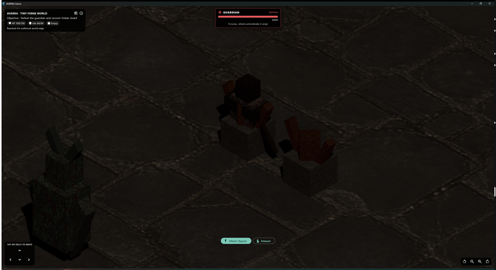

# AVARRA Stage 12.14 - Action-RPG Contextual Target Frame

**Status:** Implemented; focused tests, analysis, live Windows rendering, and
release-build gates pass
**Date:** 2026-08-21

## Product requirement

Game already supported contextual click-to-move, automatic approach, attack,
and interaction. The selected entity was highlighted in the scene, but its
identity, health, and queued action were distributed across diagnostic-style
HUD text. A more legible isometric action-RPG combat loop needs the current
target and the meaning of the player's click to remain obvious without opening
diagnostics.

## Implemented slice

Game now presents a responsive top-center contextual target frame:

- living combatants use a red hostile treatment with current/maximum health and
  a live health bar;
- interactable entities use a gold treatment and action guidance without
  inventing a health value;
- the hint distinguishes selection, pursuit, automatic attacking, approach,
  and ready-to-use states from the existing action-target state;
- compact layouts place the frame below the mobile HUD instead of overlapping
  it; and
- semantic labels expose target identity, health, and action guidance to
  accessibility clients.

The existing Thermion selection highlight remains active. The frame supplements
that world-space cue with stable screen-space information.

Pressing Attack on a distant target now queues the already-existing pursuit
loop and reports `Pursuing Guardian · attacks automatically in range`. It does
not first submit an attack that is guaranteed to fail range validation. Once
the target enters range, the same solo or host-authoritative combat path
performs the attack. Ground movement still disengages the queued action.

## Live acceptance

The Windows x64 release loaded the Stage 12.13 Forge-exported Champion mission
through the real `--avarra-forge-test-play=<absolute .avarra path>` contract.
After renderer readiness, the visible Attack control selected the authored
Guardian and entered pursuit.

The preserved 2576 x 1408 capture confirms the real Game executable displays:

- the Tiny Forge World mission and Gothic scene;
- a top-center `GUARDIAN` / `HOSTILE` frame;
- the authored 64/64 health value and full health bar; and
- persistent automatic-pursuit guidance while the target is outside attack
  range.

## Architecture boundary

This is an Avarra Game presentation and command-feedback slice. It does not add
player UI to Forge, introduce a second selection model, change the world/content
schema, move combat authority into Flutter, or alter server-side range and
damage validation. Both offline and multiplayer paths continue to use the
existing server-safe targeting and combat systems.

No open technical choice was closed, so no ADR is required.

## Evidence

- The two focused target-frame widget tests cover hostile health/progress and
  interactable no-health presentation, including compact width.
- The focused target-frame, action-targeting, and Game shell group passes all
  20 tests.
- The complete Game suite passes all 42 tests.
- The complete 18-suite repository matrix passes all 246 tests.
- `flutter analyze` passes for Game and `dart analyze .` passes for the complete
  workspace.
- The Windows x64 Game release builds and the live Champion package reaches the
  contextual pursuit state.
- `tool/test_stage_12_12_pipeline.ps1` continues to pass the typed Champion
  export, Game import, source-removal, and restart boundary.

Two tests were added, so the repository inventory is now 246.

## Honest limitations

- The current combatant label is the bounded runtime role name `Guardian`;
  authored display names and enemy-rank presentation do not yet have a stable
  schema.
- The live capture exercises hostile selection and pursuit. Interactable frame
  behavior is widget-tested but was not separately captured in the release
  executable.
- There are no floating damage numbers, hit flashes, impact/audio feedback,
  skill/resource bars, item-rarity presentation, or loot beams yet.
- The capture does not complete the attack, reveal, pickup, turn-in, and
  return-to-Forge workflow.
- Physical Android touch, sustained frame pacing, direct-LAN, thermal/battery,
  and human playability acceptance remain open.

## Recommended next gate

Add the smallest authoritative combat-feedback slice: expose accepted damage
events to Game presentation, animate a brief hit flash and bounded floating
damage number, and prove the contextual health bar falls from the same combat
result. Keep simulation and damage authority in `avarra_gameplay`, then run the
continuous Forge-button mission walkthrough and physical Android acceptance.
