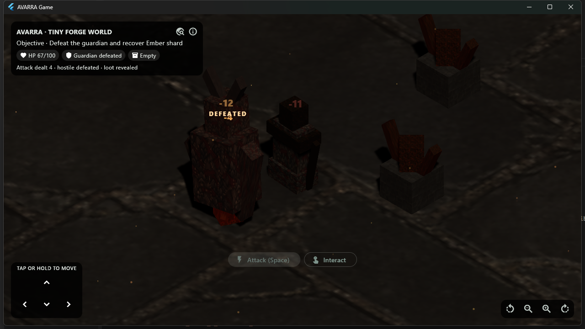

# AVARRA Stage 12.17 - Authoritative Combat Feedback

**Status:** Implemented; bounded presentation events, live Windows Champion
combat, analysis, release build, profiled handoff pipeline, and the complete
test matrix pass
**Date:** 2026-08-21

## Product requirement

Stage 12.16 made characters controllable and articulated, but accepted hits
still read mostly as health-number changes. The authored Hollow Warden `Death`
clip could never play because dead entities disappeared from presentation in
the same simulation tick.

This gate adds the smallest Diablo-style combat-feedback slice that makes
impact and defeat readable without moving damage, cooldown, death, collision,
save, or multiplayer authority into rendering.

## Renderer-neutral combat timeline

`avarra_client` now owns a pure-Dart `CombatPresentationTimeline`. It records
immutable events by stable `EntityId` only after gameplay authority has acted:

- `attackStarted` for responsive attack presentation;
- `damageApplied` for confirmed hit reaction, flash, and floating damage; and
- `defeated` for the bounded death presentation window.

The timeline retains at most 24 events in Game, validates all durations and
damage values, prunes expired entries when new events arrive, and exposes an
immutable frame at a caller-owned presentation time. Its current bounded
policy is:

| Feedback | Duration |
| --- | ---: |
| attack presentation | 600 ms |
| material hit flash | 180 ms |
| articulated hit reaction | 350 ms |
| floating damage | 900 ms |
| defeat/death linger | 1,100 ms |

These are presentation constants, not combat rules or authored schema.

Offline Game records the existing accepted `CombatAttackResult`. Connected
Game records confirmed damage from decreases in the host-authoritative
replicated health mirror. Local connected attack animation remains responsive
at command submission, while damage, hit flash, numbers, and defeat wait for
host state.

## Player-visible feedback

The same sampled frame drives three independent consumers:

- Thermion receives a bounded zero-to-one hit-flash intensity and combines it
  with selection tint and occluder opacity;
- a pointer-transparent Flutter overlay projects stable entity world positions
  through the renderer-neutral orthographic camera rig, then floats and fades
  damage values; and
- animation selection uses the same attack/hit/defeat window instead of
  unrelated local timers.

Lethal hits add a separate `DEFEATED` callout. Dead entities leave collision
and gameplay queries immediately, so they cannot block movement or be attacked,
but remain in `PresentationSnapshot` for 1.1 seconds. Hollow Warden therefore
plays its real 0.9-second `Death` clip and disappears after the presentation
window. Restart clears the timeline.

The reverse orthographic `screenPointForWorld` projection added to
`avarra_isometric` is renderer neutral and covered by a screen/ground
round-trip regression.



## Live Windows acceptance

The Windows x64 release loaded the corrected typed Champion package through the
real Forge Test Play argument. A real pointer clicked the visible Attack
control, which entered the existing pursue-and-auto-attack loop.

A 15.006-second burst captured 108 full 1280 x 720 frames while the release
remained responsive. The sequence shows:

- world-anchored `-12` and `-11` values over simultaneous exchanged hits;
- the struck model turning red during the short material flash;
- the target frame and authoritative HUD health changing with the fight;
- the lethal `-4` and `DEFEATED` callouts; and
- the Hollow Warden remaining visible while its articulated body falls, then
  disappearing and revealing the Ember Shard.

The selected lethal frame was written at 16:50:22.928 UTC. The death pose
remained visible through the 16:50:23.768 capture and was absent by
16:50:24.046, matching the bounded 1.1-second policy within the roughly 140 ms
capture cadence.

## Authority and architecture boundary

The resulting flow is:

```text
authoritative CombatAttackResult or replicated Health state
  -> renderer-neutral bounded CombatPresentationTimeline
  -> one immutable CombatPresentationFrame
       -> named animation requests
       -> Thermion hit-flash intensity
       -> Flutter world-anchored damage overlay
```

No gameplay, content, save, world, ECS, or protocol schema changed. The
dedicated server remains free of Flutter, Thermion, and GPU dependencies.
Forge receives no player HUD code.

No ADR is added because this slice uses accepted architecture boundaries and
does not finalize the renderer, animation schema, network transport, or
material-effect strategy.

## Evidence

- `avarra_client` passes 8 tests, including event lifetime, source-neutral
  replicated damage, cap, and pruning coverage.
- `avarra_isometric` passes 14 tests, including orthographic reverse
  projection.
- Avarra Game passes 52 tests, including pointer transparency, float/fade
  motion, damage expiry, and defeat callout coverage.
- The Thermion bridge passes 8 tests, including bounded flash input.
- The complete 18-suite repository matrix passes all 264 tests.
- Workspace analysis passes with no issues.
- The Windows x64 Game release builds.
- The typed Champion Forge export, moved-file Game import, source removal, and
  selected-world restart pipeline still passes.

Seven tests were added, so the repository inventory is now 264.

## Honest limitations

- Protocol v3 still has no explicit combat-impact event. Remote clients infer
  confirmed damage and death from authoritative health deltas, so the attacker
  identity and exact host impact timestamp are unavailable.
- The Ashen Vanguard proof asset has Idle/Run/Attack but no player Hit or Death
  clip. Player damage still receives flash and floating numbers.
- The material flash is a provisional base-color multiplier. Production
  characters may need emissive, outline, or per-material authoring support.
- Floating values do not yet stack/combine, distinguish critical damage, or
  expose authored damage types.
- Combat audio, impact particles, skill wind-up telegraphs, loot beams, and
  richer pickup feedback are not implemented.
- Physical Android animation/overlay cost, touch quality, thermal/battery
  behavior, and direct-LAN timing remain open.

## Recommended next gate

Add one complete primary-skill presentation slice using the same boundary:
bounded wind-up/impact timing, an adapter-neutral impact marker, a small audio
backend proof, and a loot beam/pickup toast after defeat. Carry explicit
authoritative combat-event sequencing for connected clients only if measured
health-delta timing is insufficient. Validate the current animation and combat
overlay on physical Android before selecting a permanent skinned-character,
material-effect, or animation schema.
