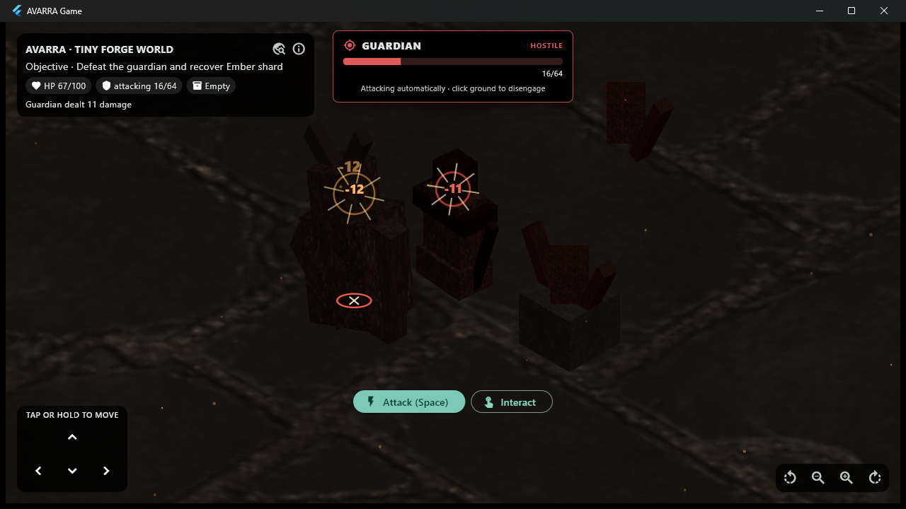

# AVARRA Stage 12.19 - Smooth Traversal and Destination Feedback

**Status:** Implemented; focused/full Game tests, formatting, analysis, Windows
release, and live Champion pursuit acceptance pass
**Date:** 2026-08-21

## Product requirement

Stage 12.18 completed the confirmed combat-to-loot loop, but traversal still
read as a sequence of hard camera recenterings. Ground movement, hostile
pursuit, and interaction approach also shared invisible target state: the
player moved, but the world did not clearly show where or why.

The physical Android gate was checked first. `adb devices -l` reported no
attached device, so physical touch, thermal, and battery acceptance could not
run in this workspace.

This gate adds the smallest presentation-only traversal slice that makes
existing authoritative movement feel continuous and makes the active action
destination visible.

## Frame-rate-independent camera follow

`smoothGameplayCameraTarget` is a pure, renderer-neutral presentation policy.
It eases the current camera target toward the latest player position with an
exponential half-life:

| Property | Policy |
| --- | ---: |
| follow half-life | 110 ms |
| correction snap distance | 6 world units |
| lifecycle baseline | reset on every ticker start/resume |
| restart behavior | immediate snap |

The exponential policy produces the same convergence when one frame duration
is split into smaller frames. Corrections at or beyond six units snap so a
restart, teleport, or large reconciliation cannot leave the camera drifting
through the world.

Movement, prediction, and replication now update a desired camera target.
The visible camera advances on the existing vsync presentation ticker. The
same eased `IsometricCameraRig` is passed to Thermion and every projected
Flutter overlay, so selection, world-to-screen feedback, and picking continue
to use the displayed camera rather than a second hidden view.

Canonical transforms, collision, streaming interest, saves, and replicated
positions are unchanged.

## Action destination feedback

`GameplayDestinationOverlay` projects one current action target into the
viewport:

- cyan ring with inward points for a ground-move destination;
- red ring with a cross for hostile pursuit/automatic attack; and
- gold ring with a diamond for interaction approach.

The indicator uses the same target state already consumed by fixed-step
movement. It disappears when the target completes, is cleared, dies, despawns,
or becomes unavailable.

The presentation remains bounded:

| Property | Policy |
| --- | ---: |
| active indicators | 1 |
| animation cycle | 1,000 ms |
| input handling | pointer transparent |
| off-screen work | culled before painting |
| repaint isolation | one repaint boundary |

Direct keyboard or held-pad movement has no destination and therefore shows no
ring; it still receives smooth camera follow.



## Live Windows acceptance

The Windows x64 release loaded Forge's typed Champion package through the real
`--avarra-forge-test-play` contract. A pointer message clicked the visible
Attack control and entered the existing pursue-and-auto-attack loop.

A 45-frame, full-window sequence captured at roughly 80 ms cadence shows:

- the red crossed ring anchored below the selected Hollow Warden;
- the indicator remaining aligned while the player closes distance;
- the target frame changing from pursuit to automatic attack;
- simultaneous confirmed impact rings and floating damage remaining aligned
  while the camera follows; and
- the normal death and loot-reveal transition completing afterward.

The packaged process remained responsive. The selected 1280 x 720 frame keeps
the pursuit ring, target frame, and simultaneous impact feedback visible.

The move and interaction marker variants are covered by widget tests. The live
capture deliberately uses hostile pursuit because its visible Attack control
provides the deterministic end-to-end input path.

## Architecture boundary

The traversal presentation flow is:

```text
authoritative/predicted player transform
  -> desired camera target
  -> bounded presentation-only follower
  -> displayed IsometricCameraRig
       -> Thermion camera
       -> projected combat/loot/destination overlays

existing ground/attack/interaction target
  -> one immutable destination indicator
  -> pointer-transparent projected painter
```

No world, content, save, ECS, gameplay, or protocol schema changed. The
dedicated server remains free of Flutter, camera, and GPU dependencies. Forge
receives no player-app presentation code.

No ADR is added because this is a replaceable Game presentation policy. It does
not select a navigation backend, renderer, physics solver, or permanent camera
configuration.

## Evidence

- Avarra Game passes all 60 tests.
- Three pure camera tests cover teleport snap, split-frame convergence,
  zero-delta behavior, and invalid input.
- Two widget tests cover projected animation, pointer transparency, removal,
  and invalid destinations.
- The complete CI-aligned 18-suite matrix passes all 272 tests.
- Workspace analysis and formatting pass.
- The Windows x64 Game release builds.
- The typed Champion Forge export, moved-file Game import, source removal, and
  selected-world restart pipeline passes.
- One 1280 x 720 packaged pursuit frame is preserved.

Five tests were added, so the repository inventory is now 272.

## Honest limitations

- No physical Android device is attached; touch quality, overlay cost,
  frame pacing, thermal/battery behavior, and direct-LAN timing remain open.
- The packaged capture exercises the attack indicator. Move and interaction
  variants are automated widget acceptance, not live visual evidence.
- Camera follow has no velocity look-ahead, obstacle avoidance, shake,
  user-adjustable strength, or reduced-motion preference yet.
- Camera rotation and zoom remain immediate.
- Destination feedback does not imply pathfinding; AVARRA still uses the
  existing deterministic direct movement and collision-slide behavior.
- Protocol v3 still carries transforms and state rather than explicit
  sequenced navigation or combat presentation events.
- Audio remains unselected and unimplemented.

## Recommended next gate

Run this exact traversal/indicator/combat sequence on physical Android when a
device is available. Then add a bounded Diablo-style action bar with visible
authoritative cooldown state and one primary-skill presentation POC. Keep any
audio backend, navigation expansion, camera preference, or explicit gameplay
event protocol behind measurement and an ADR before treating it as permanent.
