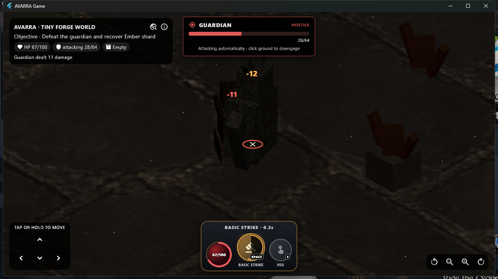

# AVARRA Stage 12.20 - Primary Action Bar and Combat Readiness

**Status:** Implemented; focused/full Game tests, analysis, Windows release,
and live Champion combat acceptance pass
**Date:** 2026-08-21

## Product requirement

Stage 12.19 made traversal and active destinations readable, but the primary
combat action remained a generic button. The player could engage a hostile,
yet the HUD did not expose the real attack recovery window or provide the
compact health/action silhouette expected from an isometric action RPG.

The user explicitly asked development to continue without waiting for the
physical Android gate. This stage therefore delivers a desktop-validated,
presentation-first combat-control slice and leaves physical-device evidence
open.

## Diablo-style action surface

`GameplayActionBar` replaces the normal combat-button row with one bounded
bottom-center surface:

- a red health globe driven by the player's runtime `HealthComponent`;
- a large gold Basic Strike slot with a visible `SPACE` key cap;
- a radial recovery veil and tenths-of-a-second readiness label;
- a smaller cyan interaction slot with an `E` key cap; and
- clear ready, auto-strike, recovery, no-hostile, and disabled-use states.

The desktop bar sits near the bottom edge, while compact layouts retain the
existing raised placement so it does not cover the movement pad. Mission
completion and defeat/restart prompts keep their existing priority.

The bar is semantic-container aware. Each slot reports its label, readiness,
hotkey, button state, and enabled state, while the health globe announces the
current and maximum health values.



## Cooldown and input policy

`GameplaySkillCooldown` is an immutable presentation value derived from
simulation time:

| Property | Policy |
| --- | --- |
| source offline | `BasicAttackStateComponent.nextReadyAt` |
| source connected | local command-pacing deadline |
| total duration | authored `BasicAttackComponent.cooldown` |
| displayed precision | tenths of a second, rounded up |
| radial range | clamped from 0 to 1 |
| frame updates | existing presentation notifier |

Offline cooldown remains authoritative gameplay state. In connected play, the
displayed recovery window is explicitly the client's command-pacing deadline;
the host still accepts or rejects the command and remains authoritative.

Space and E are mapped through one tested hotkey function. Actions fire only
on key-down, so OS key repeat does not create repeated commands.

Pressing Basic Strike during recovery preserves the existing hostile engagement
and reports the strike as queued. The fixed-step approach/auto-attack loop
executes it when ready. Connected immediate attacks now set the same local
pacing deadline used by automatic attacks, preventing command spam without
claiming that the client decides damage or cooldown acceptance.

The E key and interaction slot both dispatch the existing
`InteractEntityIntent`. Distant targets still use Stage 12.18's collision-aware
approach and invoke automatically on arrival.

## Live Windows acceptance

The Windows x64 release loaded the typed Champion package through the real
`--avarra-forge-test-play` contract. After the scene became ready, Space
selected the nearest living hostile and entered the existing pursue-and-
automatic-attack loop.

A 24-frame, 1280 x 720 sequence captured at roughly 80 ms cadence shows:

- the health globe dropping to 67/100 after confirmed guardian damage;
- the Basic Strike status reporting 0.3 seconds of recovery;
- the dark radial cooldown sector and gold completed-progress arc;
- the red hostile destination cross and target frame remaining aligned;
- simultaneous confirmed floating damage; and
- movement and camera controls remaining unobstructed.

The packaged Game remained responsive for the full capture and closed cleanly.

## Architecture boundary

The action-bar flow is:

```text
offline authoritative BasicAttackStateComponent
  or connected local command-pacing deadline
    + authored BasicAttackComponent.cooldown
    + runtime HealthComponent
      -> immutable GameplaySkillCooldown
      -> presentation-only GameplayActionBar

Space / action slot
  -> existing hostile target + approach loop
  -> existing CombatSystem or authoritative gameplay command

E / use slot
  -> existing InteractEntityIntent
  -> existing interaction approach and authority path
```

No world, content, save, ECS, replication, or command schema changed. The
dedicated server remains Flutter/GPU independent, and no Game UI entered Forge.

No ADR is added because this stage exposes existing Basic Strike state through
a replaceable player-app widget. A multi-skill loadout, resource system, or
permanent skill schema would require a separate product slice and an ADR before
being treated as final.

## Evidence

- Avarra Game passes all 64 tests.
- Four new tests cover cooldown derivation, hotkey mapping, health/readiness
  presentation, pointer dispatch, radial recovery, and disabled interaction.
- The complete CI-aligned 18-suite matrix passes all 276 tests.
- Workspace formatting and analysis pass.
- The Windows x64 Game release builds.
- The typed Champion Forge export/import/restart pipeline passes.
- One 1280 x 720 packaged combat frame is preserved.

Four tests were added, so the repository inventory is now 276.

## Honest limitations

- Physical Android validation was intentionally deferred at the user's
  direction; touch sizing, frame pacing, thermal/battery behavior, and
  direct-LAN timing remain open.
- Basic Strike is the only authored player attack. This is not yet a general
  skill bar, loadout, resource, item-modifier, or ability-casting system.
- Connected recovery display represents local command pacing. Protocol v3 does
  not replicate an authoritative player cooldown timestamp.
- The queued strike is target retention through the existing auto-attack loop,
  not a general-purpose input-buffer or combo system.
- No mana/resource globe is fabricated because AVARRA has no authoritative
  resource model yet.
- Audio, hit-stop, camera shake, gamepad mapping, and user-remappable bindings
  remain open.

## Recommended next gate

Continue desktop product polish without blocking on Android: add one bounded
combat-responsiveness slice such as reduced-motion-aware hit-stop/camera impulse
or a separately authored secondary skill POC. Do not fabricate mana, cooldown,
or skill data; add a typed gameplay contract and ADR first if the next slice
requires new authoritative ability state.
