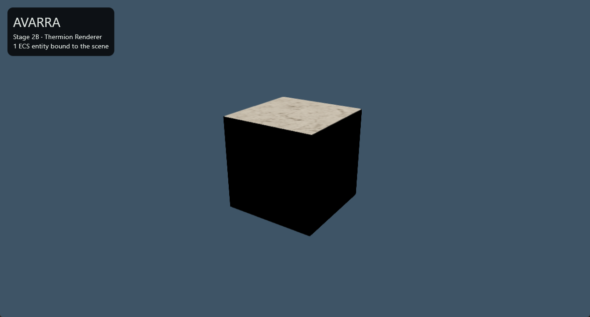

# AVARRA — Stage 2B Renderer Validation

**Status:** Windows validation passed; physical Android runtime validation pending
**Date:** 2026-08-10

## Implemented proof

The Game creates one canonical ECS entity with a transform and stable render
asset ID, extracts an immutable presentation snapshot, and synchronizes it
through `avarra_scene_bridge` into the provisional Thermion/Filament backend.

The proof scene contains:

```text
one ECS presentation entity
one Khronos glTF cube
one initial camera
one direct sun light
cast/receive shadow flags
renderer-neutral create/update/destroy mapping
```

Thermion is isolated in `packages/avarra_thermion_bridge`. The Core, ECS,
Client, generic Scene Bridge, and Server remain free of Flutter and renderer
types.

## Automated evidence

Environment:

```text
Flutter 3.44.4 stable
Dart 3.12.2
thermion_flutter/thermion_dart 0.5.0-pre.5
exact Git commit caad37835e7d379621247b24b7de9d84071bd474
Windows x64
Android debug APK
```

Passed on 2026-08-10:

- dependency resolution;
- source formatting across 53 Dart files;
- whole-workspace analysis with no issues;
- 46 tests: 40 pure Dart, 3 Thermion bridge, 2 Game, 1 Forge widget;
- headless server native compilation and three-tick execution;
- Game Windows release build;
- Game Android debug APK build;
- Windows visible-process stability for more than three minutes;
- Windows controlled launch/close with process exit within 15 seconds;
- corrected Windows visual confirmation and resize/minimize/restore lifecycle
  validation;
- no Windows Vulkan device-loss or unsupported-update errors on the pinned
  pre-release;
- Forge Windows release build;
- automated closure checking for every external buffer and image URI in the
  glTF fixture;
- Windows and Android packaging of `Cube.gltf`, `Cube.bin`, and
  `Cube_BaseColor.png`;
- deterministic regeneration of `AVARRA_MASTER_LLM_HANDOFF_v8.md`.

Fixture hashes:

```text
Cube.gltf  9580FF77AD6A1A601FB570AAAD6148F8E4067244D2430337A43EDBB4D627E85D
Cube.bin   ECE1E675655D75762AAA7E920D93167442D3B9672324694716528ED4E018E4B3
Cube_BaseColor.png  0750D5A03C1BEBC640571E309F66C6E88EFBFF2EF4C120619466A7014551BB9A
```

The fixture is the CC0 Khronos glTF Sample Assets Cube. Attribution and source
links are in `apps/avarra_game/assets/models/THIRD_PARTY.md`.

## Android workaround

The pinned Thermion pre-release declares compile SDK 33 in its Android plugin
while current AndroidX dependencies require 34 or newer. Game overrides only the
`thermion_flutter` library subproject to compile SDK 36 in
`apps/avarra_game/android/build.gradle.kts`.

Remove the override when a pinned upstream release resolves the metadata
mismatch, after re-running both Android and Windows product builds.

## Known upstream warnings

Current builds emit non-fatal warnings for:

- a Windows macro redefinition and DLL-interface boundary;
- Android C-linkage declarations in Thermion native code;
- Thermion's legacy Kotlin Gradle Plugin application path;
- native dependency download/compilation on cold builds.

Published 0.4.1 also fails the live Windows gate with
`VK_ERROR_DEVICE_LOST`. Do not downgrade to it. The current upstream commit
selects a separate Vulkan queue when available or serializes access on
single-queue hardware; see ADR-017.

Treat any escalation from warning to error as a dependency-compatibility event,
not as a reason to bypass the scene boundary.

## Manual runtime gate

Windows:

```powershell
cd apps/avarra_game
flutter run -d windows
```

Automated launch, sustained responsiveness, and controlled-close checks pass.
The first human visual run exposed an incomplete fixture package: `Cube.gltf`
referenced `Cube_BaseColor.png`, but only the glTF and binary buffer had been
copied. Thermion correctly reported the missing asset instead of rendering the
cube. The exact Khronos texture is now packaged, a regression test checks every
external glTF URI, and both product bundles contain all three files.

The corrected Windows build passed on 2026-08-10:

1. the user confirmed that the cube is visible;
2. the captured window shows the lit Khronos cube and the one-entity HUD;
3. no initialization error overlay appears;
4. the process remained responsive after resizing from 1280x720 to 1000x700;
5. minimize/restore preserved the scene and the original window size was
   restored;
6. a graceful close after the lifecycle cycle exited in 0.24 seconds.



The evidence image SHA-256 is
`4FDB07D9F141F6AEFE2B4D10EEA2E91274561C61A489EFF80D8D9E46F02DA8C0`.

Physical Android device:

```powershell
cd apps/avarra_game
flutter devices
flutter run -d <device-id>
```

No physical Android device was connected on 2026-08-10; `flutter devices`
reported only Windows, Chrome, and Edge. This is the remaining Stage 2 runtime
gate.

Confirm the same visual result, then background/resume the app and record:

```text
device model and Android version
debug/profile build mode
steady frame time or FPS
memory after initial load
surface/lifecycle errors
thermal behavior during a short run
```

Do not mark the Stage 2 roadmap gate complete until the physical Android run
passes. The next implementation milestone after that is Stage 3's isometric
camera, picking, and desktop/mobile selection loop.

## Decision record

See ADR-015 for the Flutter Scene stable-SDK finding, ADR-016 for the
provisional Thermion decision, and ADR-017 for the Windows runtime failure and
exact upstream dependency pin.
